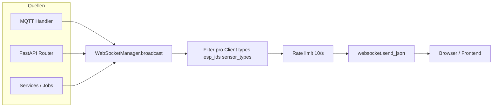

# Report S3 — WebSocket / Realtime (Code vs. Doku)

**Datum:** 2026-04-05  
**Auftrag:** `.claude/auftraege/Auto_One_Architektur/server/auftrag-server-S3-websocket-realtime-2026-04-05.md`  
**Referenz:** `.claude/reference/api/WEBSOCKET_EVENTS.md` (v3.8, 2026-04-04)  
**Code-Wurzel:** `El Servador/god_kaiser_server/src/`

---

## 1. Verbindungsaufbau

| Aspekt | IST (Code) |
|--------|------------|
| **Route** | `@router.websocket("/ws/realtime/{client_id}")` mit Prefix `/api/v1` → effektiv **`/api/v1/ws/realtime/{client_id}`** (`main.py` inkludiert Router mit `prefix="/api/v1"`). Entspricht der Doku-URL. |
| **Auth** | Query-Parameter **`token`** (JWT Access). Kein Token → Close **4001** „Missing token“. |
| **JWT** | `verify_token(token, expected_type="access")`, `sub` numerisch, **Blacklist-Check**, User existiert und **`is_active`**. |
| **Raum / ESP** | Kein serverseitiges „Room“-Konzept. **ESP-Filter** nur über Client-**Subscribe**-Payload (`filters.esp_ids`), ausgewertet in `WebSocketManager.broadcast` anhand von `data["esp_id"]`. |
| **client_id** | Pfadparameter; serverseitig nur als Schlüssel in `_connections` / Rate-Limiter — keine inhaltliche Validierung (Client erzeugt z. B. UUID-artige ID). |

**Datei:** `src/api/v1/websocket/realtime.py`

---

## 2. Manager — Registrierung, Filter, Entfernung

**Datei:** `src/websocket/manager.py`

| Mechanismus | Verhalten |
|-------------|-----------|
| **connect** | `accept()`, Eintrag in `_connections`, leere `_subscriptions`, neuer Rate-Limit-`deque`. |
| **subscribe** | Ersetzt `_subscriptions[client_id]` vollständig durch übergebene `filters` (`types`, `esp_ids`, `sensor_types`). |
| **unsubscribe** | `filters is None` → leeres Dict; sonst partielles Entfernen aus Listen. |
| **broadcast** | Pro Client: wenn `types` **nicht leer** und `message_type` nicht enthalten → skip; wenn `data` **`esp_id`** hat und `esp_ids` gefiltert → skip; wenn **`sensor_type`** in `data` und `sensor_types` gefiltert → skip. **`types` / Listen leer** → **kein Typ-/ESP-/Sensor-Filter** (Client erhält alles, sofern Rate-Limit). |
| **Rate limit** | **10 Nachrichten / Sekunde / Client** (Sliding Window). Überschreitung → Nachricht **verworfen** (`debug`-Log „skipping message“), kein Disconnect. |
| **send_json-Fehler** | Exception → Client-ID in `disconnected_clients` → **`_disconnect_unlocked`** (Cleanup + `increment_ws_disconnect`). |
| **Shutdown** | Alle Verbindungen schließen, Maps leeren (ohne Re-Entrant-Lock-Deadlock). |

**Zusatz:** Envelope-`correlation_id` vs. `data["correlation_id"]` — Divergenz triggert Metriken + Warning (`increment_ws_envelope_data_divergence`, `increment_ws_contract_mismatch`).

---

## 3. Emit-Pfade (Datei → Funktion → Event-Typ)

Kern-API: `WebSocketManager.broadcast(message_type, data, …)` bzw. `broadcast_threadsafe` (nur Restore).

### 3.1 MQTT-Handler (`src/mqtt/handlers/`)

| Datei | Funktion / Kontext | `message_type` |
|-------|-------------------|----------------|
| `heartbeat_handler.py` | diverse | `esp_health`, `device_discovered`, `device_rediscovered`, `esp_reconnect_phase` |
| `lwt_handler.py` | LWT / Offline | `esp_health` |
| `sensor_handler.py` | normale Messung + VPD-Zweig | `sensor_data` |
| `config_handler.py` | Config-ACK | `config_response` |
| `actuator_handler.py` | Status | `actuator_status` |
| `actuator_response_handler.py` | Command-ACK | `actuator_response` |
| `actuator_alert_handler.py` | Alert | `actuator_alert` |
| `error_handler.py` | ESP-Systemfehler | `error_event` |
| `diagnostics_handler.py` | Diagnose | `esp_diagnostics` |
| `zone_ack_handler.py` | Zone-ACK | `zone_assignment` |
| `subzone_ack_handler.py` | Subzone-ACK | `subzone_assignment` |
| `intent_outcome_handler.py` | kanonisches Outcome | `intent_outcome` |
| `intent_outcome_lifecycle_handler.py` | CONFIG_PENDING-Lifecycle (Subtopic) | **`intent_outcome_lifecycle`** |

`base_handler.broadcast_event` / `broadcast_to_esp`: aktuell **keine** weiteren Aufrufer außerhalb der Basisklasse (keine zusätzlichen Event-Typen über diesen Hook).

### 3.2 MQTT-Helfer

| Datei | Funktion | `message_type` |
|-------|----------|----------------|
| `mqtt/websocket_utils.py` | Sensor-/Health-Hilfen | `sensor_data`, `sensor_health` |

### 3.3 Services

| Datei | Kontext | `message_type` |
|-------|---------|----------------|
| `actuator_service.py` | `send_command` / Fehlerpfade | `actuator_command`, `actuator_command_failed` |
| `logic_engine.py` | Rule-Ausführung | `logic_execution` |
| `notification_router.py` | Inbox-Routing | `notification_new`, `notification_updated`, `notification_unread_count` |
| `esp_service.py` | Config-Publish | `config_published`, `config_failed` |
| `maintenance/service.py` | MQTT-Monitor | `system_event` (nur **`mqtt_disconnected`**-artiger Payload, siehe Drift) |
| `maintenance/jobs/sensor_health.py` | Job → Utils | `sensor_health` (über Utils) |
| `logic/actions/sequence_executor.py` | `_broadcast_event` | `sequence_started`, `sequence_step`, `sequence_completed`, `sequence_error`, `sequence_cancelled` |
| `plugin_service.py` | `_broadcast_ws` | `plugin_execution_started`, `plugin_execution_completed` |
| `audit_backup_service.py` | Restore | `events_restored` (**`broadcast_threadsafe`**) |

### 3.4 REST-Router (`src/api/v1/`)

| Datei | `message_type` |
|-------|----------------|
| `device_context.py` | `device_context_changed` |
| `sensors.py` | `device_scope_changed`, `sensor_config_deleted` |
| `actuators.py` | `device_scope_changed`, `actuator_alert`, **`actuator_config_deleted`** |
| `esp.py` | `device_approved`, `device_rejected` |
| `debug.py` | `device_discovered` (Mock-ESP) |

---

## 4. Katalog: Event | Producer | Trigger | Payload-Skizze

| Event | Producer-Modul | Trigger | Payload-Skizze |
|-------|----------------|---------|----------------|
| `esp_health` | `heartbeat_handler`, `lwt_handler` | MQTT Heartbeat / LWT / Timeout-Pfad | `esp_id`, Status, Telemetrie, optional Contract-Felder |
| `esp_reconnect_phase` | `heartbeat_handler` | Reconnect State-Adoption | `esp_id`, `phase`, `offline_seconds`, … |
| `device_discovered` | `heartbeat_handler`, `debug.py` | Unbekanntes ESP / Mock-Create | `esp_id`, `device_id`, Zeiten, Counts; Debug: extra Felder (`simulation_active`, …) |
| `device_rediscovered` | `heartbeat_handler` | Rejected/Offline-Flow | `esp_id`, `device_id`, `rediscovered_at`, … |
| `sensor_data` | `sensor_handler`, `websocket_utils` | MQTT Sensor-Daten / Pi-VPD | i. d. R. Messwerte; Sonderpfad mit `message`/`severity`/`device_id` |
| `sensor_health` | `sensor_health` → `websocket_utils` | Maintenance-Job | `esp_id`, `gpio`, `health_status`, … |
| `sensor_config_deleted` | `sensors.py` | DELETE Sensor-Config | `config_id`, `esp_id`, `gpio`, `sensor_type` |
| **`actuator_config_deleted`** | **`actuators.py`** | DELETE Actuator-Config | `esp_id`, `gpio`, `actuator_type` |
| `actuator_status` | `actuator_handler` | MQTT Status | State, Typen, `emergency`, … |
| `actuator_command` / `actuator_command_failed` | `actuator_service.py` | REST Command-Pfad | Command, `correlation_id`, Fehlertext |
| `actuator_response` | `actuator_response_handler` | MQTT Response | Contract-Serializer-Felder |
| `actuator_alert` | `actuator_alert_handler`, `actuators.py` | MQTT Alert / API (z. B. Emergency) | `alert_type`, `message`, ggf. Troubleshooting |
| `config_response` | `config_handler` | MQTT `config_response` | Contract-Serializer |
| `config_published` / `config_failed` | `esp_service.py` | Config-Publish | `esp_id`, `config_keys`, `correlation_id` / Fehler |
| `intent_outcome` | `intent_outcome_handler` | MQTT `intent_outcome` | Kanonisches Outcome + `domain`/`severity`/… |
| **`intent_outcome_lifecycle`** | **`intent_outcome_lifecycle_handler`** | MQTT `…/intent_outcome/lifecycle` | `esp_id`, `schema`, `event_type`, `reason_code`, … |
| `zone_assignment` | `zone_ack_handler` | MQTT Zone-ACK | `esp_id`, `status`, `zone_id`, … |
| `subzone_assignment` | `subzone_ack_handler` | MQTT Subzone-ACK | `esp_id`, `subzone_id`, `status`, … |
| `device_context_changed` | `device_context.py` | PUT/DELETE Device-Context | `config_type`, `config_id`, aktive Zone/Subzone, `context_source` |
| `device_scope_changed` | `sensors.py`, `actuators.py` | Scope/Zonen-Update | `config_type`, `config_id`, `device_scope`, `assigned_zones` |
| `logic_execution` | `logic_engine.py` | Rule-Actions | `rule_id`, `rule_name`, `trigger`, `action`, `success`, … |
| `notification_new` / `notification_updated` / `notification_unread_count` | `notification_router.py` | DB-Inbox | Notification-DTO / Zähler (**`user_id`** im unread-Payload) |
| `sequence_*` | `sequence_executor.py` | Sequenz-Lauf | IDs, Steps, Status, Dauer |
| `plugin_execution_started` / `plugin_execution_completed` | `plugin_service.py` | Plugin-Run | `execution_id`, `plugin_id`, Status/Dauer |
| `system_event` | `maintenance/service.py` | MQTT getrennt | **`event`: `mqtt_disconnected`**, ISO-`timestamp` |
| `error_event` | `error_handler.py` | MQTT `system/error` | Contract-Serializer |
| `esp_diagnostics` | `diagnostics_handler.py` | MQTT Diagnostics | Heap, CB, Contract-Felder |
| `events_restored` | `audit_backup_service.py` | Backup-Restore | `backup_id`, **`restored_count`**, `event_ids`, `message` |
| `device_approved` / `device_rejected` | `esp.py` | Approve/Reject | siehe Drift-Tabelle |

**Hinweis:** `notification` (Legacy WS) — in `notification_executor.py` **kein** direkter `broadcast("notification")` mehr; Kanal `websocket` läuft über **NotificationRouter** → `notification_new` / …

---

## 5. Abgleich `WEBSOCKET_EVENTS.md` — Drift-Tabelle

| Thema | Doku | Code (IST) | Einordnung |
|-------|------|------------|------------|
| **Fehlender Event-Typ** | Quick-Lookup listet nicht | **`intent_outcome_lifecycle`** existiert (`intent_outcome_lifecycle_handler.py`) | **Doc fehlt** (P1) |
| **Fehlender Event-Typ** | Quick-Lookup listet nicht | **`actuator_config_deleted`** (`actuators.py`) | **Doc fehlt** (P1) |
| **`system_event`** | §11.1 Beispiel `event_type`/`message`/`details` (Cleanup) | Nur **`mqtt_disconnected`**-Pfad mit **`event`** + `timestamp` | **Doku überholt / Code schlanker** (P1): Cleanup-Broadcast nicht im WS-Pfad gefunden |
| **`device_approved`** | `zone_id`, `zone_name` | u. a. `approved_at`, `status`; **keine** `zone_id`/`zone_name` im Broadcast-Dict | **Payload-Drift** (P2) |
| **`device_rejected`** | `rejected_by`, `reason` | **`rejection_reason`**, **`rejected_at`**, `cooldown_until`; kein `rejected_by` | **Payload-Drift** (P2) |
| **`events_restored`** | `events_count`, `source` | **`restored_count`**, **`event_ids`**, `message`, `backup_deleted` nur in HTTP-Result | **Payload-Drift** (P2) |
| **`sequence_step`** | nur `status: completed` als Beispiel | zusätzlich **`starting`** und **`failed`** mit erweiterten Feldern (`success`, `duration_ms`, …) | **Doku unvollständig** (P2) |
| **`notification_unread_count`** | nur `unread_count`, `highest_severity` | zusätzlich **`user_id`** in `data` | **Doku unvollständig** (P3) |
| **`sensor_data`** (VPD/Sonderpfad) | Standard-Mess-Payload | Pfad mit **`message`**, **`severity`**, **`device_id`**, `gpio: 0`, `sensor_type: vpd` | **Nebenvariante dokumentieren** (P2) |
| **Legacy `notification`** | als deprecated WS-Event | wird serverseitig **nicht mehr** als Typ `notification` gebroadcastet (Router-Pfad) | **Doku an aktuellen Pfad anpassen** (P2) |
| **Handler-Tabelle §14** | u. a. nur Kern-Handler | fehlt **`intent_outcome_handler`**, **`intent_outcome_lifecycle_handler`** | **Doc ergänzen** (P2) |

Frontend-interne Typen `contract_mismatch` / `contract_unknown_event`: weiterhin **nicht** serverseitig gesendet — mit Doku konsistent.

---

## 6. Fehlerfall: Disconnect, Burst, Backpressure

| Szenario | Verhalten |
|----------|-----------|
| **Client disconnected** | `WebSocketDisconnect` im Endpoint → `manager.disconnect`; bei Sendefehler während `broadcast` → sofortiger Cleanup des Clients. |
| **Burst / hohe Frequenz** | **Kein** explizites Backpressure-Queueing: pro Nachricht `send_json`. Überschreitung **10 msg/s** → **stilles Drop** (nur Debug-Log), Client bleibt verbunden. |
| **Verlorene Events** | Kein serverseitiger Replay-Buffer; verlorene oder gedroppte Events sind **dauerhaft verloren** für diesen Client. |
| **broadcast_threadsafe** | Schedule auf Event-Loop; Fehler in `future.result()` werden geloggt (`_handle_broadcast_result`). |

---

## 7. Störfall: „WS down, MQTT up“

| Kategorie | Ohne WS sichtbar? | Alternativer Kanal |
|-----------|-------------------|---------------------|
| Live-Sensorwerte, Heartbeats, Roh-MQTT | **Nein** (kein Browser-MQTT im Standard-Stack) | **REST** z. B. letzte Messwerte / ESP-Listen (aggregiert, ggf. verzögert) |
| Intent-Finalität / Outcomes | WS primär für Live-Updates | **`/v1/intent-outcomes`** (laut Doku Parität) |
| Notifications | Kein Live-Badge-Stream | **GET Notifications** / Inbox-API |
| Config-/Command-Terminalität | WS-Events (`config_response`, `actuator_response`, …) | REST liefert oft **Start**; **Finalität** erfordert WS oder Polling auf aggregierte Ressourcen (falls vorhanden) |
| Logic-/Sequence-Fortschritt | **Nein** | Kein vollwertiger MQTT-Ersatz fürs Dashboard; ggf. Audit/Logs |

**Bewertung:** **Realtime weg**, **REST/MQTT auf Server-ESP-Ebene** laufen weiter; das **Frontend** verliert **Echtzeit-Sicht** und muss **pollen** oder **nach reconnect** neu laden.

---

## 8. Kurzdiagramm

---

## 9. Gap-Liste P0 / P1 / P2

| Prio | ID | Beschreibung |
|------|----|----------------|
| **P0** | — | Keine sicherheitskritische Lücke aus WS-Analyse allein; Rate-Limit-Drop bei dichtem `sensor_data` kann **Operatoren-Sicht** verzerren (bewusstes Design). |
| **P1** | G-S3-01 | **`WEBSOCKET_EVENTS.md`** um **`intent_outcome_lifecycle`** und **`actuator_config_deleted`** ergänzen inkl. Producer/Trigger. |
| **P1** | G-S3-02 | **`system_event`**: Doku vs. Code — entweder Cleanup-/Maintenance-Broadcast wieder implementieren oder Doku auf **nur MQTT-Monitor-Event** reduzieren. |
| **P2** | G-S3-03 | **`device_approved` / `device_rejected`** Payloads in Doku an **esp.py** angleichen oder API vereinheitlichen. |
| **P2** | G-S3-04 | **`events_restored`** Felder (`restored_count` vs. `events_count`) dokumentieren. |
| **P2** | G-S3-05 | **`sequence_step`**-Lebenszyklus (`starting` / `completed` / `failed`) und Felder dokumentieren. |
| **P2** | G-S3-06 | §14 Handler-Tabelle: **`intent_outcome_handler`**, **`intent_outcome_lifecycle_handler`** aufnehmen. |
| **P2** | G-S3-07 | Legacy-`notification`-WS: klären „nur historisch“ vs. tatsächlicher Emit-Pfad (heute: **Router**). |

---

## 10. Abnahmekriterien (Auftrag)

| Kriterium | Erfüllt |
|-----------|---------|
| Jeder Event-Typ aus dem Code in Report oder Drift als „Doc fehlt“ | **Ja** (`intent_outcome_lifecycle`, `actuator_config_deleted` in Drift) |
| Mindestens **fünf** unterschiedliche Producer-Dateien | **Ja** (28+ Dateien mit Broadcast-Pfaden) |

---

## 11. Referenzauftrag G1/G2

Die im Auftrag genannte Datei `analyseauftrag-server-end-to-end-vollpruefung-und-vollstaendigkeit-2026-04-03.md` war im Workspace **nicht vorhanden** (laut Git gelöscht). Inhaltliche Anknüpfung erfolgte über **`WEBSOCKET_EVENTS.md`** und direkte Code-Inventur.

---

*Erstellt durch statische Code-Analyse (Stand Repo 2026-04-05).*
