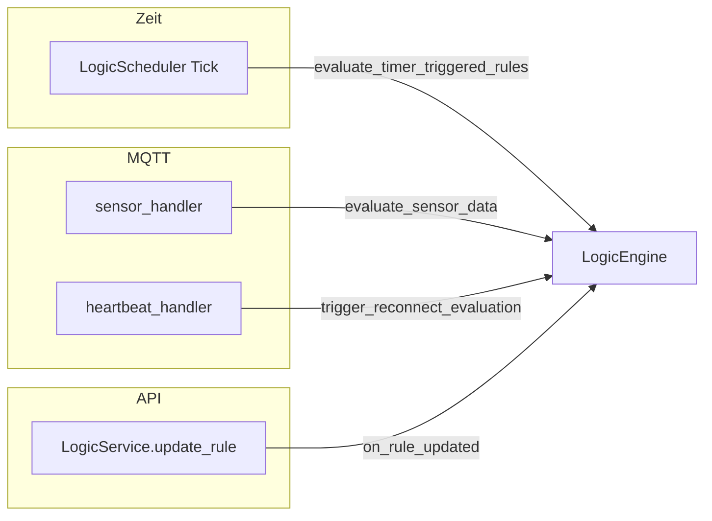

# Report S8 — Domain-Services (Batch 2): Logic Engine, Scheduler, Simulation

**Datum:** 2026-04-05  
**Scope:** `El Servador/god_kaiser_server/src/services/logic_engine.py`, `logic_scheduler.py`, `logic_service.py`, `services/logic/**`, `services/simulation/**`  
**Bezug:** Auftrag S8, Architektur C4 (Rule-Success vs. Hardware-Success)

---

## 1. Triggergraph (textuell + Mermaid)

**Knoten = Auslöser / Einstiegspunkte**, **Kanten = konkrete Aufrufe** in Richtung `LogicEngine`.

| # | Triggerquelle | Codeanker | Pfad |
|---|---------------|-----------|------|
| T1 | **MQTT Sensordaten** (frisch, nicht „stale for logic“) | `mqtt/handlers/sensor_handler.py` (~573–620) | `asyncio.create_task` → `LogicEngine.evaluate_sensor_data(...)` |
| T2 | **Zeit / Timer** (zentrale Tick-Schleife) | `services/logic_scheduler.py` | `LogicScheduler._scheduler_loop` → `evaluate_timer_triggered_rules()` |
| T3 | **API Regel-Update** (PUT) | `services/logic_service.py` (~260–268) | nach DB-Commit → `LogicEngine.on_rule_updated(rule_id, ...)` |
| T4 | **MQTT Reconnect** (nach Adoption) | `mqtt/handlers/heartbeat_handler.py` (~1588–1600) | `_complete_adoption_and_trigger_reconnect_eval` → `trigger_reconnect_evaluation(esp_id)` |
| — | **Hintergrund-Task Engine** | `logic_engine.py` `_evaluation_loop` | aktuell nur `sleep(1)` — **keine** Rule-Queue; reale Auslösung erfolgt über T1–T4 |
| — | **Sequenzen-API** | `api/v1/sequences.py` | liest `SequenceActionExecutor` vom Engine — **kein** eigener Rule-Trigger; Sequenzen laufen als Action-Typ innerhalb von Rules |
| — | **Inbound-Replay** (indirekt) | `main.py` + Subscriber | kann MQTT-Events erneut durch `sensor_handler` schicken → wieder T1 |

**Mindestens drei unterschiedliche Triggerquellen mit Codeankern:** T1 (Sensor/MQTT), T2 (Scheduler), T3 (API) bzw. T4 (Reconnect) — erfüllt.

---

## 2. Priorität: Runtime vs. API-Schema

### Bestätigung im Code (Hypothese Architektur-Review)

- **`CrossESPLogic`-Ladereihenfolge:** `LogicRepository.get_enabled_rules()` sortiert mit `order_by(CrossESPLogic.priority.asc())` und dokumentiert explizit: *lower priority number = higher priority* (`db/repositories/logic_repo.py` ~43–56).
- **Konfliktauflösung:** `ConflictManager` beschreibt Strategie 1 als *„Höhere Priorität gewinnt (niedrigerer priority-Wert = höher)“* (`services/logic/safety/conflict_manager.py` ~58–62).
- **`_execute_actions`:** Docstring `rule_priority: Rule priority (lower number = higher priority)` (`logic_engine.py` ~851).

### Widerspruch in OpenAPI/Pydantic

- **`LogicRuleCreate.priority`:** Feld-Beschreibung **`"Rule priority (1=lowest, 100=highest)"`** (`schemas/logic.py` ~296–300).

Das ist **semantisch invertiert** zur Laufzeit: Wer die API-Dokumentation liest und „80 = hohe Priorität“ im Sinne von „100 ist am höchsten“ interpretiert, verhält sich **falsch** relativ zu ConflictManager/Repo — dort gewinnt die **kleinere** Zahl.

---

## 3. Bausteine (kurz: Rolle + Persistenz)

| Baustein | Rolle | Persistenz / Lebensdauer |
|----------|--------|---------------------------|
| **ConflictManager** | Serielle Konkurrenz pro Actuator-Key (`esp:gpio` optional mit Zone); Safety-Priority `-1000`; TTL-Locks (Default 60s) | In-Memory (`_locks`, `_mutexes`, History-Liste) |
| **RateLimiter** | Global + pro-ESP Token-Bucket; pro-Regel `max_executions_per_hour` via DB-Zählung | Buckets RAM; Rule-Counter DB |
| **HysteresisConditionEvaluator** | Zustand Ein/Aus mit activate/deactivate-Schwellen | **DB** `logic_hysteresis_states` + In-Memory-Cache; Startup-Load in `main.py` |
| **Sensor / Time / Compound / Diagnostics Evaluators** | Bedingungsauswertung | Evaluatoren zustandslos außer Hysteresis/Diagnostics (Diagnostics nutzt Session/DB je nach Implementierung) |
| **LoopDetector** | Schutz vor Sensor↔Aktor-Feedback-Schleifen bei **neuen/geänderten** Regeln | Nur in `LogicValidator` bei Validate/CRUD — **nicht** zur Laufzeit pro Tick (`validator.py` ~90–92, ~304) |

---

## 4. Scheduler (LogicScheduler)

- **Intervall:** `settings.performance.logic_scheduler_interval_seconds`, Default **60 s**, Env `LOGIC_SCHEDULER_INTERVAL_SECONDS` (`core/config.py` ~150–155); Verdrahtung in `main.py` ~749–754.
- **Ablauf:** Endlosschleife: erst `await asyncio.sleep(interval_seconds)`, dann `evaluate_timer_triggered_rules()` (`logic_scheduler.py` ~78–84) — **erster Tick erst nach einem vollen Intervall** nach Start.
- **Nebenwirkungen:** DB-Session über `get_session()`; Filter aller Rules mit `time`/`time_window` in `trigger_conditions`; bei erfüllten Bedingungen `_evaluate_rule`; bei Fensterende optional „OFF“-Pfad mit Cooldown-Guard (`logic_engine.py` ~360–392); `commit()`; ConflictManager-Release im `finally`.
- **Runtime-State:** Nutzt `StateAdoptionService` indirekt nur über spätere Actuator-Pfade in `_execute_actions` (Adoption muss completed sein, sonst Skip); Timer-Pfad lädt Sensorwerte frisch aus DB (`_load_sensor_values_for_timer`).

---

## 5. Simulation (`services/simulation/`)

| Teil | Funktion | Grenzen |
|------|----------|---------|
| **SimulationScheduler** | Mock-ESP: Heartbeats + Sensor-Jobs über **CentralScheduler**, Konfig aus DB, Runtime (Drift, Actuator-States) im RAM | Ziel: Dev/Debug und Tests; **kein Ersatz** für echte Hardware-Physik |
| **MockActuatorHandler** | MQTT-Subscriptions auf Actuator-Topics für Mocks; simulierte Responses/Status | Produktiv nur sinnvoll für registrierte **Mock**-Devices; echte ESPs nutzen Firmware |
| **recover_mocks()** (Konzept laut Docstring) | Nach Server-Restart „running“ Mocks aus DB wieder anbinden | Konsistenz: DB als Source of Truth für Config, RAM für transienten Sim-State |

**Wichtig für Logic-Trigger:** Simulierte Sensordaten laufen über denselben MQTT-Pfad wie echte Geräte → `sensor_handler` → `evaluate_sensor_data` (T1). Die Logic unterscheidet **nicht** explizit „Mock vs. Real“ im Trigger — Unterscheidung erfolgt über Device-Typ/Registrierung außerhalb der Engine.

---

## 6. C4 — Rule-Success vs. Hardware-Success

### Wo es **sauber getrennt** ist (Gegenbeispiel „gut“)

- **WebSocket `logic_execution`:** Pro Aktion wird `ActionResult.success` und `message` gebroadcastet (`logic_engine.py` ~950–962). Damit sieht das Frontend/Monitoring **pro Action**, ob z. B. `ActuatorActionExecutor` Erfolg meldet — das ist die feinste sichtbare Trennung zwischen „Executor hat geantwortet“ und dem späteren MQTT-Ack der Hardware (letzteres ist ein weiteres Layer).

### Wo es **unklar / gemischt** wirkt (kritischer Punkt)

- **`LogicExecutionHistory` nach `_evaluate_rule`:** Nach `_execute_actions(...)` wird bei normalem Erfolgspfad **`log_execution(..., success=True)`** geschrieben (`logic_engine.py` ~599–607), **ohne** die einzelnen `ActionResult`-Werte zu aggregieren. `success` bedeutet hier primär: **„Rule-Pipeline ohne Exception beendet“**, nicht „alle Aktoren haben hardwareseitig bestätigt“.
- **`ActuatorActionExecutor`:** `send_command` liefert ein bool; echtes **End-to-End-Erfolg** (Response-Topic, Safe-Mode, Offline) kann davon abweichen — die History-Zeile bleibt dennoch `success=True`, solange keine Exception fliegt und der Pfad bis `log_execution` durchläuft.
- **Subzone-Skip:** Bei Subzone-Mismatch wird `ActionResult(success=True, ..., skipped)` zurückgegeben (`actuator_executor.py` ~91–95) — semantisch „kein Hardware-Befehl“, aber `success=True` kann in WS/Logs wie Erfolg wirken.

**Stellungnahme:** Die **operative** Trennung für Operatoren ist eher **WS pro Action**; die **auditierbare** Kurzform in `logic_execution_history.success` ist mit **„Regel-Lauf OK“** vermischt und nicht isomorph zu **„Hardware hat ausgeführt“**.

---

## 7. Extern sichtbare Outcomes (je Pfad)

| Kanal | Inhalt / Event |
|--------|----------------|
| **MQTT** | `ActuatorService.send_command` → Befehle an ESP/Mock (QoS/Publisher wie im Actuator-Stack) |
| **WebSocket** | `logic_execution` mit Rule-, Trigger-, Action-Detail und `success` pro Schritt (`logic_engine.py`) |
| **DB** | `logic_execution_history`; `CrossESPLogic.last_triggered`; Hysterese-Zeilen; Rate-Limit-Zähler |
| **Weitere Executors** | Z. B. Notifications, Plugin, Diagnostics — jeweils über `action_executors` mit eigenem Ergebnis/Seiteneffekten |
| **Reconnect-Observability** | `esp_reconnect_phase` (Heartbeat-Handler) unmittelbar um Adoption + `trigger_reconnect_evaluation` |

---

## Risiko-Liste — „Prioritäts-Drift API ↔ Runtime“

1. **P0 (Dokumentation):** OpenAPI-Text `1=lowest, 100=highest` widerspricht Repo/ConflictManager (**kleinere Zahl = höhere Priorität**). Risiko: falsch priorisierte Regeln in der Praxis.
2. **P1 (UX):** UI/Clients, die Priorität wie „Score höher = wichtiger“ modellieren, ohne die invertierte Semantik zu kennen.
3. **P2:** Kein serverseitiger Constraint, der numerische Priorität gegenüber Business-Labels erzwingt — reine Integer ohne Enum.

---

## Gap-Liste P0 / P1 / P2

| Stufe | Gap |
|-------|-----|
| **P0** | **Prioritäts-Beschreibung** in `schemas/logic.py` an Runtime angleichen oder Feld umbenennen/umdokumentieren inkl. Breaking-Note für Clients. |
| **P1** | **`logic_execution_history.success`** spiegelt nicht zuverlässig Hardware-/Actuator-Erfolg; entweder aggregieren aus `ActionResult` oder zweites Feld („`actions_all_succeeded`“) einführen. |
| **P1** | **Neue Regel (POST `/rules`)** ruft `on_rule_updated` nicht auf — im Gegensatz zu PUT; sofortige Re-Eval/Hysterese-Reset nur nach Update, nicht nach Create (kann zu verzögertem ersten Feuern führen). |
| **P2** | **POST `/rules/{id}/toggle`** (enable) geht direkt über Repo/Commit + optional OFF bei disable — **ohne** `LogicEngine.on_rule_updated`; Aktivieren löst keine sofortige Engine-Re-Eval aus (`api/v1/logic.py` ~458–532). |
| **P2** | **`_evaluation_loop`** der Engine ist derzeit **Stub** (nur Sleep) — könnte verwirren; Doku oder zukünftige Queue hier klar benennen. |
| **P2** | **LogicScheduler:** Erster Tick verzögert um ein volles Intervall; für kurze „time_window“-Tests ggf. unerwartet. |
| **P2** | **Simulation vs. Produktion:** Kein harter Gate in `evaluate_sensor_data` gegen Mock-Traffic — beabsichtigt, aber für Safety-Audits dokumentieren. |

---

## Abnahmekriterien (Selbstcheck)

- ≥3 Triggerquellen mit Codeankern: **ja** (Sensor-MQTT, Scheduler, API-Update, optional Reconnect als vierte).
- C4: mindestens ein **gutes** Beispiel (WS `logic_execution` mit `result.success`) und ein **kritischer** Punkt (`log_execution`/`success=True` vs. Hardware): **ja**.

---

*Ende Report S8*
