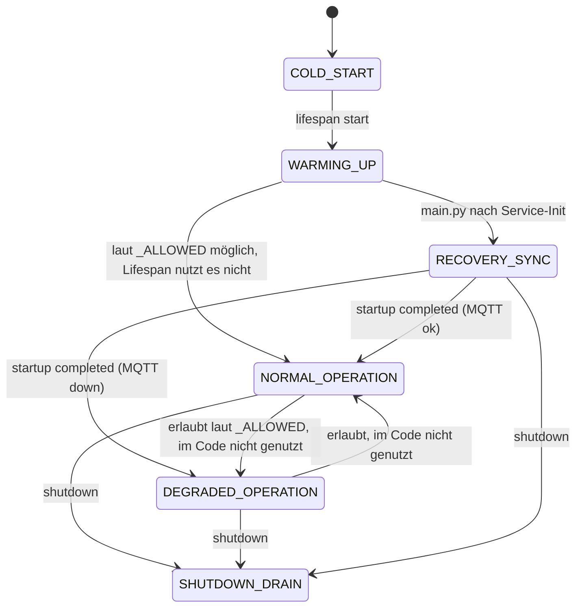

# Report S9 — Runtime-State, Inbound-Inbox, Notifications, Event-Aggregation

**Datum:** 2026-04-05  
**Bezug:** `auftrag-server-S9-runtime-inbox-notifications-2026-04-05.md`  
**Code-Wurzel:** `El Servador/god_kaiser_server/src/`

---

## 1. Zustandsmaschine (`RuntimeStateService`)

### 1.1 Zustände (`RuntimeMode`)

| Zustand | Semantik (IST) |
|--------|----------------|
| `COLD_START` | Initial nach Prozessstart (Singleton frisch) |
| `WARMING_UP` | Lifespan-Startup aktiv |
| `RECOVERY_SYNC` | Wird im Lifespan gesetzt **vor** Replay-Bootstrap und bleibt bis kurz vor „Server started“ (siehe 1.3) |
| `NORMAL_OPERATION` | Start abgeschlossen **und** MQTT verbunden |
| `DEGRADED_OPERATION` | Start abgeschlossen **ohne** MQTT-Verbindung |
| `SHUTDOWN_DRAIN` | Lifespan-Shutdown |

### 1.2 Erlaubte Übergänge (Guards)

Definiert in `RuntimeStateService._ALLOWED` (`runtime_state_service.py`). Ungültige Übergänge werden **still verworfen** (nur `logger.warning`, kein Raise).

### 1.3 Codeanker der tatsächlichen Transitions

| Von → Nach | Auslöser (reason) | Ort |
|------------|-------------------|-----|
| `COLD_START` → `WARMING_UP` | `lifespan startup begin` | `main.py` Lifespan |
| `*` → `RECOVERY_SYNC` | `inbound replay bootstrap` | `main.py` nach Service-Init, vor `_inbound_replay_worker` |
| `RECOVERY_SYNC` / `WARMING_UP` → `NORMAL_OPERATION` oder `DEGRADED_OPERATION` | `startup completed` | `main.py` (abhängig von `connected`) |
| `*` → `SHUTDOWN_DRAIN` | `lifespan shutdown begin` | `main.py` Shutdown |

**Wichtig:** In der **Betriebsphase** (nach `startup completed`) bleibt `mode` typischerweise `NORMAL_OPERATION` oder `DEGRADED_OPERATION`. Es gibt **keine** dynamische Transition in `DEGRADED_OPERATION` bei reinem DB-Ausfall — `set_degraded_reason` wird im produktiven Pfad aktuell **nur** für `mqtt_disconnected` aus `main.py` gesetzt (nicht für DB).

### 1.4 Readiness (`snapshot()`)

`ready == true` nur wenn:

- `mode == NORMAL_OPERATION`
- `logic_liveness`, `recovery_completed`, alle `_worker_health`-Flags `true`
- `degraded_reason_codes` leer

Worker-Keys: `mqtt_subscriber`, `websocket_manager`, `inbound_replay_worker`.

**Sichtbarkeit nach außen:** `GET` Health-Detailed nutzt `get_runtime_state_service().snapshot()` (`api/v1/health.py`).

### 1.5 Zustandsdiagramm (vereinfacht)

*Anmerkung:* Laut `_ALLOWED` wäre `WARMING_UP` → `NORMAL_OPERATION` möglich; der **Lifespan** setzt jedoch vor `startup completed` explizit `RECOVERY_SYNC` (`main.py` ~766).

---

## 2. Inbound-Inbox (`InboundInboxService`)

### 2.1 Was wird zwischengespeichert?

Nur Nachrichten auf **kritischen** Topics, definiert in `Subscriber._is_critical_topic()` (`subscriber.py`):

- Pfade mit `/sensor/` und Suffix `/data`
- `.../system/error`
- `.../config_response`
- `.../system/intent_outcome`
- `.../system/intent_outcome/lifecycle`

### 2.2 Speicherort und Lebensdauer

| Aspekt | Realisierung |
|--------|----------------|
| Medium | **Datei** (JSONL), nicht PostgreSQL |
| Pfad | Standard: `{tempdir}/god-kaiser-inbox/critical-inbound.jsonl` (`tempfile.gettempdir()`) |
| Kapazität | Standard 20 000 Events; bei Überlauf wird **ältestes** Event verworfen (priorisiert `acked`, sonst Index 0) |
| Ack | `mark_delivered` setzt `status=acked`; Rewrite der ganzen Datei (`tmp` + `os.replace`) |

### 2.3 Neustart / „RAM vs. DB“

- **RAM:** In-Memory-Liste `_events` wird aus Datei geladen bzw. bei mtime-Änderung neu geladen (`_ensure_loaded`).
- **DB:** Unabhängig — Inbox überlebt DB-Ausfall, solange Dateisystem verfügbar ist.
- **Server-Neustart:** Datei bleibt unter typischem Temp-Verhalten erhalten (OS-abhängig; bei Container ohne persistentes `/tmp` ggf. verlustbehaftet).

### 2.4 Replay

- `Subscriber.replay_pending_events()` lädt `list_pending`, ruft Handler erneut auf, reichert Payload mit `_reconciliation` an.
- Periodischer Worker: `main.py` `_inbound_replay_worker` alle 5 s, `set_recovery_completed(pending==0)`.

### 2.5 Hypothese Prüfhypothese „keine durable Queue über DB-Ausfall“

**Teilweise falsifiziert:** Für **kritische** Topics existiert eine **dateibasierte** durable Queue; sie ist **nicht** in der Datenbank. Ein reiner PostgreSQL-Ausfall bedeutet nicht automatisch Verlust der Inbox — wohl aber **weiterhin** fehlschlagende Handler-Verarbeitung bis die DB wieder da ist (Events bleiben `pending` / `attempts` steigen).

**Weiterhin gültig:** Es gibt **keine** vollständige durable Queue für **alle** MQTT-Ingress-Pfade; nicht-kritische Topics nutzen die Inbox nicht.

---

## 3. `NotificationRouter`

### 3.1 Producer (Aufrufer, Auswahl)

| Producer-Kontext | Datei (Beispiel) |
|------------------|------------------|
| Sensor-Schwellen / Pipeline | `mqtt/handlers/sensor_handler.py` |
| Aktuator-Alerts | `mqtt/handlers/actuator_alert_handler.py` |
| Logic-Engine Notification-Action | `services/logic/actions/notification_executor.py` |
| REST Notifications API | `api/v1/notifications.py` |
| Grafana/Webhook | `api/v1/webhooks.py` |
| Alert-Suppression-Scheduler | `services/alert_suppression_scheduler.py` |
| AI-Bridge | `services/ai_notification_bridge.py` |

### 3.2 Consumer / Kanäle

| Schritt | Garantie / Verhalten |
|---------|----------------------|
| Dedup | Titel-Fenster oder `correlation_id` (Broadcast) oder atomares Fingerprint-INSERT |
| Persistenz | `notification_repo.create` / `create_with_fingerprint_dedup` — **benötigt DB** |
| WebSocket | `WebSocketManager.broadcast("notification_new", …)` — Fehler werden geloggt, **blockieren nicht** (`try/except`) |
| E-Mail | `EmailService`, Quiet Hours, Severity-Regeln — Fehler **blockieren nicht**; `email_log_repo` |
| `session.commit()` | Am Ende von `route()` |

**Hinweis:** In `notification_router.py` wird **kein** MQTT-Publish für Benachrichtigungen ausgeführt; „MQTT als Kanal“ für Operator-Alerts ist hier **nicht** der Router selbst, sondern ggf. andere Module (Out of Scope dieser Datei).

### 3.3 Prioritäten

Keine explizite Prioritäts-Warteschlange: sequenzieller Ablauf Dedup → DB → Prefs → WS → E-Mail → Commit.

---

## 4. `EventAggregatorService`

| Aspekt | Inhalt |
|--------|--------|
| Rolle | Liest **bestehende** Tabellen (`audit_log`, `sensor_data`, `esp_health` via `ESPHeartbeatLog`, `actuators` via `ActuatorHistory`), transformiert in ein **einheitliches** Event-JSON |
| Trigger | Primär **pull** durch API: `EventAggregatorService(db)` in `api/v1/audit.py` (`aggregate_events` Endpoint) |
| Nebenwirkungen | **Keine** Schreiboperationen; bei Teilfehlern pro Quelle: `logger.error`, Quelle liefert `loaded: 0` |
| Abhängigkeit | **Stark von DB** — bei DB weg keine Aggregation |

---

## 5. Störfall: DB kurz nicht erreichbar während MQTT-Ingress (konkreter Pfad)

### 5.1 Einstieg (Broker → Prozess)

1. `MQTTClient._on_message` (`client.py`) decodiert Payload und ruft synchron `on_message_callback` → `Subscriber._route_message(topic, payload_str)`.

2. `_route_message` parst JSON. Bei bekanntem Handler und **kritischem** Topic:
   - `_append_critical_inbound_event` → `asyncio.run_coroutine_threadsafe(_inbound_inbox.append(...), main_loop).result(timeout=5.0)`  
   - Bei Erfolg: `inbox_event_id` gesetzt; Event liegt in JSONL.

3. `executor.submit(_execute_handler, …)` — **asynchron** zur Paho-Callback-Rückkehr: Der Thread-Pool startet die Ausführung; der **MQTT-Client-Callback kehrt zurück**, sobald `_route_message` endet (nach `submit`, nicht nach Handler-Ende).

4. **QoS-1-Semantik (praktisch):** Sobald der Paho-Callback zurückkehrt, ist die Broker-Seite typischerweise mit der QoS-1-Acknowledgement-Phase fertig — **unabhängig davon**, ob der async Handler die DB bereits geschrieben hat.

### 5.2 Handler-Lauf (Beispiel async Handler)

`_execute_handler` → `run_coroutine_threadsafe(_run_handler_with_cid(handler, …), main_loop)` mit Timeout 30 s.

- **DB-Fehler** im Handler: Exception → `messages_failed += 1`, `_inbox_mark_attempt(inbox_event_id)` wenn ID gesetzt (`subscriber.py`).
- **Rückgabe `False`:** `mark_attempt` statt `mark_delivered`.

### 5.3 Kritisch vs. nicht-kritisch

| Topic-Klasse | Inbox vor Handler-Queue | DB weg |
|--------------|------------------------|--------|
| Kritisch | Ja (wenn Append ≤5s erfolgreich) | Pending bleibt; Replay-Worker versucht erneut |
| Nicht kritisch | Nein | Kein serverseitiger Replay aus Inbox; Daten können faktisch fehlen, Broker hat oft bereits „geliefert“ (s. QoS oben) |

### 5.4 Nebenpfad Notification

Ruft ein Handler `NotificationRouter.route()` auf und die DB ist weg: DB-Operation schlägt fehl → typischerweise Exception/500-Pfad im Handler; bei `actuator_alert_handler` ist explizit dokumentiert, dass Notification-Fehler **MQTT-Verarbeitung nicht blockieren** sollen (`logger.warning`).

---

## 6. G2-Bewertung: Pfad | still möglich? | Nachweis bei Verlust

| Pfad | Still möglich? | Nachweis / Outcome bei Verlust |
|------|----------------|--------------------------------|
| MQTT QoS 0 (z. B. Heartbeat) | Ja | Keine Broker-Retransmission; Verlust ohne Anwendungs-ACK |
| MQTT QoS 1 + nicht-kritischer Topic ohne Inbox | Teilweise | Callback endet nach `executor.submit`; PUBACK oft vor DB-Commit; Verlust der **persistierten** Wirkung ohne garantierten Retry |
| MQTT QoS 1 + kritischer Topic + erfolgreiches Inbox-Append | Nein (für Inbox-Datei) | JSONL-Eintrag + `pending`; Metriken/Logs bei Replay-Fail; **kein** automatischer DB-„Outbox“-Ersatz |
| Inbox-Append schlägt fehl (Loop/Timeout/IO) | Ja | `inbox_event_id is None`; Handler läuft trotzdem; bei DB-Fehler kein Replay-Anker |
| `NotificationRouter` WS-Broadcast | Ja | Exception wird geloggt; DB-Commit kann trotzdem erfolgen (Benutzer sieht Eintrag ggf. ohne Live-Push) |
| `NotificationRouter` E-Mail | Ja | explizit non-blocking; `email_log` kann `failed` sein |
| `EventAggregatorService` | Ja | Nur Lesen; leere/teilweise Ergebnisse + Error-Log |
| Runtime-Transition bei DB-Down | Ja | Kein automatischer Wechsel zu `DEGRADED_OPERATION` durch DB; `degraded_reason` nur MQTT in `main.py` |

---

## 7. Gap-Liste

### P0

- **MQTT ACK vs. Verarbeitungstiefe:** QoS-1-Nachrichten können brokerseitig „abgeschlossen“ sein, bevor DB-Persistenz in Handlern abgeschlossen ist; für **nicht-kritische** Topics gibt es keinen serverseitigen Durable-Replay.
- **Temp-Inbox-Pfad:** Produktions-Deployments müssen klären, ob `/tmp` (o. ä.) **persistent** genug ist — sonst fällt die „durable“ Inbox mit Container-Restart weg.

### P1

- **Runtime-Modell vs. Realität:** `RECOVERY_SYNC` wird nicht dauerhaft gehalten, obwohl Inbox-Replay im Hintergrund läuft; operativ ist `recovery_completed` in `snapshot()` aussagekräftiger als `mode`.
- **`set_degraded_reason`:** Fast ungenutzt (nur MQTT); DB-/Pool-Probleme spiegeln sich nicht in `RuntimeMode`/`degraded_reason_codes`.

### P2

- **Health-Detailed DB-Felder:** Teilweise Platzhalter-Latenzen (`latency_ms=5.0`) — operational nicht aus echten Pool-Metriken.
- **Dokumentationsdrift:** Kommentar in `notification_router.py` erwähnt „Optional webhook“; zentrale `route()`-Methode enthält keinen Webhook-Schritt (ggf. andere Services).

---

## 8. Abnahmekriterien Auftrag — Erfüllung

| Service | Öffentliche Methoden (Kern) | Mindestens ein Aufrufer |
|---------|----------------------------|-------------------------|
| `RuntimeStateService` | `transition`, `set_logic_liveness`, `set_recovery_completed`, `set_worker_health`, `set_degraded_reason`, `snapshot` | `main.py`, `api/v1/health.py`, Tests |
| `InboundInboxService` | `append`, `mark_delivered`, `mark_attempt`, `list_pending`, `stats` | `mqtt/subscriber.py`, `main.py` (Replay-Worker), Tests |
| `NotificationRouter` | `route`, `suppress_dependent_alerts`, `persist_suppressed`, `broadcast_notification_updated`, `broadcast_unread_count` | Handler, APIs, Logic-Executor, Tests |
| `EventAggregatorService` | `aggregate_events` | `api/v1/audit.py` |

Störfall „DB kurz weg“: siehe **Abschnitt 5** mit Datei- und Zeilenlogik (`subscriber.py`, `client.py`).

---

*Ende Report S9*
