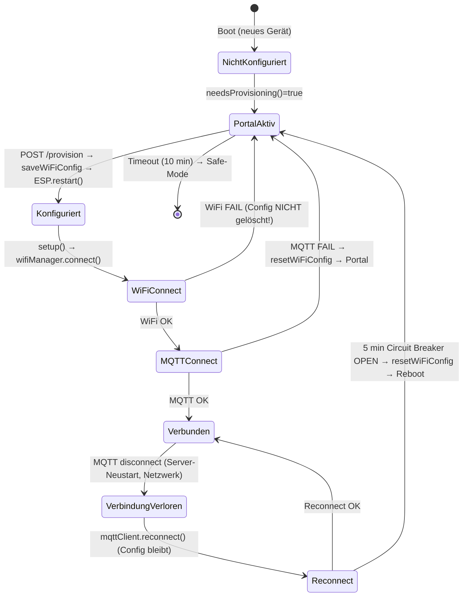

# Bericht: Firmware Verbindungshandling — Vollanalyse

> **Erstellt:** 2026-03-09  
> **Typ:** Reine Analyse (kein Code geändert)  
> **Ziel:** Grundlage für Implementierung differenziertes Verbindungshandling

---

## 1. Übersicht

### 1.1 Verbindungskonfiguration — Wo liegt sie?

| Komponente | Speicherort | Inhalt |
|------------|-------------|--------|
| **WiFi + Server/MQTT** | ESP32 NVS, Namespace `wifi_config` | SSID, Passwort, Server-IP, MQTT-Port, MQTT-Credentials, `configured`-Flag |
| **Zone** | ESP32 NVS, Namespace `zone_config` | zone_id, zone_name, kaiser_id, etc. |
| **System** | ESP32 NVS, Namespace `system_config` | esp_id, current_state, safe_mode_reason, boot_count, last_boot_time |
| **Server** | PostgreSQL (El Servador) | ESP-Registrierung, last_seen, status (online/offline) |

### 1.2 Beteiligte Komponenten

| Komponente | Datei | Rolle |
|------------|-------|-------|
| **ProvisionManager** | `provision_manager.cpp/h` | Captive Portal, AP-Mode, Config-Speichern, Validierung |
| **WiFiManager** | `wifi_manager.cpp/h` | WiFi Connect/Disconnect, Reconnect, Circuit Breaker |
| **MQTTClient** | `mqtt_client.cpp/h` | MQTT Connect/Disconnect, Reconnect, LWT, Heartbeat, Offline-Buffer |
| **ConfigManager** | `config_manager.cpp/h` | NVS-Keys lesen/schreiben/löschen für WiFi, Zone, System |
| **StorageManager** | `storage_manager.cpp/h` | NVS-Namespace-Zugriff (Preferences API) |
| **main.cpp** | `main.cpp` | Boot-Sequenz, Aufruf Provisioning vs. Connect, Reconnect-Loop, **Config-Löschung** |

### 1.3 Zustands-/Flussdiagramm



**Kritische Beobachtung:** Es gibt **keine Unterscheidung** zwischen „nie erfolgreich verbunden“ und „war verbunden, dann Disconnect“. Beide führen bei anhaltendem MQTT-Ausfall (5 min) zur Config-Löschung.

---

## 2. ESP32 (El Trabajante)

### 2.1 Boot-Sequenz

| Step | Aktion | Datei:Zeile |
|------|--------|-------------|
| 1 | Serial, Boot-Banner | main.cpp:136-156 |
| 2.5 | Boot-Button Factory Reset (10s) | main.cpp:184-246 |
| 3 | GPIOManager Safe-Mode | main.cpp:254 |
| 4 | Logger | main.cpp:256 |
| 5 | StorageManager.begin() | main.cpp:265 |
| 6 | ConfigManager.begin(), loadAllConfigs() | main.cpp:286-294 |
| 6.1 | loadWiFiConfig, loadZoneConfig, loadSystemConfig | config_manager.cpp |
| 6.2 | Inconsistent-State-Repair (STATE_SAFE_MODE_PROVISIONING + valid config) | main.cpp:321-336 |
| 6.3 | Boot-Loop-Detection | main.cpp:339+ |
| 8 | TopicBuilder (esp_id, kaiser_id) | main.cpp:604-608 |
| 10 | **WiFi connect** | main.cpp:644-702 |
| 11 | **MQTT connect** | main.cpp:707-789 |

**Entscheidung Portal vs. direkt verbinden:**
- `provisionManager.needsProvisioning()` prüft: `!config.configured` oder `config.ssid.length() == 0`
- Wenn `needsProvisioning() == true` → Portal starten (wird in setup() nicht direkt aufgerufen; Portal wird nur bei WiFi/MQTT-Fehler gestartet)
- Bei **WiFi-Fehler**: Portal starten, Config **nicht** löschen
- Bei **MQTT-Fehler** (setup): Config **löschen**, Portal starten

### 2.2 Provisioning / Captive Portal

| Aspekt | Details |
|--------|---------|
| **Start** | Bei WiFi-Fehler oder MQTT-Fehler in setup(); oder bei MQTT 5-min-Fehler in loop() |
| **Bedingungen** | `provisionManager.startAPMode()` nach `configManager.resetWiFiConfig()` (nur bei MQTT-Fehler) oder mit bestehender Config (WiFi-Fehler) |
| **Schließen** | Nach POST /provision → `config_received_ = true` → `ESP.restart()` → beim nächsten Boot normaler Connect-Versuch |
| **Timeout** | 10 Minuten (AP_MODE_TIMEOUT_MS), danach Safe-Mode mit AP weiterhin aktiv |
| **Validierung** | `validateProvisionConfig()`: SSID, Passwort-Länge, IPv4, MQTT-Port |
| **NVS-Keys** | `configManager.saveWiFiConfig()` → wifi_config Namespace |

### 2.3 Verbindungsaufbau

| Phase | Ablauf |
|-------|--------|
| 1. WiFi | `wifiManager.connect(wifi_config)` → `connectToNetwork()` → blockierend bis WIFI_TIMEOUT_MS (20s) |
| 2. MQTT | `mqttClient.connect(mqtt_config)` → `connectToBroker()` → LWT setzen, `attemptMQTTConnection()` |
| 3. Registration | Nach Connect: `registration_confirmed_ = false`, Heartbeat senden, auf Heartbeat-ACK warten (10s Timeout) |
| 4. Erfolg | `reconnect_attempts_ = 0`, Circuit Breaker Success, Offline-Buffer verarbeiten |

**„Erfolgreich verbunden“ festgehalten:**
- **NVS:** Es gibt **keinen** expliziten Key „has_successfully_connected_once“ oder „last_connected_at“
- **RAM:** `registration_confirmed_` (wird bei Disconnect zurückgesetzt)
- **Server:** `last_seen`, `status=online` in DB

### 2.4 Verbindungsverlust (Disconnect)

| Ereignis | Erkennung | Reaktion |
|----------|-----------|----------|
| MQTT Disconnect | `mqtt_.loop()` (PubSubClient) erkennt Verbindungsverlust; `isConnected()` = false | `mqttClient.loop()` → `reconnect()` |
| WiFi Disconnect | `wifiManager.loop()` → `handleDisconnection()` | `reconnect()` (Circuit Breaker) |

**An welcher Stelle wird die Verbindungskonfiguration gelöscht?**

| # | Datei | Zeile | Trigger | Bedingung |
|---|-------|-------|---------|------------|
| 1 | main.cpp | 227 | Boot-Button 10s | Manuell |
| 2 | main.cpp | 748 | MQTT Connect FAIL (setup) | Einmaliger Fehlschlag beim ersten Connect |
| 3 | main.cpp | 1000 | MQTT factory_reset | Server sendet Befehl |
| 4 | main.cpp | **2398** | **MQTT 5 min Circuit Breaker OPEN** | **Kernproblem: Auch bei vorher erfolgreicher Verbindung!** |

**Unterscheidung „Connect fehlgeschlagen“ vs. „war verbunden, dann Disconnect“:**  
**Nein.** Beide Fälle führen bei anhaltendem MQTT-Ausfall zur gleichen Reaktion (Config-Löschung nach 5 min).

### 2.5 Reconnect-Logik

| Komponente | Reconnect | Backoff | Config vor Reconnect |
|------------|-----------|---------|------------------------|
| WiFi | `wifiManager.reconnect()` | 30s Intervall, Circuit Breaker 10 Failures → 60s | Config aus `current_config_` (RAM), ursprünglich aus NVS |
| MQTT | `mqttClient.reconnect()` | Exponential (1s × 2^attempts, max 60s), Circuit Breaker 5 Failures → 30s | Config aus `current_config_` (RAM), ursprünglich aus NVS |

**Config wird beim Reconnect aus RAM gelesen** (`current_config_`), nicht erneut aus NVS. Die Config wird nur gelöscht, wenn explizit `resetWiFiConfig()` aufgerufen wird (siehe Tabelle oben).

### 2.6 NVS-Struktur Verbindung

| Namespace | Keys | Wann geschrieben | Wann gelesen | Wann gelöscht |
|-----------|------|------------------|--------------|---------------|
| **wifi_config** | ssid, password, server_address, mqtt_port, mqtt_username, mqtt_password, configured | POST /provision, handleProvision() | Boot (loadWiFiConfig), handleRoot (Form-Pre-Fill) | resetWiFiConfig() bei: Boot-Button, MQTT-Fail setup, MQTT 5min, factory_reset |
| **zone_config** | zone_id, zone_name, kaiser_id, ... | POST /provision, Zone-Assign via MQTT | Boot (loadZoneConfig) | Boot-Button, factory_reset, handleReset |
| **system_config** | esp_id, current_state, safe_mode_reason, boot_count, last_boot_time | Diverse (State-Übergänge) | Boot (loadSystemConfig) | Nicht komplett; State wird überschrieben |

**Hinweis:** Es gibt **keinen** NVS-Key für „hat_successfully_connected_once“ oder „last_mqtt_connected_at“.

---

## 3. Server-Seite (El Servador)

### 3.1 MQTT-Broker

- **LWT:** ESP32 konfiguriert LWT bei Connect (`mqtt_client.cpp` Zeile 196-205):
  - Topic: `kaiser/{kaiser_id}/esp/{esp_id}/system/will`
  - Payload: `{"status":"offline","reason":"unexpected_disconnect","timestamp":...}`
  - QoS 1, Retain true
- **Clean Session:** Standard PubSubClient (typisch clean=true für ESP32)
- **Verhalten bei Disconnect:** Broker publiziert LWT automatisch, wenn Client ohne DISCONNECT-Paket verschwindet

### 3.2 Application-Server (El Servador)

| Handler | Topic | Reaktion |
|---------|-------|----------|
| **HeartbeatHandler** | `kaiser/+/esp/+/system/heartbeat` | ESP online, last_seen aktualisieren, Heartbeat-ACK senden, ggf. Zone-Resync |
| **LWTHandler** | `kaiser/+/esp/+/system/will` | ESP offline setzen, WebSocket-Broadcast, Audit-Log |

**„Erfolgreich verbunden“ aus ESP-Sicht:**
- Erster Heartbeat wird gesendet
- Server antwortet mit Heartbeat-ACK auf `kaiser/{kaiser_id}/esp/{esp_id}/system/heartbeat/ack`
- ESP setzt `registration_confirmed_ = true` nach ACK-Empfang
- Ohne ACK: Nach 10s Timeout wird Gate trotzdem geöffnet (Fallback)

**Re-Registration:** Bei Reconnect sendet ESP erneut Heartbeat; Server aktualisiert last_seen. Kein spezieller „Re-Registration“-Flow.

---

## 4. Zusammenfassung: Wer speichert was, wann

| Speicherort | Inhalt | Geschrieben | Gelesen | Gelöscht |
|-------------|--------|-------------|---------|----------|
| ESP NVS wifi_config | WiFi + Server/MQTT | Portal-Save, Provision | Boot, Form-Pre-Fill | resetWiFiConfig (4 Trigger) |
| ESP NVS zone_config | Zone-Daten | Portal-Save, Zone-Assign | Boot | Boot-Button, factory_reset |
| ESP NVS system_config | State, boot_count | State-Übergänge | Boot | Nicht vollständig |
| ESP RAM current_config_ | WiFi/MQTT (Kopie) | Connect | Reconnect | Bei resetWiFiConfig (wifi_config_ Reset) |
| ESP RAM registration_confirmed_ | Gate für Publish | Nach Heartbeat-ACK | Publish-Check | Bei jedem Disconnect |
| Server DB | last_seen, status | Heartbeat, LWT | API, WebSocket | Nicht (nur Update) |

---

## 5. Identifizierte Probleme und Empfehlungen

### 5.1 Problem 1: Config-Löschung bei Server-Neustart

**Wo genau:** `main.cpp` Zeilen 2372-2410

```cpp
// MQTT PERSISTENT FAILURE DETECTION → PROVISIONING RECOVERY
if (!mqttClient.isConnected() && mqttClient.getCircuitBreakerState() == CircuitState::OPEN) {
  if (mqtt_failure_start == 0) {
    mqtt_failure_start = millis();
  } else if (millis() - mqtt_failure_start > MQTT_PERSISTENT_FAILURE_TIMEOUT_MS) {  // 5 min
    // ...
    configManager.resetWiFiConfig();
    ESP.restart();
  }
}
```

**Trigger:** MQTT 5 Minuten nicht verbunden + Circuit Breaker OPEN.  
**Folge:** Config wird gelöscht, Reboot, Portal öffnet sich — **unabhängig davon, ob der ESP jemals erfolgreich verbunden war**.

### 5.2 Empfehlung: Unterscheidung „Falsche Config“ vs. „Server vorübergehend weg“

| Szenario | Erkennung | Gewünschte Reaktion |
|----------|-----------|----------------------|
| **Falsche Config** | Nie erfolgreich verbunden seit letztem Config-Save | Config löschen, Portal öffnen |
| **Server weg** | Mindestens einmal erfolgreich verbunden (Heartbeat-ACK empfangen) | Config behalten, nur Reconnect, Portal geschlossen |

**Vorschlag: NVS-Key `connected_once` (bool)**

- **Setzen:** Wenn `registration_confirmed_ == true` (nach Heartbeat-ACK) und mindestens ein Publish erfolgreich war → `configManager.setConnectedOnce(true)` → NVS schreiben
- **Lesen:** Beim Boot und vor Config-Löschung
- **Löschen:** Bei `resetWiFiConfig()` (konsistent mit Config-Reset)
- **Logik:** Nur wenn `connected_once == false` UND MQTT 5-min-Fehler → Config löschen, Portal. Wenn `connected_once == true` → Config behalten, weiter reconnecten, kein Portal.

### 5.3 Empfehlung: Zusätzliche Heuristiken

| Heuristik | Nutzen |
|-----------|--------|
| **Connect-Timeout vs. Dauer verbunden** | Wenn ESP z.B. >60s verbunden war (Heartbeat mind. 1× gesendet + ACK), gilt als „war verbunden“ |
| **Boot-Count nach stabilem Betrieb** | `boot_count` wird nach 60s stabiler Operation zurückgesetzt; könnte als Indikator für „war schon mal stabil“ dienen (aber weniger zuverlässig als expliziter Flag) |

### 5.4 Risikobewertung

| Risiko | Bewertung | Mitigation |
|--------|-----------|------------|
| Boot-Loops | Niedrig | `connected_once` nur setzen nach bestätigtem Heartbeat-ACK |
| Portal nie mehr öffnen | Mittel | Bei `connected_once=true` und anhaltendem Fehler: Nach z.B. 24h oder manuell per Boot-Button zurücksetzen |
| Falsch-positive „war verbunden“ | Niedrig | Nur nach Heartbeat-ACK setzen (Server hat ESP bestätigt) |

---

## 6. Offene Punkte / Annahmen

### 6.1 Nicht aus Code erschlossen

- Verhalten unter Wokwi vs. echter Hardware (z.B. Circuit Breaker, NVS-Persistenz)
- Exaktes Verhalten von PubSubClient bei Netzwerkausfall (wann erkennt `mqtt_.loop()` Disconnect?)
- Ob `handleDisconnection()` im MQTTClient irgendwo aufgerufen wird (aktuell nur Definition, kein Aufruf in loop gefunden)

### 6.2 Annahmen für Implementierung

- Heartbeat-ACK ist ausreichendes Kriterium für „erfolgreich verbunden“
- 5 Minuten Circuit Breaker OPEN ist sinnvoller Schwellwert für „persistenter Fehler“ bei falscher Config
- Einmal gesetzter `connected_once`-Flag wird bei `resetWiFiConfig()` mitgelöscht (muss in resetWiFiConfig ergänzt werden)

---

## 7. Datei-Referenz (Analyse-Basis)

| Datei | Relevante Abschnitte |
|-------|----------------------|
| `El Trabajante/src/main.cpp` | setup() 644-789 (WiFi/MQTT), loop() 2372-2410 (5-min-Config-Löschung) |
| `El Trabajante/src/services/provisioning/provision_manager.cpp` | begin(), needsProvisioning(), handleProvision(), handleReset() |
| `El Trabajante/src/services/communication/wifi_manager.cpp` | connect(), reconnect(), handleDisconnection() |
| `El Trabajante/src/services/communication/mqtt_client.cpp` | connect(), reconnect(), connectToBroker(), loop() |
| `El Trabajante/src/services/config/config_manager.cpp` | loadWiFiConfig(), saveWiFiConfig(), resetWiFiConfig() |
| `El Servador/god_kaiser_server/src/mqtt/handlers/heartbeat_handler.py` | handle_heartbeat(), _send_heartbeat_ack() |
| `El Servador/god_kaiser_server/src/mqtt/handlers/lwt_handler.py` | handle_lwt() |

---

*Bericht abgeschlossen. Bereit für Implementierungs-Auftrag.*
