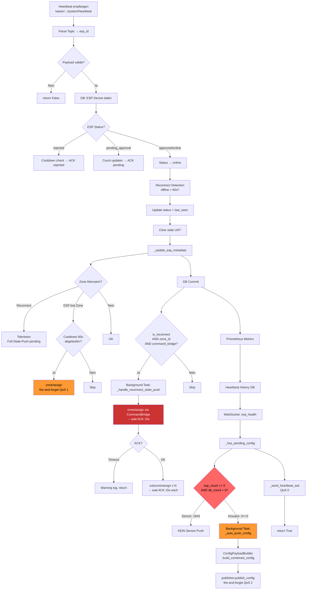

# Analyse B: Server-Kommunikation & Verarbeitung — Config Mismatch Loop

**Typ:** Code-Analyse (IST-Zustand Dokumentation)
**Datum:** 2026-03-10
**Zusammenhang:** Analyse B von 3 (A = Firmware-Logik, B = Server-Kommunikation, C = Logging)
**Analyst:** Claude Opus 4.6 (Agent)

---

## Zusammenfassung

Der Heartbeat-Handler hat **ZWEI unabhaengige Mismatch-Erkennungspfade** die parallel laufen:

1. **Config-Mismatch** (`_has_pending_config`, Zeile 1217-1269): Prueft `== 0` — triggert Config-Push
2. **Zone-Mismatch** (`_update_esp_metadata`, Zeile 693-827): Prueft Zone-ID-Vergleich und `zone_assigned` Flag — triggert Zone-Resync

Fuer ESP_472204 mit `sensor_count: 18, actuator_count: 0`:
- **Config-Mismatch**: NUR `actuator_count == 0` triggert (Sensor-Mismatch 18 vs. 2 wird NICHT erkannt)
- **Zone-Mismatch**: Abhaengig vom `zone_id`/`zone_assigned` Feld im Heartbeat

Der Config-Push ist **fire-and-forget** (kein ACK-Wait). Die Zone-Resync im normalen Heartbeat ist ebenfalls fire-and-forget. Nur der **Full-State-Push bei Reconnect** (`_handle_reconnect_state_push`) nutzt die MQTTCommandBridge mit ACK-Wait und 15s Timeout.

---

## B1: Heartbeat-Empfang und Mismatch-Erkennung

### B1-01: Heartbeat-Handler Einstiegspunkt

**Datei:** `El Servador/god_kaiser_server/src/mqtt/handlers/heartbeat_handler.py`
**Einstiegspunkt:** `HeartbeatHandler.handle_heartbeat()` Zeile 74
**Modul-Level Wrapper:** `handle_heartbeat()` Zeile 1543 (delegiert an Singleton Zeile 1530)

**Subscribe-Topic-Pattern:**
```
kaiser/{kaiser_id}/esp/{esp_id}/system/heartbeat
```
(Konstante: `MQTT_TOPIC_ESP_HEARTBEAT` in `core/constants.py:21`)

**Heartbeat-Payload Felder (aus Docstring Zeile 80-92):**

| Feld | Typ | Beschreibung |
|------|-----|--------------|
| `esp_id` | str | ESP Device-ID |
| `zone_id` | str | Aktuelle Zone (aus NVS) |
| `master_zone_id` | str | Master-Zone |
| `zone_assigned` | bool | Ob Zone zugewiesen ist |
| `ts` | int | Unix Timestamp |
| `uptime` | int | Uptime in Sekunden |
| `heap_free` / `free_heap` | int | Freier Heap (beide akzeptiert) |
| `wifi_rssi` | int | WiFi-Signalstaerke |
| `sensor_count` / `active_sensors` | int | Anzahl aktiver Sensoren (beide akzeptiert) |
| `actuator_count` / `active_actuators` | int | Anzahl aktiver Aktoren (beide akzeptiert) |
| `gpio_status` | list | GPIO-Pin-Status (Phase 1) |
| `gpio_reserved_count` | int | Anzahl reservierter GPIOs |
| `boot_count` | int | Boot-Zaehler (optional) |
| `wifi_ip` | str | IP-Adresse (optional) |
| `_source` | str | Datenquelle (optional, fuer Mock-Detection) |

**Pflicht-Felder (Validierung Zeile 894-967):** `ts`, `uptime`, `heap_free`/`free_heap`, `wifi_rssi`
**NICHT Pflicht:** `sensor_count`, `actuator_count` (Default: 0)

**Verarbeitungsablauf (bestehende Geraete, Zeile 156-371):**
```
1. Parse Topic → esp_id extrahieren (Zeile 103)
2. Payload validieren (Zeile 116-125)
3. DB-Session oeffnen, ESP-Device laden (Zeile 128-132)
4. Status-basierte Verzweigung:
   - "rejected" → Cooldown-Check → ggf. Rediscovery (Zeile 169-184)
   - "pending_approval" → Heartbeat-Count updaten, ACK senden (Zeile 186-196)
   - "approved" → Status auf "online" setzen (Zeile 198-201)
5. Reconnect-Detection (Zeile 162-167): offline_seconds > 60
6. Update status + last_seen (Zeile 222-230)
7. LWT-Message loeschen (Zeile 232-247)
8. Metadata updaten inkl. Zone-Mismatch-Check (Zeile 250)
9. Health-Metrics loggen (Zeile 253)
10. DB Commit (Zeile 256)
11. [Reconnect] Full-State-Push als Background-Task (Zeile 258-264)
12. Prometheus Metrics (Zeile 267-270)
13. Heartbeat-History in DB loggen (Zeile 272-291)
14. WebSocket Broadcast: "esp_health" (Zeile 305-349)
15. Config-Mismatch-Check: _has_pending_config() (Zeile 357-363)
16. Heartbeat-ACK senden (Zeile 365-369)
```

### B1-02: Mismatch-Vergleichslogik (KERNFRAGE)

#### Config-Mismatch (Zeile 1217-1269: `_has_pending_config()`)

**ESP-Counts Herkunft (Zeile 357-360):**
```python
esp_sensor_count = payload.get("sensor_count", payload.get("active_sensors", 0))
esp_actuator_count = payload.get("actuator_count", payload.get("active_actuators", 0))
```

**DB-Counts Herkunft (Zeile 1246-1247):**
```python
db_sensor_count = await sensor_repo.count_by_esp(esp_device.id)
db_actuator_count = await actuator_repo.count_by_esp(esp_device.id)
```

**DB-Query `sensor_repo.count_by_esp()` (sensor_repo.py:151):**
```python
stmt = select(func.count()).select_from(SensorConfig).where(SensorConfig.esp_id == esp_id)
```
- **KEIN Filter auf `enabled`/`is_active`!** Zaehlt ALLE sensor_configs fuer den ESP.
- Parameter: `esp_id: uuid.UUID` (interner UUID, nicht device_id String)

**DB-Query `actuator_repo.count_by_esp()` (actuator_repo.py:108-114):**
```python
stmt = select(func.count()).select_from(ActuatorConfig).where(ActuatorConfig.esp_id == esp_id)
```
- **Ebenfalls KEIN Filter auf `enabled`!** Zaehlt ALLE actuator_configs.

**Exakte Vergleichsbedingung (Zeile 1249-1251):**
```python
# ESP reports 0 configs but DB has configs → reboot detected
needs_sensor_push = esp_sensor_count == 0 and db_sensor_count > 0
needs_actuator_push = esp_actuator_count == 0 and db_actuator_count > 0
```

### VERDACHT BESTAETIGT: Bedingung ist `== 0`, NICHT `!=`

**Kritische Antworten:**

| Frage | Antwort | Begruendung |
|-------|---------|-------------|
| Wird `sensor_count: 18` vs. DB-Count 2 als Mismatch erkannt? | **NEIN** | `18 == 0` ist False → `needs_sensor_push = False` |
| Wird `actuator_count: 0` vs. DB-Count 1 als Mismatch erkannt? | **JA** | `0 == 0` ist True UND `1 > 0` ist True → `needs_actuator_push = True` |

**Konsequenz:** Bei ESP_472204 wird NUR der Actuator-Mismatch erkannt. Der massive Sensor-Count-Unterschied (18 vs. 2) wird komplett ignoriert.

**Weitere Mismatch-Checks:** Es gibt KEINE weiteren Checks (kein Typ-Vergleich, kein GPIO-Vergleich). Nur der einfache Count-Vergleich gegen 0.

#### Zone-Mismatch (Zeile 693-827: `_update_esp_metadata()`)

Separater Mismatch-Pfad, unabhaengig vom Config-Mismatch:

**Vergleichslogik (Zeile 698-711):**
```python
heartbeat_zone_id = payload.get("zone_id", "")
heartbeat_zone_assigned = payload.get("zone_assigned", True)
db_zone_id = esp_device.zone_id or ""

esp_has_zone = bool(heartbeat_zone_id)
db_has_zone = bool(db_zone_id)
esp_lost_zone = not heartbeat_zone_assigned and db_has_zone

if heartbeat_zone_id != db_zone_id or esp_lost_zone:
    # Zone-Mismatch erkannt
```

**Mismatch-Faelle und Behandlung:**

| Fall | Bedingung | Aktion |
|------|-----------|--------|
| Reconnect erkannt | `is_reconnect and db_has_zone` | Tolerieren (Full-State-Push pending, Zeile 712-717) |
| Pending Assignment | `pending_zone_assignment` in metadata | Tolerieren (Zeile 719-729) |
| ESP hat Zone, DB nicht | `esp_has_zone and not db_has_zone` | Warning loggen (Zeile 730-737) |
| DB hat Zone, ESP nicht | `not esp_has_zone and db_has_zone` oder `esp_lost_zone` | **Auto-Resync** mit Cooldown 60s (Zeile 738-820) |
| Beide haben Zone, aber verschieden | else | Warning loggen (Zeile 821-827) |

**Zone-Resync (Zeile 770-795):** Fire-and-forget MQTT publish (KEIN CommandBridge, KEIN ACK-Wait!)
```python
mqtt_client.publish(resync_topic, json.dumps(resync_payload), qos=1)
```
Topic: `kaiser/{kaiser_id}/esp/{esp_id}/zone/assign`
Cooldown: 60 Sekunden (via `zone_resync_sent_at` in metadata)

### B1-03: Heartbeat-ACK Generierung

**Methode:** `_send_heartbeat_ack()` Zeile 1160-1215
**Topic:** `kaiser/{kaiser_id}/esp/{esp_id}/system/heartbeat/ack` (constants.py:33-35)

**Payload:**
```json
{
    "status": "online" | "pending_approval" | "rejected",
    "config_available": true | false,
    "server_time": 1741564800
}
```

**QoS:** 0 (fire-and-forget, Zeile 1202)
**Bedingung:** Wird IMMER gesendet (bei jedem Heartbeat, Zeile 365-369)

**Reihenfolge:** Heartbeat-ACK wird NACH dem Config-Mismatch-Check gesendet (Zeile 357-369):
1. `_has_pending_config()` → Prueft Mismatch, startet ggf. `_auto_push_config()` als Background-Task
2. `_send_heartbeat_ack()` → Sendet ACK mit `config_available=True/False`

**Zusammenhang ACK ↔ Config-Push:** Der Config-Push wird als SEPARATER Background-Task gestartet (`asyncio.create_task`, Zeile 1262). Der Heartbeat-ACK wird unabhaengig davon gesendet. Es gibt keinen kausalen Zusammenhang — der ACK informiert den ESP nur dass Config pending ist.

---

## B2: Config-Push-Logik

### B2-01: Trigger-Bedingungen fuer Config-Push

**Primaerer Trigger: Heartbeat Mismatch (Zeile 1249-1263)**
- Bedingung: `esp_count == 0 AND db_count > 0`
- Aktion: `asyncio.create_task(self._auto_push_config(esp_device.device_id))`
- **KEIN Rate-Limiting/Cooldown fuer Config-Push!**
- Wird bei **JEDEM** Heartbeat mit Mismatch getriggert (alle 30 Sekunden)

**Sekundaerer Trigger: REST API (ESP-Service)**
- `ESPService.send_config()` (esp_service.py:367) wird von CRUD-Endpoints aufgerufen
- Kein automatischer Trigger — nur bei expliziten API-Calls

**Dritter Trigger: Full-State-Push bei Reconnect (Zeile 1308-1424)**
- Bedingung: `is_reconnect AND esp_device.zone_id AND _command_bridge`
- Cooldown: 120 Sekunden (STATE_PUSH_COOLDOWN_SECONDS, Zeile 48)
- Dieser Pfad nutzt CommandBridge (ACK-Wait) — aber NUR fuer Zone/Subzone, nicht Config!

**Verdacht bestaetigt:** Es gibt KEIN Rate-Limiting fuer den normalen Config-Push. Bei jedem Heartbeat mit `actuator_count: 0` wird ein neuer Config-Push gestartet.

### B2-02: Config-Push Payload und MQTT-Topics

**Methode:** `_auto_push_config()` Zeile 1271-1306

**Aufrufkette:**
```
_auto_push_config(device_id)
  → ConfigPayloadBuilder.build_combined_config(device_id, session)
    → sensor_repo.get_by_esp(esp_device.id)  — ALLE Sensoren
    → actuator_repo.get_by_esp(esp_device.id) — ALLE Aktoren
    → Filter: nur enabled (config_builder.py:195-196)
    → GPIO-Konflikt-Check (config_builder.py:198-231)
    → Mapping via ConfigMappingEngine
  → ESPService.send_config(device_id, combined_config)
    → publisher.publish_config(esp_id, config)
```

**MQTT-Topic (publisher.py:238):**
```
kaiser/{kaiser_id}/esp/{esp_id}/config
```
(Konstante: `MQTT_TOPIC_ESP_CONFIG` = `kaiser/{kaiser_id}/esp/{esp_id}/config`, constants.py:30)

**Payload-Struktur (publisher.py:241-244):**
```json
{
    "sensors": [
        {
            "sensor_name": "...",
            "sensor_type": "...",
            "gpio": 0,
            "active": true,
            "sample_interval_ms": 30000,
            "subzone_id": "...",
            "raw_mode": true
        }
    ],
    "actuators": [
        {
            "actuator_name": "...",
            "actuator_type": "...",
            "gpio": 5,
            "active": true,
            "subzone_id": "...",
            "aux_gpio": 255,
            "critical": false,
            "inverted_logic": false,
            "default_state": false,
            "default_pwm": 0
        }
    ],
    "correlation_id": "uuid-string",
    "timestamp": 1741564800
}
```

**QoS:** 2 (Exactly once, constants.py:208 — `QOS_CONFIG = 2`)
**Bulk:** EINE Message mit allen Sensoren + Aktoren (nicht einzeln)

**Kritische Frage: Loest Config-Push auch Zone-Assign aus?**
**NEIN.** `_auto_push_config()` ruft nur `ConfigPayloadBuilder.build_combined_config()` und `ESPService.send_config()` auf. Es gibt keinen Aufruf von Zone-Assign in diesem Pfad.

**ABER:** Der Zone-Mismatch-Check in `_update_esp_metadata()` (Zeile 738-820) ist ein separater Pfad der VORHER im selben Heartbeat-Zyklus laeuft (Zeile 250 vs. 361). Wenn der ESP auch eine Zone-Mismatch-Situation hat, werden BEIDE Pushes im selben Zyklus getriggert.

### B2-03: Was genau sendet der Server an ESP_472204?

**Erwarteter Config-Push-Payload fuer ESP_472204:**

Basierend auf DB (2 sensor_configs, 1 actuator_config, alle enabled):
```json
{
    "sensors": [
        {
            "sensor_name": "...",
            "sensor_type": "sht31_temp",
            "gpio": 0,
            "active": true,
            "sample_interval_ms": 30000,
            "raw_mode": true
        },
        {
            "sensor_name": "...",
            "sensor_type": "sht31_humidity",
            "gpio": 0,
            "active": true,
            "sample_interval_ms": 30000,
            "raw_mode": true
        }
    ],
    "actuators": [
        {
            "actuator_name": "...",
            "actuator_type": "...",
            "gpio": ...,
            "active": true
        }
    ],
    "correlation_id": "uuid",
    "timestamp": ...
}
```

**MQTT-Messages pro Heartbeat-Zyklus (Worst Case: Config + Zone Mismatch):**

| # | Topic | Methode | QoS |
|---|-------|---------|-----|
| 1 | `.../{esp_id}/system/heartbeat/ack` | `_send_heartbeat_ack()` | 0 |
| 2 | `.../{esp_id}/config` | `_auto_push_config()` (Background-Task) | 2 |
| 3 | `.../{esp_id}/zone/assign` | Zone-Resync in `_update_esp_metadata()` (falls Zone-Mismatch) | 1 |

**Minimal (nur Actuator-Mismatch, keine Zone-Probleme):** 2 Messages (ACK + Config)
**Maximal (Config + Zone Mismatch):** 3 Messages

---

## B3: ACK-Verarbeitung und Timeout-Handling

### B3-01: MQTTCommandBridge send_and_wait_ack()

**Datei:** `El Servador/god_kaiser_server/src/services/mqtt_command_bridge.py`
**Klasse:** `MQTTCommandBridge` (Zeile 30)

**`send_and_wait_ack()` (Zeile 57-133):**

```
1. correlation_id = str(uuid4())                    — Zeile 80
2. payload["correlation_id"] = correlation_id        — Zeile 81 (mutiert Payload!)
3. future = loop.create_future()                     — Zeile 84
4. self._pending[correlation_id] = future            — Zeile 85
5. self._esp_pending[(esp_id, type)] → deque.append  — Zeile 87-88
6. MQTT publish (synchron via paho, QoS 1)           — Zeile 96-97
7. Publish fehlgeschlagen → Cleanup + MQTTACKTimeoutError  — Zeile 105-114
8. await asyncio.wait_for(future, timeout)           — Zeile 117
9. Timeout → MQTTACKTimeoutError                     — Zeile 123-131
10. finally: _cleanup(correlation_id, key)           — Zeile 132-133
```

**Timeout:** `DEFAULT_TIMEOUT = 15.0` (Zeile 37). Konfigurierbar per Call (Parameter `timeout`).

**Timeout-Verhalten:** Wirft `MQTTACKTimeoutError` (Exception, Zeile 128-131). Caller entscheidet ob Retry oder Log.

**QoS fuer CommandBridge-Sends:** `QOS_SENSOR_DATA = 1` (At least once, constants.py:204). NICHT QoS 2!

**`resolve_ack()` (Zeile 135-182):**

```
Matching-Strategie (in Reihenfolge):
1. Exakt: correlation_id in ack_data → self._pending[cid]     — Zeile 156-161
2. Fallback: (esp_id, command_type) → aeltester Future (FIFO)  — Zeile 164-179
```

**Fallback-FIFO:** Wenn der ESP die `correlation_id` nicht zuruecksendet (oder ein anderes Format verwendet), wird der aelteste pending Future fuer diesen ESP + command_type aufgeloest.

**`has_pending()` (Zeile 184-197):**
Check ob laufende Operationen fuer einen ESP existieren. Wird im Heartbeat-Handler fuer Zone-Mismatch-Suppression verwendet (Zeile 719).

**Cleanup/Memory-Leak-Risiko:**
- `_cleanup()` (Zeile 222-232) wird im `finally`-Block aufgerufen — garantiert Aufraeumen nach Timeout/Success
- `shutdown()` (Zeile 199-208) cancelt alle Futures beim Server-Stop
- **Kein periodischer Cleanup** fuer orphaned Futures. Wenn `send_and_wait_ack()` durch Exception vor `finally` abgebrochen wird (theoretisch moeglich bei `asyncio.CancelledError` vor `wait_for`), bleibt der Future haengen. Risiko: GERING in der Praxis.

### B3-02: Config-Push ACK-Erwartung

**Config-Push ist FIRE-AND-FORGET.** Kein ACK-Wait!

Beweis:
1. `_auto_push_config()` (Zeile 1271-1306) ruft `ESPService.send_config()` auf
2. `ESPService.send_config()` (esp_service.py:367-459) ruft `self.publisher.publish_config()` auf
3. `publisher.publish_config()` (publisher.py:210-270) macht ein direktes MQTT publish — **keine CommandBridge**
4. Es wird nirgendwo auf ein Config-ACK gewartet

**Config-ACK vom ESP:** Topic `kaiser/{kaiser_id}/esp/{esp_id}/config_response` existiert als Konstante (constants.py:17), aber:
- Es gibt **keinen Handler** der auf config_response subscribed
- Es wird **kein Future** fuer Config-ACK registriert
- Der ESP sendet moeglicherweise eine config_response, aber der Server ignoriert sie

**Woher kommen die ACK-Timeouts in Loki?**
Die Timeouts kommen vom **Full-State-Push** (`_handle_reconnect_state_push`, Zeile 1308-1424), NICHT vom normalen Config-Push. Der Full-State-Push nutzt die CommandBridge fuer:
1. `zone/assign` → wartet auf `zone/ack` (Timeout 15s)
2. Fuer jede aktive Subzone: `subzone/assign` → wartet auf `subzone/ack` (Timeout 15s)

### B3-03: Zone-Assign im Config-Push-Kontext

**Befund: Config-Push loest NICHT direkt Zone-Assign aus.**

Aber im selben Heartbeat-Zyklus koennen BEIDE unabhaengig getriggert werden:

```
Heartbeat empfangen
  → _update_esp_metadata() [Zeile 250]
      → Zone-Mismatch erkannt? → zone/assign fire-and-forget (Zeile 770-795)
  → _has_pending_config() [Zeile 361]
      → Config-Mismatch erkannt? → asyncio.create_task(_auto_push_config())
```

**Zone-Assign Trigger im Heartbeat (3 Pfade):**

| Pfad | Bedingung | Methode | ACK-Wait? |
|------|-----------|---------|-----------|
| 1. Zone-Resync (normal) | `!esp_has_zone AND db_has_zone` + Cooldown 60s abgelaufen | `mqtt_client.publish()` Zeile 785 | **NEIN** (fire-and-forget) |
| 2. Full-State-Push (Reconnect) | `is_reconnect AND zone_id AND command_bridge` + Cooldown 120s | `_command_bridge.send_and_wait_ack()` Zeile 1363 | **JA** (15s Timeout) |
| 3. `has_pending` Suppression | `pending_zone_assignment` in metadata | Kein Send — Mismatch toleriert | N/A |

**ESP-Verhalten bei redundantem Zone-Assign:** (Verweis auf Firmware-Analyse A)
- Wenn ESP bereits die richtige Zone hat: ESP sollte trotzdem ACK senden (idempotent)
- Wenn ESP NVS hat aber falschen Wert: ESP ueberschreibt und sendet ACK
- Wenn ESP kein NVS hat (Wokwi): ESP speichert in-memory, sendet ACK — verliert bei naechstem Reboot

---

## B4: Heartbeat-Handler Nebeneffekte

### B4-01: DB-Seiteneffekte des Heartbeat-Handlers

| # | Operation | Zeile | Frequenz | Bedingung |
|---|-----------|-------|----------|-----------|
| 1 | `esp_repo.update_status(online, last_seen)` | 230 | Jeder Heartbeat | Immer (fuer online/approved Devices) |
| 2 | `esp_device.device_metadata = current_metadata` | 872 | Jeder Heartbeat | Immer (Health-Metrics, GPIO-Status) |
| 3 | `session.commit()` | 256 | Jeder Heartbeat | Immer |
| 4 | `heartbeat_repo.log_heartbeat()` | 279-284 | Jeder Heartbeat | Immer (non-blocking, eigener Commit Zeile 285) |
| 5 | `metadata["zone_resync_sent_at"]` | 790 | Bei Zone-Mismatch | Cooldown 60s |
| 6 | `metadata["full_state_push_sent_at"]` | 1349 | Bei Reconnect | Cooldown 120s |

**Simulation-Config Rebuild:** Wird im Heartbeat-Handler **NICHT** aufgerufen. `rebuild_simulation_config()` existiert anderswo.

**Transaktionen:** Ein Haupt-Commit (Zeile 256) fuer Status + Metadata. Ein separater Commit fuer Heartbeat-History (Zeile 285) mit eigenem Rollback bei Fehler (Zeile 291).

### B4-02: WebSocket-Broadcasts

**Event: `esp_health` (Zeile 305-349):**
```json
{
    "esp_id": "ESP_472204",
    "status": "online",
    "message": "ESP_472204 online (44KB frei, RSSI: -45dBm) | Uptime: 2h 15m",
    "heap_free": 45000,
    "wifi_rssi": -45,
    "uptime": 8100,
    "sensor_count": 18,
    "actuator_count": 0,
    "timestamp": 1741564800,
    "gpio_status": [...],
    "gpio_reserved_count": 5
}
```

**Frequenz:** Bei JEDEM Heartbeat (alle 30s pro ESP)

**Performance-Impact im Mismatch-Loop:**
- `esp_health` Broadcast: 120x/h (1x pro 30s Heartbeat)
- Das ist die NORMALE Frequenz — der Mismatch-Loop erhoet die WS-Last NICHT, da die WS-Broadcasts nicht vom Mismatch abhaengen sondern von jedem Heartbeat

**Zusaetzliche Events:**
| Event | Trigger | Zeile |
|-------|---------|-------|
| `device_discovered` | Neues Geraet | 622-638 |
| `device_rediscovered` | Rejected → Pending | 655-666 |
| `esp_health` (offline) | Timeout-Check | 1496-1507 |
| `zone_assignment` | Zone-ACK empfangen | zone_ack_handler.py:332 |

### B4-03: Heartbeat-Handler fuer verschiedene ESP-Typen

**Mock-ESP Erkennung (Zeile 410-414):**
```python
is_mock = esp_id.startswith("MOCK_") or esp_id.startswith("ESP_MOCK_")
```
Mocks werden bei Discovery mit `hardware_type="MOCK_ESP32"` und `status="online"` registriert (kein Approval noetig).

**Mock-ESP im normalen Heartbeat:** KEINE Sonderbehandlung! Gleiche Mismatch-Logik, gleicher Config-Push. Mock-ESPs durchlaufen identischen Code wie reale ESPs.

**Einzige Mock-Ausnahme:** Full-State-Push wird fuer Mocks uebersprungen (Zeile 1328-1333):
```python
if device_id.startswith("ESP_MOCK_") or device_id.startswith("MOCK_") or "MOCK" in device_id:
    logger.debug("Skipping state push for mock ESP %s", device_id)
    return
```

**SAFE_MODE Sonderbehandlung:** Es gibt KEINE Sonderbehandlung fuer SAFE_MODE im Heartbeat-Handler. SAFE_MODE ist ein ESP-internes Konzept, der Server kennt es nicht.

**DataSource Detection (Zeile 969-1050):** Nur fuer Heartbeat-History-Logging (welche Datenquelle). Hat keinen Einfluss auf die Verarbeitungslogik.

---

## Zusammenfassung: Server-seitige Kausalkette

### Flussdiagramm: Heartbeat-Zyklus (vollstaendig)



### Kausalkette: Config Mismatch Loop fuer ESP_472204

```
Alle 30 Sekunden:
1. ESP sendet Heartbeat: sensor_count=18, actuator_count=0
2. Server: _update_esp_metadata() → Zone-Check (abhaengig von Zone-Status)
3. Server: _has_pending_config()
   → sensor: 18 == 0? NEIN → kein Sensor-Push
   → actuator: 0 == 0? JA, db_count=1 > 0? JA → MISMATCH!
4. asyncio.create_task(_auto_push_config("ESP_472204"))
5. ConfigPayloadBuilder: 2 Sensoren + 1 Actuator → JSON
6. publisher.publish_config → QoS 2 → MQTT
7. ESP empfaengt Config, konfiguriert Sensoren + Actuator
   → Aber: ESP hat bereits 18 Sensoren laufen (Simulation-Config?)
   → ESP sendet weiter sensor_count=18, actuator_count=?
8. Naechster Heartbeat in 30s → Wenn actuator_count immer noch 0 → Loop

KEIN Rate-Limiting: Config-Push bei JEDEM Heartbeat mit actuator_count=0
```

### Kritische Befunde (Server-Seite)

| # | Befund | Schwere | Zeile |
|---|--------|---------|-------|
| **B-01** | Mismatch-Bedingung `== 0` erkennt nur Totalverlust, nicht Count-Differenz | DESIGN | 1249-1251 |
| **B-02** | `count_by_esp()` zaehlt ALLE Configs (inkl. disabled) — ESP zaehlt nur aktive | LOGIK-BUG | sensor_repo.py:151, actuator_repo.py:111 |
| **B-03** | Config-Push hat KEIN Rate-Limiting/Cooldown — wird alle 30s getriggert | PERFORMANCE | 1253-1263 |
| **B-04** | Config-Push ist fire-and-forget — Server weiss nicht ob ESP Config angewendet hat | DESIGN | publisher.py:210-270 |
| **B-05** | Zone-Resync und Config-Push sind unabhaengige Pfade im selben Zyklus | ARCHITEKTUR | 250 vs. 361 |
| **B-06** | Full-State-Push hat Cooldown (120s) und ACK-Wait, normaler Config-Push nicht | INKONSISTENZ | 48 vs. 1253 |
| **B-07** | `config_response` Topic existiert aber wird nicht subscribed | UNUSED | constants.py:17 |

---

*Dieser Bericht ist Teil der Config Mismatch Loop Analyse. Naechster Schritt: Analyse C (Logging) und anschliessend Fix-Planung basierend auf allen 3 Analysen.*
