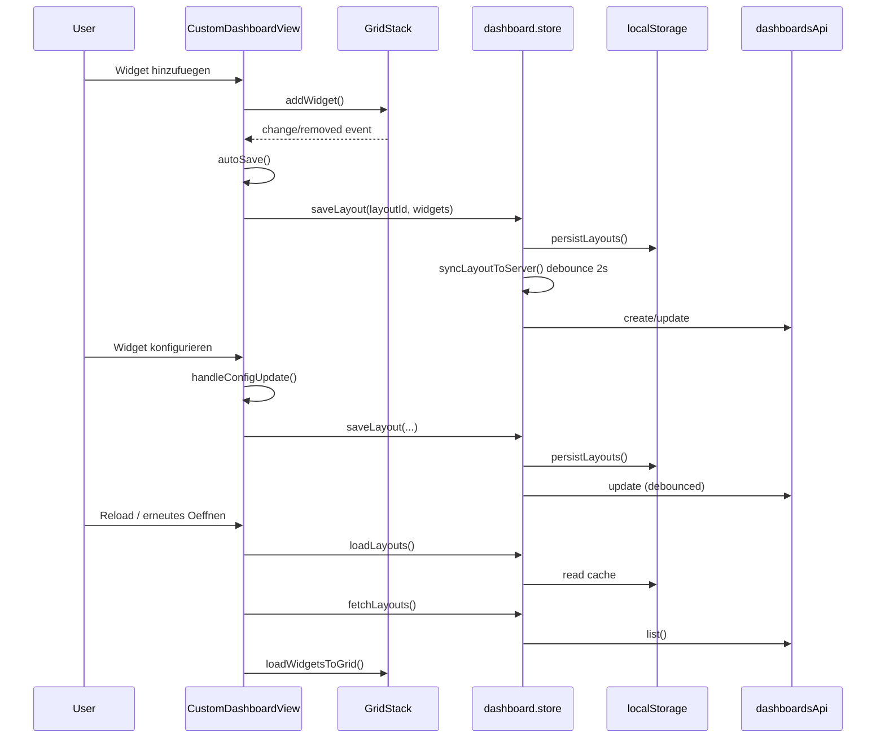

# Report F08: Dashboard Editor, Widgets, GridStack

Datum: 2026-04-05  
Scope: `El Frontend/src/views/CustomDashboardView.vue`, `El Frontend/src/components/dashboard-widgets/**`, `El Frontend/src/components/dashboard/DashboardViewer.vue`, `El Frontend/src/composables/useDashboardWidgets.ts`, `El Frontend/src/shared/stores/dashboard.store.ts`, `El Frontend/src/api/dashboards.ts`

## 1) Executive Result

- Der Editor-Lebenszyklus ist end-to-end vorhanden: Laden/Deep-Link -> GridStack-Render -> Bearbeiten -> localStorage-Speicher -> debounced Server-Sync -> Replay in Viewer/Editor.
- Die technische Persistenzkette ist klar und robust (local-first + API-sync + 404-Recreate + Retry-Entry).
- Widget-Registry und Konfigschema sind zentral in `useDashboardWidgets.ts` + `dashboard.store.ts`; 10 Typen sind konsistent registriert.
- Realtime-Konsistenz ist fuer Store-getriebene Widgets hoch (line/gauge/sensor-card/actuator-card/esp-health/alarm-list).
- Relevante Drift-/Verlustrisiken sind identifiziert: 1 hoch, 3 mittel, 2 niedrig.

---

## 2) State Machine: laden/erstellen/bearbeiten/speichern/wechseln

## 2.1 Zustandsmodell

1. `INIT`
   - `onMounted()`: optional `espStore.fetchAll()`, Deep-Link-Voraktivierung, `dashStore.fetchLayouts()`, `initGrid()`.
2. `LAYOUT_READY`
   - `activeLayoutId` gesetzt, Grid instanziert, `loadWidgetsToGrid(activeLayout.widgets)`.
3. `VIEW_MODE`
   - Grid gelockt (`enableMove(false)`, `enableResize(false)`, `removable=false`).
4. `EDIT_MODE`
   - Grid editierbar, Widget-Katalog aktiv, Config-Panel moeglich.
5. `DIRTY_PENDING_SYNC`
   - Ausloeser: Grid `change/removed`, Widget-Konfigupdate, Add/Remove, Template/Create.
   - Wirkung: `dashStore.saveLayout()` -> local persist sofort, API-sync debounced.
6. `SYNC_OK` oder `SYNC_ERROR`
   - Sync-OK: `lastSyncError = null`
   - Sync-Error: `lastSyncError = <msg>`, UI zeigt Retry (`retrySync`).
7. `SWITCH_LAYOUT`
   - `switchLayout(id)` -> `activeLayoutId` wechseln -> `loadWidgetsToGrid()`.
8. `DEACTIVATED/UNMOUNTED`
   - `cleanupAllWidgets()`, `grid.destroy(false)`, Breadcrumb reset.

## 2.2 Kernuebergaenge

- `INIT -> LAYOUT_READY`: nach `fetchLayouts()` und aktivem Layout.
- `LAYOUT_READY -> EDIT_MODE`: `toggleEditMode()` oder neues Dashboard (Create/Template setzt direkt edit).
- `EDIT_MODE -> DIRTY_PENDING_SYNC`: jede Grid-Mutation oder Konfigmutation.
- `DIRTY_PENDING_SYNC -> SYNC_OK/SYNC_ERROR`: debounce-Timer in `syncLayoutToServer`.
- `ANY -> SWITCH_LAYOUT`: Dropdown-Layoutwechsel/Deep-Link-Neuaktivierung.

---

## 3) GridStack-Events bis Persistenzwirkung

## 3.1 Event-Kette (Pflichtnachweis)

`GridStack UI Event`  
-> `CustomDashboardView.autoSave()`  
-> `dashStore.saveLayout(layoutId, widgets)`  
-> `persistLayouts()` (`localStorage`)  
-> `syncLayoutToServer(layoutId)` (2s debounce)  
-> `dashboardsApi.create/update`  
-> `layouts[idx].serverId` setzen/aktualisieren  
-> bei naechstem Laden `fetchLayouts()` merge + Replay in Grid.

## 3.2 Konkrete GridStack-Trigger

- `change`: Position/Resize/Move -> `autoSave()`.
- `removed`: Widget geloescht -> `unmountWidgetFromElement(id)` + `autoSave()`.
- `dropped` (FAB-Drag): Placeholder entfernen -> `addWidget(type)` -> `autoSave()`.

## 3.3 Replay/Reload

- Editor Replay: `loadWidgetsToGrid(layout.widgets)` bei Layoutwechsel, Deep-Link-Aufloesung und Grid-Reinit.
- Viewer Replay: `DashboardViewer` rendert statisch via `layout.widgets`; `watch(layout.updatedAt)` triggert Reload.
- Store Replay: `loadLayouts()` (lokal) + `fetchLayouts()` (server merge).

---

## 4) Widget-Registry, Konfigschema, Dateneingang je Typ

## 4.1 Registry/Schema-SSOT

- Registry: `useDashboardWidgets.ts::widgetComponentMap` (10 Typen).
- Katalog-Metadaten: `WIDGET_TYPE_META` (Label, minW/minH, Kategorie).
- Default-Konfig: `WIDGET_DEFAULT_CONFIGS`.
- Persistiertes Konfigschema: `dashboard.store.ts::DashboardWidget.config`.
- Config-UI: `WidgetConfigPanel.vue` (field-gating pro Typ + Progressive Disclosure).

## 4.2 Widget-Matrix (Input, Trigger, Speicherpfad, Fehlerpfad)

| Widgettyp | Input | Trigger | Speicherpfad | Fehlerpfad |
|---|---|---|---|---|
| `line-chart` | `sensorId`, Y/Thresholds | Sensorwahl, WS-Updates via `espStore` | `emit(update:config)` -> `widgetConfigs` -> `saveLayout` | kein eigener API-Fehlerpfad (leer bei fehlendem Sensor) |
| `gauge` | `sensorId`, Min/Max, Thresholds | Sensorwahl, store-reaktiv | wie oben | kein eigener API-Fehlerpfad |
| `sensor-card` | `sensorId` | Sensorwahl, store-reaktiv, Trend aus cache | wie oben | kein eigener API-Fehlerpfad |
| `historical` | `sensorId`, `timeRange` | Sensorwahl, Range-Wechsel | wie oben | Child `HistoricalChart` zeigt API-Fehler (`queryData/getStats`) |
| `multi-sensor` | `dataSources`, Compare-Mode, `actuatorIds`, `timeRange` | Add/Remove Sensor, Compare-Filter, Timer-Refresh | wie oben | Chart-API-Fehler mit Retry; Aktor-Overlay-Fehler degradiert still zu leer |
| `actuator-card` | `actuatorId` | Aktorwahl, Toggle | Config wie oben; Toggle geht ueber `espStore.sendActuatorCommand` | kein lokales try/catch im Widget (Risiko: Fehler-Feedback indirekt) |
| `actuator-runtime` | `zoneFilter`, `actuatorFilter`, Range | Range-/Aktorwechsel, 60s Refresh | Config wie oben | API-Fehler explizit als `error`-State |
| `esp-health` | `zoneFilter`, `showOfflineOnly` | Store-Aenderungen, Filter | Config wie oben | kein API-Fehlerpfad (rein store-basiert) |
| `alarm-list` | `zoneFilter`, `maxItems`, `showResolved` | Store-Aenderungen | Config wie oben | kein API-Fehlerpfad im Widget (datenquelle stores) |
| `statistics` | `sensorId`, `timeRange`, `showStdDev`, `showQuality` | Sensor/Range-Wechsel | Config wie oben | API-Fehler explizit (`Statistiken konnten nicht geladen werden`) |

## 4.3 Zusatzpfad Threshold-Sync

- `WidgetConfigPanel.loadThresholdsFromAlertConfig()`:
  - `sensorId` -> `configId` -> `sensorsApi.getAlertConfig(configId)`
  - mappt `warning_min/max`, `critical_min/max` auf `warnLow/high`, `alarmLow/high`
  - setzt `showThresholds=true`
  - persistiert indirekt via `emit(update:config)` -> `autoSave()`.

---

## 5) Pflichtnachweis A: Widget-Aktion -> Store -> API -> Reload/Replay

## A1: "Widget hinzufuegen" (Editor)

1. User klickt Widget im Katalog (`addWidget(type)`).
2. Grid-Zelle wird angelegt, Vue-Widget gemountet (`useDashboardWidgets.mountWidgetToElement`).
3. `autoSave()` serialisiert alle Grid-Items + `widgetConfigs`.
4. `dashStore.saveLayout()` schreibt lokal und triggert `syncLayoutToServer`.
5. `dashboardsApi.create/update` persistiert auf Server.
6. Spaeterer Reload: `fetchLayouts()` + `loadWidgetsToGrid()` reproduziert Zustand.

## A2: "Widget konfigurieren" (Config-Panel oder Widget selbst)

1. `emit('update:config', newConfig)` aus Widget oder Panel.
2. `CustomDashboardView` merged in `widgetConfigs`, optional Header-Title-Update.
3. `autoSave()` -> `saveLayout()` -> local persist + API-sync.
4. `DashboardViewer` bekommt bei `updatedAt`-Aenderung neue Konfiguration und rendert neu.

---

## 6) Pflichtnachweis B: Realtime-Update -> Widget-Rendering -> Konsistenz/Drift

## B1: Store-getriebene Widgets (hohe Realtime-Konsistenz)

- Pfad: WS/MQTT -> `espStore` Mutation -> computed in Widget -> Render.
- Betrifft: `line-chart`, `gauge`, `sensor-card`, `actuator-card`, `esp-health`, `alarm-list`.
- Charakteristik: kein Polling, kein lokales Caching notwendig ausser Chart-Buffers.

## B2: API-getriebene Widgets (eventual consistency)

- Pfad: Widget-Trigger/Timer -> REST (`sensorsApi`/`actuatorsApi`) -> Render.
- Betrifft: `historical`, `multi-sensor`, `statistics`, `actuator-runtime`.
- Charakteristik: kann zwischen zwei Polls vom Live-Store abweichen; bewusst trade-off fuer historische/aggregierte Daten.

## B3: Driftstellen

- Mischbetrieb live + historisch im selben Dashboard erzeugt zeitweise inkonsistente Wahrnehmung (normal, aber relevant fuer Operatoren).
- MultiSensor-Aktoroverlay ist "best effort" (fehlende History einzelner Aktoren fuehrt zu partiellem Overlay ohne globalen Fehlerzustand).

---

## 7) Konflikte Edit-Session vs. Live-Deviceupdates

## C1: Kein harter Schreibkonflikt auf Layoutebene

- Live-Deviceupdates mutieren primar `espStore`, nicht `dashStore.layouts`.
- Editor-Mutationen betreffen `dashStore.layouts` und Grid-DOM.
- Ergebnis: technisch getrennte Write-Domaenen, daher wenige direkte Race-Kollisionen.

## C2: Indirekte Konflikte

- Verfuegbare Sensor-/Aktoroptionen sind live aus `espStore` abgeleitet.
- Waehlt User waehrend Device-Churn, koennen Optionen verschwinden/wechseln.
- Persistierte `sensorId/actuatorId` bleiben im Layout, auch wenn Source temporaer fehlt (Widget faellt auf Empty-State).

## C3: Replay-Konsistenz

- `widgetConfigs` wird bei `loadWidgetsToGrid()` aus persistierter Layout-Config neu befuellt.
- Damit ist Edit-Session nach Layoutwechsel reproduzierbar, sofern IDs stabil bleiben.

---

## 8) Risiken (Datenverlust/Desync) mit Klassifikation

## Hoch

1. **Zone-Scope-Aenderung im Editor ohne Persistenzkette**
   - `setZoneScope()` mutiert `dashStore.layouts[idx]` direkt, ohne `saveLayout()/persistLayouts()/syncLayoutToServer()`.
   - Folge: Scope/zoneId kann bei Reload verloren gehen oder Server/Client driften.
   - Klasse: **hoch** (silent desync).

## Mittel

2. **Debounced Sync-Fenster (2s)**
   - Bei hartem Tab-Close/Crash koennen letzte Edits nur lokal oder gar nicht serverseitig landen.
   - Klasse: **mittel**.

3. **Merge/Dedup nach Name**
   - `fetchLayouts()` dedupliziert nach normalisiertem Namen und behaelt nur "neueste".
   - Gleichnamige, fachlich unterschiedliche Dashboards koennen entfernt werden.
   - Klasse: **mittel**.

4. **Aktor-Toggle ohne lokalen Fehlerfang im Widget**
   - `ActuatorCardWidget.toggle()` awaited, aber ohne `try/catch`.
   - UI-Fehlersignal haengt von tieferem Store/Global-Handler ab.
   - Klasse: **mittel** (Feedback-Luecke).

## Niedrig

5. **Partieller Overlay-Ausfall in Multi-Sensor**
   - Einzelne `actuatorsApi.getHistory` Fehler werden zu leeren Serien degradiert.
   - Klasse: **niedrig** (funktional tolerierbar, observability eingeschraenkt).

6. **Live-vs-History Zeitscheiben-Drift**
   - Unterschiedliche Refreshquellen erzeugen kurzfristige Divergenz.
   - Klasse: **niedrig** (erwartbar, aber dokumentationspflichtig).

---

## 9) Folgeauftraege (konkret)

## F08-A (hoch): Persistenzfix fuer `setZoneScope`

- Scope-Aenderung ueber Store-Action fuehren (`saveLayout`/`syncLayoutToServer`) statt direkter Array-Mutation.
- Akzeptanz: Scope/zoneId bleibt nach Reload und in API konsistent.

## F08-B (mittel): Safe-Flush vor Unmount

- Bei `onUnmounted` ausstehende debounce-Timer gezielt flushen (oder sync-now fuer active layout).
- Akzeptanz: letzte Editor-Aenderung geht nicht verloren.

## F08-C (mittel): Dedup-Haertung

- Dedup nicht nur nach Name, sondern z.B. Name+Scope+Zone oder opt-in migrationspfad.
- Akzeptanz: keine unbeabsichtigte Loeschung gleichnamiger Dashboards.

## F08-D (mittel): Lokales Fehlerfeedback fuer Aktor-Toggle

- `try/catch` im Widget oder expliziter UI-Fehlerpfad bei Command-Fail.
- Akzeptanz: Bediener bekommt sofort verwertbare Fehlermeldung.

---

## 10) Endbewertung gegen Akzeptanzkriterien

- Kriterium "State-Machine laden/erstellen/bearbeiten/speichern/wechseln": **erfuellt** (Abschnitt 2).
- Kriterium "GridStack-Events bis Persistenzwirkung": **erfuellt** (Abschnitt 3).
- Kriterium "Widget-Registry + Konfigschema + Dateneingang je Typ": **erfuellt** (Abschnitt 4).
- Kriterium "Pflichtnachweise Aktion->Store->API->Replay und Realtime->Rendering": **erfuellt** (Abschnitte 5/6).
- Kriterium "Risiken Datenverlust/Desync klassifiziert": **erfuellt** (Abschnitt 8).

---

## 11) Auftrag F08 Zusatzartefakte (Persistenzkette, Stoerfall, Identity)

## 11.1 Persistenzmatrix (`Aktion -> local write -> api sync -> replay`)

| Aktion | local write | api sync | replay nach Reload |
|---|---|---|---|
| Neues Dashboard (`createLayout`) | **ja** (`persistLayouts`) | **ja** (`syncLayoutToServer`, debounce) | **ja** (`loadLayouts` + `fetchLayouts`) |
| Dashboard aus Vorlage (`createLayoutFromTemplate`) | **ja** | **ja** | **ja** |
| Widget add/remove im Editor (`autoSave -> saveLayout`) | **ja** | **ja** | **ja** (`loadWidgetsToGrid`) |
| Widget konfigurieren (`handleConfigUpdate` / `onConfigUpdate`) | **ja** (ueber `saveLayout`) | **ja** | **ja** |
| Target setzen/entfernen (`setLayoutTarget`) | **ja** | **ja** | **ja** |
| Zone-Scope im Editor (`setZoneScope`) | **nein** (nur In-Memory Mutation) | **nein** | **nein** (bei Reload verloren moeglich) |
| Widget aus Monitor-FAB (Normalfall, `addWidget`) | **ja** | **ja** | **ja** |
| Widget aus Monitor-FAB (Fallback bei leerer Zone, manueller Scope-Write in `AddWidgetDialog`) | **teilweise** (direkte Array-Mutation) | **indirekt/spaetestens mit naechstem Save** | **fragil** (abhaengig von Folgeaktion) |

Bewertung:
- Die kanonische Kette funktioniert fuer die meisten Editoraktionen.
- Zwei Ausnahmen verletzen die Kette: `setZoneScope` (hoch) und direkter Scope-Write in `AddWidgetDialog` (mittel).

## 11.2 Nicht-kanonische Mutationen (ohne Save-Pipeline)

1. `CustomDashboardView.setZoneScope()`
   - direkte Mutation: `dashStore.layouts[idx] = { ... }`
   - fehlend: `persistLayouts()` + `syncLayoutToServer()`
   - Effekt: local/API-Replay koennen auseinanderlaufen.

2. `AddWidgetDialog.handleAdd()` (Fallback-Zweig ohne bestehendes Zone-Dashboard)
   - nach `createLayout()` direkte Mutation von `scope/zoneId/target` auf `dashStore.layouts[idx]`
   - kein expliziter Persist-/Sync-Aufruf fuer diese Metadaten in demselben Schritt.

## 11.3 Reproduzierbarer Desync-Fall (Nachweis)

### Fall D1: Zone-Scope geht bei Reload verloren

Voraussetzung:
- Bestehendes Dashboard im Editor.

Schritte:
1. Editor oeffnen (`/editor/:dashboardId`).
2. Pin-Icon -> Anzeigeort `Monitor - Inline` setzen.
3. Zone-Scope im Select auf konkrete Zone wechseln (`setZoneScope(...)`).
4. **Ohne weitere Widgetaktion** direkt Route wechseln oder Seite neu laden.
5. Dashboard erneut oeffnen.

Ist-Ergebnis:
- Scope/Zone kann auf vorherigem Zustand stehen (oder Cross-Zone), obwohl UI zuvor geaendert wurde.

Ursache:
- Mutation laeuft an `saveLayout` vorbei, daher kein garantierter local write + kein API sync.

Wirkung:
- Silent Desync zwischen sichtbarer Session-UI und reproduzierbarem Reload-Zustand.

## 11.4 Debounce-/Flush-Verhalten unter Stoerfall

Technikstand:
- Server-Sync ist per Layout auf `SAVE_DEBOUNCE_MS = 2000` entkoppelt.
- Kein expliziter Flush-Hook fuer `beforeunload`, `pagehide`, Route-Leave oder `onUnmounted`.

Stoerfallmatrix:
- **Crash/Tab kill innerhalb 2s nach letzter Aenderung:** Serverstand kann letzte Aenderung verlieren.
- **Hard navigation/close innerhalb Debounce-Fenster:** gleicher Effekt; Retry erst spaeter aus neuer Session moeglich.
- **Routewechsel im App-Kontext:** Editor baut Grid ab, aber triggert keinen "sync-now" fuer offene Timer.

Einordnung:
- Local-first puffert vieles (wenn Aenderung ueber `saveLayout` ging), aber API-Finalitaet bleibt ohne Flush unsicher.
- Bei nicht-kanonischen Writes (`setZoneScope`) fehlt sogar der lokale durable write.

## 11.5 Identity-Regeln haerten + Backward-Pfad

Aktuell:
- `fetchLayouts()` dedupliziert nur per `name.toLowerCase().trim()`.
- Risiko: fachlich verschiedene Dashboards mit gleichem Namen werden zusammengelegt/geloescht.

Soll-Regel (fachlich robust):
- Primarschluessel fuer Deduplikation:
  - `serverId`, wenn vorhanden.
  - sonst `identityKey = name_norm + scope + zoneId + sensorId + target(view/placement)`.

Backward-Pfad (ohne Big-Bang):
1. **Phase 1 (read-compatible):** Neue `identityKey`-Berechnung nur im Frontend, keine API-Aenderung.
2. **Phase 2 (safe dedup):** Nur dedupen, wenn `identityKey` gleich ist; reine Name-Kollision nur warnen/loggen.
3. **Phase 3 (migration optional):** Bestehende Layouts beim naechsten Save mit stabiler Identitaet markieren.
4. **Phase 4:** Legacy-Name-only-Dedup entfernen.

## 11.6 Sequenzdiagramm: Add -> Configure -> Save -> Reload (pro Widget)

## 11.7 Konkrete Akzeptanz-Checks fuer F08

- Scope/Layout-Aenderung bleibt nach Reload konsistent:
  - aktuell **nicht garantiert** fuer `setZoneScope`.
- Kein stiller Verlust letzter Aenderung bei Navigation:
  - aktuell **nicht garantiert** fuer API-Finalitaet im Debounce-Fenster.
- Dedup-Regeln loeschen keine fachlich verschiedenen Dashboards:
  - aktuell **nicht garantiert** bei Name-Kollision.

