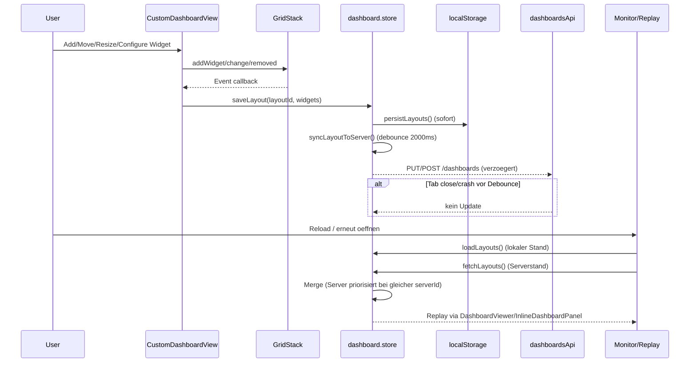

# Report Frontend F08: Custom Dashboard Editor, Widgets, GridStack und Persistenz
## 9) Update nach Umsetzung (2026-04-06)

### 9.1 Umgesetzte P0/P1-Fixes

- **Kanonische Scope-/Metadaten-Mutationen:** `dashboard.store` enthält jetzt `setLayoutScope(...)` und `setLayoutMetadata(...)`; direkte `dashStore.layouts[idx]`-Mutationen in `CustomDashboardView`/`AddWidgetDialog` wurden entfernt.
- **Safe-Flush:** `flushPendingSyncs(...)` eingeführt; Flush wird auf `beforeunload` (Store) sowie `onBeforeRouteLeave` und `onUnmounted` in `CustomDashboardView` ausgelöst.
- **Merge-Härtung bei gleicher `serverId`:** `fetchLayouts()` nutzt Dirty-/Zeitregeln (`dirty + local newer`, `clean + server newer`, `conflict` bei beidseitiger Änderung), keine stille Überschreibung mehr.
- **Identity-Härtung:** Name-only-Dedup inkl. Auto-Delete entfernt; fachlicher Schlüssel über `buildLayoutIdentityKey(name+scope+zoneId+sensorId+target)` eingeführt.
- **Diagnostik:** `syncFlags` erweitert um `status`, `dirty`, `conflict`, `last_sync_attempt_at`, `last_sync_result_at`, `last_sync_message`.

### 9.2 Testnachweise

- `npx vitest run tests/unit/stores/dashboard.test.ts` erfolgreich (inkl. neuer Merge-/Identity-/Flush-Tests).
- `npx vue-tsc --noEmit` erfolgreich.

### 9.3 Aktualisierter Abgleich mit Akzeptanzkriterien

- Scope/Layout-Änderungen nach Reload konsistent: **erfüllt** (kanonische Actions + Persistenz-/Sync-Pfad).
- Kein stiller Verlust letzter Änderung bei schnellem Schließen: **weitgehend erfüllt** (Best-Effort-Flush + Konfliktstatus statt stiller Überschreibung).
- Dedup löscht keine fachlich verschiedenen Dashboards: **erfüllt** (name-basiertes Auto-Delete entfernt).
Datum: 2026-04-06  
Scope: `El Frontend/src/views/CustomDashboardView.vue`, `El Frontend/src/shared/stores/dashboard.store.ts`, `El Frontend/src/components/monitor/AddWidgetDialog.vue`, `El Frontend/src/components/dashboard/InlineDashboardPanel.vue`, `El Frontend/src/components/dashboard/DashboardViewer.vue`, `El Frontend/src/router/index.ts`

## 1) Persistenzmatrix `Aktion -> local write -> api sync -> replay`

| Aktion | Local write (RAM/localStorage) | API sync | Replay (Reload/Monitor) | Befund |
|---|---|---|---|---|
| Widget hinzufügen (Editor) | `autoSave()` -> `saveLayout()` -> `persistLayouts()` | `syncLayoutToServer()` (debounce 2000ms) | `loadLayouts()` + `fetchLayouts()` + `loadWidgetsToGrid()` / `InlineDashboardPanel` | Kette vorhanden, aber debounce-kritisch |
| Widget verschieben/resizen (GridStack `change`) | wie oben | wie oben | wie oben | Kette vorhanden, aber debounce-kritisch |
| Widget entfernen (GridStack `removed`) | wie oben | wie oben | wie oben | Kette vorhanden, aber debounce-kritisch |
| Widget-Konfig ändern (Panel/Widget-Event) | `autoSave()` -> `saveLayout()` -> `persistLayouts()` | `syncLayoutToServer()` (debounce) | Viewer/Inline remount auf `updatedAt`/Store-Änderung | Kette vorhanden, aber debounce-kritisch |
| Target setzen/entfernen (Pin) | `setLayoutTarget()` -> `persistLayouts()` | `syncLayoutToServer()` (debounce) | Monitor-Panel-Selektion via `target` | Kette vorhanden, aber debounce-kritisch |
| Zone-Scope setzen (`setZoneScope`) | **nur RAM-Mutation** an `dashStore.layouts[idx]` | **kein** Sync | Replay abhängig von späteren Writes | **Nicht-kanonisch, desync-anfällig** |
| Layout erstellen (`createLayout`) | `persistLayouts()` | `syncLayoutToServer()` (debounce) | im Editor aktiv + später Monitor | Kette vorhanden, aber debounce-kritisch |
| Layout aus Template (`createLayoutFromTemplate`) | `persistLayouts()` | `syncLayoutToServer()` (debounce) | Replay vorhanden | Kette vorhanden, aber debounce-kritisch |
| Layout aus AddWidgetDialog ohne Zone-Geräte (Fallback-Pfad) | direkte `dashStore.layouts[idx]`-Mutation, dann `addWidget()`/`saveLayout()` | indirekt über `saveLayout()` | Replay meist ok, da `saveLayout` nachzieht | Nicht-kanonisch, aber oft maskiert |

## 2) Nicht-kanonische Mutationen (außerhalb Save-Pipeline)

### 2.1 `setZoneScope` mutiert Store direkt ohne Persistenz/Sync

- In `CustomDashboardView` wird `dashStore.layouts[idx]` direkt überschrieben, ohne `persistLayouts()` und ohne `syncLayoutToServer()`.
- Damit fehlt die verbindliche Kette `local -> api -> replay` für Scope/Zone.
- Folge: Scope-Änderung kann bei Reload/Navigation verschwinden, wenn keine weitere Aktion `saveLayout()` triggert.

### 2.2 `AddWidgetDialog` fallback mutiert Layout-Metadaten direkt

- Im Fallback-Pfad (`generateZoneDashboard === null`) werden `scope`, `zoneId`, `autoGenerated`, `target` direkt in `dashStore.layouts[idx]` gesetzt.
- Danach folgt zwar typischerweise `addWidget()` (`saveLayout()`), aber der Pfad bleibt fachlich nicht-kanonisch und fragil (abhängig von Folgeaktionen).

## 3) Debounce-/Flush-Verhalten unter Störfall

## 3.1 Ist-Mechanik

- `saveLayout()` schreibt sofort lokal (`persistLayouts()`), Server-Sync erfolgt debounced (`SAVE_DEBOUNCE_MS = 2000`).
- `syncLayoutToServer()` ist fire-and-forget (Timer in `_saveDebounceTimers`).
- `CustomDashboardView` hat in `onUnmounted()` **keinen** Flush ausstehender Timer und keinen Hard-Sync.
- Es gibt keinen Dashboard-spezifischen `beforeunload`/Route-Leave-Safe-Flush.

### 3.2 Kritischer Desync (reproduzierbar)

**Fall D1: Letzte Änderung < 2s vor Tab-Close/Crash auf bereits server-synchronisiertem Dashboard**

1. Bestehendes Dashboard mit `serverId` im Editor öffnen.  
2. Widget verschieben oder Konfig ändern (triggert `saveLayout` + debounce-sync).  
3. Innerhalb von <2s Tab schließen oder Browser killen.  
4. Neu öffnen (harte Session).  
5. `loadLayouts()` lädt lokale Änderung, **danach** `fetchLayouts()` ersetzt bei gleicher `serverId` den lokalen Eintrag mit Serverstand (Server-Priorität im Merge).  

**Wirkung:** Letzte Änderung ist nach Reload verloren (silent desync zwischen Nutzererwartung und finalem Zustand).

### 3.3 Route-Change vs. Hard-Close

- SPA-Route-Wechsel allein ist weniger kritisch, weil Store-Timer meist weiterläuft.
- Hard-Close/Crash/Refresh vor Debounce-Ablauf bleibt kritisch (kein Flush-Hook).

## 4) Identity-Regeln und Dedup-Risiko

### 4.1 Ist-Regel

- In `fetchLayouts()` wird dedupliziert über `name.toLowerCase().trim()`.
- Bei Kollision bleibt nur das jüngste `updatedAt`; ältere werden lokal entfernt und bei `serverId` zusätzlich serverseitig gelöscht.

### 4.2 Fachliches Risiko

- Zwei fachlich verschiedene Dashboards mit gleichem Namen (z. B. unterschiedlicher `scope`, `zoneId`, `target`) können zusammengelegt/gelöscht werden.
- Das verletzt die geforderte Layout-Identität und kann irreversible Löschungen auslösen.

### 4.3 Härtungsvorschlag (SOLL)

1. Dedup-Key von reinem Namen auf fachliche Identität erweitern, z. B.:  
   `identity = normalize(name) + scope + zoneId + sensorId + target.view + target.placement`
2. Server-ID als primäre Identität behandeln; Name nur als Anzeige-Metadatum.
3. Auto-delete bei Namenskollision deaktivieren; stattdessen Konflikt markieren (UI/Log), nicht löschen.
4. Migrations-/Backward-Pfad: bestehende Layouts mit Legacy-Key nur markieren, erst nach expliziter Bestätigung bereinigen.

## 5) Sequenzdiagramm Add/Configure/Save/Reload (pro Widget)

## 6) Nachweis: Ursache/Wirkung für mindestens einen Desync-Fall

### Nachweis N1 (Scope-Verlust durch nicht-kanonische Mutation)

- Ursache: `setZoneScope()` schreibt nur in `dashStore.layouts[idx]`, ohne persist/sync.
- Wirkung: Scope/Zone-Änderung ist nicht verbindlich in der Persistenzkette; nach Reload kann der vorherige Stand erscheinen.

### Nachweis N2 (Debounce-Verlust trotz local-first)

- Ursache: Debounce-Sync + fehlender Safe-Flush bei Close/Crash + server-priorisierter Merge.
- Wirkung: Letzte Änderung wird bei Reopen durch älteren Serverstand überschrieben.

## 7) Abgleich mit Akzeptanzkriterien

- Scope/Layout-Änderungen nach Reload konsistent: **nicht erfüllt** (nicht-kanonischer Scope-Pfad + Debounce-Risiko).  
- Kein stiller Verlust letzter Änderung bei Navigation: **teilweise erfüllt** (SPA eher stabil, Hard-Close/Crash nicht).  
- Dedup löscht keine fachlich verschiedenen Dashboards: **nicht erfüllt** (name-basierte Dedup-Löschung).  

## 8) Priorisierte Maßnahmen (ohne kompletten Umbau)

1. **Kanonische Scope-Action** im Store einführen (z. B. `setLayoutScope(layoutId, scope, zoneId)`), inkl. `persistLayouts()+syncLayoutToServer()`.
2. **Safe-Flush** für ausstehende Debounce-Timer auf `beforeunload` und optional `onBeforeRouteLeave` (best effort).
3. **Merge-Strategie härten**: lokale unsynced Änderungen bei gleicher `serverId` nicht blind durch Server ersetzen (z. B. `updatedAt`/dirty-Flag beachten).
4. **Dedup-Key fachlich erweitern** und Auto-Delete bei reiner Namenskollision entfernen.
5. **Integrations-Tests** ergänzen:  
   - `create -> configure -> reload parity`  
   - `edit -> close < debounce -> reopen`  
   - `scope change -> reload`  
   - `name collision with different scope/target`.

