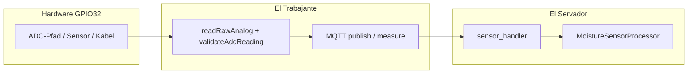

# CORRELATION-MAP — INC-2026-04-11-ea5484-gpio32-soil-adc-signal

**Clustering-Reihenfolge** (laut Konzept 6.2 / `auto-debugger`): Notification-Felder → HTTP `request_id` → `esp_id` + Zeitfenster → MQTT → Dedup zuletzt.

---

## 1. Notification-Felder (`correlation_id`, `fingerprint`, `parent_notification_id`)

| Feld | Evidence im Run | Status |
|------|-----------------|--------|
| correlation_id | In bereitgestelltem **Bericht** nicht extrahiert | **n/a** |
| fingerprint | n/a | **n/a** |
| parent_notification_id | n/a | **n/a** |

**Hinweis:** Keine Vermischung mit WS-`error_event`-Kette ohne Payload-Beleg.

---

## 2. HTTP (`X-Request-ID` / `request_id`)

| Beobachtung | Quelle | Hinweis |
|--------------|--------|---------|
| Burst **`POST /api/v1/sensors/ESP_EA5484/32/measure`** | Bericht §2.2 (Server-Log-Auszug) | Konkrete `X-Request-ID`-Werte im Repo **nicht** abgelegt — bei Follow-up aus `automationone-server`-Logs übernehmen. |
| Kalibrier-Sessions / Abbruch | `CalibrationResponseHandler`, `User aborted calibration flow` | Operativer Ablauf, nicht ADC-Rail-Ursache. |

**Vollständige Route (Repo-IST):** `POST /api/v1/sensors/{esp_id}/{gpio}/measure` — `El Servador/god_kaiser_server/src/api/v1/sensors.py` (Decorator `"/{esp_id}/{gpio}/measure"`, Router `prefix="/v1/sensors"`).

---

## 3. `esp_id` + Zeitfenster (Kernkorrelation)

| Fenster | esp_id | GPIO | Ereignis-Schicht | Kurzbeschreibung |
|---------|--------|------|------------------|------------------|
| ~2026-04-10 22:41–22:44 (Container) | ESP_EA5484 | 32 | **Serial** | Manuelle Messung; **`ADC rail … raw=4095`** |
| gleiches Fenster | ESP_EA5484 | 32 | **Server** | Rohwert-Sprünge → `processed` % mit **quality** good/poor/fair laut linearer Kalibrierung |
| gleiches Fenster | ESP_EA5484 | — | **Broker** | Client disconnect `exceeded timeout` (Keepalive) |
| gleiches Fenster | ESP_EA5484 | — | **Serial** | MQTT write timeout errno 119 → Disconnect → TLS timeout → **ERRTRAK 3014** |

**Rohwert ↔ Prozent (Beispiele aus Bericht — keine Secrets):**

| raw | processed (Beispiel) | quality (Beispiel) | Einordnung |
|-----|----------------------|--------------------|--------------|
| 2111 | 64.1 % | good | Mitte der Kennlinie |
| 3706 | 0.0 % | poor | Nahe „trocken“-Kalibrierpunkt / Rand |
| 1430 | 100.0 % | poor | Nahe „nass“-Kalibrierpunkt / Rand |
| 1822 | 81.1 % | fair | Randbereich fair |

**4095:** Firmware klassifiziert als Rail → `validateAdcReading` → Log + Quality **`suspect`** auf Gerät; Server mappt nach Kalibrierung — instabiler **Eingang** erklärt Rand-`quality`, nicht zwingend fehlerhafte `linear_2point`-Mathematik.

---

## 4. MQTT (Topics / synthetische CID)

| Topic / Muster | Rolle | Evidence |
|----------------|-------|------------|
| Sensor measure command (GPIO 32) | Auslöser manueller Messzyklen | Bericht: `sensor/32/command`, `timeout_ms=5000` (Serial) |
| Sensor telemetry (Feuchte) | Rohwert an Server | Konsistent mit `sensor_handler`-Pfad (Details in Server-Debug) |

**CID:** Im Bericht keine durchgängige Client-ID-Zeile für ADC vs. MQTT verknüpft — **Lücke** für Feld-bewusste Tiefe.

---

## 5. Dedup / Titel (zuletzt)

- **Nicht** zur Root-Cause-Bildung herangezogen (Kollisionsrisiko).

---

## 6. Korrelationsdiagramm (qualitativ)

**Lesart:** Instabilität **vor** der Server-Kalibrierkurve; Kalibrierung projiziert nur, was am Pin ankommt.
