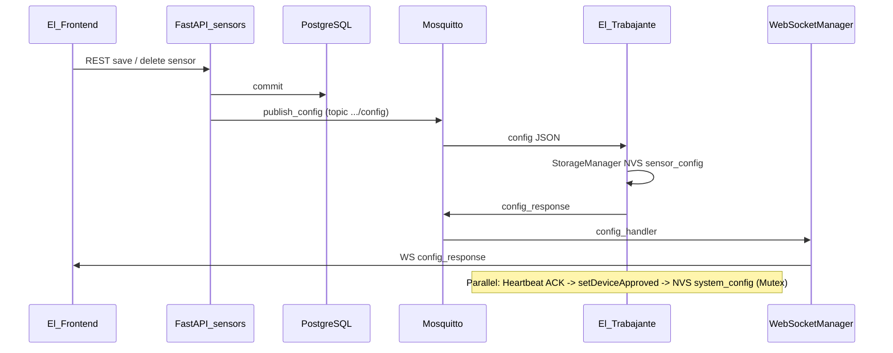

# CODE-LAYER-MAP — NVS / Config / DELETE / UI

Vier Schichten (STEUER-Minimum), je **≥3 Dateipfade**, plus Ablauf-Diagramm.

## Tabelle: Schicht → Dateien → Verantwortung → Konfliktpunkt

| Schicht | Dateipfade (repo-relativ) | Verantwortung | Konflikt / Risiko |
|---------|---------------------------|---------------|-------------------|
| **Firmware NVS/MQTT** | `El Trabajante/src/services/config/storage_manager.cpp`, `config_manager.cpp`, `main.cpp`, `services/sensor/sensor_manager.cpp` | NVS-Mutex 250 ms; Approval-Persistenz; MQTT `/config` vs. Heartbeat-ACK | `beginTransaction`/`beginNamespace` Lock-Timeout vs. häufiges `setDeviceApproved` |
| **Server API/MQTT/WS** | `El Servador/god_kaiser_server/src/api/v1/sensors.py`, `mqtt/handlers/sensor_handler.py`, `mqtt/handlers/config_handler.py`, `services/esp_service.py`, `websocket/manager.py` | CRUD, Ingest, Config-Publish, WS-Broadcast | DELETE-Response-Schema (UUID); fehlende DB-Config + `degraded` |
| **Frontend Store/Toast** | `El Frontend/src/shared/stores/config.store.ts`, `src/stores/esp.ts`, `src/composables/useConfigResponse.ts`, `src/types/websocket-events.ts` | `config_response` / `sensor_config_deleted` UX | Toast-Text aus Server-Message vs. tatsächliche Firmware-Ursache |
| **Observability / Mapping** | `El Servador/.../core/esp32_error_mapping.py`, `El Servador/.../core/logging_config.py`, `docker/alloy/config.alloy` | Fehlertexte DE, strukturierte Logs, Log-Shipment | Korrelation nur mit sauberen IDs (`correlation_id`, `request_id`) |

---

## Ablauf A — Config-Push vs. Heartbeat (nummeriert)

1. Operator speichert Sensor → REST → DB-Update → `send_config` → MQTT `…/config`.  
2. ESP `handleSensorConfig` (siehe `main.cpp` SYNC-Pfad) → NVS `sensor_config` Namespace.  
3. ESP publiziert MQTT `config_response` → Server `config_handler` → WS `config_response`.  
4. Parallel: Server Heartbeat-ACK → MQTT → ESP `main.cpp` Heartbeat-Handler → **`setDeviceApproved`** → NVS `system_config` (gleicher `StorageManager`-Mutex).

## Ablauf B — Sensor DELETE

1. `DELETE /api/v1/sensors/{esp_id}/{config_id}` (`sensors.py`).  
2. DB delete → Subzone-Sync (optional) → `build_combined_config` → `send_config`.  
3. WS `sensor_config_deleted` mit string-IDs.  
4. HTTP-Response `SensorConfigResponse` aus `_model_to_response`.

---

## Sequenzdiagramm (Mermaid)

---

## Konflikt-Hotspots (kurz)

| Hotspot | Symptom | Code-Anker |
|---------|---------|------------|
| NVS Mutex 250 ms | `beginNamespace lock timeout` | `storage_manager.cpp` |
| Approval bei jedem ACK | unnötige NVS-Writes | `main.cpp` + `config_manager.cpp` |
| Fehlende DB-Sensorzeile | Warnlog + `degraded` | `sensor_handler.py` |
| UI-Text | „Speicher voll…“ | `esp32_error_mapping.py` + `config.store.ts` |
