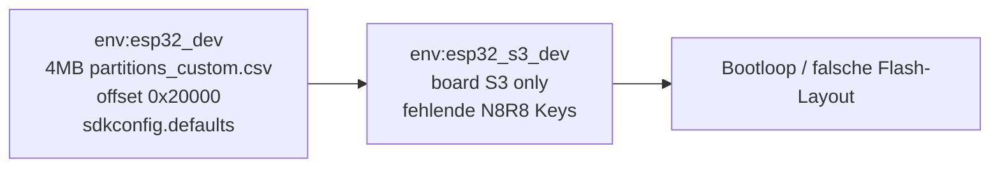
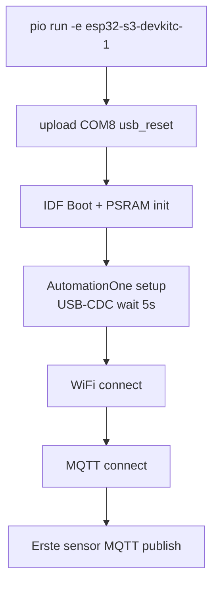

# ESP32-S3 DevKitC-1 Port (Firmware)

## Reality-Check (verify-plan Gate)

| TM-Annahme | IST im Repo | Korrektur |
|------------|-------------|-----------|
| Kanonische `platformio.ini` im Repo-Root | Nur [`El Trabajante/platformio.ini`](El Trabajante/platformio.ini) | Alle Änderungen dort; kein Root-`platformio.ini` anlegen |
| Neues Env `esp32-s3-devkitc-1` | Existiert als `[env:esp32_s3_dev]` (Zeilen 151–163) | TM-Env-Namen als **kanonisch** einführen; `esp32_s3_dev` als `extends`-Alias behalten (Regression für frühe Experimente) |
| Separate GPIO-Map für S3 | [`esp32_s3_devkit.h`](El Trabajante/src/config/hardware/esp32_s3_devkit.h) + `ESP32_S3_DEVKIT_MODE` in 6 Modulen | Map ist aktiv, aber **falsch** (siehe unten) |
| Kommentar „GPIO-Map bleibt esp32_dev.h“ in `platformio.ini` | **Veraltet** — Code nutzt bereits `esp32_s3_devkit.h` | Kommentar entfernen/aktualisieren |
| `qio_opi`, `BOARD_HAS_PSRAM`, `default_8MB.csv` | **Fehlen** im S3-Env | Pflicht-Ergänzung (Bootloop-Risiko #1) |
| `dacWrite` / `touchRead` | Keine Treffer in `src/` | Kein Code-Fix nötig |
| Akzeptanz „PSRAM initialized“ | Kein Custom-Log im Projekt; kommt vom **ESP-IDF Bootloader** | Erwartung: IDF-Zeile `PSRAM` / `oct` im Serial-Log, nicht nur Application-Banner |

**Kritische vererbte Fehler** (`esp32_s3_dev extends = env:esp32_dev`):



- [`partitions_custom.csv`](El Trabajante/partitions_custom.csv): 4MB WROOM-Layout — **falsch für N8R8 (8MB)**
- `board_upload.offset_address = 0x20000` von `esp32_dev` — für S3 mit `default_8MB.csv` typisch **nicht** übernehmen; im S3-Env explizit zurücksetzen/entfernen
- Kein `board_build.arduino.memory_type = qio_opi` → Octal-PSRAM-Init scheitert häufig

---

## Zielbild



- **[`env:esp32_dev`](El Trabajante/platformio.ini)**: unverändert (Regression: `pio run -e esp32_dev`)
- **Neues kanonisches Env** `esp32-s3-devkitc-1` gemäß TM-Abschnitt 3
- **Alias** `[env:esp32_s3_dev] extends = env:esp32-s3-devkitc-1` (optional, 1 Zeile)

---

## Phase 1: PlatformIO — N8R8 + USB-CDC

Datei: [`El Trabajante/platformio.ini`](El Trabajante/platformio.ini)

Neues/ersetzendes Env (Kern — nicht nur `extends esp32_dev` für Board-spezifische Keys):

```ini
[env:esp32-s3-devkitc-1]
extends = env:esp32_dev
board = esp32-s3-devkitc-1
framework = arduino

; N8R8 Speicher (Pflicht)
board_build.arduino.memory_type = qio_opi
board_build.flash_mode = qio
board_build.psram_type = opi
board_upload.flash_size = 8MB
board_upload.maximum_size = 8388608
board_build.partitions = default_8MB.csv

; WROOM-spezifisches NICHT erben:
board_upload.offset_address =

build_flags =
    ${env:esp32_dev.build_flags}
    -DESP32_S3_DEVKIT_MODE=1
    -DBOARD_HAS_PSRAM
    -DARDUINO_USB_MODE=1
    -DARDUINO_USB_CDC_ON_BOOT=1

upload_speed = 921600
upload_protocol = esptool
upload_flags =
    --before=usb_reset
    --after=hard_reset
    --chip=esp32s3

monitor_speed = 115200
; optional lokal (nicht committen): upload_port = COM8, monitor_port = COM8
```

**Bewusst von `esp32_dev` erben:** `lib_deps`, Feature-Makros (`MAX_SENSORS`, MQTT-IDF-Pfad), `sdkconfig.defaults` (MQTT Core-0-Pinning bleibt sinnvoll auf S3).

**Nicht committen:** `upload_port`/`monitor_port` — nur in lokaler `platformio.ini` User-Section oder CLI `--upload-port COM8`.

---

## Phase 2: GPIO-Map N8R8 korrigieren

Datei: [`El Trabajante/src/config/hardware/esp32_s3_devkit.h`](El Trabajante/src/config/hardware/esp32_s3_devkit.h)

Aktueller Fehler (Zeile 9 + RESERVED-Array): blockiert GPIO **26–37** pauschal — TM-korrekt sind nur **35, 36, 37** (Octal-PSRAM).

| Kategorie | Pins (TM) | Aktion in Header |
|-----------|-----------|------------------|
| Octal-PSRAM | 35, 36, 37 | `RESERVED` |
| USB CDC | 19, 20 | `RESERVED` |
| Strapping | 0, 3, 45, 46 | `RESERVED` (45 auf N8R8 laut TM als GPIO nutzbar — trotzdem reservieren wie bisher für Safety) |
| UART0 Boot-Log | 43, 44 | `RESERVED` |
| RGB LED | 38 (v1.1) / 48 (v1.0) | Beide in `RESERVED` bis Board-Rev. geklärt; `LED_PIN = 38` + Kommentar |
| **Entfernen** aus RESERVED | 26–34, 40–42 | Nur reservieren wenn Board-Doku es verlangt — 40–42 sind **nicht** in TM-USB-Liste |

`SAFE_GPIO_PINS` neu ableiten: alle nutzbaren Header-Pins minus RESERVED (inkl. 1, 2, 4, 5, 8, 9, 10–18, 21, 38, 39, 47 …).

`ADC2_GPIO_PINS` (11–20) und I2C **8/9**, OneWire **4** beibehalten — passen zum DevKit-Header.

**Statische Prüfung (Acceptance vor Code):**

```powershell
cd "El Trabajante"
rg "\b(35|36|37)\b" src/config/hardware/esp32_s3_devkit.h
# SAFE_GPIO_PINS darf 35–37 nicht enthalten
```

**Bereits verdrahtet:** Code-Pfad für S3 ist konsistent (`gpio_manager`, `i2c_bus`, `onewire_bus`, `main.cpp` Zeilen 2626–2631 USB-CDC-Wartezeit). Keine weiteren `#ifdef`-Stellen nötig außer ggf. Dokumentation.

---

## Phase 3: Build-Verifikation (ohne Hardware)

| Schritt | Befehl | Erwartung |
|---------|--------|-----------|
| Regression classic | `pio run -e esp32_dev` | Exit 0 |
| S3 Build | `pio run -e esp32-s3-devkitc-1` | Exit 0, keine Linker-Fehler |
| Binary-Größe | Log `RAM/Flash` | App < ~1.9MB pro `default_8MB` OTA-Slot |
| Optional native | `pio test -e native` | Unverändert grün (GPIO-Tests nutzen Mock, nicht S3-Header) |

Bei Warnungen zu ADC2: nur melden, wenn Code `analogRead` auf ADC2-Pins (11–20) mit WiFi nutzt.

---

## Phase 4: Flash + Serial (Hardware COM8)

**Vor dem ersten Flash (Verify-Plan-Gate):** Erwartetes Boot-Log in Slack/Notiz festhalten (TM Abschnitt 5), dann abgleichen.

| Schritt | Befehl | Erwartung |
|---------|--------|-----------|
| Flash | `pio run -e esp32-s3-devkitc-1 -t upload --upload-port COM8` | Success; danach Auto-Reset via `usb_reset` |
| Erster Flash scheitert | BOOT halten → RESET → BOOT los | Download-Mode |
| Monitor | `pio device monitor -e esp32-s3-devkitc-1 --port COM8 --baud 115200` | Siehe Akzeptanz A–D |

**Diagnose Bootloop:** Wenn nur USB-CDC offen und frühe Crashes: UART0 an **GPIO43 TX** mitschneiden (TM-Fallstrick).

**WiFi/MQTT-Credentials:** wie bei `esp32_dev` (NVS/Provisioning) — kein NVS-Migrations-Script im Scope; frisches Board = Provision-Portal oder `esp32_funkturm`-Pattern nur bei Bedarf.

---

## Phase 5: Akzeptanzkriterien A–E

| ID | Test | PASS wenn |
|----|------|-----------|
| A | Serial-Boot | Kein Brownout-Loop; Application-Banner + Chip `ESP32-S3` |
| B | PSRAM | IDF-Boot zeigt PSRAM/OPI-Init (nicht sofort `rst:`-Kette ohne App-Output) |
| C | WiFi | `WiFi connected` + IP im Log |
| D | MQTT | `MQTT connected` + Broker-Subscription sichtbar |
| E | Sensor | Eine `sensor`-Topic-Message (Format wie classic) |

**Kriterium E — Verkabelung (offen, da keine User-Antwort):**

- **Variante A:** Sensoren an S3-Defaults (I2C 8/9, DS18B20 GPIO4) oder Server-Konfig mit GPIOs aus `SAFE_GPIO_PINS`
- **Variante B:** Noch WROOM-Verdrahtung (21/22) → entweder Umbau **oder** temporär `I2C_SDA_PIN`/`I2C_SCL_PIN` in `esp32_s3_devkit.h` anpassen (nur für diesen Test, dokumentieren)
- **Variante C:** Nur MQTT ohne Sensor — E als „deferred“, A–D trotzdem Pflicht für „Boot-fähig“

Verifikation E: `mosquitto_sub -h <broker> -t 'kaiser/+/esp/+/sensor/+/data' -v`

---

## Phase 6: Dokumentation (minimal)

- [`El Trabajante/platformio.ini`](El Trabajante/platformio.ini): S3-Block-Kommentar auf N8R8 + Env-Namen aktualisieren
- [`.claude/skills/esp32-development/SKILL.md`](.claude/skills/esp32-development/SKILL.md) §0 Stack-Anker: drittes Board `esp32-s3-devkitc-1` + Verweis `esp32_s3_devkit.h`
- Optional: Kurzvermerk in [`MODULE_REGISTRY.md`](El Trabajante/MODULE_REGISTRY.md) unter Board-Configs

**Nicht im Scope:** Server, Frontend, Partitions-Redesign, NVS-Migration, Kalibrierung, `esp32_prod`-S3-Variante.

---

## Risiko-Matrix

| Risiko | Symptom | Mitigation |
|--------|---------|------------|
| Fehlendes `qio_opi` | Reset-Loop, kein PSRAM-Log | Phase 1 Keys |
| 4MB-Partition geerbt | Flash OK, Boot kaputt | `default_8MB.csv` + offset löschen |
| USB-CDC vor Host | Leeres Serial 5s | `main.cpp` wait existiert; UART0 für Diagnose |
| GPIO-Map zu restriktiv | Safe-Mode OK, Config-Fehler | Phase 2 |
| Brownout WiFi | Reset bei `WiFi.begin` | Direktes USB, kein Hub |
| GPIO19/20 belegt | USB weg | Reservierung in Phase 2 |

---

## Empfohlene Ausführungsreihenfolge (firmware-dev)

1. `platformio.ini`: neues Env + Alias, **ohne** `esp32_dev`-Zeilen zu ändern
2. `esp32_s3_devkit.h`: RESERVED/SAFE gemäß TM
3. `pio run -e esp32_dev` dann `pio run -e esp32-s3-devkitc-1`
4. Flash/Monitor COM8, Befunde A–E dokumentieren (Verify-Plan-Gate)
5. Docs-Skill-Abschnitt (1–2 Zeilen) nur bei grünem S3-Build

**Branch-Empfehlung:** Feature-Branch (z. B. `feat/esp32-s3-devkitc-1`), nicht `auto-debugger/work`, sofern kein Linear-Incident.
