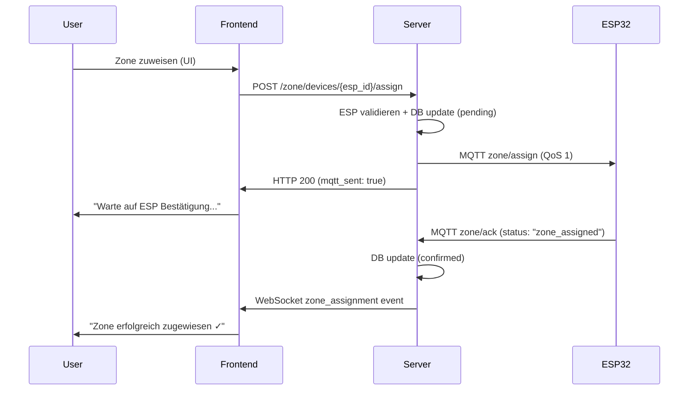

# Zone Assignment Flow - Server & Frontend Perspektive

## Overview

Das Zone Assignment System ermöglicht die hierarchische Organisation von ESP32-Geräten in logische Gruppen (Zonen). Dieser Flow beschreibt die **Server-seitige Implementierung** und **Frontend-Integration**.

**Korrespondiert mit:** `El Trabajante/docs/system-flows/08-zone-assignment-flow.md`

> **ESP32-Seite:** Für ESP32-interne Zone-Verarbeitung (NVS-Speicherung, Heartbeat, Topic-Subscription) siehe die korrespondierende ESP32-Dokumentation.

---

## Voraussetzungen

- [ ] ESP32 provisioniert und verbunden (siehe PROVISIONING.md)
- [ ] ESP32 via REST API registriert (`POST /api/v1/esp/register`)
- [ ] Server läuft mit MQTT-Verbindung
- [ ] Frontend läuft mit WebSocket-Verbindung
- [ ] Zone-Service und API implementiert
- [ ] ZoneAssignmentPanel in ESP Detail View integriert

---

## Teil 1: Zone-Hierarchie Konzept

### 1.1 Architektur-Prinzip: ESP-zentrisch, Server als Vermittler

**KRITISCH:** Das Zone-System ist **ESP-zentrisch** implementiert:

| Komponente | Verantwortlichkeit |
|------------|-------------------|
| **ESP32** | Speichert Zone-Config in NVS, inkludiert Zone-Infos in allen MQTT-Messages |
| **Server** | **Vermittler** - empfängt Zone-Infos via Heartbeat, speichert für Frontend, sendet Zone-Assignments via MQTT |
| **Frontend** | Visualisiert Zone-Hierarchie, ermöglicht Zone-Zuweisung durch User |

**Server ist NICHT die Zone-Wahrheitsquelle!** Der ESP speichert seine Zone selbst. Server spiegelt nur.

### 1.2 Zwei getrennte Prozesse

| Prozess | Wann | Wie | Was wird konfiguriert |
|---------|------|-----|----------------------|
| **Provisioning** | Ersteinrichtung | AP-Mode + HTTP POST | WiFi-Credentials, Server-IP, MQTT-Port |
| **Zone Assignment** | Nach Provisioning (Runtime) | MQTT Message | zone_id, master_zone_id, zone_name, kaiser_id |

### 1.3 Zone-Hierarchie

```
God-Kaiser Server (Raspberry Pi 5)
  │
  └─► kaiser_id = "god"
        │
        ├─► ESP: ESP_AB12CD
        │     │
        │     ├─► zone_id: "greenhouse_zone_1"
        │     │     │
        │     │     ├─► master_zone_id: "greenhouse_master"
        │     │     │
        │     │     └─► subzone_id: "section_A" (Sensor/Actuator-Level)
        │     │
        │     └─► Sensors/Actuators mit subzone_id
        │
        └─► ESP: ESP_CD34EF (zone_assigned: false = nicht zugewiesen)
```

### 1.4 Kaiser-ID Bedeutung (aktueller Stand vs. Roadmap)

**Aktueller Stand (2025):**
- Alle ESPs kommunizieren mit `kaiser_id = "god"` (God-Kaiser Server)
- Kaiser-Nodes sind **geplant, aber nicht implementiert**
- Topic-Struktur bereits vorbereitet: `kaiser/{kaiser_id}/esp/{esp_id}/...`

**Roadmap:**
- Kaiser-Nodes für 100+ ESP Skalierung
- Verteilte Architektur mit Raspberry Pi Zero/3 Nodes
- Automatische ESP-zu-Kaiser Zuweisung

---

## Teil 2: Server Zone-Assignment Implementation

### 2.1 REST API Endpoints

**Base URL:** `/api/v1/zone`

| Endpoint | Method | Beschreibung |
|----------|--------|--------------|
| `/devices/{esp_id}/assign` | POST | Zone zuweisen |
| `/devices/{esp_id}/assign` | DELETE | Zone entfernen |
| `/devices/{esp_id}` | GET | Zone-Info abrufen |
| `/{zone_id}/devices` | GET | ESPs in Zone abrufen |
| `/unassigned` | GET | Unzugewiesene ESPs abrufen |

#### 2.1.1 Zone Assignment Request

```typescript
POST /api/v1/zone/devices/{esp_id}/assign

Request Body:
{
  "zone_id": "greenhouse_zone_1",
  "master_zone_id": "greenhouse_master",  // optional
  "zone_name": "Greenhouse Section 1"      // optional
}

Response (Success):
{
  "success": true,
  "message": "Zone assignment sent to ESP",
  "device_id": "ESP_AB12CD",
  "zone_id": "greenhouse_zone_1",
  "master_zone_id": "greenhouse_master",
  "mqtt_topic": "kaiser/god/esp/ESP_AB12CD/zone/assign",
  "mqtt_sent": true
}
```

#### 2.1.2 Zone Assignment Flow

1. **Validation:** ESP existiert in Datenbank
2. **DB Update:** ESP Zone-Felder mit "pending" markieren
3. **MQTT Publish:** Zone-Assignment an ESP senden (QoS 1)
4. **Response:** Erfolg signalisieren (ACK kommt asynchron)

### 2.2 Zone Service

**File:** `El Servador/god_kaiser_server/src/services/zone_service.py`

**Verantwortlichkeiten:**
- Zone Assignment/Removal via MQTT
- Zone ACK Processing von ESPs
- Zone Queries (nach Zone filtern)
- MQTT Payload Validation

**Methoden:**
- `assign_zone()` - Zone zuweisen
- `remove_zone()` - Zone entfernen
- `handle_zone_ack()` - ACK verarbeiten
- `get_zone_esps()` - ESPs nach Zone filtern
- `get_unassigned_esps()` - Unzugewiesene ESPs finden

### 2.3 MQTT Handler: Zone ACK Processing

**File:** `El Servador/god_kaiser_server/src/mqtt/handlers/zone_ack_handler.py`

**Topic:** `kaiser/{kaiser_id}/esp/{esp_id}/zone/ack`

**Payload von ESP32:**
```json
{
  "esp_id": "ESP_AB12CD",
  "status": "zone_assigned",
  "zone_id": "greenhouse_zone_1",
  "master_zone_id": "greenhouse_master",
  "ts": 1734523800
}
```

**Flow:**
1. Topic parsen → ESP ID extrahieren
2. Payload validieren
3. ESP in DB finden
4. Zone-Felder aktualisieren basierend auf ACK Status
5. WebSocket Event broadcasten (`zone_assignment`)

### 2.4 Datenbank Schema

**Migration:** `add_master_zone_id_to_esp_device.py`

**ESPDevice Model Änderungen:**
```python
# Neu hinzugefügt
master_zone_id: Optional[str] = mapped_column(String(50), nullable=True, index=True)

# Bereits vorhanden
zone_id: Optional[str] = mapped_column(String(50), nullable=True, index=True)
zone_name: Optional[str] = mapped_column(String(100), nullable=True)
kaiser_id: Optional[str] = mapped_column(String(50), nullable=True, index=True)
```

---

## Teil 3: Frontend Zone-Assignment Integration

### 3.1 ZoneAssignmentPanel Component

**File:** `El Frontend/src/components/zones/ZoneAssignmentPanel.vue`

**Features:**
- Aktuelle Zone-Info anzeigen
- Zone Assignment Form (zone_id, master_zone_id, zone_name)
- Real-time ACK Status (pending → success/error)
- Zone entfernen Funktion
- WebSocket Integration für Live-Updates

**Props:**
```typescript
interface Props {
  espId: string
  currentZoneId?: string
  currentZoneName?: string
  currentMasterZoneId?: string
}
```

**Events:**
```typescript
emit('zone-updated', {
  zone_id: string
  zone_name?: string
  master_zone_id?: string
})
```

### 3.2 Zone API Client

**File:** `El Frontend/src/api/zones.ts`

**Methoden:**
- `assignZone(espId, request)` - Zone zuweisen
- `removeZone(espId)` - Zone entfernen
- `getZoneInfo(espId)` - Zone-Info abrufen
- `getZoneDevices(zoneId)` - ESPs in Zone
- `getUnassignedDevices()` - Unzugewiesene ESPs

### 3.3 WebSocket Integration

**File:** `El Frontend/src/composables/useRealTimeData.ts` (erweitert)

**Neue Features:**
- `ZoneUpdate` Interface
- `onZoneUpdate` Event Handler
- `lastZoneUpdate` Reactive State
- `zone_assignment` Message Type Support

**ZoneUpdate Interface:**
```typescript
interface ZoneUpdate {
  esp_id: string
  status: 'zone_assigned' | 'error'
  zone_id: string
  master_zone_id?: string
  timestamp: number
  message?: string
}
```

### 3.4 Integration in ESP Detail View

**File:** `El Frontend/src/views/MockEspDetailView.vue`

**Integration Points:**
- ZoneAssignmentPanel zwischen Status Cards und Sensors Section
- Props: ESP Zone-Daten übergeben
- Event Handler: `handleZoneUpdate()` für lokale UI Updates
- WebSocket: Automatisch via ZoneAssignmentPanel

---

## Teil 4: Kompletter Datenfluss

### 4.1 Assignment Flow (User → ESP)



### 4.2 Error Handling

**Server-seitige Fehler:**
- ESP nicht gefunden → HTTP 404
- MQTT Publish fehlgeschlagen → HTTP 500
- Zone ACK timeout → Pending Status bleibt

**ESP-seitige Fehler:**
- Zone ACK mit `status: "error"`
- Message enthält Fehlerbeschreibung
- Server broadcastet Error via WebSocket

**Frontend Error States:**
- MQTT Send fehlgeschlagen
- ESP ACK timeout (kein WebSocket Event)
- Zone ACK mit Fehler

---

## Teil 5: MQTT Protocol Reference

### 5.1 Zone Assignment (Server → ESP)

**Topic:** `kaiser/{kaiser_id}/esp/{esp_id}/zone/assign`

**Payload:**
```json
{
  "zone_id": "greenhouse_zone_1",
  "master_zone_id": "greenhouse_master",
  "zone_name": "Greenhouse Section 1",
  "kaiser_id": "god",
  "timestamp": 1734523800
}
```

### 5.2 Zone ACK (ESP → Server)

**Topic:** `kaiser/{kaiser_id}/esp/{esp_id}/zone/ack`

**Success Payload:**
```json
{
  "esp_id": "ESP_AB12CD",
  "status": "zone_assigned",
  "zone_id": "greenhouse_zone_1",
  "master_zone_id": "greenhouse_master",
  "ts": 1734523800
}
```

**Error Payload:**
```json
{
  "esp_id": "ESP_AB12CD",
  "status": "error",
  "zone_id": "",
  "master_zone_id": "",
  "ts": 1734523800,
  "message": "Failed to save zone config to NVS"
}
```

### 5.3 WebSocket Event (Server → Frontend)

**Event Type:** `zone_assignment`

**Payload:**
```json
{
  "esp_id": "ESP_AB12CD",
  "status": "zone_assigned",
  "zone_id": "greenhouse_zone_1",
  "master_zone_id": "greenhouse_master",
  "timestamp": 1734523800
}
```

---

## Teil 6: Testing Checklist

### 6.1 Server Tests

- [ ] Alembic Migration läuft erfolgreich
- [ ] Zone API Endpoints antworten korrekt
- [ ] MQTT Zone Assignment wird published (QoS 1)
- [ ] Zone ACK Handler empfängt ESP Response
- [ ] WebSocket Events werden gebroadcastet
- [ ] Datenbank Updates funktionieren (pending → confirmed)

### 6.2 Frontend Tests

- [ ] ZoneAssignmentPanel zeigt korrekte Zone-Info
- [ ] Form Validation funktioniert
- [ ] Zone Assignment API Call erfolgreich
- [ ] WebSocket Zone Events werden empfangen
- [ ] UI Updates bei Zone Assignment
- [ ] Error States werden korrekt angezeigt

### 6.3 End-to-End Tests

- [ ] UI → API → MQTT → ESP → ACK → WebSocket → UI
- [ ] Zone Assignment erfolgreich
- [ ] ESP zeigt neue Zone in Heartbeat
- [ ] Zone Removal funktioniert
- [ ] Error Cases werden behandelt

---

## Teil 7: Troubleshooting

### 7.1 Zone Assignment wird nicht gesendet

**Symptom:** API Call erfolgreich, aber ESP empfängt nichts

**Mögliche Ursachen:**
- MQTT Broker nicht erreichbar
- ESP offline/getrennt
- QoS 1 nicht unterstützt

**Debug:**
```bash
# MQTT Logs prüfen
mosquitto_sub -h localhost -p 8883 -t "kaiser/god/esp/+/zone/assign" -v
```

### 7.2 ESP ACK wird nicht empfangen

**Symptom:** Zone Assignment gesendet, aber kein WebSocket Event

**Mögliche Ursachen:**
- ESP kann Zone nicht in NVS speichern
- ESP sendet ACK auf falschem Topic
- MQTT Verbindung unterbrochen

**Debug:**
```bash
# ACK Topic überwachen
mosquitto_sub -h localhost -p 8883 -t "kaiser/god/esp/+/zone/ack" -v
```

### 7.3 WebSocket Event erreicht Frontend nicht

**Symptom:** ACK empfangen, aber UI zeigt keine Bestätigung

**Mögliche Ursachen:**
- WebSocket Verbindung unterbrochen
- Event Handler nicht registriert
- ESP ID Filter falsch

**Debug:**
- Browser DevTools Network Tab prüfen
- WebSocket Connection Status prüfen
- `useRealTimeData` Logs prüfen

### 7.4 Zone Assignment bleibt "pending"

**Symptom:** UI zeigt dauerhaft "Warte auf ESP Bestätigung"

**Mögliche Ursachen:**
- ESP reboot erforderlich (sieht alte Subscription)
- ESP kann ACK nicht senden
- WebSocket Event verloren

**Lösung:**
- ESP rebooten
- Zone Assignment erneut senden
- MQTT Logs prüfen

---

## Teil 8: Code-Locations Referenz

### 8.1 Server (Python)

| Component | File | Zeilen | Beschreibung |
|-----------|------|--------|--------------|
| Migration | `alembic/versions/add_master_zone_id_to_esp_device.py` | 1-52 | DB Schema Migration |
| ESP Model | `src/db/models/esp.py` | 79 | master_zone_id Feld |
| Schemas | `src/schemas/zone.py` | 1-294 | Pydantic Models |
| Service | `src/services/zone_service.py` | 1-342 | Business Logic |
| API | `src/api/v1/zone.py` | 1-297 | REST Endpoints |
| MQTT Handler | `src/mqtt/handlers/zone_ack_handler.py` | 1-292 | ACK Processing |
| Constants | `src/core/constants.py` | 33+ | Zone Topic Constants |
| Topics | `src/mqtt/topics.py` | 503+ | Topic Parsers |
| Main | `src/main.py` | 125+ | Handler Registration |
| API Init | `src/api/v1/__init__.py` | 40+ | Router Registration |

### 8.2 Frontend (TypeScript/Vue)

| Component | File | Zeilen | Beschreibung |
|-----------|------|--------|--------------|
| Types | `src/types/index.ts` | 341+ | Zone Interfaces |
| API | `src/api/zones.ts` | 1-48 | Zone API Client |
| WebSocket | `src/composables/useRealTimeData.ts` | 40+ | Zone Event Support |
| Component | `src/components/zones/ZoneAssignmentPanel.vue` | 1-250+ | UI Component |
| Integration | `src/views/MockEspDetailView.vue` | 40+ | Panel Integration |

### 8.3 ESP32 (Referenz)

| Component | File | Zeilen | Beschreibung |
|-----------|------|--------|--------------|
| Datenstruktur | `src/models/system_types.h` | 23-48 | KaiserZone Struct |
| Assignment Handler | `src/main.cpp` | 415-489 | MQTT Zone Processing |
| NVS Speicherung | `src/services/config/config_manager.cpp` | 257-286 | Zone Persistence |
| Topic Builder | `src/utils/topic_builder.cpp` | 19-22 | kaiser_id Management |
| Heartbeat | `src/services/communication/mqtt_client.cpp` | 380-408 | Zone Info in HB |

---

## Kritische Entscheidungen

### 1. ESP-zentrische Architektur
**Entscheidung:** Server ist NICHT die Zone-Wahrheitsquelle
**Begründung:** ESP speichert Zone selbst in NVS, Server spiegelt nur
**Implikation:** Zone-Änderungen erfordern ESP-ACK für Bestätigung

### 2. Asynchrone ACK-Verarbeitung
**Entscheidung:** Zone Assignment ist asynchron (MQTT → ACK → WebSocket)
**Begründung:** MQTT QoS 1 garantiert Delivery, aber ESP braucht Zeit für NVS
**Implikation:** UI muss "pending" State zeigen bis ACK kommt

### 3. ZoneAssignmentPanel Integration
**Entscheidung:** Panel in bestehende ESP Detail View integrieren
**Begründung:** Zone Assignment ist ESP-spezifisch, gehört zur ESP-Konfiguration
**Implikation:** Keine separate Zone-Management Seite

### 4. master_zone_id als optionales Feld
**Entscheidung:** master_zone_id ist optional in API
**Begründung:** Grundlegende Zone-Funktionalität ohne Hierarchie möglich
**Implikation:** UI muss optionale Felder korrekt handhaben

---

## Verifizierungscheckliste

- [ ] **Migration:** `alembic upgrade head` läuft ohne Fehler
- [ ] **API:** `POST /api/v1/zone/devices/{esp_id}/assign` funktioniert
- [ ] **MQTT:** Zone Assignment Topics werden published
- [ ] **Handler:** Zone ACK Handler empfängt und verarbeitet
- [ ] **WebSocket:** `zone_assignment` Events werden gesendet
- [ ] **Frontend:** ZoneAssignmentPanel zeigt korrekte Daten
- [ ] **Integration:** Panel ist in MockEspDetailView eingebunden
- [ ] **Real-time:** WebSocket Updates funktionieren
- [ ] **E2E:** Vollständiger Flow UI → ESP → ACK → UI
- [ ] **Error Handling:** Alle Error Cases werden behandelt

---

**Letzte Verifizierung:** [Datum]
**Verifiziert gegen Code-Version:** Git master branch
**Dokumentation abgeschlossen:** ✅


