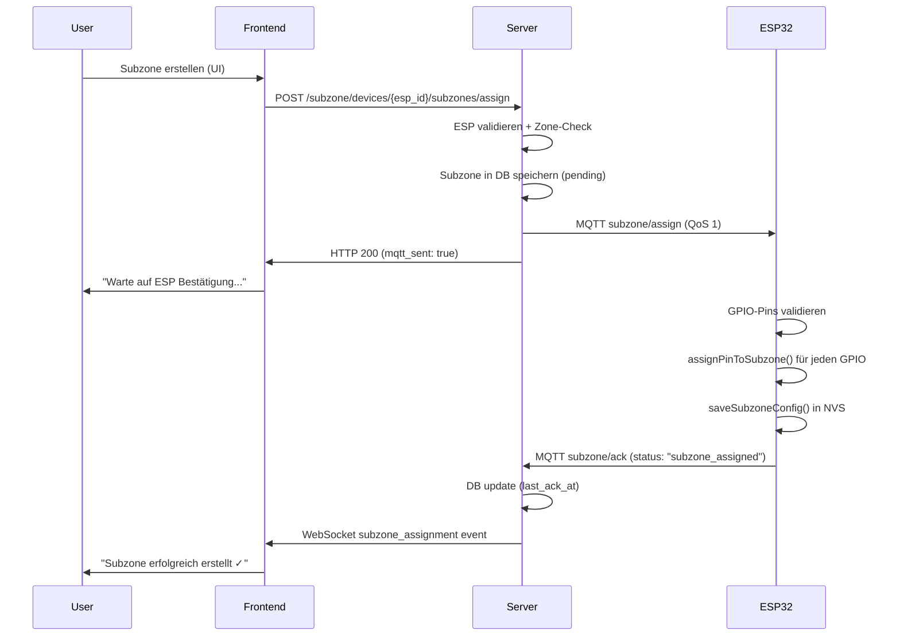
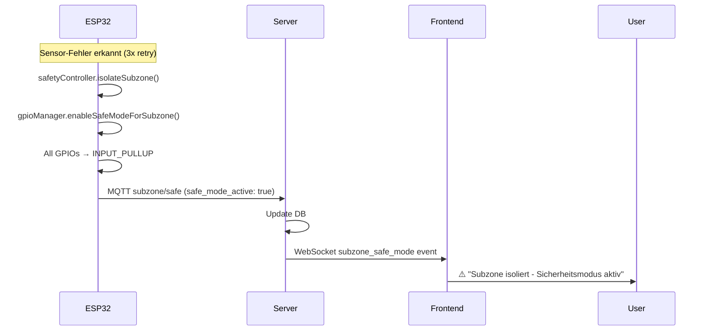

# Subzone Management, Safe-Mode & Pin Assignment Flow - Server & Frontend

## Overview

Subzones sind logische Gruppierungen einzelner GPIO-Pins/Sensoren/Aktoren innerhalb einer Zone, die eine feingranulare Kontrolle über einzelne Hardware-Komponenten ermöglichen. Das Subzone-Management integriert sich mit dem Safe-Mode-System für Pin-spezifische Sicherheit und ermöglicht Emergency-Stop-Operationen auf Subzone-Ebene.

**Korrespondiert mit:** [El Trabajante/docs/system-flows/09-subzone-management-flow.md](../../../El Trabajante/docs/system-flows/09-subzone-management-flow.md)

> **ESP32-Seite:** Für ESP32-interne Subzone-Verarbeitung (GPIO-Manager, NVS-Speicherung, Safe-Mode) siehe die korrespondierende ESP32-Dokumentation.

**Implementierungsstatus:** 
| Komponente | Status | Beschreibung |
|-----------|--------|--------------|
| ESP32 (El Trabajante) | ✅ VOLLSTÄNDIG | GPIO-Manager, Config-Manager, MQTT-Handler, Safety-Controller |
| Server (El Servador) | ✅ VOLLSTÄNDIG IMPLEMENTIERT | Service, API, Handler, Schemas, DB Model, MQTT Integration |
| Frontend (El Frontend) | ✅ VOLLSTÄNDIG IMPLEMENTIERT | Types, API Client, WebSocket, Integration |

---

## Voraussetzungen

- [ ] ESP32 provisioniert und verbunden
- [ ] ESP32 via REST API registriert (`POST /api/v1/esp/register`)
- [ ] **Zone-Assignment erfolgreich** (siehe [08-zone-assignment-flow-server-frontend.md](./08-zone-assignment-flow-server-frontend.md))
- [ ] Server läuft mit MQTT-Verbindung
- [ ] Frontend läuft mit WebSocket-Verbindung
- [ ] GPIO-Manager auf ESP32 initialisiert (Safe-Mode aktiv)

---

## Teil 1: Architektur-Prinzipien

### 1.1 ESP-Zentrische Architektur

**KRITISCH:** Das Subzone-System folgt dem gleichen Pattern wie das Zone-System:

| Komponente | Verantwortlichkeit |
|------------|-------------------|
| **ESP32** | Speichert Subzone-Config in NVS, verwaltet GPIO-Pin-Zuweisungen, aktiviert Safe-Mode |
| **Server** | **Vermittler** - sendet Subzone-Assignments via MQTT, empfängt ACKs, spiegelt Zustand in DB |
| **Frontend** | Visualisiert Subzone-Hierarchie, ermöglicht Subzone-Zuweisung durch User |

**ESP speichert seine Subzones selbst!** Server spiegelt nur und koordiniert.

### 1.2 Hierarchie-Struktur

```
God-Kaiser Server (kaiser_id = "god")
  │
  └─► ESP: ESP_AB12CD
        │
        ├─► zone_id: "greenhouse_zone_1"
        │     │
        │     ├─► master_zone_id: "greenhouse_master"
        │     │
        │     ├─► subzone_id: "irrigation_section_A"
        │     │     ├─► Sensor: GPIO 4 (Soil Moisture)
        │     │     ├─► Actuator: GPIO 5 (Water Pump)
        │     │     └─► Actuator: GPIO 6 (Valve Control)
        │     │
        │     └─► subzone_id: "climate_control"
        │           ├─► Sensor: GPIO 18 (Temperature)
        │           └─► Actuator: GPIO 21 (Fan Control)
```

### 1.3 Wichtig: Subzones vs. Zones

| Aspekt | Zone | Subzone |
|--------|------|---------|
| **Ebene** | ESP-Level | Pin/Sensor/Actuator-Level |
| **Zuweisung** | ESP gehört zu einer Zone | GPIO-Pins gehören zu Subzones |
| **Voraussetzung** | Provisioning | Zone muss zugewiesen sein |
| **MQTT-Topic** | `zone/assign` | `subzone/assign` |
| **Server-Speicherung** | `esp_devices.zone_id` | `subzone_configs` Tabelle |

---

## Teil 2: Server-Implementierung

### 2.1 Neue Dateien (zu erstellen)

| Datei | Zweck | Pattern-Referenz |
|-------|-------|-----------------|
| `src/db/models/subzone.py` | SQLAlchemy Model | `esp.py` |
| `src/schemas/subzone.py` | Pydantic Schemas | `zone.py` |
| `src/services/subzone_service.py` | Business Logic | `zone_service.py` |
| `src/api/v1/subzone.py` | REST Endpoints | `zone.py` |
| `src/mqtt/handlers/subzone_ack_handler.py` | ACK Processing | `zone_ack_handler.py` |

### 2.2 Bestehende Dateien (zu erweitern)

| Datei | Änderung |
|-------|----------|
| `src/core/constants.py` | Subzone Topic-Patterns, Error-Codes |
| `src/mqtt/topics.py` | Subzone Topic Builder/Parser |
| `src/main.py` | Handler Registration |
| `src/api/v1/__init__.py` | Router Registration |
| `src/db/models/esp.py` | Relationship zu Subzones |

---

## Teil 3: Database Model

### 3.1 SubzoneConfig Model

**Datei:** `El Servador/god_kaiser_server/src/db/models/subzone.py`

```python
"""
Subzone Configuration Model

Phase: 9 - Subzone Management
Status: ZU IMPLEMENTIEREN

Stores subzone configurations for ESP devices.
Each subzone groups GPIO pins for feingranulare Kontrolle.
"""

import uuid
from datetime import datetime
from typing import List, Optional

from sqlalchemy import Boolean, DateTime, ForeignKey, Integer, JSON, String, UniqueConstraint
from sqlalchemy.dialects.postgresql import UUID
from sqlalchemy.orm import Mapped, mapped_column, relationship
from sqlalchemy.sql import func

from ..base import Base, TimestampMixin


class SubzoneConfig(Base, TimestampMixin):
    """
    Subzone Configuration Model.

    Represents a logical grouping of GPIO pins within an ESP's zone.
    Enables pin-level control and safe-mode operations.

    Attributes:
        id: Primary key (UUID)
        esp_id: Foreign key to esp_devices.device_id
        subzone_id: Unique subzone identifier within ESP
        subzone_name: Human-readable name
        parent_zone_id: Zone this subzone belongs to (must match ESP zone_id)
        assigned_gpios: JSON array of GPIO pin numbers
        safe_mode_active: Whether subzone is in safe-mode
        sensor_count: Number of sensors in subzone (from ESP)
        actuator_count: Number of actuators in subzone (from ESP)
    """

    __tablename__ = "subzone_configs"

    # Primary Key
    id: Mapped[uuid.UUID] = mapped_column(
        UUID(as_uuid=True),
        primary_key=True,
        default=uuid.uuid4,
        doc="Primary key (UUID)",
    )

    # Foreign Key to ESP Device
    esp_id: Mapped[str] = mapped_column(
        String(50),
        ForeignKey("esp_devices.device_id", ondelete="CASCADE"),
        nullable=False,
        index=True,
        doc="ESP device ID (e.g., ESP_AB12CD)",
    )

    # Subzone Identity
    subzone_id: Mapped[str] = mapped_column(
        String(50),
        nullable=False,
        index=True,
        doc="Unique subzone identifier (e.g., 'irrigation_section_A')",
    )

    subzone_name: Mapped[Optional[str]] = mapped_column(
        String(100),
        nullable=True,
        doc="Human-readable subzone name",
    )

    # Zone Hierarchy
    parent_zone_id: Mapped[str] = mapped_column(
        String(50),
        nullable=False,
        index=True,
        doc="Parent zone ID (must match ESP's zone_id)",
    )

    # GPIO Assignment
    assigned_gpios: Mapped[List[int]] = mapped_column(
        JSON,
        default=list,
        nullable=False,
        doc="JSON array of GPIO pin numbers [4, 5, 6]",
    )

    # Safe-Mode Status
    safe_mode_active: Mapped[bool] = mapped_column(
        Boolean,
        default=True,
        nullable=False,
        doc="Whether subzone is currently in safe-mode",
    )

    # Counts (from ESP ACK)
    sensor_count: Mapped[int] = mapped_column(
        Integer,
        default=0,
        nullable=False,
        doc="Number of sensors in this subzone",
    )

    actuator_count: Mapped[int] = mapped_column(
        Integer,
        default=0,
        nullable=False,
        doc="Number of actuators in this subzone",
    )

    # Metadata
    last_ack_at: Mapped[Optional[datetime]] = mapped_column(
        DateTime,
        nullable=True,
        doc="Last ACK timestamp from ESP",
    )

    # Relationship to ESP
    esp: Mapped["ESPDevice"] = relationship(
        "ESPDevice",
        back_populates="subzones",
    )

    # Unique constraint: one subzone_id per ESP
    __table_args__ = (
        UniqueConstraint("esp_id", "subzone_id", name="uq_esp_subzone"),
    )

    def __repr__(self) -> str:
        return (
            f"<SubzoneConfig(esp_id='{self.esp_id}', "
            f"subzone_id='{self.subzone_id}', "
            f"gpios={self.assigned_gpios})>"
        )

    @property
    def gpio_count(self) -> int:
        """Get number of assigned GPIOs."""
        return len(self.assigned_gpios) if self.assigned_gpios else 0
```

### 3.2 ESP Model Erweiterung

**Datei:** `El Servador/god_kaiser_server/src/db/models/esp.py`

**Hinzufügen nach Zeile 179 (nach `actuators` relationship):**

```python
    # Subzone Configurations (Phase 9)
    subzones: Mapped[list["SubzoneConfig"]] = relationship(
        "SubzoneConfig",
        back_populates="esp",
        cascade="all, delete-orphan",
        doc="Subzone configurations for this device",
    )
```

### 3.3 Alembic Migration

**Datei:** `El Servador/god_kaiser_server/alembic/versions/xxx_add_subzone_configs.py`

```python
"""Add subzone_configs table

Revision ID: xxx_add_subzone_configs
Revises: [previous_revision]
Create Date: 2025-12-18

Phase: 9 - Subzone Management
"""

from alembic import op
import sqlalchemy as sa
from sqlalchemy.dialects.postgresql import UUID, JSON


revision = "xxx_add_subzone_configs"
down_revision = "[previous_revision]"
branch_labels = None
depends_on = None


def upgrade() -> None:
    op.create_table(
        "subzone_configs",
        sa.Column("id", UUID(as_uuid=True), primary_key=True),
        sa.Column("esp_id", sa.String(50), sa.ForeignKey("esp_devices.device_id", ondelete="CASCADE"), nullable=False, index=True),
        sa.Column("subzone_id", sa.String(50), nullable=False, index=True),
        sa.Column("subzone_name", sa.String(100), nullable=True),
        sa.Column("parent_zone_id", sa.String(50), nullable=False, index=True),
        sa.Column("assigned_gpios", JSON, nullable=False, default=[]),
        sa.Column("safe_mode_active", sa.Boolean, nullable=False, default=True),
        sa.Column("sensor_count", sa.Integer, nullable=False, default=0),
        sa.Column("actuator_count", sa.Integer, nullable=False, default=0),
        sa.Column("last_ack_at", sa.DateTime, nullable=True),
        sa.Column("created_at", sa.DateTime, server_default=sa.func.now()),
        sa.Column("updated_at", sa.DateTime, onupdate=sa.func.now()),
        sa.UniqueConstraint("esp_id", "subzone_id", name="uq_esp_subzone"),
    )


def downgrade() -> None:
    op.drop_table("subzone_configs")
```

---

## Teil 4: Pydantic Schemas

**Datei:** `El Servador/god_kaiser_server/src/schemas/subzone.py`

```python
"""
Subzone Management Pydantic Schemas

Phase: 9 - Subzone Management
Status: ZU IMPLEMENTIEREN

Provides:
- Subzone assignment request/response models
- Subzone ACK payload model (from ESP32)
- Safe-mode control models
- Subzone info display model

Consistency with El Trabajante:
- subzone_id format: lowercase letters, numbers, underscores (max 32 chars)
- parent_zone_id: Must match ESP's assigned zone_id
- assigned_gpios: Array of GPIO pin numbers
- safe_mode_active: Boolean, default True
- Timestamps: Unix seconds

References:
- El Trabajante/docs/system-flows/09-subzone-management-flow.md
- El Trabajante/src/models/system_types.h (SubzoneConfig struct)
"""

from typing import List, Optional

from pydantic import BaseModel, ConfigDict, Field, field_validator

from .common import BaseResponse


# =============================================================================
# Subzone Assignment Request/Response
# =============================================================================


class SubzoneAssignRequest(BaseModel):
    """
    Subzone assignment request from Frontend/API.

    Used to assign GPIO pins to a subzone via MQTT.
    ESP will receive this via: kaiser/{kaiser_id}/esp/{esp_id}/subzone/assign
    """

    subzone_id: str = Field(
        ...,
        min_length=1,
        max_length=32,
        description="Unique subzone identifier (max 32 chars for NVS compatibility)",
        examples=["irrigation_section_A", "climate_control"],
    )
    subzone_name: Optional[str] = Field(
        None,
        max_length=100,
        description="Human-readable subzone name",
        examples=["Irrigation Section A", "Climate Control Zone"],
    )
    parent_zone_id: Optional[str] = Field(
        None,
        max_length=50,
        description="Parent zone ID (if empty, uses ESP's zone_id)",
        examples=["greenhouse_zone_1"],
    )
    assigned_gpios: List[int] = Field(
        ...,
        min_length=1,
        max_length=20,
        description="GPIO pin numbers to assign to this subzone",
        examples=[[4, 5, 6], [18, 21]],
    )
    safe_mode_active: bool = Field(
        True,
        description="Whether subzone starts in safe-mode (default: true for safety)",
    )

    @field_validator("subzone_id")
    @classmethod
    def validate_subzone_id_format(cls, v: str) -> str:
        """Validate subzone_id contains only valid characters."""
        if not v.replace("_", "").isalnum():
            raise ValueError(
                "subzone_id must contain only letters, numbers, and underscores"
            )
        return v.lower()

    @field_validator("assigned_gpios")
    @classmethod
    def validate_gpios(cls, v: List[int]) -> List[int]:
        """Validate GPIO pin numbers."""
        for gpio in v:
            if gpio < 0 or gpio > 39:
                raise ValueError(f"Invalid GPIO pin: {gpio}. Must be 0-39.")
        # Remove duplicates while preserving order
        seen = set()
        unique = []
        for gpio in v:
            if gpio not in seen:
                seen.add(gpio)
                unique.append(gpio)
        return unique

    model_config = ConfigDict(
        json_schema_extra={
            "example": {
                "subzone_id": "irrigation_section_A",
                "subzone_name": "Irrigation Section A",
                "parent_zone_id": "greenhouse_zone_1",
                "assigned_gpios": [4, 5, 6],
                "safe_mode_active": False,
            }
        }
    )


class SubzoneAssignResponse(BaseResponse):
    """
    Subzone assignment response.

    Returned after sending subzone assignment via MQTT.
    Note: ESP confirmation comes asynchronously via subzone/ack topic.
    """

    device_id: str = Field(
        ...,
        description="ESP device ID that was assigned",
        examples=["ESP_AB12CD"],
    )
    subzone_id: str = Field(
        ...,
        description="Assigned subzone ID",
        examples=["irrigation_section_A"],
    )
    assigned_gpios: List[int] = Field(
        ...,
        description="GPIO pins assigned to this subzone",
        examples=[[4, 5, 6]],
    )
    mqtt_topic: str = Field(
        ...,
        description="MQTT topic used for assignment",
        examples=["kaiser/god/esp/ESP_AB12CD/subzone/assign"],
    )
    mqtt_sent: bool = Field(
        ...,
        description="Whether MQTT message was successfully published",
    )

    model_config = ConfigDict(
        json_schema_extra={
            "example": {
                "success": True,
                "message": "Subzone assignment sent to ESP",
                "device_id": "ESP_AB12CD",
                "subzone_id": "irrigation_section_A",
                "assigned_gpios": [4, 5, 6],
                "mqtt_topic": "kaiser/god/esp/ESP_AB12CD/subzone/assign",
                "mqtt_sent": True,
            }
        }
    )


class SubzoneRemoveResponse(BaseResponse):
    """
    Subzone removal response.
    """

    device_id: str = Field(
        ...,
        description="ESP device ID",
        examples=["ESP_AB12CD"],
    )
    subzone_id: str = Field(
        ...,
        description="Removed subzone ID",
        examples=["irrigation_section_A"],
    )
    mqtt_topic: str = Field(
        ...,
        description="MQTT topic used for removal",
        examples=["kaiser/god/esp/ESP_AB12CD/subzone/remove"],
    )
    mqtt_sent: bool = Field(
        ...,
        description="Whether MQTT message was successfully published",
    )


# =============================================================================
# Safe-Mode Control
# =============================================================================


class SafeModeRequest(BaseModel):
    """
    Safe-mode control request.
    """

    reason: str = Field(
        "manual",
        max_length=100,
        description="Reason for safe-mode change",
        examples=["manual", "emergency_stop", "maintenance"],
    )


class SafeModeResponse(BaseResponse):
    """
    Safe-mode control response.
    """

    device_id: str = Field(...)
    subzone_id: str = Field(...)
    safe_mode_active: bool = Field(...)
    mqtt_sent: bool = Field(...)


# =============================================================================
# Subzone ACK Payload (from ESP32)
# =============================================================================


class SubzoneAckPayload(BaseModel):
    """
    Subzone ACK payload from ESP32.

    Received via MQTT topic: kaiser/{kaiser_id}/esp/{esp_id}/subzone/ack

    ESP32 sends this after processing subzone assignment to confirm success/failure.
    """

    esp_id: str = Field(
        ...,
        description="ESP device ID",
        examples=["ESP_AB12CD"],
    )
    status: str = Field(
        ...,
        description="Assignment status: 'subzone_assigned', 'subzone_removed', or 'error'",
        examples=["subzone_assigned", "error"],
    )
    subzone_id: str = Field(
        ...,
        description="Subzone ID that was processed",
        examples=["irrigation_section_A"],
    )
    timestamp: int = Field(
        ...,
        alias="ts",
        description="Unix timestamp (seconds)",
        examples=[1734523800],
    )
    error_code: Optional[int] = Field(
        None,
        description="Error code (only on status='error'). Range: 2500-2506",
        examples=[2501],
    )
    message: Optional[str] = Field(
        None,
        description="Error message (only on status='error')",
        examples=["GPIO 5 already assigned to subzone irrigation_section_B"],
    )

    @field_validator("status")
    @classmethod
    def validate_status(cls, v: str) -> str:
        """Validate status is one of the expected values."""
        valid_statuses = {"subzone_assigned", "subzone_removed", "error"}
        if v not in valid_statuses:
            raise ValueError(f"status must be one of: {valid_statuses}")
        return v

    model_config = ConfigDict(
        populate_by_name=True,
        json_schema_extra={
            "example": {
                "esp_id": "ESP_AB12CD",
                "status": "subzone_assigned",
                "subzone_id": "irrigation_section_A",
                "ts": 1734523800,
            }
        },
    )


# =============================================================================
# Subzone Info Display
# =============================================================================


class SubzoneInfo(BaseModel):
    """
    Subzone information for display.

    Used when returning subzone info as part of ESP device response.
    """

    subzone_id: str = Field(
        ...,
        description="Unique subzone identifier",
        examples=["irrigation_section_A"],
    )
    subzone_name: Optional[str] = Field(
        None,
        description="Human-readable subzone name",
        examples=["Irrigation Section A"],
    )
    parent_zone_id: str = Field(
        ...,
        description="Parent zone ID",
        examples=["greenhouse_zone_1"],
    )
    assigned_gpios: List[int] = Field(
        ...,
        description="GPIO pins in this subzone",
        examples=[[4, 5, 6]],
    )
    safe_mode_active: bool = Field(
        ...,
        description="Whether subzone is in safe-mode",
    )
    sensor_count: int = Field(
        0,
        description="Number of sensors in subzone",
    )
    actuator_count: int = Field(
        0,
        description="Number of actuators in subzone",
    )
    created_at: Optional[str] = Field(
        None,
        description="Creation timestamp (ISO format)",
    )

    @property
    def gpio_count(self) -> int:
        """Get number of assigned GPIOs."""
        return len(self.assigned_gpios)

    model_config = ConfigDict(
        from_attributes=True,
        json_schema_extra={
            "example": {
                "subzone_id": "irrigation_section_A",
                "subzone_name": "Irrigation Section A",
                "parent_zone_id": "greenhouse_zone_1",
                "assigned_gpios": [4, 5, 6],
                "safe_mode_active": False,
                "sensor_count": 1,
                "actuator_count": 2,
                "created_at": "2025-12-18T10:30:00Z",
            }
        },
    )


class SubzoneListResponse(BaseResponse):
    """
    Response for listing all subzones of an ESP.
    """

    device_id: str = Field(...)
    zone_id: Optional[str] = Field(None)
    subzones: List[SubzoneInfo] = Field(default_factory=list)
    total_count: int = Field(0)
```

---

## Teil 5: Subzone Service

**Datei:** `El Servador/god_kaiser_server/src/services/subzone_service.py`

```python
"""
Subzone Service - Business Logic for Subzone Operations

Phase: 9 - Subzone Management
Status: ZU IMPLEMENTIEREN

Provides:
- Subzone assignment via MQTT
- Subzone removal via MQTT
- Subzone ACK handling from ESP32
- Safe-mode control for subzones
- Subzone queries

This service provides shared business logic used by:
- REST API endpoints (api/v1/subzone.py)
- MQTT handlers (mqtt/handlers/subzone_ack_handler.py)

MQTT Protocol:
- Assignment: kaiser/{kaiser_id}/esp/{esp_id}/subzone/assign
- Removal: kaiser/{kaiser_id}/esp/{esp_id}/subzone/remove
- ACK: kaiser/{kaiser_id}/esp/{esp_id}/subzone/ack
- Safe: kaiser/{kaiser_id}/esp/{esp_id}/subzone/safe

References:
- El Trabajante/docs/system-flows/09-subzone-management-flow.md
- .claude/CLAUDE_SERVER.md
"""

import json
import time
from typing import Any, Dict, List, Optional

from sqlalchemy import select
from sqlalchemy.ext.asyncio import AsyncSession

from ..core import constants
from ..core.logging_config import get_logger
from ..db.models.esp import ESPDevice
from ..db.models.subzone import SubzoneConfig
from ..db.repositories import ESPRepository
from ..mqtt.publisher import Publisher
from ..schemas.subzone import (
    SafeModeResponse,
    SubzoneAssignResponse,
    SubzoneInfo,
    SubzoneListResponse,
    SubzoneRemoveResponse,
)

logger = get_logger(__name__)


class SubzoneService:
    """
    Subzone assignment and management business logic service.

    Handles subzone assignment, removal, safe-mode control, and ACK processing.
    Follows the same patterns as ZoneService for consistency.
    """

    def __init__(
        self,
        session: AsyncSession,
        esp_repo: Optional[ESPRepository] = None,
        publisher: Optional[Publisher] = None,
    ):
        """
        Initialize SubzoneService.

        Args:
            session: SQLAlchemy async session
            esp_repo: ESP repository (optional, created if not provided)
            publisher: MQTT publisher (optional, created if not provided)
        """
        self.session = session
        self.esp_repo = esp_repo or ESPRepository(session)
        self.publisher = publisher or Publisher()
        self.kaiser_id = getattr(constants, "DEFAULT_KAISER_ID", "god")

    # =========================================================================
    # Subzone Assignment
    # =========================================================================

    async def assign_subzone(
        self,
        device_id: str,
        subzone_id: str,
        assigned_gpios: List[int],
        subzone_name: Optional[str] = None,
        parent_zone_id: Optional[str] = None,
        safe_mode_active: bool = True,
    ) -> SubzoneAssignResponse:
        """
        Assign GPIO pins to a subzone via MQTT.

        Flow:
        1. Validate ESP exists and has zone assigned
        2. Build and publish MQTT subzone assignment message
        3. Store pending assignment in DB (confirmed on ACK)
        4. Return response (actual confirmation comes via subzone/ack topic)

        Args:
            device_id: ESP device ID (e.g., "ESP_AB12CD")
            subzone_id: Unique subzone identifier
            assigned_gpios: List of GPIO pin numbers
            subzone_name: Human-readable subzone name (optional)
            parent_zone_id: Parent zone ID (optional, defaults to ESP's zone_id)
            safe_mode_active: Whether subzone starts in safe-mode (default: True)

        Returns:
            SubzoneAssignResponse with assignment status

        Raises:
            ValueError: If ESP device not found or has no zone assigned
        """
        # 1. Find ESP device
        device = await self.esp_repo.get_by_device_id(device_id)
        if not device:
            logger.warning(f"Subzone assignment failed: ESP {device_id} not found")
            raise ValueError(f"ESP device '{device_id}' not found")

        # 2. Validate zone is assigned (CRITICAL - Subzone requires Zone)
        if not device.zone_id:
            logger.warning(
                f"Subzone assignment failed: ESP {device_id} has no zone assigned"
            )
            raise ValueError(
                f"ESP device '{device_id}' has no zone assigned. "
                "Assign a zone before creating subzones."
            )

        # 3. Use ESP's zone_id if parent_zone_id not provided
        actual_parent_zone_id = parent_zone_id or device.zone_id

        # 4. Validate parent_zone_id matches ESP's zone_id
        if actual_parent_zone_id != device.zone_id:
            logger.warning(
                f"Subzone assignment: parent_zone_id '{actual_parent_zone_id}' "
                f"doesn't match ESP zone_id '{device.zone_id}'"
            )
            raise ValueError(
                f"parent_zone_id '{actual_parent_zone_id}' must match "
                f"ESP's zone_id '{device.zone_id}'"
            )

        # 5. Build MQTT topic
        topic = f"kaiser/{self.kaiser_id}/esp/{device_id}/subzone/assign"

        # 6. Build payload (matches ESP32 expectations from system_types.h)
        payload = {
            "subzone_id": subzone_id,
            "subzone_name": subzone_name or "",
            "parent_zone_id": actual_parent_zone_id,
            "assigned_gpios": assigned_gpios,
            "safe_mode_active": safe_mode_active,
            "sensor_count": 0,  # Will be updated by ESP
            "actuator_count": 0,  # Will be updated by ESP
            "timestamp": int(time.time()),
        }

        # 7. Publish via MQTT (QoS 1 - At least once)
        mqtt_sent = self._publish_subzone_message(topic, payload)

        if mqtt_sent:
            # 8. Create or update pending subzone in DB
            await self._upsert_subzone_config(
                device_id=device_id,
                subzone_id=subzone_id,
                subzone_name=subzone_name,
                parent_zone_id=actual_parent_zone_id,
                assigned_gpios=assigned_gpios,
                safe_mode_active=safe_mode_active,
            )

            logger.info(
                f"Subzone assignment sent to {device_id}: "
                f"subzone_id={subzone_id}, gpios={assigned_gpios}"
            )
        else:
            logger.error(f"Subzone assignment MQTT publish failed for {device_id}")

        return SubzoneAssignResponse(
            success=mqtt_sent,
            message=(
                "Subzone assignment sent to ESP"
                if mqtt_sent
                else "MQTT publish failed"
            ),
            device_id=device_id,
            subzone_id=subzone_id,
            assigned_gpios=assigned_gpios,
            mqtt_topic=topic,
            mqtt_sent=mqtt_sent,
        )

    async def remove_subzone(
        self,
        device_id: str,
        subzone_id: str,
        reason: str = "manual",
    ) -> SubzoneRemoveResponse:
        """
        Remove a subzone from ESP device.

        Args:
            device_id: ESP device ID
            subzone_id: Subzone to remove
            reason: Reason for removal

        Returns:
            SubzoneRemoveResponse with removal status
        """
        # 1. Find ESP device
        device = await self.esp_repo.get_by_device_id(device_id)
        if not device:
            raise ValueError(f"ESP device '{device_id}' not found")

        # 2. Build MQTT topic
        topic = f"kaiser/{self.kaiser_id}/esp/{device_id}/subzone/remove"

        # 3. Build payload
        payload = {
            "subzone_id": subzone_id,
            "reason": reason,
            "timestamp": int(time.time()),
        }

        # 4. Publish via MQTT
        mqtt_sent = self._publish_subzone_message(topic, payload)

        if mqtt_sent:
            logger.info(f"Subzone removal sent to {device_id}: subzone_id={subzone_id}")
        else:
            logger.error(f"Subzone removal MQTT publish failed for {device_id}")

        return SubzoneRemoveResponse(
            success=mqtt_sent,
            message="Subzone removal sent to ESP" if mqtt_sent else "MQTT publish failed",
            device_id=device_id,
            subzone_id=subzone_id,
            mqtt_topic=topic,
            mqtt_sent=mqtt_sent,
        )

    # =========================================================================
    # Safe-Mode Control
    # =========================================================================

    async def enable_safe_mode(
        self,
        device_id: str,
        subzone_id: str,
        reason: str = "manual",
    ) -> SafeModeResponse:
        """
        Enable safe-mode for a subzone.

        All GPIO pins in the subzone will be set to INPUT_PULLUP.

        Args:
            device_id: ESP device ID
            subzone_id: Subzone to put in safe-mode
            reason: Reason for safe-mode activation

        Returns:
            SafeModeResponse with result
        """
        device = await self.esp_repo.get_by_device_id(device_id)
        if not device:
            raise ValueError(f"ESP device '{device_id}' not found")

        topic = f"kaiser/{self.kaiser_id}/esp/{device_id}/subzone/safe"
        payload = {
            "subzone_id": subzone_id,
            "action": "enable",
            "reason": reason,
            "timestamp": int(time.time()),
        }

        mqtt_sent = self._publish_subzone_message(topic, payload)

        return SafeModeResponse(
            success=mqtt_sent,
            message="Safe-mode enable sent to ESP" if mqtt_sent else "MQTT publish failed",
            device_id=device_id,
            subzone_id=subzone_id,
            safe_mode_active=True,
            mqtt_sent=mqtt_sent,
        )

    async def disable_safe_mode(
        self,
        device_id: str,
        subzone_id: str,
        reason: str = "manual",
    ) -> SafeModeResponse:
        """
        Disable safe-mode for a subzone.

        WARNING: This allows actuators to be controlled. Use with caution.

        Args:
            device_id: ESP device ID
            subzone_id: Subzone to take out of safe-mode
            reason: Reason for safe-mode deactivation

        Returns:
            SafeModeResponse with result
        """
        device = await self.esp_repo.get_by_device_id(device_id)
        if not device:
            raise ValueError(f"ESP device '{device_id}' not found")

        topic = f"kaiser/{self.kaiser_id}/esp/{device_id}/subzone/safe"
        payload = {
            "subzone_id": subzone_id,
            "action": "disable",
            "reason": reason,
            "timestamp": int(time.time()),
        }

        mqtt_sent = self._publish_subzone_message(topic, payload)

        return SafeModeResponse(
            success=mqtt_sent,
            message="Safe-mode disable sent to ESP" if mqtt_sent else "MQTT publish failed",
            device_id=device_id,
            subzone_id=subzone_id,
            safe_mode_active=False,
            mqtt_sent=mqtt_sent,
        )

    # =========================================================================
    # Subzone ACK Handling
    # =========================================================================

    async def handle_subzone_ack(
        self,
        device_id: str,
        status: str,
        subzone_id: str,
        timestamp: int = 0,
        error_code: Optional[int] = None,
        message: Optional[str] = None,
    ) -> bool:
        """
        Handle subzone assignment acknowledgment from ESP.

        Called by subzone_ack_handler when ESP confirms subzone assignment.

        Args:
            device_id: ESP device ID
            status: "subzone_assigned", "subzone_removed", or "error"
            subzone_id: Processed subzone ID
            timestamp: ACK timestamp (Unix seconds)
            error_code: Error code (if status == "error")
            message: Error message (if status == "error")

        Returns:
            True if ACK processed successfully
        """
        if status == "subzone_assigned":
            # Update subzone record to confirm assignment
            await self._confirm_subzone_assignment(device_id, subzone_id)
            logger.info(
                f"Subzone assignment confirmed for {device_id}: subzone_id={subzone_id}"
            )
            return True

        elif status == "subzone_removed":
            # Delete subzone record
            await self._delete_subzone_config(device_id, subzone_id)
            logger.info(
                f"Subzone removal confirmed for {device_id}: subzone_id={subzone_id}"
            )
            return True

        elif status == "error":
            logger.error(
                f"Subzone operation failed for {device_id}: "
                f"subzone_id={subzone_id}, error_code={error_code}, message={message}"
            )
            # Keep the record for retry, but mark as failed
            return False

        else:
            logger.warning(f"Unknown subzone ACK status from {device_id}: {status}")
            return False

    # =========================================================================
    # Subzone Queries
    # =========================================================================

    async def get_esp_subzones(self, device_id: str) -> SubzoneListResponse:
        """
        Get all subzones for an ESP device.

        Args:
            device_id: ESP device ID

        Returns:
            SubzoneListResponse with all subzones
        """
        device = await self.esp_repo.get_by_device_id(device_id)
        if not device:
            raise ValueError(f"ESP device '{device_id}' not found")

        # Query subzones from DB
        result = await self.session.execute(
            select(SubzoneConfig).where(SubzoneConfig.esp_id == device_id)
        )
        subzone_configs = result.scalars().all()

        subzones = [
            SubzoneInfo(
                subzone_id=sc.subzone_id,
                subzone_name=sc.subzone_name,
                parent_zone_id=sc.parent_zone_id,
                assigned_gpios=sc.assigned_gpios or [],
                safe_mode_active=sc.safe_mode_active,
                sensor_count=sc.sensor_count,
                actuator_count=sc.actuator_count,
                created_at=sc.created_at.isoformat() if sc.created_at else None,
            )
            for sc in subzone_configs
        ]

        return SubzoneListResponse(
            success=True,
            message=f"Found {len(subzones)} subzones",
            device_id=device_id,
            zone_id=device.zone_id,
            subzones=subzones,
            total_count=len(subzones),
        )

    async def get_subzone(
        self, device_id: str, subzone_id: str
    ) -> Optional[SubzoneInfo]:
        """
        Get a specific subzone.

        Args:
            device_id: ESP device ID
            subzone_id: Subzone ID

        Returns:
            SubzoneInfo or None if not found
        """
        result = await self.session.execute(
            select(SubzoneConfig).where(
                SubzoneConfig.esp_id == device_id,
                SubzoneConfig.subzone_id == subzone_id,
            )
        )
        sc = result.scalar_one_or_none()

        if not sc:
            return None

        return SubzoneInfo(
            subzone_id=sc.subzone_id,
            subzone_name=sc.subzone_name,
            parent_zone_id=sc.parent_zone_id,
            assigned_gpios=sc.assigned_gpios or [],
            safe_mode_active=sc.safe_mode_active,
            sensor_count=sc.sensor_count,
            actuator_count=sc.actuator_count,
            created_at=sc.created_at.isoformat() if sc.created_at else None,
        )

    # =========================================================================
    # Internal Methods
    # =========================================================================

    def _publish_subzone_message(
        self,
        topic: str,
        payload: Dict[str, Any],
    ) -> bool:
        """
        Publish subzone message via MQTT.

        Args:
            topic: MQTT topic
            payload: Message payload

        Returns:
            True if publish successful
        """
        try:
            payload_str = json.dumps(payload)
        except Exception as e:
            logger.error(f"Failed to serialize subzone payload: {e}")
            return False

        # Use QoS 1 (At least once) for subzone operations
        qos = constants.QOS_SENSOR_DATA  # QoS 1

        success = self.publisher.client.publish(topic, payload_str, qos)

        if success:
            logger.debug(f"Subzone message published to {topic}")
        else:
            logger.error(f"Subzone message publish failed to {topic}")

        return success

    async def _upsert_subzone_config(
        self,
        device_id: str,
        subzone_id: str,
        subzone_name: Optional[str],
        parent_zone_id: str,
        assigned_gpios: List[int],
        safe_mode_active: bool,
    ) -> None:
        """
        Create or update subzone configuration in DB.
        """
        # Check if subzone exists
        result = await self.session.execute(
            select(SubzoneConfig).where(
                SubzoneConfig.esp_id == device_id,
                SubzoneConfig.subzone_id == subzone_id,
            )
        )
        existing = result.scalar_one_or_none()

        if existing:
            # Update existing
            existing.subzone_name = subzone_name
            existing.parent_zone_id = parent_zone_id
            existing.assigned_gpios = assigned_gpios
            existing.safe_mode_active = safe_mode_active
        else:
            # Create new
            new_config = SubzoneConfig(
                esp_id=device_id,
                subzone_id=subzone_id,
                subzone_name=subzone_name,
                parent_zone_id=parent_zone_id,
                assigned_gpios=assigned_gpios,
                safe_mode_active=safe_mode_active,
            )
            self.session.add(new_config)

    async def _confirm_subzone_assignment(
        self, device_id: str, subzone_id: str
    ) -> None:
        """
        Confirm subzone assignment (update last_ack_at).
        """
        from datetime import datetime

        result = await self.session.execute(
            select(SubzoneConfig).where(
                SubzoneConfig.esp_id == device_id,
                SubzoneConfig.subzone_id == subzone_id,
            )
        )
        config = result.scalar_one_or_none()

        if config:
            config.last_ack_at = datetime.utcnow()

    async def _delete_subzone_config(self, device_id: str, subzone_id: str) -> None:
        """
        Delete subzone configuration from DB.
        """
        result = await self.session.execute(
            select(SubzoneConfig).where(
                SubzoneConfig.esp_id == device_id,
                SubzoneConfig.subzone_id == subzone_id,
            )
        )
        config = result.scalar_one_or_none()

        if config:
            await self.session.delete(config)
```

---

## Teil 6: REST API Endpoints

**Datei:** `El Servador/god_kaiser_server/src/api/v1/subzone.py`

```python
"""
Subzone Management API Endpoints

Phase: 9 - Subzone Management
Status: ZU IMPLEMENTIEREN

Provides:
- POST /subzone/devices/{esp_id}/subzones/assign - Assign GPIO pins to subzone
- GET /subzone/devices/{esp_id}/subzones - Get all subzones for ESP
- GET /subzone/devices/{esp_id}/subzones/{subzone_id} - Get specific subzone
- DELETE /subzone/devices/{esp_id}/subzones/{subzone_id} - Remove subzone
- POST /subzone/devices/{esp_id}/subzones/{subzone_id}/safe-mode - Enable safe-mode
- DELETE /subzone/devices/{esp_id}/subzones/{subzone_id}/safe-mode - Disable safe-mode

Subzone assignment flow:
1. Frontend calls POST /subzone/devices/{esp_id}/subzones/assign
2. Server publishes to MQTT: kaiser/{kaiser_id}/esp/{esp_id}/subzone/assign
3. ESP receives, validates GPIOs, saves to NVS, sends ACK via subzone/ack topic
4. Server receives ACK, updates DB, broadcasts WebSocket event

References:
- El Trabajante/docs/system-flows/09-subzone-management-flow.md
- .claude/CLAUDE_SERVER.md
"""

from typing import Optional

from fastapi import APIRouter, HTTPException, status

from ...core.logging_config import get_logger
from ...schemas.subzone import (
    SafeModeRequest,
    SafeModeResponse,
    SubzoneAssignRequest,
    SubzoneAssignResponse,
    SubzoneInfo,
    SubzoneListResponse,
    SubzoneRemoveResponse,
)
from ...services.subzone_service import SubzoneService
from ..deps import DBSession, OperatorUser

logger = get_logger(__name__)

router = APIRouter(prefix="/subzone", tags=["subzone"])


# =============================================================================
# Subzone Assignment Endpoints
# =============================================================================


@router.post(
    "/devices/{esp_id}/subzones/assign",
    response_model=SubzoneAssignResponse,
    status_code=status.HTTP_200_OK,
    summary="Assign GPIO Pins to Subzone",
    description="""
    Assign GPIO pins to a subzone via MQTT.

    **Prerequisites:**
    - ESP must be registered in database
    - ESP must have a zone assigned (zone_id must exist)

    **Flow:**
    1. Validates ESP exists and has zone assigned
    2. Validates parent_zone_id matches ESP's zone_id (if provided)
    3. Publishes subzone assignment to MQTT topic
    4. Creates/updates subzone record in database
    5. Returns response (actual confirmation comes via subzone/ack topic)

    **MQTT Topic:** `kaiser/{kaiser_id}/esp/{esp_id}/subzone/assign`

    **Safety:** By default, subzones start with safe_mode_active=true.
    All GPIOs will be set to INPUT_PULLUP until explicitly disabled.

    **Note:** ESP confirmation is asynchronous. Frontend should listen
    for WebSocket `subzone_assignment` events for confirmation.
    """,
    responses={
        200: {"description": "Subzone assignment sent to ESP"},
        400: {"description": "Invalid request (ESP has no zone, parent mismatch)"},
        404: {"description": "ESP device not found"},
        500: {"description": "MQTT publish failed"},
    },
)
async def assign_subzone(
    esp_id: str,
    request: SubzoneAssignRequest,
    db: DBSession,
    current_user: OperatorUser,
) -> SubzoneAssignResponse:
    """
    Assign GPIO pins to a subzone on an ESP device.

    Args:
        esp_id: ESP device ID (e.g., "ESP_AB12CD")
        request: Subzone assignment request
        db: Database session
        current_user: Authenticated operator/admin user

    Returns:
        SubzoneAssignResponse with assignment status
    """
    subzone_service = SubzoneService(db)

    try:
        result = await subzone_service.assign_subzone(
            device_id=esp_id,
            subzone_id=request.subzone_id,
            assigned_gpios=request.assigned_gpios,
            subzone_name=request.subzone_name,
            parent_zone_id=request.parent_zone_id,
            safe_mode_active=request.safe_mode_active,
        )

        # Commit the subzone record to DB
        await db.commit()

        logger.info(
            f"Subzone assignment initiated for {esp_id} by {current_user.username}: "
            f"subzone_id={request.subzone_id}, gpios={request.assigned_gpios}"
        )

        if not result.mqtt_sent:
            raise HTTPException(
                status_code=status.HTTP_500_INTERNAL_SERVER_ERROR,
                detail="MQTT publish failed. ESP may be offline.",
            )

        return result

    except ValueError as e:
        # Check if it's a zone-related error
        error_msg = str(e)
        if "no zone assigned" in error_msg.lower():
            raise HTTPException(
                status_code=status.HTTP_400_BAD_REQUEST,
                detail=error_msg,
            )
        elif "not found" in error_msg.lower():
            raise HTTPException(
                status_code=status.HTTP_404_NOT_FOUND,
                detail=error_msg,
            )
        else:
            raise HTTPException(
                status_code=status.HTTP_400_BAD_REQUEST,
                detail=error_msg,
            )


@router.get(
    "/devices/{esp_id}/subzones",
    response_model=SubzoneListResponse,
    summary="Get All Subzones for ESP",
    description="Get all subzone configurations for an ESP device.",
    responses={
        200: {"description": "List of subzones"},
        404: {"description": "ESP device not found"},
    },
)
async def get_subzones(
    esp_id: str,
    db: DBSession,
) -> SubzoneListResponse:
    """
    Get all subzones for an ESP device.

    Args:
        esp_id: ESP device ID
        db: Database session

    Returns:
        SubzoneListResponse with all subzones
    """
    subzone_service = SubzoneService(db)

    try:
        return await subzone_service.get_esp_subzones(esp_id)
    except ValueError as e:
        raise HTTPException(
            status_code=status.HTTP_404_NOT_FOUND,
            detail=str(e),
        )


@router.get(
    "/devices/{esp_id}/subzones/{subzone_id}",
    response_model=SubzoneInfo,
    summary="Get Subzone Info",
    description="Get information for a specific subzone.",
    responses={
        200: {"description": "Subzone info"},
        404: {"description": "ESP or subzone not found"},
    },
)
async def get_subzone(
    esp_id: str,
    subzone_id: str,
    db: DBSession,
) -> SubzoneInfo:
    """
    Get specific subzone information.

    Args:
        esp_id: ESP device ID
        subzone_id: Subzone identifier
        db: Database session

    Returns:
        SubzoneInfo for the specified subzone
    """
    subzone_service = SubzoneService(db)

    result = await subzone_service.get_subzone(esp_id, subzone_id)
    if not result:
        raise HTTPException(
            status_code=status.HTTP_404_NOT_FOUND,
            detail=f"Subzone '{subzone_id}' not found for ESP '{esp_id}'",
        )

    return result


@router.delete(
    "/devices/{esp_id}/subzones/{subzone_id}",
    response_model=SubzoneRemoveResponse,
    status_code=status.HTTP_200_OK,
    summary="Remove Subzone",
    description="""
    Remove a subzone from an ESP device.

    Sends removal command to ESP via MQTT. ESP will:
    1. Remove GPIO assignments from subzone
    2. Put GPIOs in safe-mode (INPUT_PULLUP)
    3. Delete subzone config from NVS
    4. Send ACK via subzone/ack topic

    **Note:** ESP confirmation is asynchronous.
    """,
    responses={
        200: {"description": "Subzone removal sent to ESP"},
        404: {"description": "ESP device not found"},
        500: {"description": "MQTT publish failed"},
    },
)
async def remove_subzone(
    esp_id: str,
    subzone_id: str,
    db: DBSession,
    current_user: OperatorUser,
) -> SubzoneRemoveResponse:
    """
    Remove a subzone from an ESP device.

    Args:
        esp_id: ESP device ID
        subzone_id: Subzone to remove
        db: Database session
        current_user: Authenticated operator/admin user

    Returns:
        SubzoneRemoveResponse with removal status
    """
    subzone_service = SubzoneService(db)

    try:
        result = await subzone_service.remove_subzone(
            device_id=esp_id,
            subzone_id=subzone_id,
        )

        logger.info(
            f"Subzone removal initiated for {esp_id} by {current_user.username}: "
            f"subzone_id={subzone_id}"
        )

        if not result.mqtt_sent:
            raise HTTPException(
                status_code=status.HTTP_500_INTERNAL_SERVER_ERROR,
                detail="MQTT publish failed. ESP may be offline.",
            )

        return result

    except ValueError as e:
        raise HTTPException(
            status_code=status.HTTP_404_NOT_FOUND,
            detail=str(e),
        )


# =============================================================================
# Safe-Mode Control Endpoints
# =============================================================================


@router.post(
    "/devices/{esp_id}/subzones/{subzone_id}/safe-mode",
    response_model=SafeModeResponse,
    status_code=status.HTTP_200_OK,
    summary="Enable Safe-Mode for Subzone",
    description="""
    Enable safe-mode for a subzone.

    All GPIO pins in the subzone will be set to INPUT_PULLUP.
    This is the safest state - no actuators can be activated.

    Use this for:
    - Emergency stop
    - Maintenance
    - Troubleshooting

    **Note:** ESP confirmation is asynchronous.
    """,
    responses={
        200: {"description": "Safe-mode enable sent to ESP"},
        404: {"description": "ESP device not found"},
        500: {"description": "MQTT publish failed"},
    },
)
async def enable_safe_mode(
    esp_id: str,
    subzone_id: str,
    request: Optional[SafeModeRequest] = None,
    db: DBSession = None,
    current_user: OperatorUser = None,
) -> SafeModeResponse:
    """
    Enable safe-mode for a subzone.

    Args:
        esp_id: ESP device ID
        subzone_id: Subzone identifier
        request: Optional reason for safe-mode
        db: Database session
        current_user: Authenticated operator/admin user

    Returns:
        SafeModeResponse with result
    """
    subzone_service = SubzoneService(db)
    reason = request.reason if request else "manual"

    try:
        result = await subzone_service.enable_safe_mode(
            device_id=esp_id,
            subzone_id=subzone_id,
            reason=reason,
        )

        logger.info(
            f"Safe-mode enable initiated for {esp_id}/{subzone_id} "
            f"by {current_user.username}: reason={reason}"
        )

        if not result.mqtt_sent:
            raise HTTPException(
                status_code=status.HTTP_500_INTERNAL_SERVER_ERROR,
                detail="MQTT publish failed. ESP may be offline.",
            )

        return result

    except ValueError as e:
        raise HTTPException(
            status_code=status.HTTP_404_NOT_FOUND,
            detail=str(e),
        )


@router.delete(
    "/devices/{esp_id}/subzones/{subzone_id}/safe-mode",
    response_model=SafeModeResponse,
    status_code=status.HTTP_200_OK,
    summary="Disable Safe-Mode for Subzone",
    description="""
    Disable safe-mode for a subzone.

    **WARNING:** This allows actuators in the subzone to be controlled.
    Only disable safe-mode when you're sure the hardware is properly configured.

    **Note:** ESP confirmation is asynchronous.
    """,
    responses={
        200: {"description": "Safe-mode disable sent to ESP"},
        404: {"description": "ESP device not found"},
        500: {"description": "MQTT publish failed"},
    },
)
async def disable_safe_mode(
    esp_id: str,
    subzone_id: str,
    db: DBSession,
    current_user: OperatorUser,
) -> SafeModeResponse:
    """
    Disable safe-mode for a subzone.

    Args:
        esp_id: ESP device ID
        subzone_id: Subzone identifier
        db: Database session
        current_user: Authenticated operator/admin user

    Returns:
        SafeModeResponse with result
    """
    subzone_service = SubzoneService(db)

    try:
        result = await subzone_service.disable_safe_mode(
            device_id=esp_id,
            subzone_id=subzone_id,
            reason="manual",
        )

        logger.warning(
            f"Safe-mode DISABLE initiated for {esp_id}/{subzone_id} "
            f"by {current_user.username}"
        )

        if not result.mqtt_sent:
            raise HTTPException(
                status_code=status.HTTP_500_INTERNAL_SERVER_ERROR,
                detail="MQTT publish failed. ESP may be offline.",
            )

        return result

    except ValueError as e:
        raise HTTPException(
            status_code=status.HTTP_404_NOT_FOUND,
            detail=str(e),
        )
```

---

## Teil 7: MQTT ACK Handler

**Datei:** `El Servador/god_kaiser_server/src/mqtt/handlers/subzone_ack_handler.py`

```python
"""
MQTT Handler: Subzone Assignment Acknowledgment Messages

Phase: 9 - Subzone Management
Status: ZU IMPLEMENTIEREN

Processes subzone ACK messages from ESP32 devices:
- Confirms subzone assignment was saved to ESP NVS
- Updates subzone_configs record in database
- Broadcasts WebSocket event for frontend update

Subzone assignment flow:
1. Server publishes subzone/assign to ESP
2. ESP validates GPIOs, saves subzone config to NVS
3. ESP sends subzone/ack to confirm
4. This handler processes ACK and broadcasts to frontend

Topic: kaiser/{kaiser_id}/esp/{esp_id}/subzone/ack

Payload (from ESP32):
{
    "esp_id": "ESP_AB12CD",
    "status": "subzone_assigned" | "subzone_removed" | "error",
    "subzone_id": "irrigation_section_A",
    "ts": 1734523800,
    "error_code": 2501,  // only on error
    "message": "..."     // only on error
}

Error Codes (from ESP32 error_codes.h):
- 2500: ERROR_SUBZONE_INVALID_ID
- 2501: ERROR_SUBZONE_GPIO_CONFLICT
- 2502: ERROR_SUBZONE_PARENT_MISMATCH
- 2503: ERROR_SUBZONE_NOT_FOUND
- 2504: ERROR_SUBZONE_GPIO_INVALID
- 2505: ERROR_SUBZONE_SAFE_MODE_FAILED
- 2506: ERROR_SUBZONE_CONFIG_SAVE_FAILED

References:
- El Trabajante/docs/system-flows/09-subzone-management-flow.md
- El Trabajante/src/models/error_codes.h
"""

import re
from typing import Any, Dict, Optional

from ...core.error_codes import ValidationErrorCode
from ...core.logging_config import get_logger
from ...db.session import get_session
from ...services.subzone_service import SubzoneService
from ...websocket.manager import WebSocketManager

logger = get_logger(__name__)


class SubzoneAckHandler:
    """
    Handles incoming subzone assignment acknowledgment messages from ESP32 devices.

    Flow:
    1. Parse topic -> extract esp_id
    2. Validate payload structure
    3. Process ACK via SubzoneService
    4. Broadcast WebSocket event to frontend
    """

    # Topic pattern: kaiser/{kaiser_id}/esp/{esp_id}/subzone/ack
    TOPIC_PATTERN = re.compile(
        r"kaiser/([a-zA-Z0-9_]+)/esp/([A-Z0-9_]+)/subzone/ack"
    )

    async def handle_subzone_ack(self, topic: str, payload: dict) -> bool:
        """
        Handle subzone ACK message from ESP.

        Args:
            topic: MQTT topic string
            payload: Parsed JSON payload dict

        Returns:
            True if message processed successfully, False otherwise
        """
        try:
            # Step 1: Parse topic
            match = self.TOPIC_PATTERN.match(topic)
            if not match:
                logger.error(f"Failed to parse subzone/ack topic: {topic}")
                return False

            kaiser_id = match.group(1)
            esp_id_from_topic = match.group(2)

            logger.debug(f"Processing subzone ACK: esp_id={esp_id_from_topic}")

            # Step 2: Validate payload
            validation_result = self._validate_payload(payload)
            if not validation_result["valid"]:
                logger.error(
                    f"Invalid subzone/ack payload from {esp_id_from_topic}: "
                    f"{validation_result['error']}"
                )
                return False

            # Extract payload fields
            esp_id = payload.get("esp_id", esp_id_from_topic)
            status = payload.get("status")
            subzone_id = payload.get("subzone_id")
            timestamp = payload.get("ts", 0)
            error_code = payload.get("error_code")
            error_message = payload.get("message", "")

            # Step 3: Process ACK via SubzoneService
            async for session in get_session():
                subzone_service = SubzoneService(session)

                success = await subzone_service.handle_subzone_ack(
                    device_id=esp_id,
                    status=status,
                    subzone_id=subzone_id,
                    timestamp=timestamp,
                    error_code=error_code,
                    message=error_message,
                )

                await session.commit()

                # Step 4: Broadcast WebSocket event
                await self._broadcast_subzone_update(
                    esp_id=esp_id,
                    status=status,
                    subzone_id=subzone_id,
                    timestamp=timestamp,
                    error_code=error_code,
                    message=error_message,
                )

                return success

        except Exception as e:
            logger.error(f"Error processing subzone ACK: {e}", exc_info=True)
            return False

    def _validate_payload(self, payload: dict) -> Dict[str, Any]:
        """
        Validate subzone ACK payload structure.

        Required fields:
        - status: "subzone_assigned", "subzone_removed", or "error"
        - subzone_id: The subzone that was processed
        - ts: Unix timestamp

        Optional fields:
        - esp_id: Device ID (also extracted from topic)
        - error_code: Error code (if status == "error")
        - message: Error message (if status == "error")

        Args:
            payload: Raw payload dict

        Returns:
            {"valid": bool, "error": str | None}
        """
        # Check for required fields
        if "status" not in payload:
            return {
                "valid": False,
                "error": "Missing required field: status",
            }

        if "subzone_id" not in payload:
            return {
                "valid": False,
                "error": "Missing required field: subzone_id",
            }

        if "ts" not in payload:
            return {
                "valid": False,
                "error": "Missing required field: ts",
            }

        # Validate status value
        status = payload.get("status")
        valid_statuses = {"subzone_assigned", "subzone_removed", "error"}
        if status not in valid_statuses:
            return {
                "valid": False,
                "error": f"Invalid status value: {status}",
            }

        # Validate timestamp
        ts = payload.get("ts")
        if not isinstance(ts, (int, float)):
            return {
                "valid": False,
                "error": f"Invalid timestamp type: {type(ts).__name__}",
            }

        return {"valid": True, "error": None}

    async def _broadcast_subzone_update(
        self,
        esp_id: str,
        status: str,
        subzone_id: str,
        timestamp: int,
        error_code: Optional[int] = None,
        message: Optional[str] = None,
    ) -> None:
        """
        Broadcast subzone update via WebSocket.

        Args:
            esp_id: ESP device ID
            status: "subzone_assigned", "subzone_removed", or "error"
            subzone_id: Subzone identifier
            timestamp: ACK timestamp
            error_code: Error code (if any)
            message: Error message (if any)
        """
        try:
            ws_manager = WebSocketManager.get_instance()

            event_data = {
                "esp_id": esp_id,
                "status": status,
                "subzone_id": subzone_id,
                "timestamp": timestamp,
            }

            if error_code is not None:
                event_data["error_code"] = error_code

            if message:
                event_data["message"] = message

            await ws_manager.broadcast(
                event_type="subzone_assignment",
                data=event_data,
            )

            logger.debug(f"Broadcasted subzone_assignment event for {esp_id}")

        except Exception as e:
            logger.error(f"Failed to broadcast subzone update: {e}")


# Module-level instance for handler registration
_handler = SubzoneAckHandler()


async def handle_subzone_ack(topic: str, payload: dict) -> bool:
    """
    Module-level handler function for MQTT subscriber registration.

    Args:
        topic: MQTT topic string
        payload: Parsed JSON payload dict

    Returns:
        True if processed successfully
    """
    return await _handler.handle_subzone_ack(topic, payload)
```

---

## Teil 8: Constants & Topics Erweiterung

### 8.1 Constants Erweiterung

**Datei:** `El Servador/god_kaiser_server/src/core/constants.py`

**Hinzufügen nach Zone Topics (ca. Zeile 36):**

```python
# =============================================================================
# Subzone Management Topics (Phase 9)
# =============================================================================

# Server → ESP (Outgoing)
MQTT_TOPIC_SUBZONE_ASSIGN = "kaiser/{kaiser_id}/esp/{esp_id}/subzone/assign"
MQTT_TOPIC_SUBZONE_REMOVE = "kaiser/{kaiser_id}/esp/{esp_id}/subzone/remove"
MQTT_TOPIC_SUBZONE_SAFE = "kaiser/{kaiser_id}/esp/{esp_id}/subzone/safe"

# ESP → Server (Incoming)
MQTT_TOPIC_SUBZONE_ACK = "kaiser/{kaiser_id}/esp/{esp_id}/subzone/ack"
MQTT_TOPIC_SUBZONE_STATUS = "kaiser/{kaiser_id}/esp/{esp_id}/subzone/status"

# Subscription Pattern (with wildcard)
MQTT_SUBSCRIBE_SUBZONE_ACK = "kaiser/{kaiser_id}/esp/+/subzone/ack"

# =============================================================================
# Subzone Error Codes (matching ESP32 error_codes.h)
# =============================================================================

ERROR_SUBZONE_INVALID_ID = 2500
ERROR_SUBZONE_GPIO_CONFLICT = 2501
ERROR_SUBZONE_PARENT_MISMATCH = 2502
ERROR_SUBZONE_NOT_FOUND = 2503
ERROR_SUBZONE_GPIO_INVALID = 2504
ERROR_SUBZONE_SAFE_MODE_FAILED = 2505
ERROR_SUBZONE_CONFIG_SAVE_FAILED = 2506
```

### 8.2 Topics Erweiterung

**Datei:** `El Servador/god_kaiser_server/src/mqtt/topics.py`

**Hinzufügen nach `parse_zone_ack_topic` (ca. Zeile 459):**

```python
    # ====================================================================
    # SUBZONE TOPIC METHODS (Phase 9)
    # ====================================================================

    @staticmethod
    def build_subzone_assign_topic(esp_id: str) -> str:
        """
        Build subzone assignment topic.

        Args:
            esp_id: ESP device ID

        Returns:
            kaiser/{kaiser_id}/esp/{esp_id}/subzone/assign
        """
        return constants.get_topic_with_kaiser_id(
            constants.MQTT_TOPIC_SUBZONE_ASSIGN,
            esp_id=esp_id
        )

    @staticmethod
    def build_subzone_remove_topic(esp_id: str) -> str:
        """
        Build subzone removal topic.

        Args:
            esp_id: ESP device ID

        Returns:
            kaiser/{kaiser_id}/esp/{esp_id}/subzone/remove
        """
        return constants.get_topic_with_kaiser_id(
            constants.MQTT_TOPIC_SUBZONE_REMOVE,
            esp_id=esp_id
        )

    @staticmethod
    def build_subzone_safe_topic(esp_id: str) -> str:
        """
        Build subzone safe-mode topic.

        Args:
            esp_id: ESP device ID

        Returns:
            kaiser/{kaiser_id}/esp/{esp_id}/subzone/safe
        """
        return constants.get_topic_with_kaiser_id(
            constants.MQTT_TOPIC_SUBZONE_SAFE,
            esp_id=esp_id
        )

    @staticmethod
    def get_subzone_ack_subscription_pattern() -> str:
        """
        Get subzone ACK subscription pattern with wildcard.

        Returns:
            kaiser/{kaiser_id}/esp/+/subzone/ack
        """
        return constants.get_topic_with_kaiser_id(
            constants.MQTT_SUBSCRIBE_SUBZONE_ACK
        )

    @staticmethod
    def parse_subzone_ack_topic(topic: str) -> Optional[Dict[str, any]]:
        """
        Parse subzone ACK topic.

        Args:
            topic: kaiser/{kaiser_id}/esp/ESP_12AB34CD/subzone/ack

        Returns:
            {
                "kaiser_id": "god",
                "esp_id": "ESP_12AB34CD",
                "type": "subzone_ack"
            }
            or None if parse fails
        """
        pattern = r"kaiser/([a-zA-Z0-9_]+)/esp/([A-Z0-9_]+)/subzone/ack"
        match = re.match(pattern, topic)

        if match:
            return {
                "kaiser_id": match.group(1),
                "esp_id": match.group(2),
                "type": "subzone_ack",
            }
        return None
```

**Erweitern von `parse_topic()` um subzone ACK:**

```python
    @classmethod
    def parse_topic(cls, topic: str) -> Optional[Dict[str, any]]:
        # ... existing parsers ...
        parsers = [
            cls.parse_sensor_data_topic,
            cls.parse_actuator_status_topic,
            cls.parse_actuator_response_topic,
            cls.parse_actuator_alert_topic,
            cls.parse_heartbeat_topic,
            cls.parse_health_status_topic,
            cls.parse_config_response_topic,
            cls.parse_discovery_topic,
            cls.parse_pi_enhanced_request_topic,
            cls.parse_zone_ack_topic,
            cls.parse_subzone_ack_topic,  # ADD THIS
        ]
        # ... rest of method ...
```

---

## Teil 9: Main.py Handler Registration

**Datei:** `El Servador/god_kaiser_server/src/main.py`

**Import hinzufügen (nach zone_ack_handler, ca. Zeile 38):**

```python
from .mqtt.handlers import (
    # ... existing handlers ...
    zone_ack_handler,
    subzone_ack_handler,  # ADD THIS
)
```

**Handler Registration hinzufügen (nach Zone ACK Handler, ca. Zeile 179):**

```python
            # Phase 7: Zone ACK Handler (zone assignment confirmations)
            _subscriber_instance.register_handler(
                f"kaiser/{kaiser_id}/esp/+/zone/ack",
                zone_ack_handler.handle_zone_ack
            )
            
            # Phase 9: Subzone ACK Handler (subzone assignment confirmations)
            _subscriber_instance.register_handler(
                f"kaiser/{kaiser_id}/esp/+/subzone/ack",
                subzone_ack_handler.handle_subzone_ack
            )
```

---

## Teil 10: API Router Registration

**Datei:** `El Servador/god_kaiser_server/src/api/v1/__init__.py`

**Import und Router hinzufügen:**

```python
from .subzone import router as subzone_router

# In api_v1_router include:
api_v1_router.include_router(subzone_router)
```

---

## Teil 11: Frontend-Integration

### 11.1 Types erweitern

**Datei:** `El Frontend/src/types/index.ts`

**Hinzufügen:**

```typescript
// =============================================================================
// Subzone Types (Phase 9)
// =============================================================================

export interface SubzoneInfo {
  subzone_id: string
  subzone_name?: string
  parent_zone_id: string
  assigned_gpios: number[]
  safe_mode_active: boolean
  sensor_count: number
  actuator_count: number
  created_at?: string
}

export interface SubzoneAssignRequest {
  subzone_id: string
  subzone_name?: string
  parent_zone_id?: string
  assigned_gpios: number[]
  safe_mode_active?: boolean
}

export interface SubzoneAssignResponse {
  success: boolean
  message: string
  device_id: string
  subzone_id: string
  assigned_gpios: number[]
  mqtt_topic: string
  mqtt_sent: boolean
}

export interface SubzoneRemoveResponse {
  success: boolean
  message: string
  device_id: string
  subzone_id: string
  mqtt_topic: string
  mqtt_sent: boolean
}

export interface SubzoneListResponse {
  success: boolean
  message: string
  device_id: string
  zone_id?: string
  subzones: SubzoneInfo[]
  total_count: number
}

export interface SubzoneUpdate {
  esp_id: string
  status: 'subzone_assigned' | 'subzone_removed' | 'error'
  subzone_id: string
  timestamp: number
  error_code?: number
  message?: string
}

export interface SafeModeResponse {
  success: boolean
  message: string
  device_id: string
  subzone_id: string
  safe_mode_active: boolean
  mqtt_sent: boolean
}
```

### 11.2 API Client

**Datei:** `El Frontend/src/api/subzones.ts`

```typescript
/**
 * Subzone Management API Client
 *
 * Phase: 9 - Subzone Management
 * Status: ZU IMPLEMENTIEREN
 *
 * Provides methods for subzone operations with the backend.
 * Follows the same patterns as zones.ts.
 */

import api from './index'
import type {
  SubzoneAssignRequest,
  SubzoneAssignResponse,
  SubzoneRemoveResponse,
  SubzoneListResponse,
  SubzoneInfo,
  SafeModeResponse,
} from '@/types'

/**
 * Subzone Management API client
 */
export const subzoneApi = {
  /**
   * Get all subzones for an ESP device
   */
  async getSubzones(espId: string): Promise<SubzoneListResponse> {
    const response = await api.get<SubzoneListResponse>(
      `/subzone/devices/${espId}/subzones`
    )
    return response.data
  },

  /**
   * Get specific subzone info
   */
  async getSubzone(espId: string, subzoneId: string): Promise<SubzoneInfo> {
    const response = await api.get<SubzoneInfo>(
      `/subzone/devices/${espId}/subzones/${subzoneId}`
    )
    return response.data
  },

  /**
   * Assign GPIO pins to a subzone
   *
   * Sends subzone assignment request to server, which publishes via MQTT to ESP.
   * ESP confirmation comes asynchronously via WebSocket subzone_assignment event.
   */
  async assignSubzone(
    espId: string,
    request: SubzoneAssignRequest
  ): Promise<SubzoneAssignResponse> {
    const response = await api.post<SubzoneAssignResponse>(
      `/subzone/devices/${espId}/subzones/assign`,
      request
    )
    return response.data
  },

  /**
   * Remove a subzone from ESP
   *
   * Sends removal command to ESP via MQTT.
   */
  async removeSubzone(
    espId: string,
    subzoneId: string
  ): Promise<SubzoneRemoveResponse> {
    const response = await api.delete<SubzoneRemoveResponse>(
      `/subzone/devices/${espId}/subzones/${subzoneId}`
    )
    return response.data
  },

  /**
   * Enable safe-mode for a subzone
   *
   * All GPIO pins in the subzone will be set to INPUT_PULLUP.
   */
  async enableSafeMode(
    espId: string,
    subzoneId: string,
    reason?: string
  ): Promise<SafeModeResponse> {
    const response = await api.post<SafeModeResponse>(
      `/subzone/devices/${espId}/subzones/${subzoneId}/safe-mode`,
      { reason: reason || 'manual' }
    )
    return response.data
  },

  /**
   * Disable safe-mode for a subzone
   *
   * WARNING: This allows actuators to be controlled.
   */
  async disableSafeMode(
    espId: string,
    subzoneId: string
  ): Promise<SafeModeResponse> {
    const response = await api.delete<SafeModeResponse>(
      `/subzone/devices/${espId}/subzones/${subzoneId}/safe-mode`
    )
    return response.data
  },
}

export default subzoneApi
```

### 11.3 WebSocket erweitern

**Datei:** `El Frontend/src/composables/useRealTimeData.ts`

**Types erweitern:**

```typescript
export interface SubzoneUpdate {
  esp_id: string
  status: 'subzone_assigned' | 'subzone_removed' | 'error'
  subzone_id: string
  timestamp: number
  error_code?: number
  message?: string
}

export interface RealTimeMessage {
  type: 'sensor' | 'actuator' | 'heartbeat' | 'state_change' | 'error' | 'zone_assignment' | 'subzone_assignment'
  data: SensorUpdate | ActuatorUpdate | HeartbeatUpdate | ZoneUpdate | SubzoneUpdate | Record<string, unknown>
}
```

**State und Handler hinzufügen:**

```typescript
// In useRealTimeData function:
const lastSubzoneUpdate = ref<SubzoneUpdate | null>(null)

const eventHandlers = {
  // ... existing handlers ...
  onSubzoneUpdate: null as ((update: SubzoneUpdate) => void) | null,
}

// In handleMessage switch:
case 'subzone_assignment':
  lastSubzoneUpdate.value = message.data as SubzoneUpdate
  eventHandlers.onSubzoneUpdate?.(message.data as SubzoneUpdate)
  break

// Add handler function:
function onSubzoneUpdate(handler: (update: SubzoneUpdate) => void) {
  eventHandlers.onSubzoneUpdate = handler
}

// Return:
return {
  // ... existing ...
  lastSubzoneUpdate,
  onSubzoneUpdate,
}
```

---

## Teil 12: Vollständiger Datenfluss

### 12.1 Subzone Assignment Flow



### 12.2 Emergency Subzone Isolation Flow



---

## Teil 13: Testing Checklist

### 13.1 Server Tests

- [ ] Subzone API Endpoints antworten korrekt
- [ ] MQTT Subzone Assignment wird published (QoS 1)
- [ ] Subzone ACK Handler empfängt ESP Response
- [ ] Error-ACK mit korrektem Error-Code wird verarbeitet
- [ ] WebSocket Events werden gebroadcastet
- [ ] Datenbank Updates funktionieren
- [ ] Zone-Check: Subzone-Assignment nur wenn Zone zugewiesen
- [ ] Parent-Zone-Check: parent_zone_id muss mit ESP zone_id übereinstimmen

### 13.2 Frontend Tests

- [ ] SubzoneManagementPanel zeigt aktuelle Subzones
- [ ] GPIO-Pin-Zuweisung funktioniert
- [ ] Safe-Mode Toggle funktioniert
- [ ] WebSocket Subzone Events werden empfangen
- [ ] UI Updates bei Subzone Assignment
- [ ] Error States werden korrekt angezeigt
- [ ] Emergency Isolation Banner wird angezeigt

### 13.3 End-to-End Tests

- [ ] UI → API → MQTT → ESP → ACK → WebSocket → UI
- [ ] Subzone Assignment erfolgreich
- [ ] GPIO-Konflikt wird korrekt behandelt (Error 2501)
- [ ] Safe-Mode Enable/Disable funktioniert
- [ ] Emergency Isolation funktioniert
- [ ] Subzone Removal funktioniert

---

## Teil 14: Implementierungs-Roadmap

### Phase 1: Server-Basis (4-6 Stunden)

1. **Constants erweitern** - `src/core/constants.py`
2. **Topics erweitern** - `src/mqtt/topics.py`
3. **Schemas erstellen** - `src/schemas/subzone.py`
4. **Database Model** - `src/db/models/subzone.py`
5. **ESP Model erweitern** - Relationship zu Subzones
6. **Alembic Migration** - `subzone_configs` Tabelle
7. **Subzone Service** - `src/services/subzone_service.py`
8. **REST API** - `src/api/v1/subzone.py`
9. **Router Registration** - `src/api/v1/__init__.py`

### Phase 2: MQTT Integration (2-3 Stunden)

1. **ACK Handler** - `src/mqtt/handlers/subzone_ack_handler.py`
2. **Handler Registration** - `src/main.py`
3. **Handler Import** - `src/mqtt/handlers/__init__.py`

### Phase 3: Frontend Integration (4-6 Stunden)

1. **Types erweitern** - `src/types/index.ts`
2. **API Client** - `src/api/subzones.ts`
3. **WebSocket erweitern** - `src/composables/useRealTimeData.ts`
4. **UI Component** - `src/components/subzones/SubzoneManagementPanel.vue`
5. **Integration** - In MockEspDetailView.vue einbinden

### Phase 4: Testing (2-3 Stunden)

1. **Unit Tests** - Service, Handler
2. **Integration Tests** - E2E Flow
3. **Manual Testing** - Mit Mock-ESP

---

## Teil 15: Kritische Entscheidungen

### 1. ESP-zentrische Architektur
**Entscheidung:** ESP speichert Subzones selbst in NVS
**Begründung:** Offline-Fähigkeit, konsistent mit Zone-System
**Implikation:** Subzone-Änderungen erfordern ESP-ACK für Bestätigung

### 2. GPIO-Validierung auf ESP32
**Entscheidung:** Alle GPIO-Validierungen erfolgen auf ESP32
**Begründung:** ESP32 kennt Hardware-Limits, Reserved Pins
**Implikation:** Server sendet Assignment, ESP validiert und ACKt

### 3. Safe-Mode als Default
**Entscheidung:** `safe_mode_active = true` ist Default für neue Subzones
**Begründung:** Sicherheit first - Aktoren müssen explizit aktiviert werden
**Implikation:** Frontend muss Safe-Mode deaktivieren um Aktoren zu nutzen

### 4. Subzone erfordert Zone
**Entscheidung:** ESP muss Zone haben bevor Subzones erstellt werden können
**Begründung:** Hierarchie: Zone → Subzone
**Implikation:** Zone-Assignment muss vor Subzone-Assignment erfolgen

### 5. Parent-Zone-Validierung
**Entscheidung:** `parent_zone_id` muss mit ESP's `zone_id` übereinstimmen
**Begründung:** Konsistenz, verhindert verwaiste Subzones
**Implikation:** Server validiert vor MQTT-Publish

---

## Verifizierungscheckliste

### ESP32-Seite (✅ IMPLEMENTIERT)

- [x] `gpio_manager.cpp` - Subzone-Methoden implementiert (Zeilen 403-598)
- [x] `safety_controller.cpp` - `isolateSubzone()` implementiert (Zeilen 66-86)
- [x] `topic_builder.h` - Subzone-Topics deklariert (Zeilen 30-35)
- [x] `main.cpp` - MQTT Handler implementiert (Zeilen 729-875)
- [x] `error_codes.h` - Error-Codes definiert (Zeilen 48-56)
- [x] `system_types.h` - `SubzoneConfig` Struct (Zeilen 57-69)
- [x] `config_manager.cpp` - NVS Persistence (Zeilen 326-462)

### Server-Seite (✅ VOLLSTÄNDIG IMPLEMENTIERT)

- [x] `src/core/constants.py` - Topic Constants erweitert
- [x] `src/mqtt/topics.py` - Topic Builder/Parser erweitert
- [x] `src/schemas/subzone.py` - Pydantic Models
- [x] `src/db/models/subzone.py` - Database Model
- [x] `src/db/models/esp.py` - Relationship erweitert
- [x] `alembic/versions/add_subzone_configs_table.py` - Migration
- [x] `src/services/subzone_service.py` - Business Logic
- [x] `src/api/v1/subzone.py` - REST Endpoints
- [x] `src/api/v1/__init__.py` - Router Registration
- [x] `src/mqtt/handlers/subzone_ack_handler.py` - ACK Handler
- [x] `src/main.py` - Handler Registration

### Frontend-Seite (✅ VOLLSTÄNDIG IMPLEMENTIERT)

- [x] `src/types/index.ts` - Subzone Interfaces
- [x] `src/api/subzones.ts` - API Client
- [x] `src/composables/useRealTimeData.ts` - WebSocket erweitert
- [ ] `src/components/subzones/SubzoneManagementPanel.vue` - UI Component
- [ ] `src/views/MockEspDetailView.vue` - Panel Integration

---

**Letzte Aktualisierung:** 2025-12-18
**Dokumentversion:** 3.0 (Komplette Server & Frontend Implementierung)
**ESP32 Status:** ✅ VOLLSTÄNDIG IMPLEMENTIERT
**Server Status:** ✅ VOLLSTÄNDIG IMPLEMENTIERT
**Frontend Status:** ✅ CORE IMPLEMENTIERT (UI Components ausstehend)
