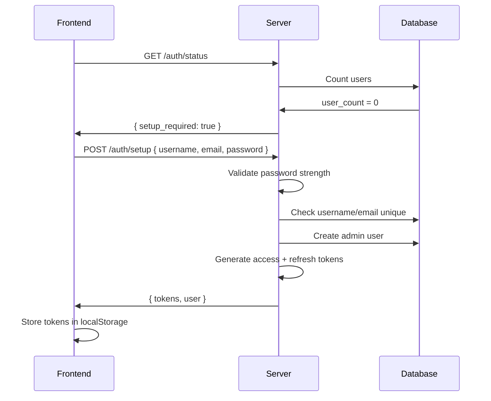
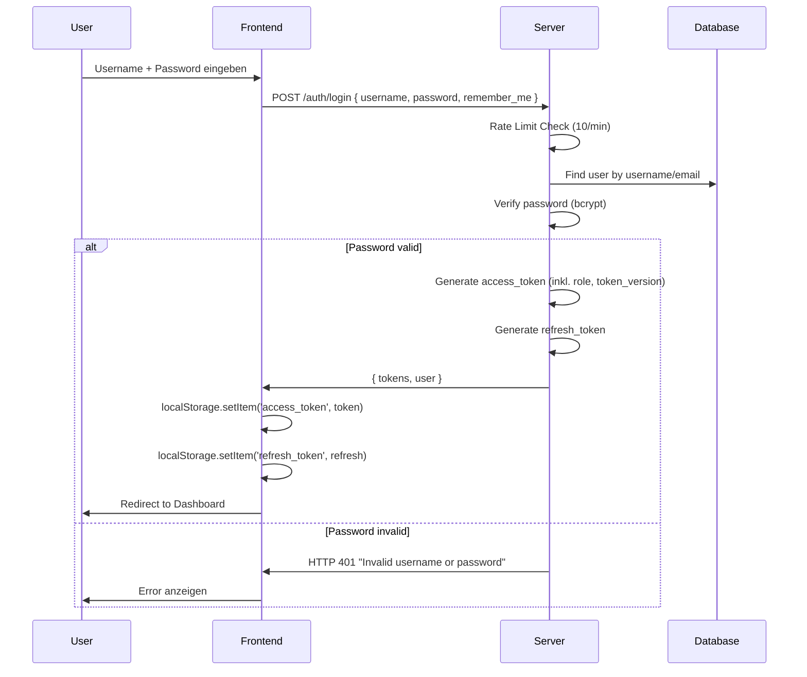
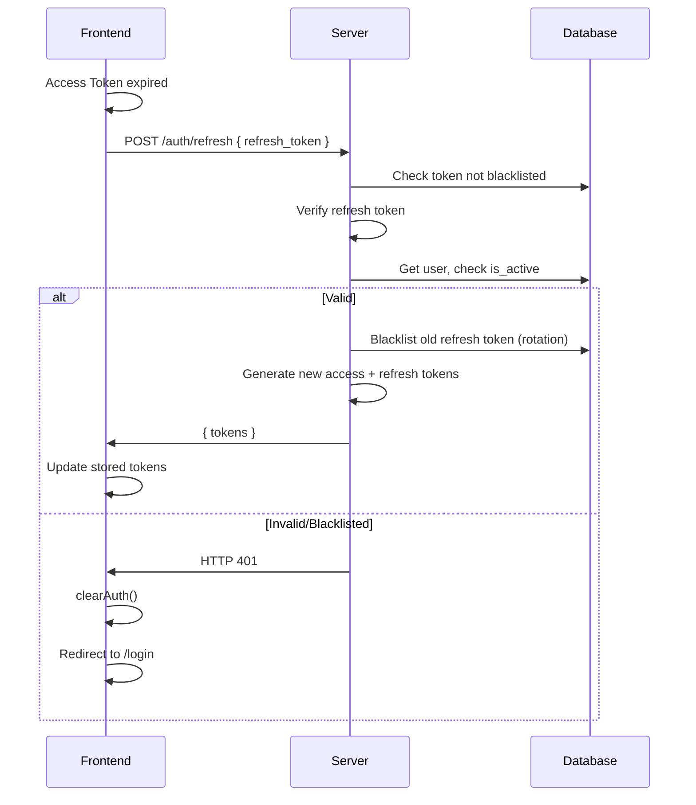
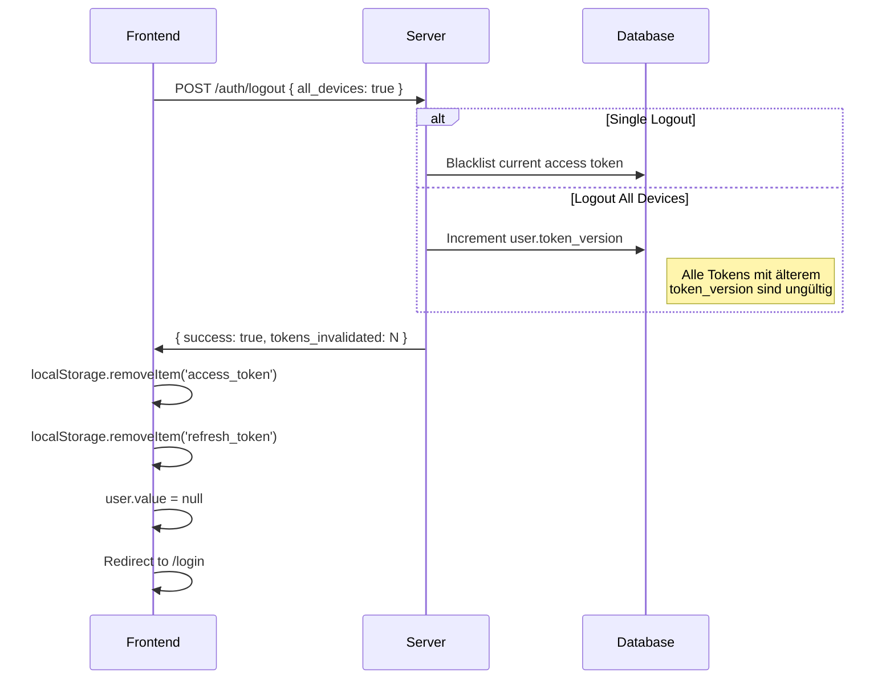
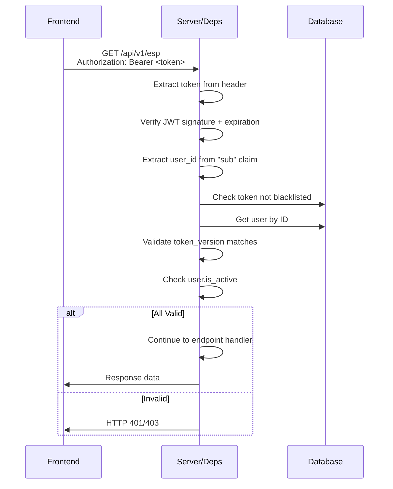

# Authentication & Authorization Flow - Server & Frontend Perspektive

## Overview

Das Authentication & Authorization System implementiert **JWT-basierte Authentifizierung** mit **Token Rotation**, **Token Blacklisting** und **Role-Based Access Control (RBAC)**. Dieser Flow beschreibt den vollständigen Security-Stack vom Login bis zum API-Zugriff.

**Status:** ✅ Implementiert (Phase 5)

---

## Voraussetzungen

- [ ] Server läuft (`god_kaiser_server`)
- [ ] Datenbank initialisiert (SQLite/PostgreSQL)
- [ ] Mindestens ein Admin-User existiert (oder Initial Setup durchführen)
- [ ] Frontend läuft mit korrektem API Endpoint

---

## Teil 1: Security-Architektur

### 1.1 JWT Token System

**Zwei Token-Typen:**

| Token-Typ | Gültigkeit | Verwendung | Claims |
|-----------|------------|------------|--------|
| **Access Token** | 24h (Standard) / 7 Tage (Remember Me) | API-Zugriff, Authorization Header | `sub`, `exp`, `iat`, `type`, `role`, `token_version` |
| **Refresh Token** | 7 Tage | Token-Erneuerung | `sub`, `exp`, `iat`, `jti`, `type` |

**Code-Location:** `El Servador/god_kaiser_server/src/core/security.py`

```python
# Access Token Base Claims (security.py Zeile 78-83)
to_encode = {
    "sub": str(user_id),
    "exp": expire,
    "iat": datetime.now(timezone.utc),
    "type": "access",
}

# Refresh Token Claims (security.py Zeile 120-126)
to_encode = {
    "sub": str(user_id),
    "exp": expire,
    "iat": datetime.now(timezone.utc),
    "jti": str(uuid4()),  # Unique ID für Rotation
    "type": "refresh",
}
```

**Wichtig:** `role` und `token_version` werden als `additional_claims` in `auth.py` hinzugefügt:

```python
# auth.py Zeile 281-288 (Login)
access_token = create_access_token(
    user_id=user.id,
    additional_claims={
        "role": user.role,
        "token_version": user.token_version,
    },
    expires_delta=expires_delta,
)
```

### 1.2 Role-Based Access Control (RBAC)

**Drei Benutzer-Rollen:**

| Rolle | Beschreibung | Berechtigungen |
|-------|--------------|----------------|
| **admin** | Voller Zugriff | Alle Operationen, User-Management, System-Config |
| **operator** | Standard-Operator | ESP-Steuerung, Sensor-Reading, Actuator-Commands, Logic Rules |
| **viewer** | Nur-Lese-Zugriff | Dashboard, Sensor-Daten anzeigen, Status prüfen |

**Code-Location:** `El Servador/god_kaiser_server/src/api/deps.py`

```python
# Zeile 239-264: Admin Guard
async def require_admin(current_user: ActiveUser) -> User:
    if current_user.role != "admin":
        raise HTTPException(status_code=403, detail="Admin privileges required")
    return current_user

# Zeile 267-293: Operator Guard
async def require_operator(current_user: ActiveUser) -> User:
    if current_user.role not in ("admin", "operator"):
        raise HTTPException(status_code=403, detail="Operator or admin privileges required")
    return current_user
```

### 1.3 Token Blacklist & Versioning

**Zwei Mechanismen zur Token-Invalidierung:**

| Mechanismus | Verwendung | Speicherung |
|-------------|------------|-------------|
| **Token Blacklist** | Einzelne Tokens invalidieren (Logout) | Datenbank-Tabelle `token_blacklist` |
| **Token Versioning** | Alle Tokens invalidieren (Logout All Devices) | User-Feld `token_version` |

**Code-Location:** `El Servador/god_kaiser_server/src/api/deps.py` (Zeile 157-195)

```python
# Token Blacklist Check
blacklist_repo = TokenBlacklistRepository(db)
if await blacklist_repo.is_blacklisted(token):
    logger.warning(f"Blacklisted token used for user_id={user_id}")
    raise HTTPException(
        status_code=status.HTTP_401_UNAUTHORIZED,
        detail="Token has been revoked",
        headers={"WWW-Authenticate": "Bearer"},
    )

# TOKEN VERSIONING: Check if token version matches user's current version
token_version = payload.get("token_version")
if token_version is not None:
    # Token has version claim - validate it
    if token_version < user.token_version:
        logger.warning(
            f"Token version mismatch for user {user.username}: "
            f"token_version={token_version}, user.token_version={user.token_version}"
        )
        raise HTTPException(
            status_code=status.HTTP_401_UNAUTHORIZED,
            detail="Token has been invalidated (logout all devices)",
            headers={"WWW-Authenticate": "Bearer"},
        )
# If token doesn't have version claim, it's an old token - allow it for backward compatibility
# but log a warning
elif user.token_version > 0:
    logger.debug(
        f"Token without version claim for user {user.username} "
        f"(user.token_version={user.token_version})"
    )
```

**Wichtig:** Alte Tokens ohne `token_version` Claim werden aus Rückwärtskompatibilitätsgründen akzeptiert. Diese werden jedoch geloggt und sollten nach einer Übergangsphase abgelehnt werden.

---

## Teil 2: Authentication Flows

### 2.1 Initial Setup Flow (Ersteinrichtung)

**Wann:** Keine User in Datenbank → Setup erforderlich

**Endpoint:** `POST /api/v1/auth/setup`

**Code-Location:** `El Servador/god_kaiser_server/src/api/v1/auth.py` (Zeile 113-211)



**Request Payload:**
```typescript
POST /api/v1/auth/setup
{
  "username": "admin",
  "email": "admin@example.com",
  "password": "SecureP@ss123!",
  "full_name": "System Administrator"  // optional
}
```

**Password Requirements (Code: `schemas/auth.py` Zeile 66-81):**
- Mindestens 8 Zeichen
- Mindestens ein Großbuchstabe
- Mindestens ein Kleinbuchstabe
- Mindestens eine Ziffer
- Mindestens ein Sonderzeichen (`!@#$%^&*()_+-=[]{}|;:,.<>?`)

**Response:**
```typescript
{
  "success": true,
  "message": "Admin account created successfully",
  "tokens": {
    "access_token": "eyJhbGciOiJIUzI1NiIs...",
    "refresh_token": "eyJhbGciOiJIUzI1NiIs...",
    "token_type": "bearer",
    "expires_in": 86400
  },
  "user": {
    "id": 1,
    "username": "admin",
    "email": "admin@example.com",
    "full_name": "System Administrator",
    "role": "admin",
    "is_active": true,
    "created_at": "2025-01-01T00:00:00Z",
    "updated_at": "2025-01-01T00:00:00Z"
  }
}
```

### 2.2 Login Flow

**Endpoint:** `POST /api/v1/auth/login`

**Code-Location:** `El Servador/god_kaiser_server/src/api/v1/auth.py` (Zeile 219-318)



**Frontend Implementation:** `El Frontend/src/stores/auth.ts` (Zeile 65-82)

```typescript
async function login(credentials: LoginRequest): Promise<void> {
  isLoading.value = true
  error.value = null

  try {
    const response = await authApi.login(credentials)
    // Server returns { tokens: { access_token, ... }, user }
    setTokens(response.tokens.access_token, response.tokens.refresh_token)
    user.value = response.user
  } catch (err: unknown) {
    const axiosError = err as { response?: { data?: { detail?: string } } }
    error.value = axiosError.response?.data?.detail || 'Login failed'
    throw err
  } finally {
    isLoading.value = false
  }
}
```

**Rate Limiting:** `deps.py` (Zeile 573-602)
- 10 Login-Versuche pro Minute pro IP/API-Key
- HTTP 429 bei Überschreitung

### 2.3 Token Refresh Flow

**Endpoint:** `POST /api/v1/auth/refresh`

**Code-Location:** `El Servador/god_kaiser_server/src/api/v1/auth.py` (Zeile 453-553)



**Token Rotation (Sicherheitsfeature):**
- Alter Refresh Token wird bei jeder Nutzung geblacklistet
- Neuer Refresh Token wird generiert
- Verhindert Token-Replay-Attacken

**Code:** `auth.py` (Zeile 517-530)
```python
# TOKEN ROTATION: Blacklist old refresh token BEFORE creating new ones
# Cache user data before any DB operations that might fail
user_id = user.id
user_role = user.role
user_token_version = user.token_version
user_username = user.username

try:
    await blacklist_repo.add_token(
        token=old_refresh_token,
        token_type="refresh",
        user_id=user_id,
        expires_at=expires_at,
        reason="token_rotation",
    )
    await db.commit()
    logger.debug(f"Old refresh token blacklisted for user: {user_username}")
except Exception as e:
    # Rollback the failed transaction to allow further DB operations
    await db.rollback()
    logger.warning(f"Failed to blacklist old refresh token (might be already blacklisted): {e}")
    # Continue anyway - token rotation is best effort
    # Token might already be blacklisted by concurrent request (race condition)
```

### 2.4 Logout Flow

**Endpoint:** `POST /api/v1/auth/logout`

**Code-Location:** `El Servador/god_kaiser_server/src/api/v1/auth.py` (Zeile 561-640)

**Zwei Modi:**

| Modus | Request | Effekt |
|-------|---------|--------|
| **Single Logout** | `{ all_devices: false }` | Aktueller Access Token wird geblacklistet |
| **Logout All Devices** | `{ all_devices: true }` | `token_version` wird inkrementiert → Alle Tokens ungültig |



---

## Teil 3: Authorization Flow

### 3.1 API Request mit Authentication

**Code-Location:** `El Servador/god_kaiser_server/src/api/deps.py` (Zeile 84-197)



**Dependency Injection Chain:**

```python
# Zeile 201: CurrentUser = Annotated[User, Depends(get_current_user)]
# Zeile 231: ActiveUser = Annotated[User, Depends(get_current_active_user)]
# Zeile 297: AdminUser = Annotated[User, Depends(require_admin)]
# Zeile 298: OperatorUser = Annotated[User, Depends(require_operator)]
```

**Verwendung in Endpoints:**
```python
# Jeder User (nur authenticated)
@router.get("/items")
async def list_items(current_user: ActiveUser):
    ...

# Nur Operatoren und Admins
@router.post("/items")
async def create_item(current_user: OperatorUser):
    ...

# Nur Admins
@router.delete("/items/{id}")
async def delete_item(current_user: AdminUser):
    ...
```

### 3.2 Role-Permission Matrix

| Endpoint | Viewer | Operator | Admin |
|----------|--------|----------|-------|
| `GET /esp` | ✅ | ✅ | ✅ |
| `GET /sensors` | ✅ | ✅ | ✅ |
| `POST /actuators/command` | ❌ | ✅ | ✅ |
| `POST /logic/rules` | ❌ | ✅ | ✅ |
| `DELETE /logic/rules/{id}` | ❌ | ✅ | ✅ |
| `GET /users` | ❌ | ❌ | ✅ |
| `POST /users` | ❌ | ❌ | ✅ |
| `DELETE /users/{id}` | ❌ | ❌ | ✅ |
| `POST /auth/mqtt/configure` | ❌ | ❌ | ✅ |

---

## Teil 4: Frontend Integration

### 4.1 Auth Store

**File:** `El Frontend/src/stores/auth.ts`

**State:**
```typescript
const user = ref<User | null>(null)
const accessToken = ref<string | null>(localStorage.getItem(TOKEN_KEY))
const refreshToken = ref<string | null>(localStorage.getItem(REFRESH_TOKEN_KEY))
const isLoading = ref(false)
const setupRequired = ref<boolean | null>(null)
const error = ref<string | null>(null)
```

**Computed Properties:**
```typescript
const isAuthenticated = computed(() => !!accessToken.value && !!user.value)
const isAdmin = computed(() => user.value?.role === 'admin')
const isOperator = computed(() => ['admin', 'operator'].includes(user.value?.role || ''))
```

### 4.2 Auth API Client

**File:** `El Frontend/src/api/auth.ts`

**Methods:**
- `getStatus()` - Check if setup required
- `login(credentials)` - User login
- `setup(data)` - Initial admin setup
- `refresh(refreshToken)` - Token refresh
- `me()` - Get current user
- `logout(logoutAll)` - Logout

### 4.3 Axios Interceptor (Token Auto-Refresh)

**File:** `El Frontend/src/api/index.ts` (Zeile 30-71)

```typescript
// Response interceptor - handle token refresh (Zeile 31-70)
api.interceptors.response.use(
  (response) => response,
  async (error: AxiosError) => {
    const originalRequest = error.config as InternalAxiosRequestConfig & { _retry?: boolean }
    const authStore = useAuthStore()

    // CRITICAL: Skip interceptor for auth endpoints to prevent infinite loop!
    const isAuthEndpoint = originalRequest?.url?.includes('/auth/refresh') ||
                           originalRequest?.url?.includes('/auth/login') ||
                           originalRequest?.url?.includes('/auth/setup') ||
                           originalRequest?.url?.includes('/auth/status')

    // If 401 and not already retrying and not an auth endpoint
    if (
      error.response?.status === 401 &&
      !originalRequest._retry &&
      !isAuthEndpoint &&
      authStore.refreshToken
    ) {
      originalRequest._retry = true

      try {
        await authStore.refreshTokens()
        // Retry original request with new token
        if (originalRequest.headers) {
          originalRequest.headers.Authorization = `Bearer ${authStore.accessToken}`
        }
        return api(originalRequest)
      } catch (refreshError) {
        // Refresh failed, logout user
        authStore.clearAuth()
        window.location.href = '/login'
        return Promise.reject(refreshError)
      }
    }

    return Promise.reject(error)
  }
)
```

**Wichtige Sicherheitsaspekte:**
- Auth-Endpoints (`/auth/refresh`, `/auth/login`, etc.) werden **explizit ausgeschlossen** um Infinite Loops zu verhindern
- `_retry` Flag verhindert mehrfache Refresh-Versuche
- Bei fehlgeschlagenem Refresh → `window.location.href` für harten Redirect

### 4.4 Router Guards

**File:** `El Frontend/src/router/index.ts` (Zeile 123-152)

```typescript
// Navigation guards
router.beforeEach(async (to, _from, next) => {
  const authStore = useAuthStore()

  // Wait for auth status check if not done yet
  if (authStore.setupRequired === null) {
    await authStore.checkAuthStatus()
  }

  // Redirect to setup if required
  if (authStore.setupRequired && to.name !== 'setup') {
    return next({ name: 'setup' })
  }

  // Check if route requires auth (meta.requiresAuth = true)
  if (to.meta.requiresAuth && !authStore.isAuthenticated) {
    return next({ name: 'login', query: { redirect: to.fullPath } })
  }

  // Check if route requires admin (meta.requiresAdmin = true)
  if (to.meta.requiresAdmin && !authStore.isAdmin) {
    return next({ name: 'dashboard' })
  }

  // Redirect authenticated users away from login/setup
  if (authStore.isAuthenticated && (to.name === 'login' || to.name === 'setup')) {
    return next({ name: 'dashboard' })
  }

  next()
})
```

**Route Meta-Fields:**
- `requiresAuth: false` - Öffentliche Routen (Login, Setup)
- `requiresAuth: true` - Geschützte Routen (alle unter `/`)
- `requiresAdmin: true` - Admin-only Routen (Users, Database, Logs, etc.)

---

## Teil 5: User Experience

### 5.1 Was der User sieht

| Zeitpunkt | UI-Anzeige | User-Aktion |
|-----------|------------|-------------|
| **t=0s** | Login-Seite mit Formular | Username + Password eingeben |
| **t=0.5s** | "Wird angemeldet..." (Loading) | Warten |
| **t=1-2s** | Dashboard | Navigieren |
| **Bei Fehler** | "Invalid username or password" | Erneut versuchen |
| **Token expired** | Automatischer Refresh | Keine (transparent) |
| **Refresh failed** | Redirect zu Login | Erneut anmelden |

### 5.2 Error States

| Error | HTTP Code | UI-Anzeige | User-Aktion |
|-------|-----------|------------|-------------|
| Invalid credentials | 401 | "Invalid username or password" | Credentials prüfen |
| User inactive | 401 | "User account is disabled" | Admin kontaktieren |
| Rate limit | 429 | "Too many attempts. Please wait." | 60 Sekunden warten |
| Token expired | 401 | (Automatischer Refresh) | Keine |
| Token revoked | 401 | Redirect zu Login | Erneut anmelden |
| Missing role | 403 | "Admin privileges required" | Berechtigung anfordern |

---

## Teil 6: Security Best Practices

### 6.1 Implementierte Maßnahmen

- ✅ **Password Hashing:** bcrypt mit Salt
- ✅ **JWT Signing:** HS256 mit Secret Key
- ✅ **Token Expiration:** Access (24h), Refresh (7 Tage)
- ✅ **Token Rotation:** Refresh Token wird bei jeder Nutzung erneuert
- ✅ **Token Blacklisting:** Invalidierte Tokens in DB gespeichert
- ✅ **Rate Limiting:** 10 Login-Versuche pro Minute
- ✅ **Password Validation:** Komplexitätsanforderungen
- ✅ **RBAC:** Drei Rollen mit unterschiedlichen Berechtigungen

### 6.2 Security Headers

```python
# Empfohlen in Production
app.add_middleware(
    CORSMiddleware,
    allow_origins=["https://yourdomain.com"],
    allow_credentials=True,
    allow_methods=["*"],
    allow_headers=["*"],
)
```

---

## Teil 7: Code-Locations Referenz

### 7.1 Server (Python)

| Component | File | Zeilen | Beschreibung |
|-----------|------|--------|--------------|
| Password Hashing | `src/core/security.py` | 16-50 | bcrypt hash/verify |
| Access Token | `src/core/security.py` | 53-94 | JWT creation (base claims) |
| Refresh Token | `src/core/security.py` | 97-134 | JWT with rotation support |
| Token Verification | `src/core/security.py` | 137-171 | JWT decode & validate |
| Password Validation | `src/core/security.py` | 194-229 | validate_password_strength |
| Auth Endpoints | `src/api/v1/auth.py` | 1-822 | Login/Setup/Refresh/Logout |
| Auth Dependencies | `src/api/deps.py` | 84-298 | get_current_user, require_admin |
| Rate Limiting | `src/api/deps.py` | 377-602 | In-memory & Redis limiter |
| Auth Schemas | `src/schemas/auth.py` | 1-691 | Pydantic models |
| User Repository | `src/db/repositories/user_repo.py` | 1-87 | DB operations |
| Token Blacklist Repo | `src/db/repositories/token_blacklist_repo.py` | 1-191 | Blacklist DB operations |
| Token Blacklist Model | `src/db/models/auth.py` | 1-159 | TokenBlacklist SQLAlchemy model |
| User Model | `src/db/models/user.py` | 1-106 | User SQLAlchemy model (inkl. token_version) |

### 7.2 Frontend (TypeScript/Vue)

| Component | File | Zeilen | Beschreibung |
|-----------|------|--------|--------------|
| Auth Store | `src/stores/auth.ts` | 1-172 | Pinia state management |
| Auth API | `src/api/auth.ts` | 1-66 | API client methods |
| Axios Interceptor | `src/api/index.ts` | 1-90 | Token injection + auto-refresh |
| Router Guards | `src/router/index.ts` | 123-152 | Navigation guards |
| Auth Types | `src/types/index.ts` | 1-60 | User, LoginRequest, TokenResponse, etc. |
| Login View | `src/views/LoginView.vue` | 1-362 | Login UI |
| Setup View | `src/views/SetupView.vue` | 1-300 | Initial setup UI |

---

## Teil 8: Troubleshooting

### 8.1 "Invalid username or password"

**Ursachen:**
- Falscher Username/Email
- Falsches Passwort
- User existiert nicht

**Debug:**
```bash
# User in DB prüfen (Tabelle: user_accounts)
sqlite3 god_kaiser_dev.db "SELECT username, email, is_active FROM user_accounts"
```

### 8.2 "Token has been revoked"

**Ursache:** Token wurde durch Logout oder Admin invalidiert

**Lösung:** Erneut anmelden

### 8.3 "Too many authentication attempts"

**Ursache:** Rate Limit überschritten (>10 Versuche/Minute)

**Lösung:** 60 Sekunden warten

### 8.4 Token Refresh schlägt fehl

**Mögliche Ursachen:**
- Refresh Token expired (>7 Tage)
- Refresh Token blacklisted (bereits verwendet)
- User wurde deaktiviert
- `token_version` wurde erhöht (Logout All Devices)

**Debug:**
```python
# Token payload prüfen (ohne Verification)
from src.core.security import decode_token_payload
payload = decode_token_payload(refresh_token)
print(payload)
```

---

## Teil 9: Cross-Reference Links (Code-Verbindungen)

### 9.1 Token-Erstellung Flow

```
[Login Request]
    │
    ▼
auth.py:230-318 (login endpoint)
    │
    ├──► user_repo.py:55-64 (authenticate)
    │        │
    │        └──► security.py:37-50 (verify_password)
    │
    └──► security.py:53-94 (create_access_token)
         + additional_claims { role, token_version }
    │
    └──► security.py:97-134 (create_refresh_token)
```

### 9.2 Token-Validierung Flow

```
[API Request mit Bearer Token]
    │
    ▼
deps.py:84-197 (get_current_user)
    │
    ├──► security.py:137-171 (verify_token)
    │
    ├──► token_blacklist_repo.py:65-83 (is_blacklisted)
    │        │
    │        └──► auth.py (TokenBlacklist Model):117-128 (hash_token)
    │
    ├──► user_repo.py:21-25 (get_by_id)
    │
    └──► Token Version Check (Zeile 175-188)
              │
              └──► user.py:87-92 (token_version field)
```

### 9.3 Token Refresh Flow

```
[Refresh Request]
    │
    ▼
auth.py:453-553 (refresh_token endpoint)
    │
    ├──► token_blacklist_repo.py:65-83 (is_blacklisted check)
    │
    ├──► security.py:137-171 (verify_token "refresh")
    │
    ├──► user_repo.py:21-25 (get_by_id)
    │
    └──► token_blacklist_repo.py:33-63 (add_token - ROTATION!)
         │
         └──► Neuer access + refresh token
```

### 9.4 Logout Flow

```
[Logout Request]
    │
    ▼
auth.py:561-640 (logout endpoint)
    │
    ├──► [Single Logout]
    │        │
    │        └──► token_blacklist_repo.py:33-63 (add_token)
    │
    └──► [Logout All Devices]
              │
              └──► user.token_version += 1
                   (invalidiert ALLE Tokens)
```

### 9.5 Frontend ↔ Server Verbindung

```
Frontend                          Server
────────────────────────────────────────────────────────
auth.ts:65-81 (login)      ──►   auth.py:219-318
api/auth.ts:25-28          ──►   POST /api/v1/auth/login
                           ◄──   { tokens, user }

auth.ts:104-118 (refresh)  ──►   auth.py:453-553
api/auth.ts:43-47          ──►   POST /api/v1/auth/refresh
                           ◄──   { tokens }

api/index.ts:31-70         ──►   401 Handler mit auto-refresh
(axios interceptor)

router/index.ts:123-152    ──►   Route Guards
stores/auth.ts:19-21       ──►   isAdmin, isOperator computed
```

---

## Verifizierungscheckliste

- [x] Initial Setup erstellt Admin-User korrekt (`auth.py:113-211`)
- [x] Login generiert valide JWT Tokens mit role und token_version (`auth.py:219-318`)
- [x] Token Blacklist und Versioning funktionieren (`deps.py:157-195`)
- [x] Refresh Token Rotation mit Fehlerbehandlung (`auth.py:517-530`)
- [x] Logout (Single/All Devices) funktioniert korrekt (`auth.py:561-640`)
- [x] Rate Limiting blockiert nach 10 Versuchen pro Minute (`deps.py:573-602`)
- [x] Role Guards schützen Admin/Operator Endpoints (`deps.py:239-293`)
- [x] Frontend Auth Store verwaltet Tokens korrekt (`auth.ts:1-172`)
- [x] Axios Interceptor refreshed Tokens automatisch (`api/index.ts:31-70`)
- [x] Router Guards schützen geschützte Routen (`router/index.ts:123-152`)
- [x] Token Models (User, TokenBlacklist) sind korrekt implementiert

---

**Letzte Verifizierung:** Dezember 2025
**Dokumentation basiert auf:** Aktueller Code-Stand
**Verifiziert durch:** Vollständige Code-Analyse aller referenzierten Dateien am 27. Dezember 2025

