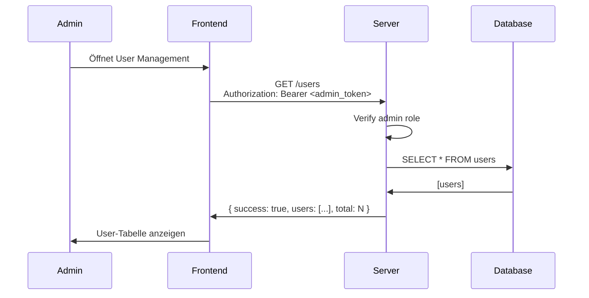
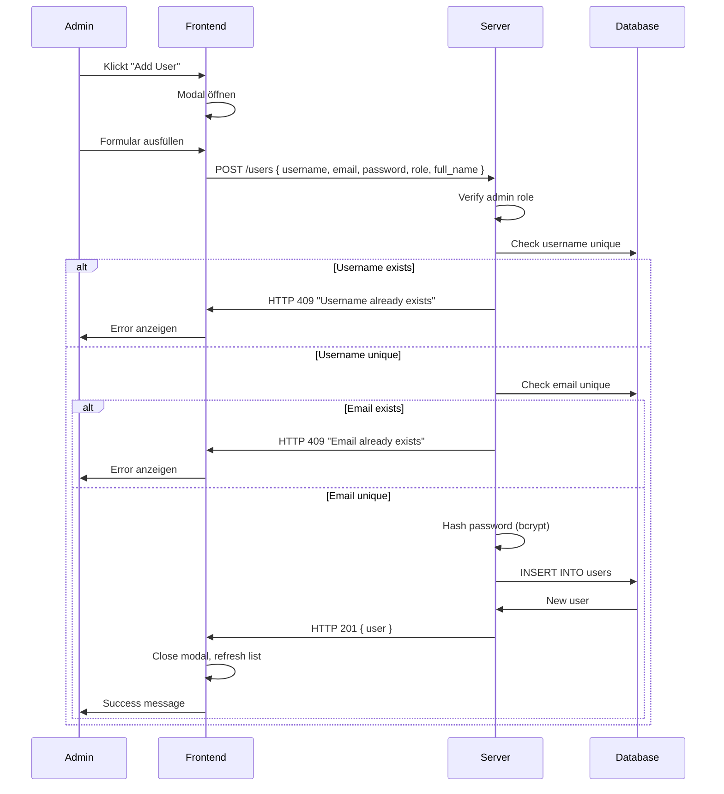
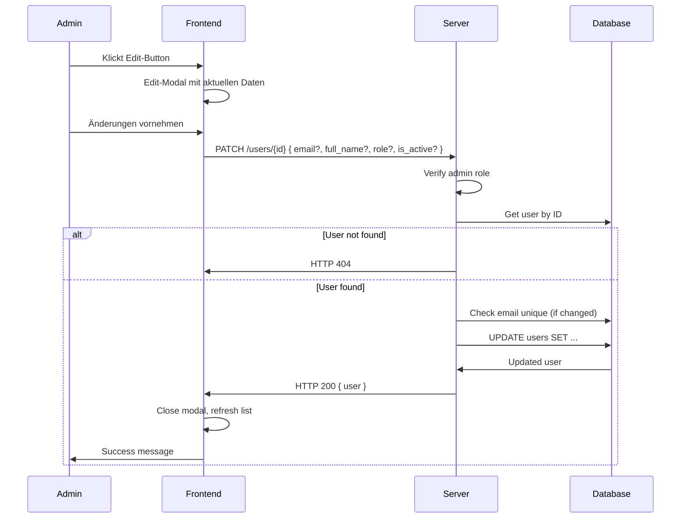
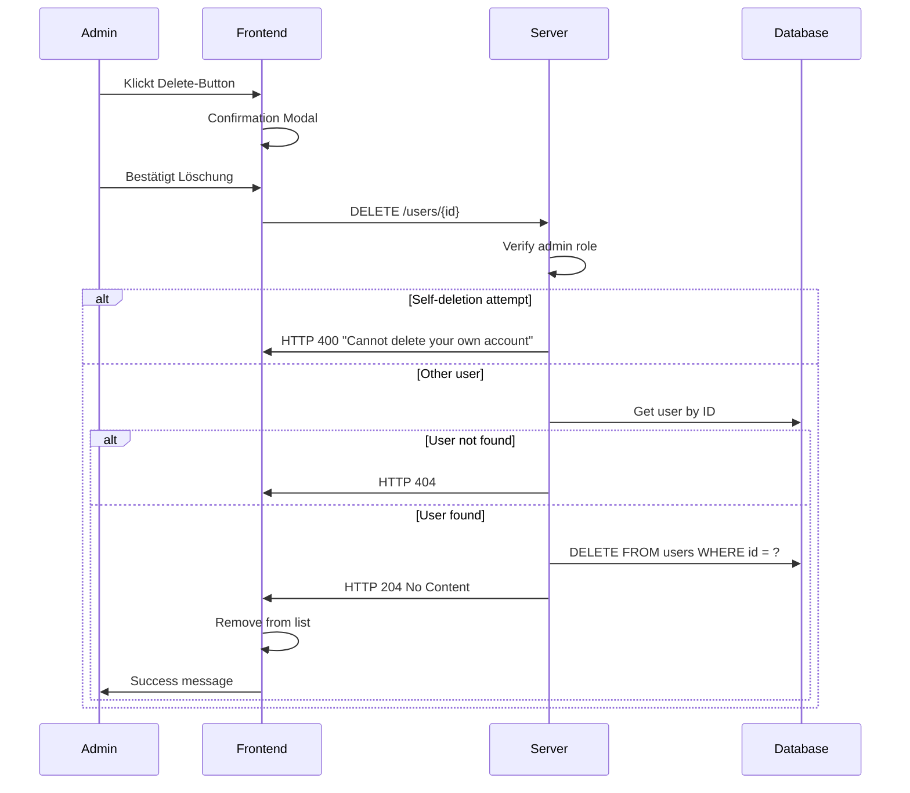
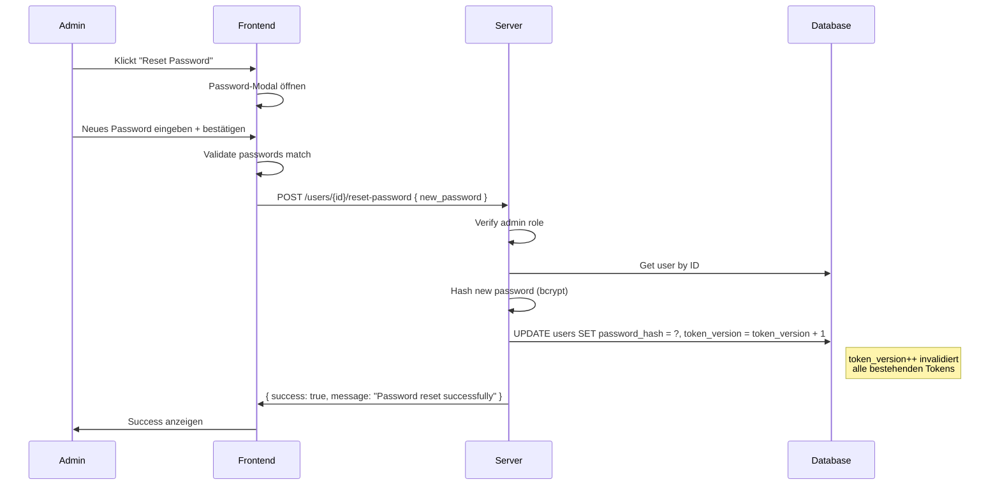
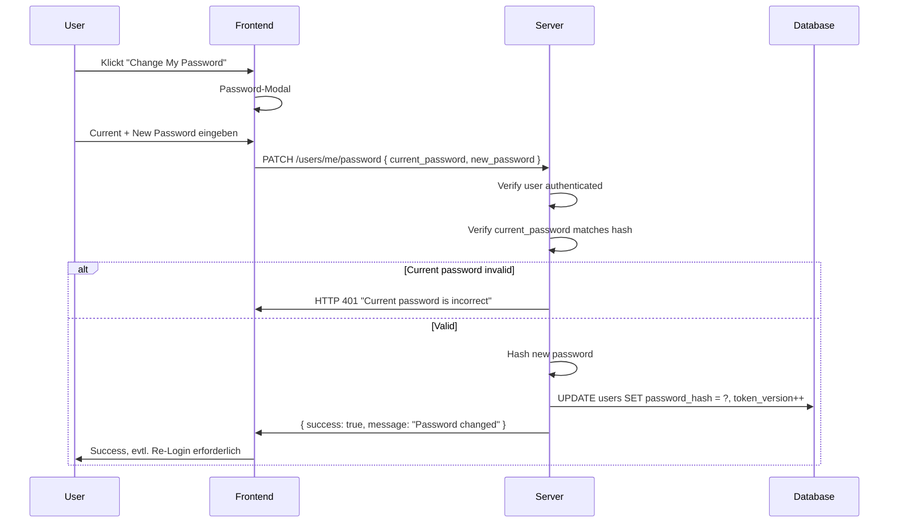

# User Management Flow - Server & Frontend Perspektive

## Overview

Das User Management System ermöglicht Administratoren die vollständige Verwaltung von Benutzerkonten. Dieser Flow beschreibt **CRUD-Operationen**, **Password-Management** und **Role Assignment**.

**Status:** ✅ Implementiert (Phase 5)
**Voraussetzung:** Authentication Flow (11-authentication-authorization-flow)

---

## Voraussetzungen

- [ ] Admin-User authentifiziert (siehe [Authentication Flow - Login](./11-authentication-authorization-flow-server-frontend.md#22-login-flow))
- [ ] Server läuft mit gültiger Datenbank-Verbindung
- [ ] Frontend hat gültigen Access Token mit `role: admin` (siehe [Auth Flow - RBAC](./11-authentication-authorization-flow-server-frontend.md#12-role-based-access-control-rbac))
- [ ] Mindestens ein Admin-User existiert (via Initial Setup oder DB)

---

## Teil 1: Architektur-Übersicht

### 1.1 User-Rollen und Berechtigungen

| Rolle | Beschreibung | Kann erstellt werden von |
|-------|--------------|-------------------------|
| **admin** | Voller System-Zugriff | Nur Admins |
| **operator** | ESP-Steuerung, keine User-Verwaltung | Nur Admins |
| **viewer** | Nur Lese-Zugriff | Nur Admins |

**Code-Location (Role Enum):** `El Servador/god_kaiser_server/src/schemas/user.py` (Zeile 14-18)

```python
class UserRole(str, Enum):
    ADMIN = "admin"
    OPERATOR = "operator"
    VIEWER = "viewer"
```

**Verlinkung:** Für RBAC-Details und Guards siehe [Authentication Flow - RBAC](./11-authentication-authorization-flow-server-frontend.md#12-role-based-access-control-rbac)

### 1.2 User-Datenmodell

**Code-Location:** `El Servador/god_kaiser_server/src/db/models/user.py`

```python
class User(Base, TimestampMixin):
    __tablename__ = "user_accounts"  # ⚠️ Nicht "users"!
    
    id: Mapped[int]                          # Primary Key (auto-increment)
    username: Mapped[str]                    # Unique, max 50 chars, indexed
    email: Mapped[str]                       # Unique, max 100 chars, indexed
    password_hash: Mapped[str]               # bcrypt hash, max 255 chars
    full_name: Mapped[Optional[str]]         # Display name, max 100 chars
    role: Mapped[str]                        # "admin" | "operator" | "viewer", default: "viewer"
    is_active: Mapped[bool]                  # Account status, default: True
    token_version: Mapped[int]               # For token invalidation, default: 0
    created_at: Mapped[datetime]             # Auto-generated (via TimestampMixin)
    updated_at: Mapped[datetime]             # Auto-updated (via TimestampMixin)
```

**Hinweis:** Der Tabellenname ist `user_accounts`, nicht `users`. Die `TimestampMixin` Klasse stellt `created_at` und `updated_at` bereit (siehe `src/db/base.py`).

### 1.3 API Endpoints

**Base URL:** `/api/v1/users`

| Endpoint | Method | Beschreibung | Auth Level | Dependency |
|----------|--------|--------------|------------|------------|
| `/` | GET | Liste aller User | Admin | `AdminUser` |
| `/` | POST | Neuen User erstellen | Admin | `AdminUser` |
| `/{user_id}` | GET | User Details | Admin | `AdminUser` |
| `/{user_id}` | PATCH | User aktualisieren | Admin | `AdminUser` |
| `/{user_id}` | DELETE | User löschen | Admin | `AdminUser` |
| `/{user_id}/reset-password` | POST | Password zurücksetzen | Admin | `AdminUser` |
| `/me/password` | PATCH | Eigenes Password ändern | Any Active User | `ActiveUser` |

**Code-Location:** `El Servador/god_kaiser_server/src/api/v1/users.py`

**Dependencies (Auth Guards):**
```python
# deps.py Zeile 297-298
AdminUser = Annotated[User, Depends(require_admin)]
ActiveUser = Annotated[User, Depends(get_current_active_user)]
```

**Verlinkung:** Für Details zur Dependency Injection Chain siehe [Authentication Flow - Authorization](./11-authentication-authorization-flow-server-frontend.md#31-api-request-mit-authentication)

---

## Teil 2: User CRUD Flows

### 2.1 List Users Flow

**Endpoint:** `GET /api/v1/users`

**Code-Location:** `users.py` (Zeile 43-61)



**Response:**
```typescript
{
  "success": true,
  "users": [
    {
      "id": 1,
      "username": "admin",
      "email": "admin@example.com",
      "full_name": "System Administrator",
      "role": "admin",
      "is_active": true,
      "created_at": "2025-01-01T00:00:00Z",
      "updated_at": "2025-01-01T00:00:00Z"
    },
    // ...weitere User
  ],
  "total": 5
}
```

### 2.2 Create User Flow

**Endpoint:** `POST /api/v1/users`

**Code-Location:** `users.py` (Zeile 64-112)



**Request Payload:**
```typescript
POST /api/v1/users
{
  "username": "newuser",          // Required: 3-50 chars, alphanumeric
  "email": "newuser@example.com", // Required: valid email
  "password": "SecureP@ss123!",   // Required: 8+ chars, complexity rules
  "full_name": "New User",        // Optional
  "role": "operator"              // Optional, default: "viewer"
}
```

**Password Validation (Server-side):**

```python
# schemas/user.py (Zeile 49-61)
class UserCreate(UserBase):
    password: str = Field(..., min_length=8, description="User password (minimum 8 characters)")
    role: UserRole = Field(default=UserRole.VIEWER, description="User role")

    @field_validator("password")
    @classmethod
    def validate_password(cls, v: str) -> str:
        """Validate password complexity."""
        if len(v) < 8:
            raise ValueError("Password must be at least 8 characters long")
        if not any(c.isupper() for c in v):
            raise ValueError("Password must contain at least one uppercase letter")
        if not any(c.islower() for c in v):
            raise ValueError("Password must contain at least one lowercase letter")
        if not any(c.isdigit() for c in v):
            raise ValueError("Password must contain at least one digit")
        return v
```

> ⚠️ **Achtung:** Die Password-Validierung bei `PasswordReset` (Zeile 128-142) und `PasswordChange` (Zeile 145-169) prüft nur `min_length=8`, nicht die volle Komplexität! Dies ist ein **Security Consideration** für zukünftige Verbesserungen.

**Verlinkung:** Siehe [Authentication Flow](./11-authentication-authorization-flow-server-frontend.md#teil-1-security-architektur) für vollständige Password Policy Details.

### 2.3 Update User Flow

**Endpoint:** `PATCH /api/v1/users/{user_id}`

**Code-Location:** `users.py` (Zeile 139-187)



**Request Payload (alle Felder optional):**
```typescript
PATCH /api/v1/users/2
{
  "email": "updated@example.com",
  "full_name": "Updated Name",
  "role": "admin",
  "is_active": false  // Deaktiviert Account
}
```

### 2.4 Delete User Flow

**Endpoint:** `DELETE /api/v1/users/{user_id}`

**Code-Location:** `users.py` (Zeile 190-222)



**Selbstlöschungs-Schutz:**
```python
# users.py Zeile 202-207
if user_id == current_user.id:
    raise HTTPException(
        status_code=status.HTTP_400_BAD_REQUEST,
        detail="Cannot delete your own account"
    )
```

---

## Teil 3: Password Management

### 3.1 Admin Password Reset

**Endpoint:** `POST /api/v1/users/{user_id}/reset-password`

**Code-Location:** `users.py` (Zeile 225-260)



**Token Invalidierung bei Password Reset:**
```python
# users.py Zeile 248-251
# Hash new password
user.password_hash = get_password_hash(password_data.new_password)

# Increment token version to invalidate existing tokens
user.token_version += 1
```

### 3.2 Self-Service Password Change

**Endpoint:** `PATCH /api/v1/users/me/password`

**Code-Location:** `users.py` (Zeile 267-299)

**Unterschied zu Admin Reset:**
- Erfordert aktuelles Password zur Verifikation
- Jeder authentifizierte User kann sein eigenes Password ändern



**Request Payload:**
```typescript
PATCH /api/v1/users/me/password
{
  "current_password": "OldP@ss123!",
  "new_password": "NewP@ss456!"
}
```

---

## Teil 4: Frontend Implementation

### 4.1 User Management View

**File:** `El Frontend/src/views/UserManagementView.vue`

**Features:**
- User-Tabelle mit allen Informationen
- Create/Edit/Delete Modals
- Password Reset Modal
- Self-Service Password Change
- Role-Badge mit Icons

**State:**
```typescript
const users = ref<User[]>([])
const isLoading = ref(false)
const error = ref<string | null>(null)
const successMessage = ref<string | null>(null)

// Modals
const showCreateModal = ref(false)
const showEditModal = ref(false)
const showDeleteModal = ref(false)
const showResetPasswordModal = ref(false)
const showChangePasswordModal = ref(false)
```

### 4.2 Users API Client

**File:** `El Frontend/src/api/users.ts`

**Methods:**
```typescript
export const usersApi = {
  async listUsers(): Promise<User[]>
  async getUser(userId: number): Promise<User>
  async createUser(data: UserCreate): Promise<User>
  async updateUser(userId: number, data: UserUpdate): Promise<User>
  async deleteUser(userId: number): Promise<void>
  async resetPassword(userId: number, newPassword: string): Promise<MessageResponse>
  async changeOwnPassword(currentPassword: string, newPassword: string): Promise<MessageResponse>
}
```

### 4.3 Role Configuration

**File:** `UserManagementView.vue` (Zeile 44-48)

```typescript
const ROLES: { value: UserRole; label: string; icon: typeof Shield; color: string }[] = [
  { value: 'admin', label: 'Admin', icon: Shield, color: 'text-red-400' },
  { value: 'operator', label: 'Operator', icon: Settings, color: 'text-yellow-400' },
  { value: 'viewer', label: 'Viewer', icon: Eye, color: 'text-blue-400' }
]
```

---

## Teil 5: User Experience

### 5.1 Was der Admin sieht

| Zeitpunkt | UI-Anzeige | Aktion verfügbar |
|-----------|------------|------------------|
| **Initial** | User-Tabelle mit allen Usern | - |
| **Jeder User** | Username, Email, Role-Badge, Status, Created Date | Edit, Reset Password, Delete |
| **Eigener User** | (you) Badge | Edit, Reset Password, ~~Delete~~ |
| **Nach Aktion** | Success/Error Toast | - |

### 5.2 User-Feedback States

| State | UI-Anzeige | User-Aktion | Timeout |
|-------|------------|-------------|---------|
| Loading | "Loading users..." mit Spinner | Warten | - |
| Success | Grüner Toast "User created successfully" | Weiter | 3s auto-hide |
| Error | Roter Banner mit Fehlermeldung | X zum Schließen | - |
| Confirm Delete | Modal "Are you sure?" | Confirm/Cancel | - |

### 5.3 Validierung im Frontend

**Password-Feld (Create User Modal):**
```vue
<input v-model="createForm.password" type="password" class="input w-full" />
<p class="text-xs text-dark-500 mt-1">
  Min 8 chars, with uppercase, lowercase, and digit
</p>
```

**Confirm Password (Reset Password Modal):**
```vue
<button
  class="btn-primary"
  :disabled="isLoading || !newPassword || newPassword !== confirmPassword"
  @click="resetPassword"
>
  Reset Password
</button>
```

---

## Teil 6: Error Handling

### 6.1 Server-seitige Fehler

| Error | HTTP Code | Detail | Code-Location |
|-------|-----------|--------|---------------|
| Username exists | 409 | `"Username 'X' already exists"` | `users.py:82-85` |
| Email exists (create) | 409 | `"Email 'X' already exists"` | `users.py:88-93` |
| Email exists (update) | 409 | `"Email 'X' already exists"` | `users.py:169-175` |
| User not found | 404 | `"User with ID X not found"` | `users.py:130-134`, `155-159`, `212-216`, `241-245` |
| Self-deletion | 400 | `"Cannot delete your own account"` | `users.py:202-207` |
| Wrong password | 401 | `"Current password is incorrect"` | `users.py:280-284` |
| Not admin | 403 | `"Admin privileges required"` | `deps.py:256-263` |
| User inactive | 403 | `"User account is disabled"` | `deps.py:221-226` |

### 6.2 Frontend Error Extraction

**File:** `UserManagementView.vue` (Zeile 86-88)

```typescript
async function createUser(): Promise<void> {
  try {
    await usersApi.createUser(createForm.value)
    // ...success handling
  } catch (err: unknown) {
    const axiosError = err as { response?: { data?: { detail?: string } } }
    error.value = axiosError.response?.data?.detail || 'Failed to create user'
  }
}
```

**Hinweis:** Alle CRUD-Funktionen verwenden dasselbe Error-Extraction-Pattern:
- `loadUsers()` - Zeile 57-59
- `createUser()` - Zeile 86-88
- `updateUser()` - Zeile 117-119
- `deleteUser()` - Zeile 143-145
- `resetPassword()` - Zeile 173-175
- `changeOwnPassword()` - Zeile 203-205

**Verlinkung:** Für 401-Handling mit Auto-Refresh siehe [Authentication Flow - Axios Interceptor](./11-authentication-authorization-flow-server-frontend.md#43-axios-interceptor-token-auto-refresh)

---

## Teil 7: Security Considerations

### 7.1 Implementierte Sicherheitsmaßnahmen

- ✅ **Admin-Only Access:** Alle User-Management-Endpoints (außer `/me/password`) erfordern `AdminUser` Dependency
- ✅ **Password Hashing:** bcrypt via `security.py:get_password_hash()` für sichere Speicherung
- ✅ **Token Invalidation:** Password-Reset/Change erhöht `token_version`, invalidiert alle bestehenden Tokens
- ✅ **Self-Deletion Prevention:** `users.py:202-207` verhindert, dass Admin sich selbst löscht
- ✅ **Password Verification:** Self-Service erfordert korrektes aktuelles Password (`verify_password()`)
- ✅ **Email/Username Uniqueness:** Datenbank-Constraints + API-Level Checks

### 7.2 Password Policy

**Für UserCreate (Zeile 49-61):**
```python
# schemas/user.py - STRENGE Validierung
- Länge: mindestens 8 Zeichen
- Muss enthalten:
  - Mindestens 1 Großbuchstabe
  - Mindestens 1 Kleinbuchstabe
  - Mindestens 1 Ziffer
```

**Für PasswordReset/PasswordChange (Zeile 128-169):**
```python
# schemas/user.py - NUR min_length=8, KEINE Komplexitätsprüfung!
# ⚠️ SECURITY CONSIDERATION: Sollte dieselbe Validierung wie UserCreate haben
```

### 7.3 Verbindung zu Authentication Security

| Sicherheitsfeature | User Management | Authentication Flow |
|--------------------|-----------------|---------------------|
| Password Hashing | `get_password_hash()` | [Auth: Password Hashing](./11-authentication-authorization-flow-server-frontend.md#61-implementierte-maßnahmen) |
| Token Versioning | `user.token_version += 1` | [Auth: Token Blacklist](./11-authentication-authorization-flow-server-frontend.md#13-token-blacklist--versioning) |
| RBAC Guards | `AdminUser`, `ActiveUser` | [Auth: Role-Based Access](./11-authentication-authorization-flow-server-frontend.md#12-role-based-access-control-rbac) |

---

## Teil 8: Code-Locations Referenz

### 8.1 Server (Python)

| Component | File | Zeilen | Beschreibung |
|-----------|------|--------|--------------|
| User Model | `src/db/models/user.py` | 1-106 | SQLAlchemy Model (Tabelle: `user_accounts`) |
| Base/Timestamps | `src/db/base.py` | 17-38 | `TimestampMixin` für `created_at`/`updated_at` |
| User Repository | `src/db/repositories/user_repo.py` | 1-87 | DB operations |
| User Schemas | `src/schemas/user.py` | 1-181 | Pydantic models inkl. `UserRole` Enum |
| User API | `src/api/v1/users.py` | 1-305 | REST endpoints |
| Auth Dependencies | `src/api/deps.py` | 239-298 | `AdminUser`, `ActiveUser`, `require_admin` |
| Password Hashing | `src/core/security.py` | 16-51 | `hash_password`, `verify_password` (bcrypt) |

### 8.2 Frontend (TypeScript/Vue)

| Component | File | Zeilen | Beschreibung |
|-----------|------|--------|--------------|
| User Management View | `src/views/UserManagementView.vue` | 1-562 | Main UI mit Modals |
| Users API | `src/api/users.ts` | 1-129 | API client mit Axios |
| Types | `src/api/users.ts` | 13-59 | `User`, `UserCreate`, `UserUpdate`, `UserRole` |

### 8.3 Cross-Reference zu Authentication

| Verbindung | User Management | Authentication Flow |
|------------|-----------------|---------------------|
| Token Versioning | `user.token_version += 1` bei Password Reset | [Auth Flow - Token Blacklist](./11-authentication-authorization-flow-server-frontend.md#13-token-blacklist--versioning) |
| Admin Guard | `AdminUser` Dependency | [Auth Flow - RBAC](./11-authentication-authorization-flow-server-frontend.md#12-role-based-access-control-rbac) |
| Password Hashing | `get_password_hash()` | [Auth Flow - Security](./11-authentication-authorization-flow-server-frontend.md#61-implementierte-maßnahmen) |

---

## Teil 9: Testing Checklist

### 9.1 CRUD Operations

- [ ] List Users zeigt alle User korrekt an
- [ ] Create User mit validen Daten erfolgreich
- [ ] Create User mit existierendem Username → 409
- [ ] Create User mit existierender Email → 409
- [ ] Update User ändert nur angegebene Felder
- [ ] Delete User entfernt User aus DB
- [ ] Self-Deletion wird verhindert

### 9.2 Password Management

- [ ] Admin Password Reset setzt Password korrekt
- [ ] Password Reset invalidiert bestehende Tokens (token_version++)
- [ ] Self-Service erfordert korrektes aktuelles Password
- [ ] Falsche Password-Eingabe → 401
- [ ] Password Policy wird serverseitig validiert

### 9.3 Authorization

- [ ] Nicht-Admin bekommt 403 bei User-Endpoints
- [ ] Admin kann alle Rollen erstellen
- [ ] Deaktivierter User kann sich nicht einloggen

---

## Teil 10: Troubleshooting

### 10.1 "Admin privileges required"

**Ursache:** Eingeloggter User hat nicht die `admin`-Rolle

**Lösung:**
```bash
# User-Rolle in DB prüfen (⚠️ Tabelle heißt "user_accounts", nicht "users"!)
sqlite3 god_kaiser_dev.db "SELECT username, role FROM user_accounts WHERE username='current_user'"
```

**Verlinkung:** Siehe [Authentication Flow - Troubleshooting](./11-authentication-authorization-flow-server-frontend.md#teil-8-troubleshooting) für Auth-spezifische Probleme.

### 10.2 User-Liste ist leer

**Mögliche Ursachen:**
- Kein Admin-Token vorhanden
- Datenbank nicht initialisiert

**Debug:**
```bash
# Users in DB prüfen (⚠️ Tabelle heißt "user_accounts"!)
sqlite3 god_kaiser_dev.db "SELECT * FROM user_accounts"
```

### 10.3 Password Reset funktioniert nicht

**Check:** Token-Version wird erhöht?
```bash
sqlite3 god_kaiser_dev.db "SELECT username, token_version FROM user_accounts WHERE id=2"
```

**Code-Referenz:** `users.py` Zeile 248-251:
```python
# Hash new password
user.password_hash = get_password_hash(password_data.new_password)
# Increment token version to invalidate existing tokens
user.token_version += 1
```

### 10.4 "Email already exists" bei User-Update

**Ursache:** Email-Uniqueness-Check

**Code-Referenz:** `users.py` Zeile 169-175:
```python
if "email" in update_data and update_data["email"]:
    existing = await user_repo.get_by_email(update_data["email"])
    if existing and existing.id != user_id:
        raise HTTPException(status_code=409, detail=f"Email '{update_data['email']}' already exists")
```

---

## Teil 11: Code-Flow-Verbindungen (Cross-References)

### 11.1 Create User Flow

```
[POST /api/v1/users Request]
    │
    ▼
users.py:64-112 (create_user endpoint)
    │
    ├──► deps.py:297 (AdminUser dependency)
    │        │
    │        └──► deps.py:239-264 (require_admin)
    │              │
    │              └──► ⚠️ HTTP 403 wenn nicht Admin
    │
    ├──► user_repo.py:21-25 (get_by_username - uniqueness check)
    │        │
    │        └──► ⚠️ HTTP 409 "Username already exists"
    │
    ├──► user_repo.py:27-31 (get_by_email - uniqueness check)
    │        │
    │        └──► ⚠️ HTTP 409 "Email already exists"
    │
    └──► security.py:16-34 (get_password_hash)
         │
         └──► bcrypt.hashpw()
```

### 11.2 Password Reset Flow

```
[POST /api/v1/users/{id}/reset-password Request]
    │
    ▼
users.py:225-260 (reset_user_password endpoint)
    │
    ├──► AdminUser dependency (siehe oben)
    │
    ├──► user_repo.py:get_by_id (get target user)
    │        │
    │        └──► ⚠️ HTTP 404 wenn User nicht existiert
    │
    └──► Token Invalidierung:
         │
         ├──► security.py:get_password_hash (neues Password hashen)
         │
         └──► user.token_version += 1
              │
              └──► Verbindung zu: 11-authentication-authorization-flow
                   │
                   └──► deps.py:175-188 (token_version check)
                        │
                        └──► Alle bestehenden Tokens dieses Users
                             werden ungültig!
```

### 11.3 Self-Service Password Change Flow

```
[PATCH /api/v1/users/me/password Request]
    │
    ▼
users.py:267-299 (change_own_password endpoint)
    │
    ├──► ActiveUser dependency (nicht AdminUser!)
    │        │
    │        └──► deps.py:204-227 (get_current_active_user)
    │
    ├──► security.py:37-50 (verify_password - prüft current_password)
    │        │
    │        └──► ⚠️ HTTP 401 "Current password is incorrect"
    │
    └──► Wie Password Reset:
         ├──► security.py:get_password_hash
         └──► user.token_version += 1
```

### 11.4 Frontend ↔ Server Verbindung

```
Frontend (Vue/TypeScript)                Server (Python/FastAPI)
────────────────────────────────────────────────────────────────────
UserManagementView.vue:51-63      ──►   users.py:43-61
(loadUsers)                              GET /users
                                   ◄──   { success, users[], total }

UserManagementView.vue:76-91      ──►   users.py:64-112
(createUser)                             POST /users
                                   ◄──   { id, username, ... }

UserManagementView.vue:105-122    ──►   users.py:139-187
(updateUser)                             PATCH /users/{id}
                                   ◄──   { id, username, ... }

UserManagementView.vue:130-147    ──►   users.py:190-222
(deleteUser)                             DELETE /users/{id}
                                   ◄──   204 No Content

UserManagementView.vue:157-178    ──►   users.py:225-260
(resetPassword)                          POST /users/{id}/reset-password
                                   ◄──   { success, message }

UserManagementView.vue:188-207    ──►   users.py:267-299
(changeOwnPassword)                      PATCH /users/me/password
                                   ◄──   { success, message }
```

### 11.5 Verbindung zum Authentication Flow

| User Management Operation | Effekt auf Authentication |
|---------------------------|---------------------------|
| Create User | Neuer User kann sich einloggen → [Auth: Login](./11-authentication-authorization-flow-server-frontend.md#22-login-flow) |
| Update `is_active: false` | User-Login schlägt fehl → [Auth: Active Check](./11-authentication-authorization-flow-server-frontend.md#31-api-request-mit-authentication) |
| Delete User | Bestehende Tokens werden ungültig (User not found) |
| Password Reset | `token_version++` invalidiert alle Tokens → [Auth: Token Versioning](./11-authentication-authorization-flow-server-frontend.md#13-token-blacklist--versioning) |
| Self Password Change | `token_version++` invalidiert alle anderen Sessions |

---

## Verifizierungscheckliste (verifiziert am Code)

- [x] `__tablename__ = "user_accounts"` (nicht "users"!) - `user.py:30`
- [x] List Users: Zeilen 43-61 - ✅ verifiziert
- [x] Create User: Zeilen 64-112 - ✅ verifiziert
- [x] Update User: Zeilen 139-187 - ✅ verifiziert
- [x] Delete User: Zeilen 190-222 - ✅ verifiziert
- [x] Password Reset: Zeilen 225-260 - ✅ verifiziert
- [x] Self Password Change: Zeilen 267-299 - ✅ verifiziert
- [x] Self-Deletion Prevention: Zeilen 202-207 - ✅ verifiziert
- [x] Token Version Increment bei Password Reset/Change - ✅ verifiziert
- [x] AdminUser/ActiveUser Dependencies - ✅ verifiziert (`deps.py:297-298`)
- [x] Frontend ROLES Config: Zeilen 44-48 - ✅ verifiziert
- [ ] ⚠️ `PasswordReset` und `PasswordChange` sollten gleiche Komplexitätsprüfung wie `UserCreate` haben

---

**Letzte Verifizierung:** Dezember 2025
**Dokumentation basiert auf:** Aktueller Code-Stand
**Verifiziert durch:** Code-Analyse aller referenzierten Dateien

