# Logic Engine Flow - Server & Frontend Perspektive

## Overview

Das Logic Engine System ermöglicht **Cross-ESP Automatisierung**: Sensor-Daten von einem ESP können Aktoren auf einem anderen ESP steuern. Das System besteht aus drei Komponenten:

1. **LogicService** - Rule CRUD, Validation, Testing
2. **LogicEngine** - Background Task, Rule Evaluation, Action Execution
3. **LogicScheduler** - Timer-based Rule Evaluation (für time_window Conditions ohne Sensor-Trigger)

**Status:** ✅ Implementiert (Phase 5)
**Korrespondiert mit:** ESP32 Sensor/Actuator Flows

---

## Voraussetzungen

- [ ] Server läuft mit MQTT-Verbindung
- [ ] Mindestens ein ESP mit Sensor registriert
- [ ] Mindestens ein ESP mit Actuator registriert
- [ ] User mit `operator` oder `admin` Rolle

---

## Teil 1: Architektur-Übersicht

### 1.1 Komponenten-Hierarchie

```
┌─────────────────────────────────────────────────────────────┐
│                    Frontend (Vue)                           │
│  ┌─────────────┐  ┌──────────────┐  ┌─────────────────┐    │
│  │ LogicView   │  │ Rule Editor  │  │ Execution       │    │
│  │ (List)      │  │ (Create/Edit)│  │ History         │    │
│  └─────────────┘  └──────────────┘  └─────────────────┘    │
└─────────────────────────────────────────────────────────────┘
                            │
                            ▼ REST API
┌─────────────────────────────────────────────────────────────┐
│                    API Layer (v1/logic.py)                  │
│  - GET /rules        - POST /rules                          │
│  - PUT /rules/{id}   - DELETE /rules/{id}                   │
│  - POST /rules/{id}/toggle   - POST /rules/{id}/test        │
│  - GET /execution_history                                   │
└─────────────────────────────────────────────────────────────┘
                            │
                            ▼
┌─────────────────────────────────────────────────────────────┐
│              LogicService (Business Logic)                   │
│  - Rule CRUD with validation                                 │
│  - Duplicate detection                                       │
│  - Rule testing/simulation                                   │
│  - Loop detection & safety checks                            │
└─────────────────────────────────────────────────────────────┘
                            │
                            ▼
┌─────────────────────────────────────────────────────────────┐
│              LogicEngine (Background Task)                   │
│  ┌─────────────────────────────────────────────────────┐    │
│  │ Modular Evaluators:                                   │    │
│  │ - SensorConditionEvaluator                            │    │
│  │ - TimeConditionEvaluator                              │    │
│  │ - CompoundConditionEvaluator                          │    │
│  │ - HysteresisConditionEvaluator                        │    │
│  └─────────────────────────────────────────────────────┘    │
│  ┌─────────────────────────────────────────────────────┐    │
│  │ Modular Executors:                                   │    │
│  │ - ActuatorActionExecutor                             │    │
│  │ - DelayActionExecutor                                │    │
│  │ - NotificationActionExecutor                         │    │
│  │ - SequenceActionExecutor                             │    │
│  └─────────────────────────────────────────────────────┘    │
│  ┌─────────────────────────────────────────────────────┐    │
│  │ Safety Components:                                   │    │
│  │ - ConflictManager (Actuator conflicts)               │    │
│  │ - RateLimiter (Execution limits)                     │    │
│  │ - LoopDetector (Circular dependencies)               │    │
│  └─────────────────────────────────────────────────────┘    │
└─────────────────────────────────────────────────────────────┘
          │                                   ▲
          │                                   │
          ▼ MQTT                    ┌─────────────────────┐
┌─────────────────────────────────┐ │   LogicScheduler    │
│         ESP32 Devices           │ │   (Background Task) │
│  - Receive actuator commands    │ │   - Timer interval  │
│  - Send sensor data ────────────┼─┼──▶ time_window eval │
└─────────────────────────────────┘ └─────────────────────┘
```

**Trigger-Arten:**
1. **Sensor-Trigger:** ESP → MQTT → sensor_handler → LogicEngine
2. **Timer-Trigger:** LogicScheduler → LogicEngine (periodisch)

**Safety Features:**
- **Conflict Management:** Verhindert widersprüchliche Actuator-Befehle
- **Rate Limiting:** Begrenzt Ausführungen pro Stunde und ESP
- **Loop Detection:** Erkennt zirkuläre Abhängigkeiten zwischen Rules
- **Hysteresis:** Verhindert häufiges Ein-/Ausschalten bei Grenzwerten

### 1.2 Rule Datenmodell

**Code-Location:** `El Servador/god_kaiser_server/src/db/models/logic.py` (Zeile 18-139)

```python
class CrossESPLogic(Base, TimestampMixin):
    __tablename__ = "cross_esp_logic"

    # Primary Key
    id: Mapped[uuid.UUID] = mapped_column(
        UUID(as_uuid=True),
        primary_key=True,
        default=uuid.uuid4,
        doc="Primary key (UUID)",
    )

    # Rule Identity
    rule_name: Mapped[str] = mapped_column(
        String(100),
        unique=True,
        index=True,
        nullable=False,
        doc="Unique rule name",
    )

    description: Mapped[Optional[str]] = mapped_column(
        Text,
        nullable=True,
        doc="Human-readable rule description",
    )

    # Rule Status
    enabled: Mapped[bool] = mapped_column(
        Boolean,
        default=True,
        nullable=False,
        index=True,
        doc="Whether rule is active",
    )

    # Trigger Conditions (CRITICAL!)
    trigger_conditions: Mapped[dict] = mapped_column(
        JSON,
        nullable=False,
        doc=(
            "Trigger conditions (sensor thresholds, time windows, etc.). "
            "Example: {'type': 'sensor_threshold', 'esp_id': 'ESP_A1', 'gpio': 34, "
            "'sensor_type': 'temperature', 'operator': '>', 'value': 25.0}"
        ),
    )

    # Logic Operator for Multiple Conditions
    logic_operator: Mapped[str] = mapped_column(
        String(3),
        default="AND",
        nullable=False,
        doc="Logic operator for multiple conditions (AND/OR)",
    )

    # Actions (CRITICAL!)
    actions: Mapped[list] = mapped_column(
        JSON,
        nullable=False,
        doc=(
            "Actions to execute when triggered. "
            "Example: [{'type': 'actuator_command', 'esp_id': 'ESP_B2', 'gpio': 18, "
            "'actuator_type': 'pump', 'value': 0.75, 'duration_seconds': 60}]"
        ),
    )

    # Execution Control
    priority: Mapped[int] = mapped_column(
        Integer,
        default=100,
        nullable=False,
        doc="Execution priority (lower = higher priority)",
    )

    cooldown_seconds: Mapped[Optional[int]] = mapped_column(
        Integer,
        nullable=True,
        doc="Minimum time between executions (prevents spam)",
    )

    max_executions_per_hour: Mapped[Optional[int]] = mapped_column(
        Integer,
        nullable=True,
        doc="Maximum executions per hour (rate limit)",
    )

    last_triggered: Mapped[Optional[datetime]] = mapped_column(
        DateTime,
        nullable=True,
        doc="Timestamp of last execution",
    )

    # Metadata
    rule_metadata: Mapped[dict] = mapped_column(
        JSON,
        default=dict,
        nullable=False,
        doc="Additional rule metadata (tags, category, owner, etc.)",
    )

    # Indices
    __table_args__ = (Index("idx_rule_enabled_priority", "enabled", "priority"),)

    # Alias properties for API compatibility
    @property
    def name(self) -> str:
        """Alias for rule_name (API compatibility)."""
        return self.rule_name

    @name.setter
    def name(self, value: str) -> None:
        """Setter for name alias."""
        self.rule_name = value

    @property
    def conditions(self) -> list:
        """Return trigger_conditions as list format (API compatibility)."""
        if isinstance(self.trigger_conditions, list):
            return self.trigger_conditions
        # Single condition dict -> wrap in list
        return [self.trigger_conditions]

    @conditions.setter
    def conditions(self, value: list) -> None:
        """Setter for conditions - stores as trigger_conditions."""
        self.trigger_conditions = value

    # =========================================================================
    # VALIDATORS (Pydantic Validation for Production Safety)
    # =========================================================================

    @validates("trigger_conditions")
    def validate_trigger_conditions(self, key, value):
        """Validate trigger_conditions using Pydantic models."""
        if value is None:
            raise ValueError("trigger_conditions cannot be None")

        try:
            # Validate using Pydantic models
            validate_conditions(value)
            return value
        except ValidationError as e:
            raise ValueError(f"Invalid trigger_conditions: {e}")

    @validates("actions")
    def validate_actions_field(self, key, value):
        """Validate actions using Pydantic models."""
        if value is None:
            raise ValueError("actions cannot be None")

        try:
            # Validate using Pydantic models
            validate_actions(value)
            return value
        except ValidationError as e:
            raise ValueError(f"Invalid actions: {e}")
```

> ⚠️ **Wichtig: Priority Sortierung**
> - `priority` mit **niedrigerem Wert = höhere Priorität** (Default: 100)
> - In `LogicRepository.get_enabled_rules()` → sortiert ASC (1 vor 100)
> - In API List → sortiert DESC für UI-Anzeige

### 1.3 Condition Types

**Code-Location:** `El Servador/god_kaiser_server/src/services/logic/conditions/`

| Type | Beschreibung | Parameter | Evaluator |
|------|--------------|-----------|-----------|
| `sensor_threshold` | Sensor-Wert Vergleich | `esp_id`, `gpio`, `sensor_type`, `operator`, `value` | `SensorConditionEvaluator` |
| `sensor` | Shorthand für sensor_threshold | `esp_id`, `gpio`, `operator`, `value` | `SensorConditionEvaluator` |
| `time_window` | Zeitbasierte Bedingung (Stunden) | `start_hour`, `end_hour`, `days_of_week` | `TimeConditionEvaluator` |
| `time` | Alias für time_window (HH:MM Format) | `start_time`, `end_time`, `days_of_week` | `TimeConditionEvaluator` |
| `compound` | Kombinierte Bedingungen | `logic` (AND/OR), `conditions` | `CompoundConditionEvaluator` |
| `hysteresis` | Hysteresis-Schwellwerte | `esp_id`, `gpio`, `on_threshold`, `off_threshold`, `sensor_type` | `HysteresisConditionEvaluator` |

**Operator Support für sensor_threshold:**
- `>`, `>=`, `<`, `<=`, `==`, `!=`
- `between` (benötigt `min` und `max` statt `value`)

**Time Format:**
- `start_hour`/`end_hour`: Integer (0-23)
- `start_time`/`end_time`: String (HH:MM, z.B. "08:00")
- `days_of_week`: Array [0-6] (0=Montag, 6=Sonntag)

### 1.4 Action Types

**Code-Location:** `El Servador/god_kaiser_server/src/services/logic/actions/`

| Type | Beschreibung | Parameter | Executor |
|------|--------------|-----------|----------|
| `actuator_command` | Aktor steuern | `esp_id`, `gpio`, `command`, `value`, `duration_seconds` | `ActuatorActionExecutor` |
| `actuator` | Shorthand | `esp_id`, `gpio`, `command`, `value`, `duration` | `ActuatorActionExecutor` |
| `delay` | Verzögerung (1-3600s) | `seconds` | `DelayActionExecutor` |
| `notification` | Multi-Channel Notification | `channel`, `target`, `message_template` | `NotificationActionExecutor` |
| `sequence` | Sequenzielle Actions | `steps` (Action-Array mit `delay` pro Step) | `SequenceActionExecutor` |

**Actuator Commands:** `ON`, `OFF`, `PWM`, `TOGGLE`

**Notification Channels:**
- `websocket` - Real-time WebSocket broadcast ✅ Implementiert
- `email` - SMTP Email (benötigt SMTP Konfiguration) ✅ Implementiert
- `webhook` - HTTP POST zu URL ✅ Implementiert

**Message Template Variablen:**
- `{sensor_value}`, `{esp_id}`, `{gpio}`, `{sensor_type}`
- `{timestamp}`, `{rule_name}`, `{rule_id}`

### 1.5 Safety Features

**Code-Location:** `El Servador/god_kaiser_server/src/services/logic/safety/`

#### 1.5.1 Conflict Manager

**Zweck:** Verhindert widersprüchliche Actuator-Befehle zwischen verschiedenen Rules

```python
# Beispiel: Rule A schaltet Pumpe ON, Rule B schaltet Pumpe OFF
# Conflict Manager prüft Prioritäten und blockiert niedrigere Rules
```

**Mechanismen:**
- **Priority-based Blocking:** Höhere Priority (niedrigere Zahl) gewinnt
- **Safety Critical Flags:** Kritische Actions können nicht überschrieben werden
- **Lock Management:** Temporäre Locks für Actuator-Kombinationen

#### 1.5.2 Rate Limiter

**Zweck:** Begrenzt Rule-Ausführungen um Systemüberlastung zu verhindern

**Limits:**
- `max_executions_per_hour` pro Rule
- ESP-basierte Limits (nicht implementiert)
- Globale System-Limits

#### 1.5.3 Loop Detector

**Zweck:** Erkennt zirkuläre Abhängigkeiten zwischen Rules

**Beispiel problematische Schleife:**
```
Rule A: Sensor X > 25 → ESP_B.actuator ON
Rule B: ESP_B.actuator ON → Sensor Y > 20 → ESP_A.actuator ON
Rule C: ESP_A.actuator ON → Sensor X > 30 → ESP_B.actuator OFF
```

**Detection Algorithm:**
- Graph-basierte Analyse der Rule-Abhängigkeiten
- DFS-Traversal mit Cycle-Detection

#### 1.5.4 Hysteresis Condition

**Zweck:** Verhindert häufiges Ein-/Ausschalten bei Grenzwerten

**Beispiel:**
```json
{
  "type": "hysteresis",
  "esp_id": "ESP_TEMP",
  "gpio": 4,
  "on_threshold": 25.0,    // Schalte ein bei 25°C
  "off_threshold": 22.0,   // Schalte aus bei 22°C
  "sensor_type": "temperature"
}
```

**Vorteil:** Reduziert Wear-and-Tear bei Relais und Pumpen

---

## Teil 2: Rule Management (CRUD)

### 2.1 List Rules Flow

**Endpoint:** `GET /api/v1/logic/rules`

**Code-Location:** `El Servador/god_kaiser_server/src/api/v1/logic.py` (Zeile 60-134)

```mermaid
sequenceDiagram
    participant U as User
    participant F as Frontend
    participant S as Server
    participant DB as Database

    U->>F: Öffnet Logic View
    F->>S: GET /logic/rules?enabled=true&page=1
    S->>S: Verify user authenticated
    S->>DB: Get all rules
    S->>S: Filter by enabled status
    S->>S: Sort by priority (desc)
    S->>S: Paginate
    
    loop For each rule
        S->>DB: Get execution count
        S->>DB: Get last execution
    end
    
    S->>F: { rules: [...], pagination: {...} }
    F->>U: Rule-Liste anzeigen
```



**Response:**
```typescript
{
  "success": true,
  "data": [
    {
      "id": "550e8400-e29b-41d4-a716-446655440000",
      "name": "Temperature Alert",
      "description": "Turn on fan when temperature exceeds 30°C",
      "conditions": {
        "type": "sensor_threshold",
        "esp_id": "ESP_AB12CD",
        "gpio": 4,
        "sensor_type": "DS18B20",
        "operator": ">",
        "value": 30
      },
      "actions": [
        {
          "type": "actuator_command",
          "esp_id": "ESP_CD34EF",
          "gpio": 12,
          "command": "ON",
          "value": 1.0,
          "duration_seconds": 300
        }
      ],
      "logic_operator": "AND",
      "enabled": true,
      "priority": 10,
      "cooldown_seconds": 60,
      "max_executions_per_hour": 10,
      "last_triggered": "2025-01-15T10:30:00Z",
      "execution_count": 42,
      "last_execution_success": true,
      "created_at": "2025-01-01T00:00:00Z",
      "updated_at": "2025-01-15T10:30:00Z"
    }
  ],
  "pagination": {
    "page": 1,
    "page_size": 20,
    "total_items": 5,
    "total_pages": 1
  }
}
```

### 2.2 Create Rule Flow

**Endpoint:** `POST /api/v1/logic/rules`

**Code-Location:** `logic.py` (Zeile 200-260)


**Request Payload Beispiel:**
```typescript
POST /api/v1/logic/rules
{
  "name": "Greenhouse Temperature Control",
  "description": "Activate ventilation when temperature exceeds threshold",
  "conditions": {
    "logic": "AND",
    "conditions": [
      {
        "type": "sensor_threshold",
        "esp_id": "ESP_GREENHOUSE",
        "gpio": 4,
        "sensor_type": "DS18B20",
        "operator": ">",
        "value": 28
      },
      {
        "type": "time_window",
        "start_hour": 8,
        "end_hour": 20,
        "days_of_week": [0, 1, 2, 3, 4]  // Mo-Fr
      }
    ]
  },
  "actions": [
    {
      "type": "actuator_command",
      "esp_id": "ESP_GREENHOUSE",
      "gpio": 12,
      "command": "ON",
      "value": 1.0,
      "duration_seconds": 600  // 10 Minuten
    }
  ],
  "logic_operator": "AND",
  "enabled": true,
  "priority": 10,
  "cooldown_seconds": 300,
  "max_executions_per_hour": 6
}
```

### 2.3 Rule Validation

**Code-Location:** `El Servador/god_kaiser_server/src/services/logic/validator.py`

**Validierungsregeln:**
- Name muss unique sein
- Conditions müssen gültiges Format haben (Pydantic Schema Validation)
- Actions müssen gültiges Format haben (Pydantic Schema Validation)
- ESP-IDs sollten existieren (Warning)
- GPIO-Pins sollten konfiguriert sein (Warning)
- Keine Duplikate (gleiche Conditions + Actions)
- **Loop Detection:** Zirkuläre Abhängigkeiten werden erkannt
- **Safety Checks:** Kritische Parameterbereiche werden validiert

**Safety Validation Classes:**
- `ValidationResult` - Basis Validierungsergebnis
- `SafetyResult` - Sicherheitsspezifische Warnungen
- `ConflictResult` - Konflikt-Analyse Ergebnisse
- `DuplicateResult` - Duplikats-Erkennung Ergebnisse

### 2.4 Toggle Rule (Enable/Disable)

**Endpoint:** `POST /api/v1/logic/rules/{rule_id}/toggle`

**Code-Location:** `logic.py` (Zeile 408-464)

```typescript
POST /api/v1/logic/rules/{rule_id}/toggle
{
  "enabled": false,
  "reason": "Maintenance"  // optional
}

Response:
{
  "success": true,
  "message": "Rule 'Temperature Control' disabled",
  "rule_id": "...",
  "rule_name": "Temperature Control",
  "enabled": false,
  "previous_state": true
}
```

---

## Teil 3: Rule Execution (LogicEngine)

### 3.1 Trigger Flow (Sensor → Rule → Actuator)

**Code-Location:** `El Servador/god_kaiser_server/src/services/logic_engine.py`


### 3.2 Condition Evaluation

**Code-Location:** `logic_engine.py` (Zeile 331-487)

**Sensor Threshold Condition:**
```python
# Zeile 436-467
if cond_type in ("sensor_threshold", "sensor"):
    # Match on ESP + GPIO + optionally Sensor Type
    if condition.get("esp_id") != sensor_data.get("esp_id"):
        return False
    if condition.get("gpio") != sensor_data.get("gpio"):
        return False
    
    operator = condition.get("operator")
    threshold = condition.get("value")
    actual = sensor_data.get("value")
    
    if operator == ">":
        return actual > threshold
    elif operator == ">=":
        return actual >= threshold
    elif operator == "<":
        return actual < threshold
    elif operator == "<=":
        return actual <= threshold
    elif operator == "==":
        return actual == threshold
    elif operator == "between":
        return condition.get("min") <= actual <= condition.get("max")
```

**Time Window Condition:**
```python
# Zeile 469-483
elif cond_type == "time_window":
    now = datetime.now()
    start_hour = condition.get("start_hour", 0)
    end_hour = condition.get("end_hour", 24)
    days = condition.get("days_of_week")  # [0,1,2,3,4] = Mon-Fri
    
    # Check day of week if specified
    if days is not None:
        if now.weekday() not in days:
            return False
    
    # Check time window
    return start_hour <= now.hour < end_hour
```

**Compound Conditions (AND/OR):**
```python
# Zeile 396-417
if "logic" in conditions and "conditions" in conditions:
    logic = conditions.get("logic", "AND").upper()
    sub_conditions = conditions.get("conditions", [])
    
    if logic == "AND":
        # All conditions must be met
        for condition in sub_conditions:
            if not await self._check_single_condition(condition, sensor_data):
                return False
        return True
    elif logic == "OR":
        # At least one condition must be met
        for condition in sub_conditions:
            if await self._check_single_condition(condition, sensor_data):
                return True
        return False
```

### 3.3 Action Execution

**Code-Location:** `logic_engine.py` (Zeile 489-620)

**Actuator Command:**
```python
# Zeile 573-606
if action_type in ("actuator_command", "actuator"):
    esp_id = action.get("esp_id")
    gpio = action.get("gpio")
    command = action.get("command", "ON")
    value = action.get("value", 1.0)
    duration = action.get("duration_seconds") or action.get("duration", 0)
    
    success = await self.actuator_service.send_command(
        esp_id=esp_id,
        gpio=gpio,
        command=command,
        value=value,
        duration=duration,
        issued_by=f"logic:{rule_id}",
    )
    
    # WebSocket broadcast
    await self.websocket_manager.broadcast("logic_execution", {
        "rule_id": str(rule_id),
        "rule_name": rule_name,
        "trigger": trigger_data,
        "action": {...},
        "success": success,
        "timestamp": trigger_data.get("timestamp"),
    })
```

### 3.4 Cooldown & Rate Limiting

**Code-Location:** `logic_engine.py` (Zeile 262-272)

```python
# Check cooldown
if rule.cooldown_seconds:
    last_execution = await logic_repo.get_last_execution(rule.id)
    if last_execution:
        # last_execution ist LogicExecutionHistory → .timestamp verwenden
        time_since_last = datetime.now(timezone.utc) - last_execution.timestamp
        if time_since_last.total_seconds() < rule.cooldown_seconds:
            logger.debug(f"Rule {rule.rule_name} in cooldown")
            return  # Skip execution

# Check rate limiting
target_esp_ids = self._extract_target_esp_ids(rule.actions)
rate_result = await self.rate_limiter.check_rate_limit(
    rule_id=str(rule.id),
    rule_max_per_hour=rule.max_executions_per_hour,
    esp_ids=target_esp_ids
)

if not rate_result["allowed"]:
    logger.warning(
        f"Rule {rule.rule_name} rate limited: {rate_result['reason']}"
    )
    return
```

> 📝 **Hinweis:** `get_last_execution()` gibt ein `LogicExecutionHistory`-Objekt zurück.
> Der `timestamp`-Zugriff ist erforderlich für den datetime-Vergleich.

**Rate Limiting Mechanismen:**
- **Rule-based:** `max_executions_per_hour` pro Rule
- **ESP-based:** Zukünftig implementierbare ESP-spezifische Limits
- **Global Limits:** Systemweite Schutzmechanismen

### 3.5 Conflict Management & Action Execution

**Code-Location:** `logic_engine.py` (Zeile 522-620)

```python
# Extract actuator actions for conflict management
actuator_actions = [
    action for action in actions
    if action.get("type") in ("actuator_command", "actuator")
]

# Acquire locks for all actuator actions
acquired_locks = []
for action in actuator_actions:
    can_execute, conflict = await self.conflict_manager.acquire_actuator(
        esp_id=action.get("esp_id"),
        gpio=action.get("gpio"),
        rule_id=str(rule_id),
        priority=rule_priority,
        command=action.get("command", "ON"),
        is_safety_critical=action.get("is_safety_critical", False)
    )

    if not can_execute:
        logger.warning(
            f"Actuator conflict for rule {rule_name}: {conflict.message if conflict else 'Unknown conflict'}"
        )
        # Rollback already acquired locks
        for lock in acquired_locks:
            await self.conflict_manager.release_actuator(...)
        return
```

**Conflict Resolution Strategies:**
1. **Priority-based:** Niedrigere Priority-Zahl = höhere Priorität
2. **Safety Critical:** Kritische Actions können nicht überschrieben werden
3. **Lock Management:** Temporäre exklusive Locks für Actuator/GPIO Kombinationen

### 3.6 LogicScheduler (Timer-Triggered Rules)

**Code-Location:** `El Servador/god_kaiser_server/src/services/logic_scheduler.py`

Der LogicScheduler ist ein **Background Task** für zeitbasierte Rules (ohne Sensor-Trigger).


**Konfiguration:**
- `interval_seconds`: Evaluationsintervall (Default: 60s)
- Konfigurierbar via `settings.performance.logic_scheduler_interval_seconds`

**Startup:** Initialisiert in `main.py` nach LogicEngine:
```python
_logic_scheduler = LogicScheduler(
    _logic_engine,
    interval_seconds=settings.performance.logic_scheduler_interval_seconds,
)
await _logic_scheduler.start()
```

---

## Teil 4: Rule Testing

### 4.1 Test/Simulate Rule

**Endpoint:** `POST /api/v1/logic/rules/{rule_id}/test`

**Code-Location:** `logic.py` (Zeile 472-518)


**Request:**
```typescript
POST /api/v1/logic/rules/{rule_id}/test
{
  "mock_sensor_values": {
    "ESP_AB12CD:4": 35.5,      // ESP:GPIO -> Value
    "ESP_CD34EF:6": 65.0
  },
  "mock_time": "14:30",        // Optional: Simulierte Zeit
  "dry_run": true              // true = Keine echte Ausführung
}
```

**Response:**
```typescript
{
  "success": true,
  "rule_id": "550e8400-e29b-41d4-a716-446655440000",
  "rule_name": "Temperature Alert",
  "would_trigger": true,
  "condition_results": [
    {
      "condition_index": 0,
      "condition_type": "sensor_threshold",
      "result": true,
      "details": "ESP_AB12CD:4 (35.5) > 30",
      "actual_value": 35.5
    },
    {
      "condition_index": 1,
      "condition_type": "time_window",
      "result": true,
      "details": "Time 14:30 in [8, 20]",
      "actual_value": null
    }
  ],
  "action_results": [],
  "dry_run": true
}
```

---

## Teil 5: Execution History

### 5.1 Query History

**Endpoint:** `GET /api/v1/logic/execution_history`

**Code-Location:** `logic.py` (Zeile 526-607)

**Query Parameters:**
- `rule_id` - Filter by specific rule
- `success` - Filter by success status
- `start_time` - Time range start
- `end_time` - Time range end
- `limit` - Max results (default: 50)

**Response:**
```typescript
{
  "success": true,
  "entries": [
    {
      "id": "...",
      "rule_id": "...",
      "rule_name": "Temperature Alert",
      "triggered_at": "2025-01-15T14:30:00Z",
      "trigger_reason": "ESP_AB12CD:4 = 35.5",
      "actions_executed": [
        {
          "type": "actuator_command",
          "esp_id": "ESP_CD34EF",
          "gpio": 12,
          "command": "ON"
        }
      ],
      "success": true,
      "error_message": null,
      "execution_time_ms": 45
    }
  ],
  "total_count": 42,
  "success_rate": 0.95
}
```

---

## Teil 6: Modular Evaluators & Executors

### 6.1 Condition Evaluators

**Code-Location:** `El Servador/god_kaiser_server/src/services/logic/conditions/`

| Evaluator | File | Supported Types |
|-----------|------|-----------------|
| `SensorConditionEvaluator` | `sensor_evaluator.py` | `sensor_threshold`, `sensor` |
| `TimeConditionEvaluator` | `time_evaluator.py` | `time_window`, `time` |
| `CompoundConditionEvaluator` | `compound_evaluator.py` | `AND`, `OR` combinations |

### 6.2 Action Executors

**Code-Location:** `El Servador/god_kaiser_server/src/services/logic/actions/`

| Executor | File | Supported Types |
|----------|------|-----------------|
| `ActuatorActionExecutor` | `actuator_executor.py` | `actuator_command`, `actuator` |
| `DelayActionExecutor` | `delay_executor.py` | `delay` |
| `NotificationActionExecutor` | `notification_executor.py` | `notification` |

---

## Teil 7: WebSocket Integration

### 7.1 Real-time Updates

**Event Type:** `logic_execution`

**Payload:**
```typescript
{
  "type": "logic_execution",
  "data": {
    "rule_id": "...",
    "rule_name": "Temperature Alert",
    "trigger": {
      "esp_id": "ESP_AB12CD",
      "gpio": 4,
      "sensor_type": "DS18B20",
      "value": 35.5,
      "timestamp": 1705323000
    },
    "action": {
      "esp_id": "ESP_CD34EF",
      "gpio": 12,
      "command": "ON",
      "value": 1.0,
      "duration": 300
    },
    "success": true,
    "timestamp": 1705323000
  }
}
```

---

## Teil 8: User Experience

### 8.1 Was der User sieht

| UI-Element | Anzeige | Interaktion |
|------------|---------|-------------|
| **Rule Liste** | Name, Status, Last Triggered, Execution Count | Toggle, Edit, Delete, Test |
| **Rule Editor** | Condition Builder, Action Builder | Drag & Drop (geplant), Validierung |
| **Test Modal** | Mock-Wert Eingabe, Ergebnis-Anzeige | Test ausführen |
| **History View** | Tabelle mit Executions, Success/Error | Filter, Pagination |

### 8.2 Feedback States

| State | UI-Anzeige | User-Aktion |
|-------|------------|-------------|
| Rule Triggered | Toast "Rule X triggered" + WebSocket | - |
| Rule Failed | Toast "Rule X failed: [error]" | Error prüfen |
| Cooldown Active | Badge "Cooldown" auf Rule | Warten |
| Rule Disabled | Grauer Status, "Disabled" Badge | Enable |

---

## Teil 9: Code-Locations Referenz

### 9.1 Server (Python)

**Basis-Pfad:** `El Servador/god_kaiser_server/`

| Component | File | Zeilen | Beschreibung |
|-----------|------|--------|--------------|
| Logic Model | `src/db/models/logic.py` | 1-332 | SQLAlchemy Models (CrossESPLogic, LogicExecutionHistory) |
| Logic Validation | `src/db/models/logic_validation.py` | - | Pydantic Validation für DB |
| Logic Repository | `src/db/repositories/logic_repo.py` | 1-260 | DB operations |
| Logic Schemas | `src/schemas/logic.py` | 1-670 | Pydantic API models |
| Logic API | `src/api/v1/logic.py` | 1-608 | REST endpoints |
| LogicService | `src/services/logic_service.py` | 1-427 | Business logic |
| LogicEngine | `src/services/logic_engine.py` | 1-782 | Background evaluation + Safety |
| LogicScheduler | `src/services/logic_scheduler.py` | 1-108 | Timer-based rule scheduling |
| LogicValidator | `src/services/logic/validator.py` | 1-326 | Rule validation + Loop detection |
| **Condition Evaluators** | | | |
| - Base | `src/services/logic/conditions/base.py` | 1-53 | Abstract base class |
| - Sensor | `src/services/logic/conditions/sensor_evaluator.py` | 1-109 | sensor_threshold, sensor |
| - Time | `src/services/logic/conditions/time_evaluator.py` | 1-117 | time_window, time |
| - Compound | `src/services/logic/conditions/compound_evaluator.py` | 1-107 | AND/OR combinations |
| - Hysteresis | `src/services/logic/conditions/hysteresis_evaluator.py` | - | Hysteresis thresholds |
| **Action Executors** | | | |
| - Base | `src/services/logic/actions/base.py` | 1-60 | Abstract base class + ActionResult |
| - Actuator | `src/services/logic/actions/actuator_executor.py` | 1-133 | actuator_command, actuator |
| - Delay | `src/services/logic/actions/delay_executor.py` | 1-85 | delay |
| - Notification | `src/services/logic/actions/notification_executor.py` | 1-247 | email, webhook, websocket |
| - Sequence | `src/services/logic/actions/sequence_executor.py` | - | Sequential action execution |
| **Safety Components** | | | |
| - ConflictManager | `src/services/logic/safety/conflict_manager.py` | - | Actuator conflict resolution |
| - RateLimiter | `src/services/logic/safety/rate_limiter.py` | - | Execution rate limiting |
| - LoopDetector | `src/services/logic/safety/loop_detector.py` | - | Circular dependency detection |

### 9.2 Integration Points

| Component | File | Connection | Zeilen |
|-----------|------|------------|--------|
| Sensor Handler | `src/mqtt/handlers/sensor_handler.py` | Calls `logic_engine.evaluate_sensor_data()` | 245-268 |
| Main App | `src/main.py` | Initializes LogicEngine + LogicScheduler + Safety Service | 220-256 |
| WebSocket | `src/websocket/manager.py` | Broadcasts `logic_execution` & `notification` events | - |
| Actuator Service | `src/services/actuator_service.py` | Executes actuator commands via MQTT | - |
| Safety Service | `src/services/safety_service.py` | Circuit breaker for actuator operations | - |
| Publisher | `src/mqtt/publisher.py` | MQTT message publishing | - |
| Conflict Manager | `src/services/logic/safety/conflict_manager.py` | Actuator conflict resolution | - |
| Rate Limiter | `src/services/logic/safety/rate_limiter.py` | Execution rate limiting | - |

### 9.3 Sensor Handler Integration (Detail)

**Code-Location:** `sensor_handler.py` Zeile 245-268

```python
# Logic Engine Trigger (non-blocking!)
try:
    import asyncio
    from ...services.logic_engine import get_logic_engine
    
    async def trigger_logic_evaluation():
        try:
            logic_engine = get_logic_engine()
            if logic_engine:
                await logic_engine.evaluate_sensor_data(
                    esp_id=esp_id_str,
                    gpio=gpio,
                    sensor_type=sensor_type,
                    value=processed_value or raw_value
                )
        except Exception as e:
            logger.error(f"Error in logic evaluation: {e}", exc_info=True)
    
    # Create non-blocking task
    asyncio.create_task(trigger_logic_evaluation())
except Exception as e:
    logger.warning(f"Failed to trigger logic evaluation: {e}")
```

> 📝 **Non-Blocking Design:** Die Logic-Evaluation wird als separate `asyncio.Task` gestartet,
> um den Sensor-Handler nicht zu blockieren.

---

## Teil 10: Troubleshooting

### 10.1 Rule wird nicht getriggert

**Mögliche Ursachen:**
1. Rule ist disabled
2. Conditions nicht erfüllt
3. Cooldown aktiv
4. **Rate limiting aktiv** (max_executions_per_hour erreicht)
5. **Actuator conflict** (höhere Priority Rule blockiert)
6. ESP-ID oder GPIO stimmt nicht überein
7. LogicEngine nicht gestartet

**Debug:**
```python
# In sensor_handler.py nach evaluate_sensor_data() Call prüfen
logger.debug(f"Triggering logic evaluation for {esp_id}:{gpio}")

# In logic_engine.py für Rate Limiting prüfen
logger.debug(f"Rate limit check: {rate_result}")

# In logic_engine.py für Conflicts prüfen
logger.warning(f"Actuator conflict: {conflict.message}")
```

### 10.2 Action wird nicht ausgeführt

**Mögliche Ursachen:**
1. Actuator Service kann MQTT nicht senden
2. Target ESP offline
3. GPIO nicht als Actuator konfiguriert

**Debug:**
```bash
# MQTT Topic überwachen
mosquitto_sub -t "kaiser/god/esp/+/actuator/set" -v
```

### 10.3 Rule Test funktioniert, aber Live-Trigger nicht

**Ursache:** Sensor-Daten Format stimmt nicht überein

**Check:**
- `esp_id` in Rule vs. tatsächliche ESP-ID
- `gpio` in Rule vs. Sensor GPIO
- `sensor_type` in Rule vs. tatsächlicher Typ

---

## Teil 11: Beispiel-Szenarien

### 11.1 Einfache Temperatur-Steuerung

```json
{
  "name": "Greenhouse Fan Control",
  "conditions": {
    "type": "sensor_threshold",
    "esp_id": "ESP_GH01",
    "gpio": 4,
    "sensor_type": "DS18B20",
    "operator": ">",
    "value": 28
  },
  "actions": [{
    "type": "actuator_command",
    "esp_id": "ESP_GH01",
    "gpio": 12,
    "command": "ON",
    "duration_seconds": 600
  }],
  "cooldown_seconds": 300
}
```

### 11.2 Cross-ESP mit Zeitfenster

```json
{
  "name": "Day/Night Light Control",
  "conditions": {
    "logic": "AND",
    "conditions": [
      {
        "type": "sensor_threshold",
        "esp_id": "ESP_LIGHT_SENSOR",
        "gpio": 6,
        "operator": "<",
        "value": 100
      },
      {
        "type": "time_window",
        "start_hour": 18,
        "end_hour": 22
      }
    ]
  },
  "actions": [{
    "type": "actuator_command",
    "esp_id": "ESP_LIVING_ROOM",
    "gpio": 14,
    "command": "ON"
  }]
}
```

---

## Teil 12: Verwandte Dokumentation

| Dokument | Beschreibung | Relevanz |
|----------|--------------|----------|
| [11-authentication-authorization-flow](./11-authentication-authorization-flow-server-frontend.md) | Auth für Logic API | `OperatorUser` Dependency |
| [12-user-management-flow](./12-user-management-flow-server-frontend.md) | User Roles | `operator`, `admin` Rollen |
| ESP32 Sensor Flow (El Trabajante) | Sensor-Daten Quelle | MQTT Topics |
| ESP32 Actuator Flow (El Trabajante) | Actuator-Steuerung | MQTT Commands |

---

**Letzte Verifizierung:** 27. Dezember 2025
**Dokumentation basiert auf:** Git master branch
**Code-Review:** Alle Zeilenreferenzen verifiziert, Safety-Features hinzugefügt
**Neue Features:** Conflict Management, Rate Limiting, Hysteresis, Loop Detection

