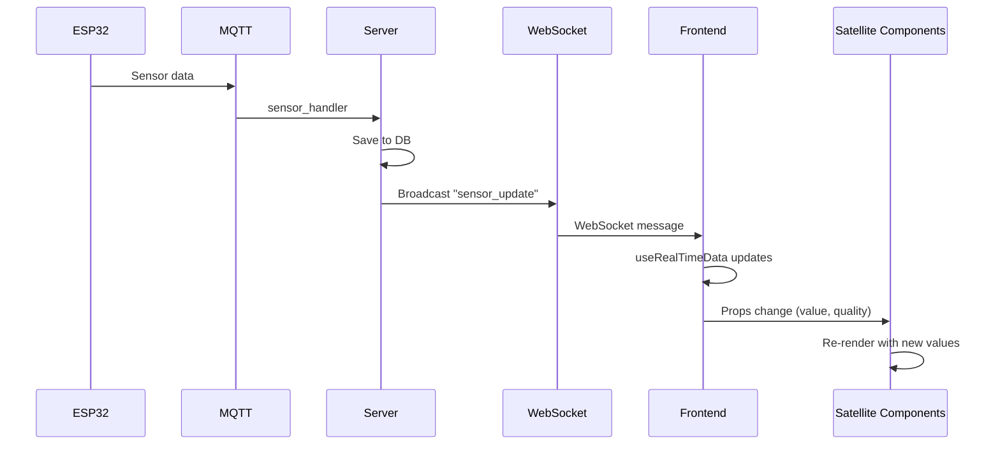

# Satelliten-Cards Flow - Frontend Perspektive

## Overview

Das Satelliten-Cards System visualisiert Sensoren und Aktoren als **kompakte Karten**, die um die zentrale ESP-Card angeordnet werden. Ergänzt durch **Connection Lines** werden logische Verbindungen zwischen Komponenten dargestellt.

**Basiert auf:** `El Frontend/Docs/UI/Vision.md` (Satelliten-Konzept)

---

## ⚠️ IST-Zustand vs. SOLL-Zustand (Code-verifiziert: 20.12.2025)

| Komponente | IST-Zustand | SOLL-Zustand | Gap |
|------------|-------------|--------------|-----|
| **SensorSatellite.vue** | ✅ 100% fertig (271 LOC) | ✅ | - |
| **ActuatorSatellite.vue** | ✅ 100% fertig (289 LOC) | ✅ | - |
| **ConnectionLines.vue** | ✅ 100% fertig (268 LOC) | ✅ | Logic-Parsing fehlt |
| **ESPCard.vue Integration** | ❌ **0%** | ✅ Satellites um Card | ⚠️ **Komplett fehlt** |
| **Orbital-Layout CSS** | ❌ **0%** | ✅ Positions-System | ⚠️ **Nicht implementiert** |
| **WebSocket sensor_data** | ❌ **Nicht subscribed** | ✅ Live-Updates | ⚠️ **Fehlt in esp.ts Store** |

### Status-Zusammenfassung

```
Komponenten:     ████████████████████████████  100%  ✅ Fertig
Integration:     ░░░░░░░░░░░░░░░░░░░░░░░░░░░░  0%    ❌ Nicht implementiert
WebSocket:       ████████░░░░░░░░░░░░░░░░░░░░  30%   🔄 Nur esp_health/status
```

**Fazit:** Die Satelliten-Komponenten existieren und sind funktionsfähig, werden aber **nirgendwo verwendet**. `ESPCard.vue` enthält keine Satelliten-Imports.

---

## Voraussetzungen

- [ ] ESP mit Sensoren/Aktoren registriert (siehe [01-boot-sequence](./01-boot-sequence-server-frontend.md))
- [ ] Frontend läuft mit WebSocket-Verbindung (siehe [06-mqtt-message-routing](./06-mqtt-message-routing-flow-server-frontend.md))
- [ ] Real-time Daten via `useRealTimeData` Composable (`src/composables/useRealTimeData.ts`)
- [ ] Optional: Logic Rules für Connection Lines (siehe [13-logic-engine-flow](./13-logic-engine-flow-server-frontend.md))

---

## Teil 1: Architektur-Übersicht

### 1.1 Komponenten-Hierarchie

```
┌─────────────────────────────────────────────────────────────┐
│                DevicesView / DeviceDetailView               │
│  ┌───────────────────────────────────────────────────────┐  │
│  │                  ConnectionLines                       │  │
│  │            (SVG Layer - Position: absolute)           │  │
│  └───────────────────────────────────────────────────────┘  │
│                                                             │
│  ┌─────────────┐        ┌─────────────┐       ┌──────────┐ │
│  │ Sensor      │        │   ESP       │       │ Actuator │ │
│  │ Satellite   │◄──────►│   Card      │◄─────►│ Satellite│ │
│  │             │        │  (Central)  │       │          │ │
│  └─────────────┘        └─────────────┘       └──────────┘ │
│                                                             │
│  ┌─────────────┐        ┌─────────────┐                    │
│  │ Sensor      │        │ Actuator    │                    │
│  │ Satellite   │        │ Satellite   │                    │
│  └─────────────┘        └─────────────┘                    │
└─────────────────────────────────────────────────────────────┘
```

### 1.2 Komponenten-Dateien

| Komponente | File | Beschreibung |
|------------|------|--------------|
| `SensorSatellite` | `src/components/esp/SensorSatellite.vue` | Sensor-Karte mit Live-Werten |
| `ActuatorSatellite` | `src/components/esp/ActuatorSatellite.vue` | Aktor-Karte mit Status |
| `ConnectionLines` | `src/components/esp/ConnectionLines.vue` | SVG-Verbindungslinien |
| `ESPCard` | `src/components/esp/ESPCard.vue` | Zentrale ESP-Übersichtskarte |

---

## Teil 2: SensorSatellite Component

### 2.1 Zweck und Features

**File:** `El Frontend/src/components/esp/SensorSatellite.vue`

**Features:**
- Live-Wert Anzeige mit Einheit
- Quality-Indikator (excellent → poor)
- Sensor-Typ-basiertes Icon
- Klick zeigt Connection Lines
- Hover-Effekte und Selektion

### 2.2 Props Interface

```typescript
interface Props {
  /** ESP ID this sensor belongs to */
  espId: string
  /** GPIO pin number */
  gpio: number
  /** Sensor type (e.g., 'DS18B20', 'pH', 'EC') */
  sensorType: string
  /** Sensor name (optional) */
  name?: string | null
  /** Current sensor value */
  value: number
  /** Quality level */
  quality: QualityLevel  // 'excellent' | 'good' | 'fair' | 'degraded' | 'poor' | 'bad'
  /** Unit (optional, will be derived from sensor type if not provided) */
  unit?: string
  /** Whether this sensor is selected/highlighted */
  selected?: boolean
  /** Whether to show connection lines on click */
  showConnections?: boolean
}
```

### 2.3 Events

```typescript
const emit = defineEmits<{
  click: [gpio: number]
  showConnections: [gpio: number]
}>()
```

### 2.4 Icon-Mapping

**Code-Location:** `SensorSatellite.vue` (Zeile 63-71)

```typescript
const sensorIcon = computed(() => {
  const iconName = sensorConfig.value.icon.toLowerCase()
  if (iconName.includes('thermometer')) return Thermometer
  if (iconName.includes('droplet') || iconName.includes('ph')) return Droplet
  if (iconName.includes('zap') || iconName.includes('ec')) return Zap
  if (iconName.includes('wind') || iconName.includes('fan')) return Wind
  if (iconName.includes('sun') || iconName.includes('light')) return Sun
  return Gauge  // Default
})
```

### 2.5 Quality Variant Mapping

```typescript
const qualityVariant = computed(() => {
  if (props.quality === 'excellent' || props.quality === 'good') return 'success'
  if (props.quality === 'fair' || props.quality === 'degraded') return 'warning'
  if (props.quality === 'poor' || props.quality === 'bad') return 'danger'
  return 'gray'
})
```

### 2.6 Template Structure

```vue
<template>
  <div class="sensor-satellite" :class="{ 'sensor-satellite--selected': selected }">
    <!-- Icon mit Quality-Color -->
    <div class="sensor-satellite__icon" :class="`sensor-satellite__icon--${qualityVariant}`">
      <component :is="sensorIcon" class="w-5 h-5" />
    </div>
    
    <!-- Content -->
    <div class="sensor-satellite__content">
      <!-- Name/Type + GPIO -->
      <div class="sensor-satellite__header">
        <span class="sensor-satellite__name">{{ name || sensorConfig.label }}</span>
        <span class="sensor-satellite__gpio">GPIO {{ gpio }}</span>
      </div>
      
      <!-- Value -->
      <div class="sensor-satellite__value">
        <span class="sensor-satellite__value-number">{{ formattedValue }}</span>
        <span class="sensor-satellite__value-unit">{{ sensorConfig.unit }}</span>
      </div>
      
      <!-- Quality Badge -->
      <Badge :variant="qualityVariant" size="xs">
        {{ qualityInfo.label }}
      </Badge>
    </div>
    
    <!-- Connection Indicator (pulsing dot) -->
    <div v-if="showConnections" class="sensor-satellite__connection-indicator" />
  </div>
</template>
```

### 2.7 Styling

```css
.sensor-satellite {
  display: flex;
  align-items: center;
  gap: 0.75rem;
  padding: 0.75rem;
  background-color: var(--color-bg-secondary);
  border: 1px solid var(--glass-border);
  border-radius: 0.5rem;
  cursor: pointer;
  min-width: 180px;
  transition: all 0.2s;
}

.sensor-satellite:hover {
  border-color: var(--color-iridescent-1);
  box-shadow: 0 2px 8px rgba(0, 0, 0, 0.1);
  transform: translateY(-1px);
}

.sensor-satellite--selected {
  border-color: var(--color-iridescent-1);
  box-shadow: 0 0 0 2px rgba(167, 139, 250, 0.2);
}
```

---

## Teil 3: ActuatorSatellite Component

### 3.1 Zweck und Features

**File:** `El Frontend/src/components/esp/ActuatorSatellite.vue`

**Features:**
- Status-Anzeige (AN/AUS/PWM%)
- Emergency-Stop Indikator
- Aktor-Typ-basiertes Icon
- Pulsierendes Icon bei aktivem Status
- Klick zeigt Connection Lines

### 3.2 Props Interface

```typescript
interface Props {
  /** ESP ID this actuator belongs to */
  espId: string
  /** GPIO pin number */
  gpio: number
  /** Actuator type (e.g., 'relay', 'pump', 'valve') */
  actuatorType: string
  /** Actuator name (optional) */
  name?: string | null
  /** Current state (ON/OFF) */
  state: boolean
  /** PWM value (0-255, if applicable) */
  pwmValue?: number
  /** Whether actuator is emergency stopped */
  emergencyStopped?: boolean
  /** Whether this actuator is selected/highlighted */
  selected?: boolean
  /** Whether to show connection lines on click */
  showConnections?: boolean
}
```

### 3.3 Status Display Logic

**Code-Location:** `ActuatorSatellite.vue` (Zeile 68-86)

```typescript
const statusDisplay = computed(() => {
  if (props.emergencyStopped) {
    return { text: 'E-STOP', variant: 'danger' as const }
  }
  
  // PWM-fähige Aktoren (Fan, PWM)
  if (props.actuatorType === 'pwm' || props.actuatorType === 'fan') {
    const pwm = props.pwmValue || 0
    const percent = Math.round((pwm / 255) * 100)
    return { 
      text: `${percent}%`, 
      variant: (pwm > 0 ? 'success' : 'gray') as const 
    }
  }
  
  // Binäre Aktoren (Relay, Pump, Valve)
  return {
    text: props.state ? 'AN' : 'AUS',
    variant: (props.state ? 'success' : 'gray') as const
  }
})
```

### 3.4 Icon-Mapping

```typescript
const actuatorIcon = computed(() => {
  const iconName = actuatorInfo.value.icon.toLowerCase()
  if (iconName.includes('toggle') || iconName.includes('power')) return Power
  if (iconName.includes('waves') || iconName.includes('pump')) return Waves
  if (iconName.includes('branch') || iconName.includes('valve')) return GitBranch
  if (iconName.includes('fan')) return Fan
  if (iconName.includes('flame') || iconName.includes('heater')) return Flame
  if (iconName.includes('lightbulb') || iconName.includes('light')) return Lightbulb
  if (iconName.includes('cog') || iconName.includes('motor')) return Cog
  return ToggleRight  // Default
})
```

### 3.5 Active State Animation

```css
.actuator-satellite--active {
  border-color: rgba(52, 211, 153, 0.3);
}

.actuator-satellite__icon--active {
  animation: pulse-icon 2s infinite;
}

@keyframes pulse-icon {
  0%, 100% { opacity: 1; }
  50% { opacity: 0.7; }
}
```

### 3.6 Emergency Stop Styling

```css
.actuator-satellite--emergency {
  border-color: rgba(248, 113, 113, 0.3);
  animation: pulse-emergency 1s infinite;
}

@keyframes pulse-emergency {
  0%, 100% { opacity: 1; }
  50% { opacity: 0.7; }
}
```

---

## Teil 4: ConnectionLines Component

### 4.1 Zweck und Features

**File:** `El Frontend/src/components/esp/ConnectionLines.vue`

**Features:**
- SVG-basierte Linien zwischen Komponenten
- Drei Linien-Typen: Logic, Cross-ESP, Internal
- Hover-Effekte mit Tooltip
- Klickbare Linien für Rule-Navigation
- Responsive ViewBox

### 4.2 Connection Interface

```typescript
interface Connection {
  /** Source ESP ID */
  sourceEspId: string
  /** Source GPIO */
  sourceGpio: number
  /** Source type: 'sensor' | 'actuator' */
  sourceType: 'sensor' | 'actuator'
  /** Target ESP ID */
  targetEspId: string
  /** Target GPIO */
  targetGpio: number
  /** Target type: 'sensor' | 'actuator' */
  targetType: 'sensor' | 'actuator'
  /** Connection type: 'logic' | 'internal' | 'cross-esp' */
  connectionType: 'logic' | 'internal' | 'cross-esp'
  /** Rule ID (if logic connection) */
  ruleId?: string
  /** Rule name (if logic connection) */
  ruleName?: string
  /** Whether connection is active */
  active?: boolean
}
```

### 4.3 Props Interface

```typescript
interface Props {
  /** Connections to draw */
  connections: Connection[]
  /** Component positions: { espId: { x, y }, gpio: { x, y } } */
  positions: Record<string, Position>
  /** Whether to show tooltips */
  showTooltips?: boolean
  /** Currently hovered connection */
  hoveredConnection?: Connection | null
}
```

### 4.4 Line Path Calculation

**Code-Location:** `ConnectionLines.vue` (Zeile 81-93)

```typescript
function getLinePath(connection: Connection): string {
  const sourcePos = props.positions[`${connection.sourceEspId}_${connection.sourceGpio}`] || 
                     props.positions[connection.sourceEspId]
  const targetPos = props.positions[`${connection.targetEspId}_${connection.targetGpio}`] || 
                    props.positions[connection.targetEspId]
  
  if (!sourcePos || !targetPos) return ''
  
  // Quadratic Bezier curve for smoother lines
  const midX = (sourcePos.x + targetPos.x) / 2
  const midY = (sourcePos.y + targetPos.y) / 2
  
  return `M ${sourcePos.x} ${sourcePos.y} Q ${midX} ${midY} ${targetPos.x} ${targetPos.y}`
}
```

### 4.5 Line Style Based on Type

```typescript
function getLineStyle(connection: Connection): {
  stroke: string
  strokeWidth: number
  strokeDasharray?: string
  opacity: number
} {
  switch (connection.connectionType) {
    case 'logic':
      return {
        stroke: 'var(--color-success)',   // Grün
        strokeWidth: 3,
        opacity: connection.active !== false ? 1 : 0.5,
      }
    case 'cross-esp':
      return {
        stroke: 'var(--color-iridescent-1)',  // Lila
        strokeWidth: 2,
        opacity: connection.active !== false ? 1 : 0.5,
      }
    case 'internal':
      return {
        stroke: 'var(--color-text-muted)',  // Grau
        strokeWidth: 1.5,
        strokeDasharray: '4 4',  // Gestrichelt
        opacity: connection.active !== false ? 1 : 0.5,
      }
  }
}
```

### 4.6 SVG Template

```vue
<template>
  <div ref="containerRef" class="connection-lines-container">
    <svg ref="svgRef" :viewBox="viewBox" class="connection-lines">
      <!-- Connection lines -->
      <g v-for="(connection, index) in connections" :key="index">
        <path
          :d="getLinePath(connection)"
          :style="getLineStyle(connection)"
          fill="none"
          :class="{ 'connection-line--hovered': hoveredConnection === connection }"
          @mouseenter="handleConnectionHover(connection)"
          @mouseleave="handleConnectionHover(null)"
          @click="handleConnectionClick(connection)"
        />
        
        <!-- Arrow marker for logic connections -->
        <circle
          v-if="connection.connectionType === 'logic'"
          :cx="targetPosition.x"
          :cy="targetPosition.y"
          r="4"
          :fill="getLineStyle(connection).stroke"
        />
      </g>
      
      <!-- Tooltip on hover -->
      <g v-if="showTooltips && hoveredConnection">
        <rect ... class="connection-tooltip-bg" />
        <text ...>{{ hoveredConnection.ruleName }}</text>
      </g>
    </svg>
  </div>
</template>
```

### 4.7 Styling

```css
.connection-lines-container {
  position: absolute;
  top: 0;
  left: 0;
  width: 100%;
  height: 100%;
  pointer-events: none;  /* Click-through */
  z-index: 1;  /* Unter den Cards */
}

.connection-lines {
  width: 100%;
  height: 100%;
  pointer-events: stroke;  /* Nur Linien klickbar */
}

.connection-line:hover {
  stroke-width: 4 !important;
  opacity: 1 !important;
}

.connection-line--hovered {
  stroke-width: 4 !important;
  filter: drop-shadow(0 0 4px currentColor);
}
```

---

## Teil 5: Datenfluss

### 5.1 Real-time Updates Flow

> **Implementierung:** `src/composables/useRealTimeData.ts` (Zeile 84-417)



**WebSocket Message Types (useRealTimeData.ts Zeile 62-65):**
```typescript
type: 'sensor' | 'actuator' | 'heartbeat' | 'state_change' | 'error' | 'zone_assignment' | 'subzone_assignment'
```

**Vollständiger Flow:** Siehe [02-sensor-reading-flow](./02-sensor-reading-flow-server-frontend.md)

### 5.2 Position Tracking for Connections

**Implementierung in Parent Component:**

```typescript
// DeviceDetailView.vue
const componentPositions = ref<Record<string, Position>>({})

// Track positions when components mount
function updatePosition(key: string, element: HTMLElement) {
  const rect = element.getBoundingClientRect()
  const containerRect = container.value?.getBoundingClientRect()
  
  if (containerRect) {
    componentPositions.value[key] = {
      x: rect.left - containerRect.left + rect.width / 2,
      y: rect.top - containerRect.top + rect.height / 2,
    }
  }
}
```

### 5.3 Connection Building

> **Hinweis:** Connection Building erfordert Logic Rules. 
> Siehe [13-logic-engine-flow](./13-logic-engine-flow-server-frontend.md) für Rule-Struktur.

```typescript
// Connections aus Logic Rules extrahieren
// LogicRule Interface: src/types/index.ts (Zeile 208-221)
const logicConnections = computed(() => {
  return logicRules.value
    .filter(rule => rule.enabled)
    .flatMap(rule => {
      // Parse conditions (LogicCondition: Zeile 223-234)
      const sensors = extractSensorsFromConditions(rule.conditions)
      // Parse actions (LogicAction: Zeile 236-247)
      const actuators = extractActuatorsFromActions(rule.actions)
      
      // Connection für jeden Sensor → Actuator
      return sensors.flatMap(sensor =>
        actuators.map(actuator => ({
          sourceEspId: sensor.sensor_esp_id,
          sourceGpio: sensor.sensor_gpio,
          sourceType: 'sensor' as const,
          targetEspId: actuator.actuator_esp_id,
          targetGpio: actuator.actuator_gpio,
          targetType: 'actuator' as const,
          connectionType: sensor.sensor_esp_id === actuator.actuator_esp_id 
            ? 'internal' 
            : 'cross-esp',
          ruleId: rule.id,
          ruleName: rule.name,
          active: true,
        }))
      )
    })
})
```

---

## Teil 6: User Experience

### 6.1 Was der User sieht

| Element | Anzeige | Bedeutung |
|---------|---------|-----------|
| **Sensor Card** | Wert + Einheit + Quality Badge | Live-Sensorwert mit Qualitätsstufe |
| **Actuator Card** | AN/AUS/PWM% Badge | Aktueller Aktor-Status |
| **Grüne Linie** | Durchgezogen, mit Pfeil | Aktive Logic Rule Verbindung |
| **Lila Linie** | Durchgezogen | Cross-ESP Verbindung |
| **Graue Linie** | Gestrichelt | Interne ESP-Verbindung |
| **Pulsierendes Icon** | Animation | Aktor ist aktiv |
| **E-STOP Badge** | Rot, pulsierend | Emergency Stop aktiv |

### 6.2 Interaktionen

| Aktion | Element | Effekt |
|--------|---------|--------|
| **Hover Sensor** | Satellite Card | Highlight, Elevation |
| **Click Sensor** | Satellite Card | Zeigt zugehörige Connection Lines |
| **Hover Line** | Connection Line | Verdickt, Tooltip mit Rule-Name |
| **Click Line** | Connection Line | Navigiert zu Logic Rule Details |

### 6.3 Quality Indicator Colors

> **Code-Referenz:** `SensorSatellite.vue` Zeile 77-82, Styles Zeile 179-197

| Quality | Icon Background | Badge Variant | Label (German) |
|---------|-----------------|---------------|----------------|
| `excellent` | Green (`rgba(52, 211, 153, 0.15)`) | `success` | Ausgezeichnet |
| `good` | Green (`rgba(52, 211, 153, 0.15)`) | `success` | Gut |
| `fair` | Yellow (`rgba(251, 191, 36, 0.15)`) | `warning` | Akzeptabel |
| `degraded`* | Yellow (`rgba(251, 191, 36, 0.15)`) | `warning` | Eingeschränkt |
| `poor` | Red (`rgba(248, 113, 113, 0.15)`) | `danger` | Schlecht |
| `bad` | Red (`rgba(248, 113, 113, 0.15)`) | `danger` | Sehr schlecht |
| `stale` | Gray | `gray` | Veraltet |
| `unknown` | Gray | `gray` | Unbekannt |

> \* `degraded` ist in `labels.ts` definiert aber nicht im TypeScript `QualityLevel` Type.

---

## Teil 7: Code-Locations Referenz

### 7.1 Frontend (TypeScript/Vue)

| Component | File | Zeilen | Beschreibung |
|-----------|------|--------|--------------|
| SensorSatellite | `src/components/esp/SensorSatellite.vue` | 1-270 | Sensor-Karte |
| ActuatorSatellite | `src/components/esp/ActuatorSatellite.vue` | 1-289 | Aktor-Karte |
| ConnectionLines | `src/components/esp/ConnectionLines.vue` | 1-269 | SVG-Linien |
| ESPCard | `src/components/esp/ESPCard.vue` | 1-415 | ESP-Hauptkarte |
| SensorValueCard | `src/components/esp/SensorValueCard.vue` | 1-335 | Detaillierte Sensor-Anzeige |
| DeviceDetailView | `src/views/DeviceDetailView.vue` | 1-864 | ESP Detail-Ansicht |

### 7.2 Utility Functions

| Function | File | Beschreibung |
|----------|------|--------------|
| `SENSOR_TYPE_CONFIG` | `src/utils/sensorDefaults.ts` | Sensor-Typ Konfigurationen (Zeile 36-190) |
| `getSensorUnit` | `src/utils/sensorDefaults.ts` | Einheit für Sensor-Typ (Zeile 197-199) |
| `getSensorLabel` | `src/utils/sensorDefaults.ts` | Label für Sensor-Typ (Zeile 224-226) |
| `formatSensorValueWithUnit` | `src/utils/sensorDefaults.ts` | Formatierung mit Einheit (Zeile 257-264) |
| `getQualityInfo` | `src/utils/labels.ts` | Quality Level Info (Zeile 26-38) |
| `getActuatorTypeInfo` | `src/utils/labels.ts` | Aktor-Typ Info (Zeile 89-101) |
| `formatNumber` | `src/utils/formatters.ts` | Zahlenformatierung (Zeile 126-139) |

### 7.2.1 Composables

| Composable | File | Beschreibung |
|------------|------|--------------|
| `useRealTimeData` | `src/composables/useRealTimeData.ts` | WebSocket Real-time Updates (Zeile 84-417) |
| `useWebSocket` | `src/composables/useWebSocket.ts` | Base WebSocket Handling |

**useRealTimeData exports:**
- `SensorUpdate` Interface (Zeile 15-21)
- `ActuatorUpdate` Interface (Zeile 23-29)
- `HeartbeatUpdate` Interface (Zeile 31-38)
- `ZoneUpdate` Interface (Zeile 40-47)
- `SubzoneUpdate` Interface (Zeile 53-60)

### 7.3 Types

**File:** `src/types/index.ts`

```typescript
// Zeile 79
export type QualityLevel = 'excellent' | 'good' | 'fair' | 'poor' | 'bad' | 'stale'

// MockSensor Interface (Zeile 81-91) - für Mock ESPs
export interface MockSensor {
  gpio: number
  sensor_type: string
  name: string | null
  subzone_id?: string | null
  raw_value: number
  unit: string
  quality: QualityLevel
  raw_mode: boolean
  last_read: string | null
}

// MockActuator Interface (Zeile 93-101) - für Mock ESPs
export interface MockActuator {
  gpio: number
  actuator_type: string
  name: string | null
  state: boolean
  pwm_value: number
  emergency_stopped: boolean
  last_command: string | null
}
```

> **Hinweis:** Die `labels.ts` unterstützt zusätzlich `'degraded'` für Quality-Labels, 
> aber der TypeScript-Type enthält es nicht. Das liegt daran, dass `'degraded'` ein 
> Alias für `'fair'` in der UI-Darstellung ist.

**Siehe auch:**
- `MockESP` Interface (Zeile 103-119) für vollständige Mock-ESP Struktur
- `SensorConfigResponse` (Zeile 280-301) für Real-ESP Sensor-Konfiguration
- `ActuatorConfigResponse` (Zeile 317-336) für Real-ESP Aktor-Konfiguration

### 7.4 Verwandte Flow-Dokumente

| Dokument | Relevanz |
|----------|----------|
| [02-sensor-reading-flow](./02-sensor-reading-flow-server-frontend.md) | Real-time Sensor Updates via WebSocket |
| [03-actuator-command-flow](./03-actuator-command-flow-server-frontend.md) | Aktor-Steuerung und Status-Updates |
| [08-zone-assignment-flow](./08-zone-assignment-flow-server-frontend.md) | Zone-Zuweisung für ESP-Cards |
| [10-subzone-safemode-pin-assignment-flow](./10-subzone-safemode-pin-assignment-flow-server-frontend.md) | Subzone-Zuweisungen |
| [13-logic-engine-flow](./13-logic-engine-flow-server-frontend.md) | Logic Rules für Connection Lines |

---

## Teil 8: Troubleshooting

### 8.1 Sensor-Wert wird nicht aktualisiert

**Mögliche Ursachen:**
1. WebSocket nicht verbunden
2. Sensor sendet keine Daten
3. ESP offline

**Debug:**
```typescript
// In useRealTimeData.ts
console.log('Sensor update:', sensorData)
```

### 8.2 Connection Lines nicht sichtbar

**Mögliche Ursachen:**
1. Keine Logic Rules vorhanden
2. Rules disabled
3. Position-Tracking fehlerhaft

**Debug:**
```typescript
console.log('Positions:', componentPositions.value)
console.log('Connections:', logicConnections.value)
```

### 8.3 Icon nicht korrekt

**Ursache:** sensor_type oder actuator_type nicht im Mapping

**Lösung:** Fallback auf Default-Icon (Gauge/ToggleRight)

---

## Teil 9: Integration mit Mock ESP

### 9.1 Mock ESP Satellites

> **Hinweis:** Es gibt aktuell **keine separate MockEspDetailView**. 
> Stattdessen wird die **unified DeviceDetailView** (`src/views/DeviceDetailView.vue`) verwendet,
> die sowohl Mock als auch Real ESPs unterstützt (Zeile 51: `isMock` computed property).

Mock ESPs nutzen dieselben Satellite-Komponenten wie echte ESPs. 
Die DeviceDetailView zeigt Sensoren/Aktoren in einer Row-basierten Ansicht (nicht als Satellites).

**Für Satellite-Darstellung würde die Integration so aussehen:**

```vue
<!-- Beispiel: SensorSatellite Integration -->
<SensorSatellite
  v-for="sensor in mockEsp.sensors"
  :key="sensor.gpio"
  :esp-id="mockEsp.esp_id"
  :gpio="sensor.gpio"
  :sensor-type="sensor.sensor_type"
  :name="sensor.name"
  :value="sensor.raw_value"
  :quality="sensor.quality"
  :unit="sensor.unit"
/>

<ActuatorSatellite
  v-for="actuator in mockEsp.actuators"
  :key="actuator.gpio"
  :esp-id="mockEsp.esp_id"
  :gpio="actuator.gpio"
  :actuator-type="actuator.actuator_type"
  :name="actuator.name"
  :state="actuator.state"
  :pwm-value="actuator.pwm_value"
  :emergency-stopped="actuator.emergency_stopped"
/>
```

**Aktuelle Implementierung in DeviceDetailView (Zeile 382-466):**
- Verwendet `.sensor-row` und `.actuator-row` CSS-Klassen
- Zeigt Sensoren mit `formatNumber()` und `getSensorUnit()` Utilities
- Quality Badge mit `getQualityLabel()` aus `labels.ts`

### 9.2 Mock-spezifische Features

Mock ESPs können:
- Sensor-Werte manuell setzen (via `setSensorValue`)
- Aktor-States manuell ändern
- Emergency Stop simulieren
- Heartbeats triggern

---

## Teil 10: Zukünftige Erweiterungen

### 10.1 Geplante Features (aus Vision.md)

- [ ] **Drag & Drop Positioning** - Satellites frei positionierbar
- [ ] **Animated Connection Lines** - Datenfluss-Animation
- [ ] **Grouping** - Satellites nach Subzone gruppieren
- [ ] **Mini-Charts** - Trend-Anzeige in Satellite Cards
- [ ] **Quick Actions** - Context Menu für schnelle Aktionen

### 10.2 Performance-Optimierungen

- [ ] **Virtual Scrolling** für viele Satellites
- [ ] **Debounced Updates** bei hoher Update-Rate
- [ ] **Lazy Loading** für Connection Line Calculation

---

## Anhang: Verifizierte Code-Referenzen

### A.1 SensorSatellite.vue - Verifizierte Struktur

| Element | Zeilen | Status |
|---------|--------|--------|
| Props Interface | 23-42 | ✅ Verifiziert |
| Events | 49-52 | ✅ Verifiziert |
| Icon Mapping | 63-71 | ✅ Verifiziert |
| Quality Variant | 77-82 | ✅ Verifiziert |
| Template | 98-140 | ✅ Verifiziert |
| Styles | 142-268 | ✅ Verifiziert |

### A.2 ActuatorSatellite.vue - Verifizierte Struktur

| Element | Zeilen | Status |
|---------|--------|--------|
| Props Interface | 19-38 | ✅ Verifiziert |
| Events | 46-49 | ✅ Verifiziert |
| Icon Mapping | 55-65 | ✅ Verifiziert |
| Status Display | 68-86 | ✅ Verifiziert |
| Template | 97-151 | ✅ Verifiziert |
| Styles | 153-287 | ✅ Verifiziert |

### A.3 ConnectionLines.vue - Verifizierte Struktur

| Element | Zeilen | Status |
|---------|--------|--------|
| Connection Interface | 16-37 | ✅ Verifiziert |
| Props Interface | 44-53 | ✅ Verifiziert |
| getLinePath | 81-94 | ✅ Verifiziert |
| getLineStyle | 97-134 | ✅ Verifiziert |
| Template | 157-223 | ✅ Verifiziert |
| Styles | 226-267 | ✅ Verifiziert |

---

## ⚠️ Anhang B: Implementierungs-Gaps (Code-Audit 20.12.2025)

### B.1 Fehlende Integration in ESPCard.vue

Die `ESPCard.vue` (413 LOC) enthält **keine Satelliten-Komponenten**:

```typescript
// NICHT vorhanden in ESPCard.vue:
import SensorSatellite from './SensorSatellite.vue'    // ❌ FEHLT
import ActuatorSatellite from './ActuatorSatellite.vue'  // ❌ FEHLT
import ConnectionLines from './ConnectionLines.vue'     // ❌ FEHLT
```

**Aktueller ESPCard-Inhalt:**
- Header mit ID + Badges
- Info-Rows (Zone, Sensoren, Aktoren - nur Counts)
- Action-Buttons (Details, Heartbeat, Safe-Mode, Delete)

**Kein Orbital-Layout, keine Satelliten!**

### B.2 Fehlende WebSocket Subscriptions

In `src/stores/esp.ts` (551 LOC):

```typescript
// IST (Zeile 42-48):
const ws = useWebSocket({
  filters: {
    types: ['esp_health', 'esp_status'],  // ❌ sensor_data fehlt!
  },
})

// SOLL:
const ws = useWebSocket({
  filters: {
    types: ['esp_health', 'esp_status', 'sensor_data', 'actuator_status'],
  },
})
```

### B.3 Nächste Schritte für Vollständige Integration

| Priorität | Task | Datei | Geschätzte Zeit |
|-----------|------|-------|-----------------|
| 🔴 1 | Satelliten-Import in ESPCard | `ESPCard.vue` | 0.5d |
| 🔴 2 | Orbital-Layout CSS | `ESPCard.vue` | 1d |
| 🔴 3 | Positions-Berechnung | `ESPCard.vue` | 1d |
| 🟡 4 | WebSocket sensor_data | `esp.ts` | 0.5d |
| 🟡 5 | WebSocket actuator_status | `esp.ts` | 0.5d |
| 🟢 6 | ConnectionLines Integration | `ESPCard.vue` | 1d |

**Gesamtaufwand:** ~4-5 Tage

---

**Letzte Verifizierung:** 20. Dezember 2025  
**Dokumentation basiert auf:** Git master branch  
**Code-Analyse durchgeführt:** 20.12.2025 (aktualisiert)

