# 🗄️ Datenbank Explorer - Vollständige UI-Dokumentation

## 🎯 Übersicht: Database Explorer View (`/database`)

Der Database Explorer ist ein umfassendes Tool für Administratoren zur direkten PostgreSQL-Datenbank-Exploration. Es ermöglicht sichere Datenbank-Interaktion mit Schema-Exploration, Query-Building und Daten-Manipulation ohne direkten Datenbankzugriff.

### **Route & Zugriff**
- **URL**: `/database`
- **Zugriffsrechte**: Admin-only (`meta: { requiresAdmin: true }`)
- **Zweck**: PostgreSQL-Datenbank direkt erkunden und Queries ausführen
- **Security**: Serverseitige Prepared Statements, Read-only für normale User

## 🔍 Layout & Design

### **Hauptlayout-Struktur**
```
┌─────────────────────────────────────────────────────────┐
│ ┌─────────────────────────────────────────────────────┐ │
│ │ [🗄️ Datenbanken] [🔄 Aktualisieren]                    │ │
│ │ PostgreSQL und Mock-Store Daten erkunden              │ │
│ └─────────────────────────────────────────────────────┘ │
│                                                         │
│ ┌─────────────────┬─────────────────────────────────────┐ │
│ │ Data Source     │ Content Area                        │ │
│ │ Tabs            │                                     │ │
│ │ ┌─────────────┐ │ ┌─────────────────────────────────┐ │ │
│ │ │ 🖥️ PostgreSQL│ │ │ Table Selector & Schema Info     │ │ │
│ │ │ 🧠 Mock Store│ │ └─────────────────────────────────┘ │ │
│ │ └─────────────┘ │                                     │ │
│ └─────────────────┼─────────────────────────────────────┘ │
│                   │ ┌─────────────────────────────────┐   │
│                   │ │ Filter Panel                     │   │
│                   │ └─────────────────────────────────┘   │
│                   │ ┌─────────────────────────────────┐   │
│                   │ │ Data Table with Results         │   │
│                   │ └─────────────────────────────────┘   │
│                   │ ┌─────────────────────────────────┐   │
│                   │ │ Pagination Controls             │   │
│                   │ └─────────────────────────────────┘   │
│                   └─────────────────────────────────────┘ │
└─────────────────────────────────────────────────────────┘
```

### **Data Source Tabs**
- **PostgreSQL Tab**: Direkter Zugriff auf PostgreSQL-Datenbanktabellen
- **Mock Store Tab**: In-Memory ESP-Daten für Entwicklung/Testing
- **Sync Status**: Zeigt Synchronisationsstatus zwischen Memory und DB (Mock Store)

### **Schema Panel**
- **Table Selector**: Dropdown mit allen verfügbaren Tabellen
- **Row Count Display**: Anzahl der Datensätze pro Tabelle (formatiert: 1.2K, 2.5M)
- **Column Info**: Technische Details (Name, Typ, Nullable, Primary Key)
- **Quick Stats**: Spalten-Anzahl und Total Rows bei Auswahl

### **Results Table**
- **Column Headers**: Sortierbare Spalten mit Typ-Indikatoren
- **Data Formatting**: Automatische Formatierung nach Datentyp
- **Row Selection**: Klick für Detailansicht
- **Value Masking**: Sensible Daten werden maskiert (***MASKED***)
- **Pagination**: Navigationssteuerung für große Datasets

### **Filter Panel**
- **Dynamic Filters**: Spalten-spezifische Filter-Operatoren
- **Type-aware Inputs**: Boolean-Selects, Date-Pickers, Number-Inputs
- **Filter Management**: Hinzufügen/Entfernen mehrerer Filter
- **Active Filter Count**: Badge mit Anzahl aktiver Filter

## 🎮 Interaktive Elemente

### **Table Selection**
```vue
<select class="input w-full pr-10 appearance-none cursor-pointer">
  <option value="" disabled>Choose a table to explore</option>
  <option v-for="table in sortedTables" :value="table.table_name">
    {{ table.table_name }} ({{ formatRowCount(table.row_count) }} rows)
  </option>
</select>
```
- **Sortierung**: Alphabetisch nach Tabellenname
- **Row Count**: Formatierte Anzeige (1K, 2.5M)
- **Loading State**: "Loading tables..." während Daten geladen werden

### **Column Filtering**
```vue
<!-- Column Selector -->
<select v-model="filter.column" class="input text-sm flex-1">
  <option v-for="col in filterableColumns" :value="col.name">
    {{ col.name }}
  </option>
</select>

<!-- Operator Selector -->
<select v-model="filter.operator" class="input text-sm w-24">
  <option v-for="op in getOperators(columnType)" :value="op.value">
    {{ op.label }}
  </option>
</select>

<!-- Type-specific Value Input -->
<input v-if="columnType === 'datetime'" type="datetime-local" />
<input v-else-if="columnType === 'boolean'" type="select">
  <option value="true">true</option>
  <option value="false">false</option>
</input>
```

**Unterstützte Operatoren nach Typ:**
- **String/UUID**: `=`, `contains`
- **Integer/Float**: `=`, `>=`, `<=`, `>`, `<`
- **Datetime**: `After` (>=), `Before` (<=)
- **Boolean**: `=`

### **Data Table Interaktionen**
```vue
<tr @click="emit('rowClick', record)" class="cursor-pointer hover:bg-dark-800/50">
  <td v-for="column in visibleColumns" class="p-3 text-sm font-mono">
    <span :class="getValueClass(record[column.name], column.type)">
      {{ formatValue(record[column.name], column.type) }}
    </span>
  </td>
  <td class="p-3">
    <button @click.stop="emit('rowClick', record)" title="View Details">
      <Eye class="w-4 h-4" />
    </button>
  </td>
</tr>
```

- **Row Hover**: Visuelles Feedback mit `hover:bg-dark-800/50`
- **Cell Formatting**: Typ-basierte Farbcodierung
- **Primary Key Detection**: Automatische PK-Spalten-Erkennung
- **Value Truncation**: Lange Werte werden abgeschnitten (>50 chars)

### **Pagination Controls**
```vue
<div class="flex items-center justify-between">
  <div class="text-sm text-dark-400">
    Showing {{ (page-1) * pageSize + 1 }} to {{ Math.min(page * pageSize, totalCount) }}
    of {{ totalCount }} results
  </div>
  <div class="flex items-center gap-2">
    <select v-model="pageSize" class="input text-sm">
      <option :value="50">50</option>
      <option :value="100">100</option>
      <option :value="500">500</option>
    </select>
    <button @click="prevPage" :disabled="page === 1">Previous</button>
    <span>{{ page }} of {{ totalPages }}</span>
    <button @click="nextPage" :disabled="page === totalPages">Next</button>
  </div>
</div>
```

## 🔗 Server-Kommunikation

### **API Endpunkte**

#### **1. Tabellen-Liste abrufen**
```typescript
GET /debug/db/tables
Response: {
  success: boolean,
  tables: TableSchema[]
}

interface TableSchema {
  table_name: string,
  columns: ColumnSchema[],
  row_count: number,
  primary_key: string
}
```

#### **2. Tabellen-Schema abrufen**
```typescript
GET /debug/db/{table}/schema
Response: TableSchema (siehe oben)
```

#### **3. Tabellen-Daten abfragen**
```typescript
GET /debug/db/{table}?page=1&page_size=50&sort_by=id&sort_order=desc&filters={...}
Query Parameters:
- page: number (default: 1)
- page_size: number (default: 50)
- sort_by: string (column name)
- sort_order: 'asc' | 'desc' (default: 'desc')
- filters: JSON string (URL-encoded)

Response: {
  success: boolean,
  table_name: string,
  data: Record<string, unknown>[],
  total_count: number,
  page: number,
  page_size: number,
  total_pages: number
}
```

#### **4. Einzelnen Datensatz abrufen**
```typescript
GET /debug/db/{table}/{id}
Response: {
  success: boolean,
  table_name: string,
  record: Record<string, unknown>
}
```

### **Security Measures**
- **Prepared Statements**: Alle Queries verwenden serverseitige Prepared Statements
- **Input Validation**: Strenge Validierung aller Eingabeparameter
- **Read-Only Mode**: Standardmäßig read-only, Schreiboperationen nur für Admins
- **Query Sanitization**: Automatische SQL-Injection Prevention
- **Column Whitelisting**: Nur definierte Spalten können abgefragt werden

### **Error Handling**
```typescript
// Axios Error Response
{
  response: {
    data: {
      detail: string // Human-readable error message
    }
  }
}

// Client Error States
store.error = "Failed to load table 'users'"
store.isLoading = false
```

## 👤 User Flows & Funktionen

### **1. Datenbank-Exploration Flow**

```mermaid
graph TD
    A[User öffnet /database] --> B[Tabellen-Liste laden]
    B --> C[User wählt Tabelle aus]
    C --> D[Schema & Beispieldaten laden]
    D --> E[User kann filtern/sortieren/paginieren]
    E --> F[User klickt auf Zeile für Details]
    F --> G[Record Detail Modal öffnet]
    G --> H[Foreign Key Navigation möglich]
```


### **2. Debugging Flow**

```mermaid
graph TD
    A[Problem identifiziert] --> B[Database Explorer öffnen]
    B --> C[Relevante Tabelle auswählen]
    C --> D[Spezifische Filter anwenden]
    D --> E[Daten direkt inspizieren]
    E --> F[Record Details prüfen]
    F --> G[Foreign Key Beziehungen folgen]
```


### **3. Data Export Flow**

```mermaid
graph TD
    A[Daten gefiltert/sortiert] --> B[Ergebnisse in Tabelle angezeigt]
    B --> C[Record Detail Modal öffnen]
    C --> D[JSON Export über Copy-Button]
    D --> E[Daten in externes Tool einfügen]
```


## 🖥️ UI-Komponenten detailliert

### **DatabaseExplorerView.vue - Hauptcontainer**
```vue
<template>
  <div class="space-y-6">
    <!-- Header -->
    <div class="flex flex-col sm:flex-row sm:items-center justify-between gap-4">
      <div>
        <h1 class="text-2xl font-bold text-dark-100 flex items-center gap-3">
          <Database class="w-7 h-7 text-purple-400" />
          Datenbanken
        </h1>
        <p class="text-sm text-dark-400 mt-1">
          PostgreSQL und Mock-Store Daten erkunden
        </p>
      </div>
      <div class="flex items-center gap-2">
        <button class="btn-secondary" @click="handleRefresh">
          <RefreshCw :class="['w-4 h-4 mr-2', store.isLoading && 'animate-spin']" />
          Aktualisieren
        </button>
      </div>
    </div>

    <!-- Data Source Tabs -->
    <div class="db-source-tabs">
      <button :class="['db-source-tab', activeSource === 'postgresql' && 'db-source-tab--active']"
              @click="activeSource = 'postgresql'">
        <HardDrive class="w-4 h-4" />
        <span>PostgreSQL</span>
        <span class="db-source-tab__count">{{ store.tables.length }} Tabellen</span>
      </button>
      <button :class="['db-source-tab', activeSource === 'mock-store' && 'db-source-tab--active']"
              @click="activeSource = 'mock-store'; loadMockStoreData()">
        <MemoryStick class="w-4 h-4" />
        <span>Mock Store</span>
        <span class="db-source-tab__count">{{ mockEspsInMemory.length }} ESPs</span>
        <span :class="['db-source-tab__sync', `db-source-tab__sync--${syncStatus.status}`]">
          <CheckCircle2 v-if="syncStatus.status === 'synced'" class="w-3 h-3" />
          <AlertTriangle v-else-if="syncStatus.status === 'warning'" class="w-3 h-3" />
        </span>
      </button>
    </div>

    <!-- PostgreSQL View -->
    <template v-if="activeSource === 'postgresql'">
      <TableSelector ... />
      <template v-if="store.currentTable">
        <SchemaInfoPanel :schema="store.currentSchema" />
        <FilterPanel ... />
        <DataTable ... />
        <Pagination ... />
      </template>
    </template>

    <!-- Mock Store View -->
    <template v-if="activeSource === 'mock-store'">
      <!-- Sync Status Info -->
      <div class="card p-4">
        <div class="flex items-center justify-between">
          <div class="flex items-center gap-3">
            <MemoryStick class="w-5 h-5 text-purple-400" />
            <div>
              <h3 class="font-medium">Mock ESP Store (In-Memory)</h3>
              <p class="text-sm text-muted">
                Simulierte ESPs im Server-RAM. Gehen bei Neustart verloren.
              </p>
            </div>
          </div>
          <div :class="['sync-status-badge', `sync-status-badge--${syncStatus.status}`]">
            <CheckCircle2 v-if="syncStatus.status === 'synced'" class="w-4 h-4" />
            <AlertTriangle v-else-if="syncStatus.status === 'warning'" class="w-4 h-4" />
            <div class="sync-status-badge__content">
              <span class="sync-status-badge__label">{{ syncStatus.message }}</span>
              <span class="sync-status-badge__detail">
                {{ syncStatus.memoryCount }} im RAM · {{ syncStatus.dbCount }} in DB
              </span>
            </div>
          </div>
        </div>
      </div>
      <DataTable v-if="mockStoreTableData.length > 0" ... />
    </template>

    <!-- Record Detail Modal -->
    <RecordDetailModal v-if="store.selectedRecord" ... />
  </div>
</template>
```

### **TableSelector.vue - Tabellen-Auswahl**
```vue
<template>
  <div class="relative">
    <label class="label text-sm text-dark-400 mb-1">Select Table</label>
    <div class="relative">
      <select class="input w-full pr-10 appearance-none cursor-pointer"
              :value="selectedTable || ''"
              :disabled="loading"
              @change="emit('select', $event.target.value)">
        <option value="" disabled>
          {{ loading ? 'Loading tables...' : 'Choose a table to explore' }}
        </option>
        <option v-for="table in sortedTables" :key="table.table_name" :value="table.table_name">
          {{ table.table_name }} ({{ formatRowCount(table.row_count) }} rows)
        </option>
      </select>
      <div class="absolute inset-y-0 right-0 flex items-center pr-3 pointer-events-none">
        <ChevronDown class="w-4 h-4 text-dark-400" />
      </div>
    </div>

    <!-- Quick stats when table is selected -->
    <div v-if="selectedTable" class="mt-2 flex items-center gap-4 text-xs text-dark-400">
      <span class="flex items-center gap-1">
        <Database class="w-3 h-3" />
        {{ tables.find(t => t.table_name === selectedTable)?.columns.length || 0 }} columns
      </span>
      <span>
        {{ formatRowCount(tables.find(t => t.table_name === selectedTable)?.row_count || 0) }} total rows
      </span>
    </div>
  </div>
</template>
```

### **DataTable.vue - Daten-Tabelle**
```vue
<template>
  <div class="card overflow-hidden">
    <div class="overflow-x-auto">
      <table class="w-full">
        <thead>
          <tr class="border-b border-dark-700">
            <th v-for="column in visibleColumns" :key="column.name"
                class="text-left p-3 text-xs font-medium text-dark-400 uppercase tracking-wider cursor-pointer hover:bg-dark-800 transition-colors"
                @click="emit('sort', column.name)">
              <div class="flex items-center gap-1">
                <span :title="column.label ? column.name : undefined">{{ column.label || column.name }}</span>
                <component :is="getSortIcon(column.name)"
                          :class="['w-3 h-3', sortBy === column.name ? 'text-purple-400' : 'text-dark-500']" />
              </div>
            </th>
            <th class="w-10 p-3"></th>
          </tr>
        </thead>
        <tbody v-if="!loading && data.length > 0">
          <tr v-for="(record, index) in data" :key="getPrimaryKeyValue(record)"
              :class="['border-b border-dark-800 hover:bg-dark-800/50 transition-colors cursor-pointer', index % 2 === 0 ? 'bg-dark-900/30' : '']"
              @click="emit('rowClick', record)">
            <td v-for="column in visibleColumns" :key="column.name" class="p-3 text-sm font-mono">
              <span :class="getValueClass(record[column.name], column.type)">
                {{ formatValue(record[column.name], column.type) }}
              </span>
            </td>
            <td class="p-3">
              <button class="p-1 rounded hover:bg-dark-700 transition-colors" title="View Details"
                      @click.stop="emit('rowClick', record)">
                <Eye class="w-4 h-4 text-dark-400" />
              </button>
            </td>
          </tr>
        </tbody>
        <tbody v-else-if="loading">
          <tr>
            <td :colspan="visibleColumns.length + 1" class="p-8 text-center text-dark-400">
              <div class="flex items-center justify-center gap-2">
                <div class="w-4 h-4 border-2 border-purple-500 border-t-transparent rounded-full animate-spin"></div>
                Loading data...
              </div>
            </td>
          </tr>
        </tbody>
        <tbody v-else>
          <tr>
            <td :colspan="visibleColumns.length + 1" class="p-8 text-center text-dark-400">
              No data found
            </td>
          </tr>
        </tbody>
      </table>
    </div>
  </div>
</template>
```

### **FilterPanel.vue - Filter-Verwaltung**
```vue
<template>
  <div class="card">
    <div class="px-4 py-3 flex items-center justify-between">
      <div class="flex items-center gap-2">
        <Filter class="w-4 h-4 text-dark-400" />
        <span class="font-medium text-dark-100 text-sm">Filters</span>
        <span v-if="hasActiveFilters" class="badge badge-primary text-xs">
          {{ Object.keys(currentFilters || {}).length }} active
        </span>
      </div>
      <div class="flex items-center gap-2">
        <button v-if="hasActiveFilters" class="btn-ghost btn-sm text-red-400" @click="clearFilters">
          <X class="w-3 h-3 mr-1" />
          Clear
        </button>
        <button class="btn-secondary btn-sm" @click="addFilter">
          <Plus class="w-3 h-3 mr-1" />
          Add Filter
        </button>
      </div>
    </div>

    <div v-if="filters.length > 0" class="px-4 pb-4 space-y-3">
      <div v-for="filter in filters" :key="filter.id" class="flex items-center gap-2">
        <!-- Column selector -->
        <select v-model="filter.column" class="input text-sm flex-1"
                @change="filter.operator = getOperators(getColumnType(filter.column))[0].value">
          <option v-for="col in filterableColumns" :key="col.name" :value="col.name">
            {{ col.name }}
          </option>
        </select>

        <!-- Operator selector -->
        <select v-model="filter.operator" class="input text-sm w-24">
          <option v-for="op in getOperators(getColumnType(filter.column))" :key="op.value" :value="op.value">
            {{ op.label }}
          </option>
        </select>

        <!-- Value input -->
        <template v-if="getColumnType(filter.column) === 'boolean'">
          <select v-model="filter.value" class="input text-sm flex-1">
            <option value="true">true</option>
            <option value="false">false</option>
          </select>
        </template>
        <template v-else-if="getColumnType(filter.column) === 'datetime'">
          <input v-model="filter.value" type="datetime-local" class="input text-sm flex-1" />
        </template>
        <template v-else>
          <input v-model="filter.value"
                 :type="getColumnType(filter.column) === 'integer' || getColumnType(filter.column) === 'float' ? 'number' : 'text'"
                 :step="getColumnType(filter.column) === 'float' ? '0.01' : undefined"
                 placeholder="Value..."
                 class="input text-sm flex-1" />
        </template>

        <!-- Remove button -->
        <button class="btn-ghost btn-sm text-red-400 p-1" @click="removeFilter(filter.id)">
          <X class="w-4 h-4" />
        </button>
      </div>

      <!-- Apply button -->
      <button class="btn-primary btn-sm w-full" @click="applyFilters">
        <Search class="w-3 h-3 mr-1" />
        Apply Filters
      </button>
    </div>
  </div>
</template>
```

### **RecordDetailModal.vue - Datensatz-Details**
```vue
<template>
  <div class="fixed inset-0 z-50 flex items-center justify-center p-4 bg-black/70">
    <div class="card w-full max-w-3xl max-h-[90vh] flex flex-col">
      <!-- Header -->
      <div class="flex items-center justify-between p-4 border-b border-dark-700">
        <div>
          <h3 class="text-lg font-semibold text-dark-100">Record Details</h3>
          <p class="text-sm text-dark-400">{{ tableName }}</p>
        </div>
        <div class="flex items-center gap-2">
          <button class="btn-secondary btn-sm" @click="copyJson">
            <component :is="copied ? Check : Copy" class="w-4 h-4 mr-1" />
            {{ copied ? 'Copied!' : 'Copy JSON' }}
          </button>
          <button class="p-2 rounded-lg hover:bg-dark-700 transition-colors" @click="emit('close')">
            <X class="w-5 h-5 text-dark-400" />
          </button>
        </div>
      </div>

      <!-- Content -->
      <div class="flex-1 overflow-y-auto p-4">
        <div class="space-y-3">
          <div v-for="(value, key) in record" :key="key"
               class="flex items-start gap-3 p-3 rounded-lg bg-dark-800/30">
            <div class="flex-1 min-w-0">
              <div class="flex items-center gap-2 mb-1">
                <span class="text-sm font-medium text-dark-200">{{ key }}</span>
                <!-- Foreign Key Link -->
                <button v-if="foreignKeyLinks.some(link => link.key === key)"
                        class="text-xs text-purple-400 hover:text-purple-300 flex items-center gap-1"
                        @click="emit('navigateToForeignKey',
                                   foreignKeyLinks.find(link => link.key === key)!.table,
                                   foreignKeyLinks.find(link => link.key === key)!.id)">
                  <ExternalLink class="w-3 h-3" />
                  Navigate
                </button>
              </div>
              <div v-if="isObject(value)" class="text-sm font-mono text-green-300 bg-dark-900 p-2 rounded overflow-x-auto">
                {{ formatValue(value) }}
              </div>
              <div v-else :class="['text-sm font-mono', getValueClass(value)]">
                {{ formatValue(value) }}
              </div>
            </div>
          </div>
        </div>
      </div>
    </div>
  </div>
</template>
```

## 🔄 Database-Exploration Interaktionen

### **Table Selection Flow**
1. **User öffnet Database Explorer** → Tabellen-Liste wird automatisch geladen
2. **User wählt Tabelle** → Schema + erste 50 Datensätze werden parallel geladen
3. **Default Sorting** → Timestamp/created_at/id Spalten werden automatisch erkannt und verwendet
4. **UI Updates** → Schema-Panel zeigt Spalten-Info, Filter-Panel wird aktiviert

### **Data Table Interaktionen**
```javascript
// Row Click Handler
function handleRowClick(record) {
  const pkColumn = store.currentSchema?.columns.find(c => c.primary_key)
  const pkValue = pkColumn ? String(record[pkColumn.name] || '') : String(record['id'] || '')

  if (pkValue) {
    store.loadRecord(pkValue) // Öffnet RecordDetailModal
  }
}
```

### **Filter Application**
1. **Filter erstellen** → Column + Operator + Value definieren
2. **Apply Filters** → Query-Parameter werden gesetzt, Page reset to 1
3. **Server Request** → Neue Query mit Filter-Parametern
4. **UI Update** → Gefilterte Ergebnisse + Filter-Counter Badge

### **Sorting Interaktionen**
```javascript
function handleSort(column) {
  if (queryParams.sort_by === column) {
    // Toggle order: asc ↔ desc
    const newOrder = queryParams.sort_order === 'asc' ? 'desc' : 'asc'
    setSort(column, newOrder)
  } else {
    // New column, default to desc
    setSort(column, 'desc')
  }
}
```

### **Foreign Key Navigation**
```javascript
// Automatische FK-Erkennung im RecordDetailModal
const foreignKeyLinks = computed(() => {
  const links = []
  for (const [key, value] of Object.entries(record)) {
    if (key.endsWith('_id') && value) {
      const tableName = key.replace('_id', '') + 's'
      links.push({ key, table: tableName, id: String(value) })
    }
  }
  return links
})
```

## 🌐 Server API Integration

### **API Client Implementation**
```typescript
// src/api/database.ts
export const databaseApi = {
  async listTables(): Promise<TableSchema[]> {
    const response = await api.get<TableListResponse>('/debug/db/tables')
    return response.data.tables
  },

  async getTableSchema(tableName: string): Promise<TableSchema> {
    const response = await api.get<TableSchema>(`/debug/db/${tableName}/schema`)
    return response.data
  },

  async queryTable(tableName: string, params: TableQueryParams = {}): Promise<TableDataResponse> {
    const queryParams = new URLSearchParams()

    if (params.page !== undefined) queryParams.set('page', params.page.toString())
    if (params.page_size !== undefined) queryParams.set('page_size', params.page_size.toString())
    if (params.sort_by) queryParams.set('sort_by', params.sort_by)
    if (params.sort_order) queryParams.set('sort_order', params.sort_order)

    if (params.filters && Object.keys(params.filters).length > 0) {
      queryParams.set('filters', JSON.stringify(params.filters))
    }

    const query = queryParams.toString()
    const url = `/debug/db/${tableName}${query ? '?' + query : ''}`

    const response = await api.get<TableDataResponse>(url)
    return response.data
  },

  async getRecord(tableName: string, recordId: string): Promise<RecordResponse> {
    const response = await api.get<RecordResponse>(`/debug/db/${tableName}/${recordId}`)
    return response.data
  }
}
```

### **Store Implementation**
```typescript
// src/stores/database.ts
export const useDatabaseStore = defineStore('database', () => {
  // State
  const tables = ref<TableSchema[]>([])
  const currentTable = ref<string | null>(null)
  const currentSchema = ref<TableSchema | null>(null)
  const currentData = ref<TableDataResponse | null>(null)
  const selectedRecord = ref<RecordResponse | null>(null)
  const isLoading = ref(false)
  const error = ref<string | null>(null)
  const queryParams = ref<TableQueryParams>({ page: 1, page_size: 50, sort_order: 'desc' })

  // Actions
  async function loadTables() {
    isLoading.value = true
    error.value = null
    try {
      tables.value = await databaseApi.listTables()
    } catch (err) {
      error.value = axiosError.response?.data?.detail || 'Failed to load tables'
      throw err
    } finally {
      isLoading.value = false
    }
  }

  async function selectTable(tableName: string) {
    currentTable.value = tableName
    queryParams.value = { page: 1, page_size: 50, sort_order: 'desc' }
    selectedRecord.value = null
    isLoading.value = true
    error.value = null

    try {
      const [schema, data] = await Promise.all([
        databaseApi.getTableSchema(tableName),
        databaseApi.queryTable(tableName, queryParams.value)
      ])

      currentSchema.value = schema
      currentData.value = data

      // Auto-detect sort column
      if (schema.columns.length > 0) {
        const timestampCol = schema.columns.find(c => c.name === 'timestamp')
        const createdAtCol = schema.columns.find(c => c.name === 'created_at')
        const idCol = schema.columns.find(c => c.primary_key)

        if (timestampCol) queryParams.value.sort_by = 'timestamp'
        else if (createdAtCol) queryParams.value.sort_by = 'created_at'
        else if (idCol) queryParams.value.sort_by = idCol.name
      }
    } catch (err) {
      error.value = `Failed to load table '${tableName}'`
      throw err
    } finally {
      isLoading.value = false
    }
  }

  // ... weitere Actions (setPage, setFilters, toggleSort, etc.)
})
```

### **Error Handling & Security**
```typescript
// Serverseitige Prepared Statements (Backend)
@app.get("/debug/db/{table_name}")
async def query_table(table_name: str, ...):
    # Validate table_name exists
    if table_name not in allowed_tables:
        raise HTTPException(404, "Table not found")

    # Build query with prepared statements
    query = f"SELECT * FROM {table_name}"
    params = []

    if filters:
        conditions = []
        for key, value in filters.items():
            if "__" in key:
                col, op = key.split("__", 1)
            else:
                col, op = key, "eq"

            # Validate column exists
            if col not in table_columns[table_name]:
                continue

            # Add condition with parameter
            if op == "eq":
                conditions.append(f"{col} = ?")
            elif op == "contains":
                conditions.append(f"{col} ILIKE ?")
                params.append(f"%{value}%")
            # ... weitere Operatoren

        if conditions:
            query += " WHERE " + " AND ".join(conditions)

    # Execute with prepared statement
    cursor.execute(query, params)
    results = cursor.fetchall()

    return {"success": True, "data": results, ...}
```

## 🚀 Advanced Features

### **Mock Store Integration**
```typescript
// Mock ESP Store für Entwicklung/Testing
const mockStoreColumns = [
  { name: 'esp_id', label: 'ESP-ID', type: 'text', nullable: false, primary_key: true },
  { name: 'zone_name', label: 'Zone', type: 'text', nullable: true },
  { name: 'system_state', label: 'Systemzustand', type: 'text', nullable: false },
  // ... weitere Spalten
]

const mockEspsInMemory = computed(() => {
  return espStore.devices.filter(d => {
    const deviceId = espStore.getDeviceId(d)
    return espStore.isMock(deviceId) && !isOrphaned(d)
  })
})

const syncStatus = computed(() => {
  const memoryCount = mockEspsInMemory.value.length
  const dbCount = mockEspsInDb.value.length
  const orphanedCount = dbCount - memoryCount

  if (orphanedCount > 0) {
    return { status: 'warning', message: `${orphanedCount} verwaiste Mock(s) in DB` }
  } else if (memoryCount === dbCount && memoryCount > 0) {
    return { status: 'synced', message: 'Synchronisiert' }
  }
  // ... weitere Status
})
```

### **Performance Optimierungen**
- **Lazy Loading**: Tabellen-Schema wird erst bei Bedarf geladen
- **Pagination**: Große Result-Sets werden in 50/100/500-er Blöcken geladen
- **Column Limiting**: Max. 8 Spalten werden in der Tabelle angezeigt
- **Value Truncation**: Lange Werte werden automatisch gekürzt
- **Parallel Requests**: Schema und Daten werden parallel geladen

### **Data Export Features**
```vue
<!-- RecordDetailModal Export -->
<button class="btn-secondary btn-sm" @click="copyJson">
  <component :is="copied ? Check : Copy" class="w-4 h-4 mr-1" />
  {{ copied ? 'Copied!' : 'Copy JSON' }}
</button>
```

## 🎨 Design-Spezifikationen

### **Color Coding**
```css
/* Data Type Colors */
.text-green-400 { /* Boolean true */ }
.text-red-400 { /* Boolean false */ }
.text-blue-400 { /* Numbers */ }
.text-green-300 { /* Strings */ }
.text-yellow-400 { /* Masked Values */ }
.text-purple-400 { /* Primary Keys, Foreign Keys */ }

/* Status Colors */
.text-success { color: #22c55e } /* Green */
.text-warning { color: #f59e0b } /* Amber */
.text-error { color: #ef4444 } /* Red */
```

### **Icons & Visual Elements**
- **Database**: Haupt-Icon für Database Explorer
- **HardDrive**: PostgreSQL Data Source
- **MemoryStick**: Mock Store Data Source
- **RefreshCw**: Aktualisieren-Button (mit Spin-Animation)
- **Filter**: Filter-Panel Icon
- **Eye**: Record Details anzeigen
- **Copy**: JSON Export
- **ExternalLink**: Foreign Key Navigation
- **ArrowUp/ArrowDown/ArrowUpDown**: Sort-Indikatoren

### **Layout System**
```css
/* Card System */
.card {
  background: var(--color-bg-secondary);
  border: 1px solid var(--glass-border);
  border-radius: 0.5rem;
}

/* Button System */
.btn-primary { /* Purple background */ }
.btn-secondary { /* Dark background */ }
.btn-ghost { /* Transparent background */ }

/* Input System */
.input {
  background: var(--color-bg-tertiary);
  border: 1px solid var(--glass-border);
  border-radius: 0.375rem;
}

/* Badge System */
.badge-primary {
  background: rgba(147, 51, 234, 0.1);
  color: var(--color-primary);
}
```

### **Responsive Design**
- **Mobile**: Single-Column Layout, collapsible Panels
- **Tablet**: Two-Column Layout mit angepassten Controls
- **Desktop**: Full Layout mit allen Features

## 🔧 Technische Details

### **Database Driver Integration**
- **Backend**: Direkte PostgreSQL-Verbindung über `psycopg2`/`asyncpg`
- **Connection Pooling**: Wiederverwendung von DB-Connections
- **Query Timeout**: Maximale Query-Laufzeit (30 Sekunden)
- **Connection Limits**: Max. 10 gleichzeitige Verbindungen pro User

### **Query Sanitization**
```python
# Backend SQL Injection Prevention
def sanitize_column_name(column: str) -> str:
    """Validate column name against schema"""
    if column not in allowed_columns:
        raise ValueError(f"Invalid column: {column}")
    return column

def build_safe_query(table: str, filters: dict) -> tuple[str, list]:
    """Build parameterized query"""
    query = f"SELECT * FROM {table}"
    params = []

    if filters:
        conditions = []
        for key, value in filters.items():
            column = sanitize_column_name(key)
            conditions.append(f"{column} = ?")
            params.append(value)

        query += " WHERE " + " AND ".join(conditions)

    return query, params
```

### **Caching Strategy**
- **Schema Cache**: Tabellen-Schema wird clientseitig gecached
- **Table List Cache**: Verfügbare Tabellen werden bis zum Neuladen gecached
- **No Data Cache**: Daten werden immer frisch vom Server geladen

### **Pagination Implementation**
```typescript
// Server-side Pagination
@app.get("/debug/db/{table_name}")
async def query_table(
    table_name: str,
    page: int = 1,
    page_size: int = 50,
    sort_by: str = None,
    sort_order: str = "desc",
    filters: dict = None
):
    # Validate parameters
    if page < 1 or page_size < 1 or page_size > 1000:
        raise HTTPException(400, "Invalid pagination parameters")

    # Build query with LIMIT/OFFSET
    offset = (page - 1) * page_size
    query = f"SELECT * FROM {table_name}"

    # Add WHERE, ORDER BY clauses
    # ...

    query += f" ORDER BY {sort_by} {sort_order} LIMIT {page_size} OFFSET {offset}"

    # Execute and return paginated results
    cursor.execute(query, params)
    data = cursor.fetchall()

    # Get total count for pagination info
    count_query = f"SELECT COUNT(*) FROM {table_name}"
    cursor.execute(count_query, filter_params)
    total_count = cursor.fetchone()[0]

    return {
        "success": True,
        "data": data,
        "total_count": total_count,
        "page": page,
        "page_size": page_size,
        "total_pages": math.ceil(total_count / page_size)
    }
```

### **Error Boundaries**
```vue
<!-- Global Error Handling -->
<div v-if="store.error" class="p-4 rounded-lg bg-red-500/10 border border-red-500/30">
  <div class="flex items-start gap-3">
    <AlertCircle class="w-5 h-5 text-red-400 flex-shrink-0 mt-0.5" />
    <div>
      <p class="text-sm text-red-400">{{ store.error }}</p>
      <button class="text-xs text-red-400/70 hover:text-red-400 mt-1" @click="store.clearError()">
        Schließen
      </button>
    </div>
  </div>
</div>
```

---

**Diese Dokumentation bietet einen vollständigen Überblick über den Database Explorer und ermöglicht es Entwicklern, das System vollständig zu verstehen und zu erweitern.**
