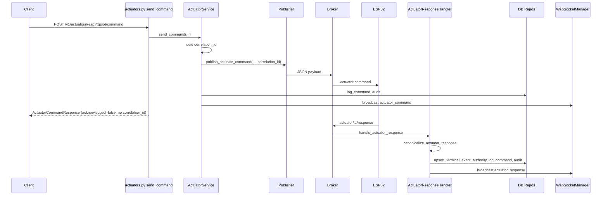
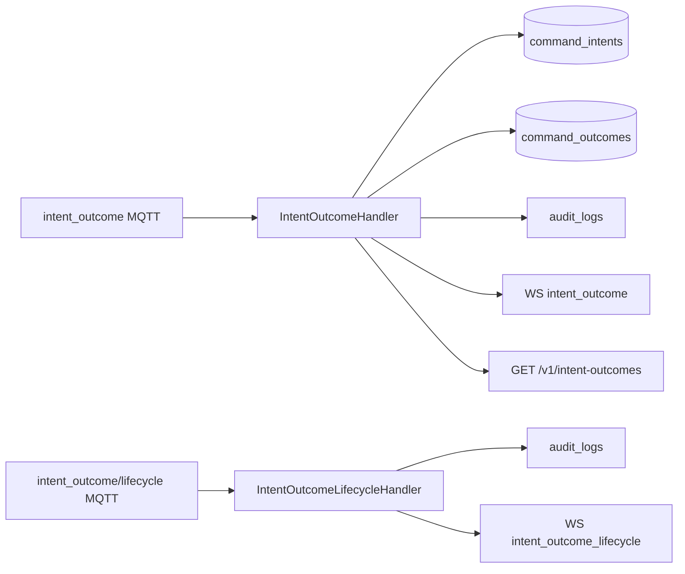

# Epic 1 — Ist-Verdrahtung: Vertrag, Korrelation, Finalität

**Datum:** 2026-04-05  
**Scope:** Reine Code-Analyse unter `El Servador/god_kaiser_server/`. Keine Firmware, kein Frontend-Code.  
**Code-Wurzel:** Repo-Relativpfad `El Servador/god_kaiser_server/`.

---

## Executive Summary

Der Server trennt drei Korrelationsmuster: (1) **Actuator-Commands** mit `correlation_id` in MQTT-Payload und synthetischer ID bei fehlender ESP-Antwort; (2) **Zone/Subzone-ACK-Warten** über `MQTTCommandBridge` mit UUID und **ausschließlich** exakter `correlation_id`-Zuordnung (**kein** FIFO-Fallback seit Epic1-04); (3) **Intent/Outcome** mit persistierten Zeilen in `command_intents` / `command_outcomes` plus dedizierter **terminal authority** in `command_outcomes` für Nicht-Intent-Events (`config_response`, `actuator_response`, `lwt`). HTTP-Finalität ist bei Aktoren und Subzones **nicht** an MQTT-ACK gekoppelt; Zonen-Zuweisung kann bei echten ESPs **synchron** auf `zone/ack` warten, sofern das ACK die serverseitige `correlation_id` echo’t.

---

## AP-A — Actuator-Command: REST → MQTT → Response → DB → WebSocket

### Endpoints (`api/v1/actuators.py`)

| Route | Methode | Body / Query | Rolle |
|--------|---------|--------------|--------|
| `/v1/actuators/{esp_id}/{gpio}/command` | POST | `ActuatorCommand`: `command`, `value`, `duration` | Normaler Befehl; ruft `ActuatorService.send_command` auf. |
| `/v1/actuators/emergency_stop` | POST | `EmergencyStopRequest`: `esp_id?`, `gpio?`, `reason` | Not-Aus; **nicht** derselbe Pfad wie normaler Command (siehe AP-B). |
| `/v1/actuators/clear_emergency` | POST | `ClearEmergencyRequest` | Kein Aktuator-Command-Payload wie AP-A; separater Kanal. |
| `/v1/actuators/{esp_id}/{gpio}` DELETE | — | — | Sendet `OFF` per `publish_actuator_command` **ohne** `correlation_id`-Parameter (Publisher-Default). |

**Codeanker:** `send_command` Handler `668:759:El Servador/god_kaiser_server/src/api/v1/actuators.py`

### `ActuatorService.send_command`

- Erzeugt **`correlation_id = str(uuid.uuid4())`** zu Beginn jedes Aufrufs.  
- **No-Op-Delta:** `_is_noop_delta` vergleicht gewünschten Befehl mit `ActuatorRepository.get_state`; bei Treffer: History-Log mit `issued_by=...:noop_delta`, **kein** MQTT-Publish, `return True`.  
- Bei Erfolg: `publisher.publish_actuator_command(..., correlation_id=correlation_id)`, danach History + Audit + WS `actuator_command`.

**Codeanker:** `46:307:El Servador/god_kaiser_server/src/services/actuator_service.py` (`send_command`)

### `Publisher.publish_actuator_command` — MQTT-Payload-Schlüssel

Aus dem Code gebaute `payload`-Dict (immer gesetzt, sofern nicht anders vermerkt):

| Schlüssel | Bedingung |
|-----------|-----------|
| `command` | `command.upper()` |
| `value` | `float` |
| `duration` | `int` |
| `timestamp` | `int(time.time())` |
| `correlation_id` | **Nur wenn** Argument `correlation_id` gesetzt ist |

**Codeanker:** `63:103:El Servador/god_kaiser_server/src/mqtt/publisher.py`

QoS: `constants.QOS_ACTUATOR_COMMAND` (Kommentar: QoS 2).

### `ActuatorCommandResponse` — Felder und Quellen im Handler

Schema: `423:455:El Servador/god_kaiser_server/src/schemas/actuator.py`

| Feld | Gesetzt in `send_command` (Handler) | Quelle / Semantik |
|------|-------------------------------------|-------------------|
| `success` | `True` | Immer bei Erreichen der Response (nach `send_command` ok). |
| `esp_id`, `gpio`, `command`, `value` | Path + Body | Request. |
| `command_sent` | `True` | Literal; **kein** Abgleich mit tatsächlichem Broker-ACK auf Protokollebene. |
| `acknowledged` | `False` | Literal; Kommentar: „ACK is async via MQTT“. |
| `safety_warnings` | `[]` | Literal **leer** — Warnungen aus `SafetyService` werden hier **nicht** durchgereicht (sie werden in `ActuatorService` nur geloggt und in History-`metadata` bei Erfolg abgelegt). |
| `correlation_id` | **Nicht** im Response-Model | **Nicht implementiert** in REST-Antwort; existiert nur intern in Service/MQTT/WS. |

**Codeanker:** `750:758:El Servador/god_kaiser_server/src/api/v1/actuators.py`

### Eingehend: `actuator_response_handler`

- Topic-Parsing → `canonicalize_actuator_response` (`device_response_contract.py`).  
- **`correlation_id`:** Wenn im Payload fehlt → synthetisch `missing-corr:act:{topic_esp_id}:{ts}`.  
- **Terminal authority:** `CommandContractRepository.upsert_terminal_event_authority` mit `event_class="actuator_response"`, Dedup-Key aus `correlation_id` oder Fallback `esp:…:gpio:…:cmd:…:ts:…`.  
- History: `actuator_repo.log_command` mit `issued_by="esp32_response"`.  
- Audit: nur wenn `correlation_id` truthy (nach Canonicalisierung immer String).  
- WS: `actuator_response` mit `serialize_actuator_response_event` + Contract-Felder.

**Codeanker:** `61:249:El Servador/god_kaiser_server/src/mqtt/handlers/actuator_response_handler.py`  
**Codeanker:** `210:288:El Servador/god_kaiser_server/src/services/device_response_contract.py` (`canonicalize_actuator_response`)

### Ausgehende WebSocket-Events (Actuator-Pfad)

| Event | Producer | Payload (min.) |
|-------|----------|----------------|
| `actuator_command` | `ActuatorService.send_command` nach erfolgreichem Publish | `esp_id`, `gpio`, `command`, `value`, `issued_by`, `correlation_id` |
| `actuator_command_failed` | Safety-Reject oder MQTT-Publish-Fehler | `esp_id`, `gpio`, `command`, optional `value`, `error`, `issued_by`, `correlation_id` |
| `actuator_response` | `ActuatorResponseHandler` | Basis via `serialize_actuator_response_event` (`esp_id`, `gpio`, `command`, `value`, `success`, `message`, `timestamp`, optional `correlation_id`) + `code`, `domain`, `severity`, `terminality`, `retry_policy`, `is_final`, `contract_violation`, `raw_*` |

**Codeanker:** `124:296:El Servador/god_kaiser_server/src/services/actuator_service.py`  
**Codeanker:** `46:68:El Servador/god_kaiser_server/src/services/event_contract_serializers.py` (`serialize_actuator_response_event`)  
**Codeanker:** `220:249:El Servador/god_kaiser_server/src/mqtt/handlers/actuator_response_handler.py`

### Sequenzdiagramm (Mermaid)

### Tabelle: Feld | gesetzt wo | sichtbar wo

| Feld | gesetzt wo | sichtbar wo |
|------|------------|-------------|
| `correlation_id` (echt) | `ActuatorService.send_command` | MQTT-Payload (wenn übergeben), WS `actuator_command` / `actuator_command_failed`, Audit bei Senden |
| `correlation_id` (synthetisch) | `canonicalize_actuator_response` wenn ESP weglässt | WS `actuator_response`, Terminal-Authority-Key |
| `command`, `value`, `duration`, `timestamp` | `Publisher.publish_actuator_command` | MQTT |
| `acknowledged` | HTTP: immer `False` | Nur REST-Response |
| `safety_warnings` | Schema; HTTP immer `[]` | REST; Warnungen ggf. in History-Metadata |

---

## AP-B — Emergency-Stop: REST → Safety → MQTT → Audit/WS

### Ablauf `POST /v1/actuators/emergency_stop`

1. **`incident_correlation_id = str(uuid.uuid4())`** (ein ID pro Request).  
2. **`SafetyService.emergency_stop_esp` / `emergency_stop_all`** vor Publish-Schleife.  
3. Pro Aktuator: **`publisher.publish_actuator_command(..., correlation_id=gpio_correlation_id)`** mit  
   **`gpio_correlation_id = build_emergency_actuator_correlation_id(incident_correlation_id, esp_id, gpio)`**  
   (Format `{incident}:{esp_id}:{gpio}`, JSON/MQTT-sicher). MQTT-Payload enthält damit **`correlation_id`** je GPIO.  
4. Bei Publish-Erfolg: `actuator_repo.log_command` mit `command_type="EMERGENCY_STOP"`, `metadata.incident_correlation_id`, **`metadata.correlation_id`** und **`metadata.mqtt_correlation_id`** (beide gleich dem MQTT-Payload `correlation_id`).  
5. `db.commit`, dann `AuditLogRepository.log_emergency_stop` mit `details.incident_correlation_id`.  
6. **Broadcast MQTT:** Topic `kaiser/broadcast/emergency`, JSON mit `incident_correlation_id`.  
7. **WS:** `actuator_alert` mit u.a. `incident_correlation_id`, optional `gpio`.  
8. Log-Zeile: `correlation_id=` im Text nutzt **`incident_correlation_id`**.

**Codeanker:** `850:1051:El Servador/god_kaiser_server/src/api/v1/actuators.py` (`emergency_stop`)

### Emergency vs. normaler Command (Diff)

| Aspekt | Normal (`ActuatorService.send_command`) | Emergency (`emergency_stop`) |
|--------|-------------------------------------------|------------------------------|
| MQTT pro GPIO | `correlation_id` pro Befehl | **`correlation_id`** pro GPIO (aus Incident + `esp_id` + GPIO) |
| Safety | `validate_actuator_command` | Blockade + direktes OFF |
| Request-Korrelation | UUID nur intern/WS/Audit | **`incident_correlation_id`** in History-Metadata, Audit, Broadcast, WS |
| WS-Event | `actuator_command` / `failed` | `actuator_alert` |
| Verbindung zu `actuator_response` | ESP kann normale Responses senden | Sende-`correlation_id` ist rückführbar zum Incident; Zuordnung in Responses nur wenn Firmware echo’t (sonst History/Audit) |

---

## AP-C — Zone/Subzone: `MQTTCommandBridge` und `resolve_ack`

### Datenstrukturen und Timeout

- `_pending: dict[str, asyncio.Future]` — Key = `correlation_id`.  
- `_esp_pending: dict[tuple[str, str], deque[str]]` — Key = `(esp_id, command_type)`, Tracking von `correlation_id` für `has_pending()` (kein FIFO-Matching in `resolve_ack` mehr).  
- **`DEFAULT_TIMEOUT = 15.0`** Sekunden.  
- `send_and_wait_ack`: erzeugt **`correlation_id = str(uuid4())`**, schreibt in `payload`, registriert Future, `MQTTClient.publish`, dann `asyncio.wait_for(future, timeout=...)`.  
- **`_cleanup`** entfernt ID aus beiden Strukturen (auch nach Timeout).

**Codeanker:** `31:252:El Servador/god_kaiser_server/src/services/mqtt_command_bridge.py`

### `resolve_ack` — Strategie (Epic1-04, kein FIFO)

**Aktuell** in `mqtt_command_bridge.py` (nach Entfernung des FIFO-Fallbacks):

1. **`cid`** aus `ack_data["correlation_id"]` (normalisiert als nicht-leerer String).  
2. Wenn `cid in self._pending` **und** Future nicht `done` → `set_result(ack_data)`, Return `True`.  
3. Sonst Return `False` und strukturiertes **WARNING**-Log (`ACK dropped: no correlation match`, inkl. `esp_id`, `command_type`, `pending_queue_len`).

**Folge:** Fehlt im ACK die passende UUID oder ist sie unbekannt, wird **kein** wartender HTTP-/Reconnect-Call aufgelöst — der Aufrufer endet mit **Timeout** (`MQTTACKTimeoutError`). Parallele Zuweisungen pro ESP sind damit **nicht** mehr über FIFO falsch gekoppelt; korrektes Echo der serverseitigen `correlation_id` ist **erforderlich**.

**Codeanker:** `El Servador/god_kaiser_server/src/services/mqtt_command_bridge.py` (`resolve_ack`, `extract_ack_correlation_id`)

### Aufrufer: wer übergibt `correlation_id`?

- **Nicht** der Aufrufer manuell: `send_and_wait_ack` setzt `correlation_id` immer im Payload.  
- **`ZoneService.assign_zone` / `remove_zone`:** `command_bridge.send_and_wait_ack(..., command_type="zone")`.  
- **`ZoneService._send_transferred_subzones`:** `command_type="subzone"`.  
- **`heartbeat_handler`:** Reconnect-Pfad mit `send_and_wait_ack` für Zone und Subzone (zusätzlicher Aufrufer neben Router).

**Codeanker:** `194:206:El Servador/god_kaiser_server/src/services/zone_service.py`  
**Codeanker:** `358:368:El Servador/god_kaiser_server/src/services/zone_service.py`  
**Codeanker:** `673:679:El Servador/god_kaiser_server/src/services/zone_service.py`  
**Codeanker:** `1783:1789:El Servador/god_kaiser_server/src/mqtt/handlers/heartbeat_handler.py` (Zone)  
**Codeanker:** `1823:1829:El Servador/god_kaiser_server/src/mqtt/handlers/heartbeat_handler.py` (Subzone)

### Handler: was fließt in `resolve_ack`?

- **`zone_ack_handler`:** `ack_data` enthält u. a. `status`, `zone_id`, `master_zone_id`, `esp_id`, `ts`, **`correlation_id`: `extract_ack_correlation_id(payload)`** (Top-Level + Aliase), `reason_code`.  
- **`subzone_ack_handler`:** analog mit `subzone_id`, `error_code`, **`correlation_id`** via `extract_ack_correlation_id(payload)`, `command_type="subzone"`.

**Codeanker:** `El Servador/god_kaiser_server/src/mqtt/handlers/zone_ack_handler.py` (Bridge-`resolve_ack`-Block)  
**Codeanker:** `El Servador/god_kaiser_server/src/mqtt/handlers/subzone_ack_handler.py` (Bridge-`resolve_ack`-Block)

### Zustandstabelle: pending Future → resolve → API

| Phase | Zustand |
|-------|---------|
| Nach `send_and_wait_ack` (vor ACK) | Future in `_pending[correlation_id]`; ID in `_esp_pending[(esp_id, type)]` |
| ACK mit passender `correlation_id` | Future resolved, exakte Zuordnung |
| ACK ohne / falsche `correlation_id` | **Kein** Match → `resolve_ack` = `False`, Future läuft bis Timeout; WARNING-Log |
| Timeout / Publish-Fehler | `MQTTACKTimeoutError`; `_cleanup` in `finally` |

### Subzone-REST vs. Bridge

**`SubzoneService.assign_subzone`** nutzt **kein** `MQTTCommandBridge` — fire-and-forget Publish. Bestätigung nur asynchron über `subzone/ack` + WS `subzone_assignment`.

**Codeanker:** `203:232:El Servador/god_kaiser_server/src/services/subzone_service.py`

---

## AP-D — Intent-Outcome und Lifecycle

### Registrierung in `main.py`

| Topic-Pattern | Handler |
|---------------|---------|
| `kaiser/+/esp/+/system/intent_outcome` | `intent_outcome_handler.handle_intent_outcome` |
| `kaiser/+/esp/+/system/intent_outcome/lifecycle` | `intent_outcome_lifecycle_handler.handle_intent_outcome_lifecycle` |

**Codeanker:** `300:309:El Servador/god_kaiser_server/src/main.py`  
**Codeanker:** `321:332:El Servador/god_kaiser_server/src/main.py` (`MQTTCommandBridge` + `set_command_bridge` für Zone/Subzone-ACK-Handler)

### `intent_outcome_handler`

- Pflichtfelder Validation: `intent_id`, `flow`, `outcome`, `ts` (int).  
- Fehlende `correlation_id`: synthetisch `missing-corr:{intent_id}`, Contract-Code `CONTRACT_MISSING_CORRELATION`.  
- `merge_intent_outcome_nested_data`, dann `canonicalize_intent_outcome`.  
- Persistenz: `upsert_intent`, `upsert_outcome`; bei `is_stale` Dedup → Commit und `return True` **ohne** WebSocket-Broadcast.

**Codeanker (stale-Pfad ohne WS):** `106:115:El Servador/god_kaiser_server/src/mqtt/handlers/intent_outcome_handler.py`  
- Audit `log_device_event` mit Canonical-Feldern.  
- WS: `intent_outcome` mit `serialize_intent_outcome_row(outcome_row)` + Metadaten, `correlation_id=` Parameter an `broadcast`.

**Codeanker:** `41:205:El Servador/god_kaiser_server/src/mqtt/handlers/intent_outcome_handler.py`

### `intent_outcome_lifecycle_handler`

- Pflicht: `event_type`, `schema`; `ts` optional aber validiert wenn vorhanden.  
- **Kein** `CommandContractRepository` — nur **Audit** + WS `intent_outcome_lifecycle`.

**Codeanker:** `25:107:El Servador/god_kaiser_server/src/mqtt/handlers/intent_outcome_lifecycle_handler.py`

### `intent_outcome_contract.py`

- **`CANONICAL_OUTCOMES`:** `accepted`, `rejected`, `applied`, `persisted`, `failed`, `expired`.  
- **`FINAL_OUTCOMES`:** `persisted`, `rejected`, `failed`, `expired`.  
- **`is_final`:** `outcome in FINAL_OUTCOMES` (in `canonicalize_intent_outcome`).  
- `serialize_intent_outcome_row`: gemeinsame Projektion für REST/WS.

**Codeanker:** `35:172:El Servador/god_kaiser_server/src/services/intent_outcome_contract.py`

### DB-Modelle (`db/models/command_contract.py`)

**`command_intents`:** `intent_id`, `correlation_id`, `esp_id`, `flow`, `orchestration_state` (Docstring: `accepted|sent|ack_pending`), Timestamps.

**`command_outcomes`:** `intent_id`, `correlation_id`, `esp_id`, `flow`, `outcome`, `contract_version`, `semantic_mode`, `legacy_status`, `target_status`, **`is_final`**, `code`, `reason`, `retryable`, `generation`, `seq`, `epoch`, `ttl_ms`, `ts`, `first_seen_at`, `terminal_at`.

**Codeanker:** `25:136:El Servador/god_kaiser_server/src/db/models/command_contract.py`

### `CommandContractRepository` — öffentliche Methoden (Kurz)

| Methode | Semantik (aus Code) |
|---------|---------------------|
| `upsert_intent` | Legt Intent an oder aktualisiert; `orchestration_state` = `accepted` wenn eingehendes `outcome=="accepted"`, sonst `ack_pending`. |
| `upsert_outcome` | Monotonie über `generation`/`seq`; **finality guard**: finales Outcome blockt „Rückwärts“-Updates; gibt `(row, was_stale)` zurück. |
| `upsert_terminal_event_authority` | Schreibt **terminal** für Nicht-Intent-Events in `command_outcomes` mit `intent_id = f"terminal:{event_class}:{dedup_key}"`. |
| `get_by_intent_id` | Liest eine `CommandOutcome`-Zeile nach `intent_id`. |
| `list_recent` | Filter `esp_id`, `flow`, `outcome`, sortiert nach `terminal_at` desc. |

**Codeanker:** `21:306:El Servador/god_kaiser_server/src/db/repositories/command_contract_repo.py`

### REST `GET /v1/intent-outcomes`

- Liste: Query `limit`, `esp_id`, `flow`, `outcome` → `list_recent` → `serialize_intent_outcome_row` je Zeile.  
- Detail: `/{intent_id}` → `get_by_intent_id`.

**Codeanker:** `18:49:El Servador/god_kaiser_server/src/api/v1/intent_outcomes.py`

### Diagramm: Topic → Handler → Tabellen → WS/API

### Tabelle: outcome | final im Contract? | wo entschieden

| outcome | `is_final` möglich? | Entscheidung |
|---------|---------------------|--------------|
| `accepted` | Nein (`FINAL_OUTCOMES` enthält es nicht) | `canonicalize_intent_outcome` → `is_final = outcome in FINAL_OUTCOMES` |
| `applied` | Nein | dito |
| `persisted` | Ja | dito |
| `rejected`, `failed`, `expired` | Ja | dito |

**Codeanker:** `35:44:El Servador/god_kaiser_server/src/services/intent_outcome_contract.py` (`FINAL_OUTCOMES`, `is_final`)

### M1 — Explizite Zustandsmaschine `accepted|sent|ack_pending|…`?

- **Im persistierten Intent:** Spalte `orchestration_state` dokumentiert `accepted|sent|ack_pending`, aber **`upsert_intent` setzt nur** `accepted` oder `ack_pending` — **`sent` wird im geprüften Pfad nicht gesetzt**.  
- **Antwort:** **Nein** als vollständige Maschine im Sinne der Roadmap; **fragmentarisch** über `orchestration_state` (zwei Zustände aus MQTT) + getrennte Outcome-Finalität in `command_outcomes`.

**Codeanker:** `45:50:El Servador/god_kaiser_server/src/db/models/command_contract.py` (Docstring)  
**Codeanker:** `35:36:El Servador/god_kaiser_server/src/db/repositories/command_contract_repo.py` (`next_state`)

---

## AP-E — Config-Antwort und „terminal authority“ (Querschnitt M1)

### `config_handler`

- `canonicalize_config_response` — fehlende `correlation_id` → synthetisch `missing-corr:cfg:…`.  
- **`upsert_terminal_event_authority`** mit `event_class="config_response"`, Dedup-Key aus `_build_terminal_authority_key`.  
- Bei `was_stale`: Metrik + früher Return (**keine** weiteren DB-Schritte in diesem Handlerpfad für diese Message).

**Codeanker:** `72:173:El Servador/god_kaiser_server/src/mqtt/handlers/config_handler.py` (Anfang inkl. authority)  
**Codeanker:** `110:207:El Servador/god_kaiser_server/src/services/device_response_contract.py` (`canonicalize_config_response`)

### `lwt_handler`

- Bei Statusübergang online→offline: **`upsert_terminal_event_authority`** mit `event_class="lwt"`, `outcome="offline"`, optional `correlation_id` aus Payload.  
- Danach ESP-Status, Actuator-Reset, Audit, WS `esp_health`.  
- **Kopplung zu Intent-Outcome:** **Keine** direkte Verwendung von `intent_outcome`-Tabellen; gemeinsam ist nur die **Wiederverwendung** von `command_outcomes` als Speicher für **terminal authority** über `upsert_terminal_event_authority`.

**Codeanker:** `129:160:El Servador/god_kaiser_server/src/mqtt/handlers/lwt_handler.py`

### Config/LWT vs. Intent-Outcome (ein Absatz)

Beide Welten schreiben in **`command_outcomes`**: echte Intent-Pfade nutzen `intent_id` aus der Firmware, während **Config-, Actuator-Response- und LWT-Terminalität** namespacede `intent_id`-Schlüssel (`terminal:…`) und dieselbe Monotonie-/Finalitätslogik in `upsert_terminal_event_authority` / `upsert_outcome` nutzen. **`intent_outcome` MQTT** aktualisiert zusätzlich **`command_intents`** und verbindet Audit/WS über `correlation_id`/`intent_id`.

---

## AP-F — Logic-Priorität: Schema vs. Laufzeit (I1)

### Quelle | Aussage „höhere Priorität = …“

| Quelle | Aussage |
|--------|---------|
| **`schemas/logic.py` — `LogicRuleCreate.priority`** | `description="Rule priority (1=lowest, 100=highest)"` — **größere Zahl = höhere Priorität**. |
| **`db/repositories/logic_repo.py` — `get_enabled_rules`** | Docstring: „sorted by priority (**ASC - lower priority number = higher priority**)“ + `order_by(CrossESPLogic.priority.asc())`. |
| **`services/logic/safety/conflict_manager.py`** | Klassen-Docstring: „**Höhere Priorität gewinnt (niedrigerer priority-Wert = höher)**“; Vergleich `effective_priority < existing_lock.priority` für Override. |

**Codeanker:** `296:301:El Servador/god_kaiser_server/src/schemas/logic.py`  
**Codeanker:** `43:56:El Servador/god_kaiser_server/src/db/repositories/logic_repo.py`  
**Codeanker:** `54:62:El Servador/god_kaiser_server/src/services/logic/safety/conflict_manager.py` (Strategie-Block)  
**Codeanker:** `188:206:El Servador/god_kaiser_server/src/services/logic/safety/conflict_manager.py` (Vergleich)

### Ergebnis I1

**Widerspruch bestätigt:** OpenAPI-Feldbeschreibung (`1=lowest, 100=highest`) steht im Gegensatz zu Repository-Dokumentation und `ConflictManager`, die **kleinere** Zahlen als **höhere** Ausführungs-/Konfliktpriorität behandeln. `LogicEngine` übergibt `rule.priority` an den `ConflictManager` (`grep` zeigt vielfache `rule.priority`-Nutzung, z. B. `382:395`, `533`, `591` in `logic_engine.py`).

**Codeanker (Nutzung):** `382:395:El Servador/god_kaiser_server/src/services/logic_engine.py` (beispielhaft)

---

## AP-G — Finalität und Client-sichtbare Zustände (C2, H2/K2, Kreuzcheck)

### Matrix

| Pfad | HTTP 2xx bedeutet (serverseitig) | Finalität „Gerät bestätigt“ belegbar über | Asynchroner Kanal |
|------|-----------------------------------|-------------------------------------------|-------------------|
| **Actuator REST** | Validierung + ggf. MQTT-Publish (oder No-Op ohne Publish); **kein** Warten auf ESP | `actuator/.../response` → History, `command_outcomes` terminal authority, WS `actuator_response` | MQTT Response |
| **Zone assign/remove REST** | DB-Update committed; bei echtem ESP oft **Warten** bis `zone/ack` oder Timeout | `esp_devices.zone_id` nach Handler; `ZoneAssignResponse.ack_received`; WS `zone_assignment` | MQTT `zone/ack` |
| **Subzone REST assign** | DB nach erfolgreichem Publish; **kein** Bridge-Wait | `subzone/ack` + `SubzoneService.handle_subzone_ack` / WS `subzone_assignment` | MQTT `subzone/ack` |
| **Emergency** | Safety-Blockade + GPIO-Publishes + Broadcast; **pro GPIO** deterministische `correlation_id` im Command-Payload | Kein dedizierter „Emergency-ACK“-Pfad; normale `actuator_response` möglich (Echo `correlation_id` firmware-abhängig) | MQTT Broadcast + GPIO |

### `acknowledged` / äquivalente Flags (Server)

| Stelle | Flag / Feld |
|--------|-------------|
| `ActuatorCommandResponse.acknowledged` | Immer `False` im erfolgreichen Pfad |
| `ZoneAssignResponse.ack_received` | `True` / `False` / `None` je nach Bridge/Mock |
| `ZoneRemoveResponse` | `mqtt_sent` (kein separates `ack_received` im gleichen Muster wie Assign — siehe Schema) |
| `SubzoneAssignResponse` | `mqtt_sent`, kein ACK-Flag in Response |
| Notifications / andere Domänen | Eigene `acknowledged` für Alerts — **außerhalb** Actuator-Command-Semantik |

**Codeanker Actuator:** `757:758:El Servador/god_kaiser_server/src/api/v1/actuators.py`  
**Codeanker Zone Response:** `105:152:El Servador/god_kaiser_server/src/schemas/zone.py`

### Konsistenz C2 / H2 / K2 / K3 (kurz)

- **C2/H2/K2:** REST-Actuator liefert **keine** `correlation_id` und **`acknowledged=false`**; echter Nachweis der Ausführung liegt bei MQTT/WS/DB, nicht in der POST-Antwort.  
- **K3:** Emergency nutzt **`incident_correlation_id`** in Logs, Audit, Broadcast und WS `actuator_alert`; **GPIO-Commands** tragen zusätzlich **`correlation_id`** (`incident`:`esp_id`:`gpio`) für E2E-Zuordnung und History-`mqtt_correlation_id`.

---

## Unklar / widersprüchlich

1. **Priorität Logik-Regeln:** Bestätigter Widerspruch zwischen API-Beschreibung und Laufzeit (AP-F).  
2. **`orchestration_state`:** DB-Docstring erwähnt `sent`, Setter im Repository nicht — semantische Lücke zwischen Modell-Dokumentation und Code.  
3. **Client-Korrelation:** REST-Actuator ohne `correlation_id` in Response, WS-Events mit `correlation_id` — **kein** serverseitig ausgelieferter Schlüssel für direktes HTTP↔WS-Matching ohne externe Annahmen.

---

## Inventar berührter Dateien

Sortiert, Pfade ab `god_kaiser_server/src/`:

1. `src/api/deps.py`  
2. `src/api/v1/actuators.py`  
3. `src/api/v1/intent_outcomes.py`  
4. `src/api/v1/zone.py`  
5. `src/db/models/command_contract.py`  
6. `src/db/repositories/command_contract_repo.py`  
7. `src/db/repositories/logic_repo.py`  
8. `src/main.py`  
9. `src/mqtt/handlers/actuator_response_handler.py`  
10. `src/mqtt/handlers/config_handler.py`  
11. `src/mqtt/handlers/heartbeat_handler.py`  
12. `src/mqtt/handlers/intent_outcome_handler.py`  
13. `src/mqtt/handlers/intent_outcome_lifecycle_handler.py`  
14. `src/mqtt/handlers/lwt_handler.py`  
15. `src/mqtt/handlers/subzone_ack_handler.py`  
16. `src/mqtt/handlers/zone_ack_handler.py`  
17. `src/mqtt/publisher.py`  
18. `src/schemas/actuator.py`  
19. `src/schemas/common.py`  
20. `src/schemas/logic.py`  
21. `src/schemas/zone.py`  
22. `src/services/actuator_service.py`  
23. `src/services/device_response_contract.py`  
24. `src/services/event_contract_serializers.py`  
25. `src/services/intent_outcome_contract.py`  
26. `src/services/logic_engine.py`  
27. `src/services/logic/safety/conflict_manager.py`  
28. `src/services/mqtt_command_bridge.py`  
29. `src/services/subzone_service.py`  
30. `src/services/zone_service.py`  
31. `src/api/v1/subzone.py`  
32. `src/schemas/subzone.py`

---

*Ende Bericht Epic 1 Ist-Verdrahtung.*
