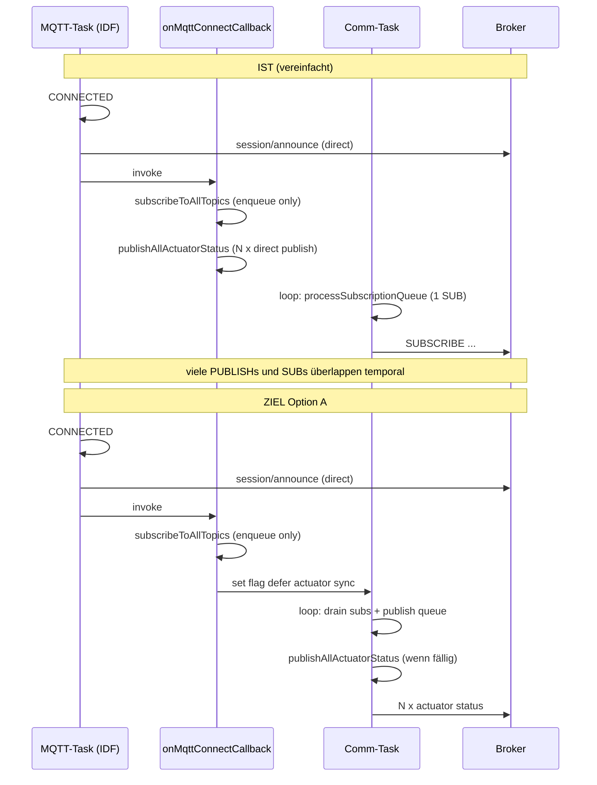

# Analyse: MQTT-Transport, Reconnect-Kette, Heartbeat/ACK und geplante Entkopplung

**Stand:** 2026-05-11  
**Kontext:** Raspberry Pi, Repo-Wurzel `/home/robin/autoone` (Firmware `El Trabajante`, Server `El Servador/god_kaiser_server`).  
**Ziel dieses Dokuments:** Die **gesamte** relevante Kette von TCP-Schreibpfad über Connect/Reconnect bis Heartbeat/Registrierung abbilden, **ohne** vorzeitig auf eine Einzelursache zu verengen; anschließend **Entkopplungsoptionen** mit **Systemwirkung** und **Konsistenz** zum bestehenden Design bewerten.

**Quellen im Repo:** `mqtt_client.cpp`, `main.cpp`, `publish_queue.*`, `actuator_manager.cpp`, `sensor_manager.cpp`, `communication_task.cpp`, `heartbeat_handler.py`, Feldanalyse `esp32-vodafone-systemanalyse` (UART/Mosquitto, extern).

---

## 1. Begriffe und Schichten

| Schicht | Was „bricht“ typischerweise | Symptom im Log |
|--------|------------------------------|----------------|
| **TCP / esp_transport** | Socket sendet nicht rechtzeitig; Puffer voll; WLAN stockt | IDF: `Writing didn't complete in specified timeout` |
| **MQTT-Client (IDF)** | Outbox, QoS-Handshake, Keepalive | `MQTT_EVENT_ERROR` TCP_TRANSPORT, danach `MQTT_EVENT_DISCONNECTED` |
| **Anwendung (Firmware)** | Bursts, falsche Task-Kontexte, Gate/ACK | `write_timeout_silent`, Queue voll, Registration Gate |

**Wichtig:** Ein Write-Timeout ist **kein** „kaputtes MQTT-Paket“, sondern ein **Transport-/Ratenproblem** (Bytes kommen nicht rechtzeitig in den Broker).

---

## 2. End-to-End-Kette nach Verbindungsaufbau (ESP-IDF-Pfad)

### 2.1 Tasks und Verantwortlichkeiten

- **MQTT-Task (ESP-IDF):** verarbeitet `MQTT_EVENT_*`, inkl. `CONNECTED`, `DATA`, `ERROR`. Priorität niedriger als Safety-Task; typisch Core 0.
- **Communication-Task (Core 0):** `wifiManager.loop()`, `mqttClient.loop()` → darin u. a. `processSubscriptionQueue()`, `processPublishQueue()`, Heartbeat-Takt; Tick **50 ms** (operational).
- **Safety-Task (Core 1):** Sensoren, Aktoren, `publishSensorReading` → ruft `MQTTClient::publish` auf → **M3:** bei Core 1 (oder im MQTT-Daten-Callback) **Enqueue** in `g_publish_queue`.

### 2.2 Sequenz: TCP verbunden → MQTT `CONNECTED`

Reihenfolge in `MQTTClient::mqtt_event_handler` bei `MQTT_EVENT_CONNECTED` (vereinfacht):

1. `g_mqtt_connected = true`, Registration Gate zurücksetzen, Subscription-Queue leeren, Write-Timeout-Zähler etc. zurücksetzen (Details siehe Code).
2. **PKG-18 / AUT-69:** `pauseForAnnounceAck` (kurzer Transport-Hold), ggf. verlängert nach Write-Timeout-Historie.
3. **`publishSessionAnnounce()`** — **direkter** `esp_mqtt_client_publish` im **MQTT-Event-Handler** (gleicher Task wie oben).
4. **`on_connect_callback_()`** → in der Firmware: `onMqttConnectCallback()` in `main.cpp`.

In `onMqttConnectCallback()`:

1. **`subscribeToAllTopics()`** — **nicht** 12 sofortige Netz-Subscribe-Aufrufe: Topics werden in die **interne Pending-Subscription-Liste** eingereiht (`queueSubscribe` → `enqueueSubscription_`). Die **tatsächlichen** `esp_mqtt_client_subscribe`-Aufrufe passieren **gestaffelt** in `MQTTClient::loop()` → `processSubscriptionQueue()` — also in der **Communication-Task**, typisch **ein Subscribe pro `loop()`-Aufruf** (sofern verbunden und fällig).
2. **Mechanismus E (nur Reconnect, nicht erster Connect):** `actuatorManager.publishAllActuatorStatus()` — siehe Abschnitt 4.
3. **`requestBootstrapHeartbeatAfterAck()`** — setzt Flags für **verzögerten** ersten Heartbeat **nach** bestätigten Subscribes auf `heartbeat/ack` und `config` (siehe Abschnitt 3).

**Kernpunkt für die Last:** Direkt im MQTT-Event nach CONNECT stehen **`session/announce`** und (bei Reconnect) **N× Aktuator-Status (QoS 1)** auf dem Schreibpfad, **während** die Subscribes erst **über die Comm-Task** nach und nach rausgehen. Das erzeugt eine **asymmetrische Lastspitze**: viele ausgehende PUBLISHs vom MQTT-Task, SUBSCRIBE-Strom aus einem anderen Task — beides teilt sich Broker, TCP und IDF-Outbox.

### 2.3 Sequenz: Subscribes und Bootstrap-Heartbeat

`processSubscriptionQueue()` (aus `loop()`):

- Sendet das **vorderste** Pending-Subscribe.
- Für `heartbeat/ack` und `config` werden `msg_id` und Bootstrap-Flags gesetzt (`[SYNC]`-Logs).

`MQTT_EVENT_SUBSCRIBED`:

- Wenn **beide** Lanes (`ack` + `config`) für die Bootstrap-Logik bereit sind → `bootstrap_heartbeat_send_pending_ = true`.

`processBootstrapHeartbeatAfterSubscribe()` (aus `loop()`):

- Ruft **`publishHeartbeat(true)`** auf — **nicht** im rohen `MQTT_EVENT_DATA`-Callback; läuft im **Comm-Task**-Kontext mit normalem `publish()`-Pfad (Core 0, kein `g_in_mqtt_event_callback`).

**Designintention (aus Kommentaren):** Write-Druck **genau** im fragilen Post-Connect-Fenster reduzieren — Heartbeat wird deshalb **hinter** die SUBSCRIBED-Bestätigungen geschoben.

### 2.4 Eingehende Daten und Publishes aus dem MQTT-Callback

Bei `MQTT_EVENT_DATA`: Nach Reassembly → `g_in_mqtt_event_callback = true` → `routeIncomingMessage(...)`.

- Jeder `mqttClient.publish(...)` aus den Handlern **während** dieses Pfads landet wegen **M3** im **Publish-Queue**-Pfad (Core-1-Regel + Callback-Regel), **nicht** als direkter `esp_mqtt_client_publish` aus dem Callback.

### 2.5 Publish-Queue-Drain (Core 0)

`processPublishQueue()`:

- Pro Comm-Tick: Budget **1** (Default) bzw. **2** bei fill≥3 und gesundem Transport (`computeAdaptivePublishDrainBudget`, AUT-481 P3); **kein** Boost bei CB OPEN, Write-Timeout oder `pauseForAnnounceAck`.
- Ziel: Bursts entlasten ohne Micro-Burst-Staus (`errno=11`) — früher fix 1/Tick (AUT-54); davor historisch 3/Tick.

**Hinweis Konsistenz:** In der Queue wird `esp_mqtt_client_publish(..., len=0, ...)` genutzt; der direkte `publish()`-Pfad setzt explizit `payload.length()` (PKG-16). Für nullterminierte Queue-Payloads ist das faktisch konsistent mit `strlen`, aber **formal asymmetrisch** — für eine spätere Härtung (nicht Gegenstand der Transport-Spitze) dokumentiert.

---

## 3. Heartbeat, Server-ACK und Registrierung („Gate“)

### 3.1 Topics und QoS (Ist-Code)

| Richtung | Topic (Schema) | Firmware | Server |
|----------|----------------|----------|--------|
| ESP → Broker | `…/system/heartbeat` | `publishHeartbeat` nutzt **QoS 0** | Handler: `handle_heartbeat` |
| Broker → ESP | `…/system/heartbeat/ack` | Subscribe **QoS 1** in `subscribeToAllTopics()` | `_send_heartbeat_ack` publiziert mit **`qos=1`** |

**Hinweis:** In `.claude/skills/mqtt-development/SKILL.md` ist `heartbeat/ack` teils als QoS 0 tabelliert — **Ist-Code ESP + Server** nutzt für den ACK **QoS 1**. Maßgeblich für diese Analyse ist der **Code**, nicht die veraltete Tabellenzeile.

### 3.2 Server: Was steckt im ACK?

`HeartbeatHandler._send_heartbeat_ack` baut u. a.:

- `status`, `config_available`, `server_time`, `handover_epoch`, `ack_type`, `contract_version`, optional `session_id`.

Kommentar im Server (`SAFETY-P5 Fix-3`): ACK kann **früh** gesendet werden (Entkopplung von schweren DB-Pfaden) — reduziert Wahrscheinlichkeit, dass der ESP lange ohne ACK bleibt, während die DB arbeitet.

**INC-EA5484-Kommentar** im `heartbeat_handler.py` (Reconnect/Subscribe-Fenster): Server-seitig wurde erkannt, dass der ESP **Zeit für QoS-Handshakes der Bootstrap-Subscribes** braucht, bevor z. B. `zone/assign` kommt — sonst TCP-Backpressure. Das stützt die These, dass **Reihenfolge und zeitliche Staffelung** zwischen Subscribes und weiterem Traffic kritisch sind.

### 3.3 ESP: Verarbeitung des ACK (`routeIncomingMessage`)

Pfad: Topic gleich `TopicBuilder::buildSystemHeartbeatAckTopic()`.

**Fail-closed:**

- JSON muss `status` und **`handover_epoch`** (numerisch, **≠ 0**) enthalten.
- `offlineModeManager.validateServerAckContract(...)` muss passieren — sonst **kein** Gate-Öffnen.

**Bei Erfolg:**

- `mqttClient.confirmRegistration()` → **`registration_confirmed_ = true`** („REGISTRATION CONFIRMED“, „Gate opened“).
- `g_last_server_ack_ms`, `offlineModeManager.onServerAckReceived`, optional NTP-Seed aus `server_time`.

**Wichtig:** Das Gate blockiert u. a. **Sensor-Publishes** (`publishSensorReading` prüft `isRegistrationConfirmed()`), nicht den Heartbeat selbst (Heartbeat-Topic ist in `publish()` explizit erlaubt).

### 3.4 Zusammenspiel Bootstrap vs. Mechanismus E

- **Bootstrap-Heartbeat:** bewusst **nach** SUBSCRIBED auf `heartbeat/ack` **und** `config`, Ausführung in **`loop()`** — konsistent mit „kein Schreibsturm im MQTT-CONNECT-Handler“.
- **Mechanismus E (`publishAllActuatorStatus` auf Reconnect):** läuft **sofort** im **`onMqttConnectCallback`**, der aus **`MQTT_EVENT_CONNECTED`** aufgerufen wird — **dasselbe** „fragile Fenster“, vor dem der Bootstrap-Heartbeat **explizit** geschützt wird.

Das ist **kein** Widerspruch in der ACK-Logik, aber ein **Widerspruch in der Transport-/Last-Disziplin** zwischen zwei bewussten Designelementen (Bootstrap defer vs. Mechanismus E sofort).

---

## 4. Schreiblast-Quellen im Reconnect-Fenster (vollständige Liste)

| Quelle | Task / Kontext | Direkt / Queue | QoS (typ.) | Bemerkung |
|--------|----------------|----------------|------------|-----------|
| `publishSessionAnnounce` | MQTT `CONNECTED` | **Direkt** | 1 | Vor `on_connect_callback_` |
| Mechanismus E `publishAllActuatorStatus` | MQTT `CONNECTED` → `onMqttConnectCallback` | **Direkt** (Core 0, nicht Callback-Flag) | 1 pro Aktor | Nur wenn `!is_first_connect` |
| Erste Subscribes | Comm-Task `loop` | `esp_mqtt_client_subscribe` | gemischt 1/2 | Gestaffelt, aber parallel zur obigen Last |
| Bootstrap `publishHeartbeat(true)` | Comm-Task `loop` | Direkt (Core 0) | 0 | Nach SUBSCRIBED |
| Sensor-Publishes | Safety Core 1 | **Queue** | 1 | Nach Gate |
| Aktuator-Responses/Alerts | typ. Core 1 / Callback | Queue / je nach Pfad | 1 | kritisch über Queue |

**Fazit:** Die **größte strukturelle Asymmetrie** ist: **Mechanismus E + session/announce** umgehen die **gleiche** Entlastungsstrategie wie M3/Drain-Budget für „Reconnect-Sync“-Telemetrie.

---

## 5. Einordnung Feldprobleme (UART / Broker)

Aus der separaten Session-Analyse (Logs `esp_uart_*`, Mosquitto):

- Wiederholtes **`Writing didn't complete in specified timeout`** → Klassifikation **`write_timeout_silent`** → **`MQTT_EVENT_DISCONNECTED`**.
- Parallel können WLAN-Symptome (`AUTH_FAIL`, `NOT_AUTHED`) und Broker-Meldungen (`session taken over`, `exceeded timeout`) auftreten.

**Kein Widerspruch:** Mehrere Ursachen können **überlagern**; die Firmware kann nur den **eigenen** Schreibpfad entlasten. Die hier geplante Entkopplung adressiert **einen belegbaren, code-nahbaren** Beitrag zur Schreiblast — ohne zu behaupten, alle Disconnects seien nur dadurch erklärt.

---

## 6. Entkopplung: Ziele und Randbedingungen

### 6.1 Ziele

1. **Konsistenz** mit bestehenden Prinzipien: „fragiles Post-Connect-Fenster“ schützen (wie bei Bootstrap-HB), **M3** wo möglich nutzen.
2. **Keine** Aufweichung des **ACK-Vertrags** (handover_epoch, fail-closed).
3. **Vorhersagbare** Server-Sicht: Aktuator-**Telemetrie** darf kurz **verzögert** sein; **Sollzustand** der Aktoren ändert sich durch Mechanismus E nicht (nur Publish von Status).

### 6.2 Hard Constraints

- **`publishAllActuatorStatus`** hält `g_actuator_mutex` und liest Treiber-Status — Aufruf muss weiterhin mit der **Mutex-Policy** kompatibel bleiben (nicht aus ISR; keine Deadlocks mit Safety-Task).
- **Server / UI:** Status kann nach Reconnect **bis zu X ms** später als heute erscheinen — X durch Scheduling (z. B. 1–3 Comm-Ticks + optional festes Minimum) bestimmbar.

---

## 7. Optionen für Entkopplung von Mechanismus E

### Option A — „Deferred flag“ (Communication-Task übernimmt Sync)

**Idee:** In `onMqttConnectCallback` **kein** `publishAllActuatorStatus()`. Stattdessen ein Flag `pending_post_reconnect_actuator_sync` + optional `deadline_ms` oder „nach N Comm-Loops“.

**Ausführung:** In `communicationTaskFunction`, **nach** `processSubscriptionQueue()` / `processPublishQueue()` (oder nach erstem erfolgreichen Bootstrap-HB), wenn Flag gesetzt und optional `millis() > reconnect_actuator_sync_after_ms`:

- `publishAllActuatorStatus()` wie heute aufrufen — dann im **Comm-Task** (Kommentar in `actuator_manager.cpp` wäre dann **korrekt**).

| Kriterium | Bewertung |
|-----------|-----------|
| Transport-Entlastung | **Hoch** — entfernt Burst aus MQTT-Event-Handler |
| Implementationsaufwand | **Gering** |
| Risiko | **Niedrig**, sofern Flag nur bei Reconnect gesetzt und nach Ausführung gelöscht wird |

### Option B — Alle Status-Publishes über `queuePublish`

**Idee:** `publishActuatorStatus` erkennt „Reconnect-Sturm-Modus“ oder generell: immer Queue.

**Problem:** `queuePublish` nutzt `strlen` für Länge — passt zu JSON-Strings; aber **8 Slots**, Shedding ab Fill ≥ 6 — bei vielen Aktoren + anderer Last könnten **Status-Messages geshed** werden, was **UI/Server** verwirrt.

| Kriterium | Bewertung |
|-----------|-----------|
| Transport | Mittel (Drain-Budget begrenzt weiterhin Ausbringen) |
| Risiko | **Mittel** (Shedding / Drops für nicht-kritische Status müssten akzeptiert oder „critical“ geflaggt werden) |

### Option C — Hybride Staffelung im MQTT-Handler mit explizitem Delay

**Idee:** `vTaskDelay` im MQTT-Handler zwischen Status-Publishes.

| Kriterium | Bewertung |
|-----------|-----------|
| Transport | Mittel |
| Risiko | **Hoch** — blockiert MQTT-Task, schlecht für Keepalive/Empfang |

**Empfehlung:** **Nicht** Option C.

### Option D — An Server-Delay angleichen

Server hat `STATE_PUSH_RECONNECT_DELAY_SECONDS = 3` und ähnliche Guards. Option A könnte optional ein **konfigurierbares** `POST_RECONNECT_ACTUATOR_STATUS_DELAY_MS` (z. B. 200–500 ms, **unter** 3 s) nutzen, um mit der **philosophie** „ESP braucht Luft nach Subscribes“ aligniert zu sein, ohne die UX spürbar zu verschlechtern.

---

## 8. Empfohlene Planrichtung (ohne bereits implementierten Patch)

**Primär:** **Option A** (Defer ins Comm-Task, nach Queue/Subscribe-Fortschritt).

**Begründung:**

- Minimale Änderung, maximale **Kohärenz** mit dem bestehenden Kommentar zum Bootstrap-Heartbeat.
- Keine Änderung am **ACK-Parsing** oder Gate-Logik.
- Klarer **Observability**-Gewinn: Kommentar in `actuator_manager.cpp` an die **tatsächlichen** Aufrufer anpassen (Reconnect vs. periodischer 30s-Timer).

**Sekundär (später):** `processPublishQueue` explizite Payload-Länge (PKG-16-Parität) — Wartbarkeit, nicht primärer Transport-Fix.

---

## 9. Systemwirkungen (explizit)

### 9.1 Firmware / Echtzeit

- **Safety:** unverändert — Mechanismus E ist **Telemetrie**, kein direkter GPIO-Befehlspfad.
- **MQTT-Task:** kürzere kritische Sektion bei `CONNECTED` → weniger Kopplung mit gleichzeitigem SUB-Strom.

### 9.2 Server / Frontend

- **Actuator-Status** kann nach MQTT-Reconnect **leicht verzögert** auftauchen (geschätzt **50–300 ms** bei 50 ms Comm-Tick + optional kleinem Delay — konkrete Zahl erst nach Implementierung messen).
- **Heartbeat-Handler** und **Full-State-Push** bleiben unabhängig; der Server verlässt sich ohnehin auf Heartbeat + eigene Delays für schwere Pfade.

### 9.3 Broker / Netz

- Weniger parallele QoS-1-PUBLISHs im Millisekundenfenster nach Session-Start → geringere Wahrscheinlichkeit für TCP-Stau und IDF-Write-Timeout — **graduell**, nicht garantiert bei schlechtem WLAN.

### 9.4 Tests / Regression

- Wokwi/Szenarien mit „REGISTRATION CONFIRMED“ und Reconnect-Pfaden erneut fahren.
- Serial: prüfen, dass `[SYNC]`-Reihenfolge (Subscribed → Bootstrap HB) **unverändert** bleibt und Mechanismus-E-Logs **zeitlich nach** ersten `loop()`-Ticks erscheinen.

---

## 10. Sequenzdiagramm (Reconnect, Ist vs. Ziel A)

**Stand Implementierung:** Option A (Defer in Comm-Task) ist seit **2026-05-11** in der Firmware umgesetzt (PKG-19); siehe Abschnitt 13.

---

## 11. Offene Punkte / Nicht Ziele dieses Dokuments

- **Keine** abschließende WLAN-/Router-Kausalfindung (AUT-352 bleibt parallel relevant).
- **Keine** Änderung der Server-ACK-Payload ohne separates Contract-Review (`contract_version`, `handover_epoch`).
- **MQTT_TOPICS.md** sollte bei Gelegenheit QoS für `heartbeat/ack` mit Code angleichen (Dokumentations-Drift).

---

## 12. Referenz-Pfade (Repo)

| Thema | Datei |
|-------|--------|
| CONNECTED + session/announce + Callback | `El Trabajante/src/services/communication/mqtt_client.cpp` |
| Mechanismus A/E/F, `subscribeToAllTopics` | `El Trabajante/src/main.cpp` |
| Publish-Queue, Shedding | `El Trabajante/src/tasks/publish_queue.cpp`, `publish_queue.h` |
| Comm-Task-Schleife | `El Trabajante/src/tasks/communication_task.cpp` |
| Aktuator-Status-Publish | `El Trabajante/src/services/actuator/actuator_manager.cpp` |
| Heartbeat + Gate | `El Trabajante/src/services/communication/mqtt_client.cpp` |
| Heartbeat ACK Routing + `confirmRegistration` | `El Trabajante/src/main.cpp` |
| Server ACK | `El Servador/god_kaiser_server/src/mqtt/handlers/heartbeat_handler.py` |

---

## 13. Implementierung PKG-19 und Feldtest (Pi, 2026-05-11)

### 13.1 Codeänderung (Minimal-Fix)

| Datei | Änderung |
|--------|----------|
| `El Trabajante/src/main.cpp` | Atomics `g_defer_post_reconnect_actuator_status` + Deadline (`millis()+250`); `processDeferredPostReconnectActuatorStatusSync()`; in `onMqttConnectCallback` bei Reconnect **kein** sofortiges `publishAllActuatorStatus()`, stattdessen Defer + Log `[SAFETY-P1] MQTT reconnected — actuator status sync scheduled (PKG-19 defer)`. |
| `El Trabajante/src/tasks/communication_task.cpp` | Nach `processPublishQueue()` Aufruf von `processDeferredPostReconnectActuatorStatusSync()` (operational, PENDING_APPROVAL, Provisioning-Zweig). |
| `El Trabajante/src/services/actuator/actuator_manager.cpp` | Kommentar an echten Aufrufer (Comm-Task / PKG-19) angepasst. |

**Build/Flash:** `pio run -e esp32_dev` und Upload auf **`/dev/ttyUSB0`** (ESP32-D0WD-V3, MAC-Kernel `…:ea:54:84` → Gerät **`ESP_EA5484`**).

### 13.2 API vs. Broker (Befehlsauslösung)

- **REST `/api/v1/auth/login`:** Auf dem Pi war **kein gültiges Admin-Passwort** in der Shell-Umgebung hinterlegt; Login mit `admin`/`admin` → `INVALID_CREDENTIALS`. Eine echte API-Kette hätte `POST …/actuators/ESP_EA5484/14/command` mit Bearer-Token erfordert.
- **Stattdessen (gleicher Broker-Pfad wie der Server):** `docker exec automationone-mqtt mosquitto_pub -h localhost -t kaiser/god/esp/ESP_EA5484/actuator/14/command -m '{"command":"ON|OFF",…}' -q 2` — **QoS 2**, ON/OFF-Wechsel alle **0,1–0,15 s**, parallel **Serial-Capture** (`stty` + `timeout cat /dev/ttyUSB0`).

Damit ist die **MQTT-Last** vergleichbar mit servergesteuerten Aktorbefehlen; nur die **REST-/Auth-Schicht** wurde wegen fehlender Zugangsdaten umgangen.

### 13.3 Drei Serial-Läufe (Rohlogs im Repo)

| Lauf | Logdatei | Dauer / Umfang | Wesentliche Beobachtung |
|------|----------|----------------|-------------------------|
| **1** | `docs/_serial_pkg19_run1.log` | Ausschnitt ab hoher Uptime | Viele `MQTT_EVENT_DISCONNECTED`, dazu **`esp-tls: couldn't get hostname for :192.168.178.60`** (URI/Konfiguration: führender Doppelpunkt vor der IP → TLS/Hostname-Pfad) und **`Host is unreachable`** nach WLAN-Problemen (`NOT_AUTHED`, `AUTH_EXPIRE`). **Kein** `Writing didn't complete` in diesem Ausschnitt; **kein** PKG-19-Log (Reconnect-Start lag vor Capture / kein sauberer Reconnect im Fenster). |
| **2** | `docs/_serial_pkg19_run2.log` | 523 Zeilen | **`MQTT_EVENT_CONNECTED`**, danach Reconnect-Kette: **`[SAFETY-P1] MQTT reconnected — actuator status sync scheduled (PKG-19 defer)`** und nach ~275 ms Uptime-Delta **`[PKG-19] Post-reconnect actuator status sync (deferred, Comm-Task)`** — bestätigt, dass der Status-Sturm **nicht mehr** im MQTT-`CONNECTED`-Callback sitzt. Ein `MQTT_EVENT_DISCONNECTED` im Fenster; **0×** `Writing didn't complete`. |
| **3** | `docs/_serial_pkg19_run3.log` | 320 Zeilen | Initial-`CONNECTED`; ein Disconnect; **kein** zweiter Reconnect mit PKG-19 mehr im Capture-Zeitraum. **0×** `Writing didn't complete`. |

### 13.4 Kurzfazit Feldtest

- **PKG-19 ist im Serial belegt** (Lauf 2): defer + Ausführung aus Comm-Task mit erwartbarem Abstand zur Reconnect-Meldung.
- **Schreib-Timeouts (`Writing didn't complete`)** traten in den drei Captures **nicht** auf; dominante Symptome in Lauf 1 waren **Broker-URI/TLS** und **WLAN**, nicht die Aktuator-Burst-Last allein.
- **Empfehlung:** Broker-URI in der NVS/Konfig prüfen (`mqtt://192.168.178.60:1883` vs. fehlerhaftes `mqtts`/Hostname-Format), dann denselben Drei-Lauf-Test mit gültigem **REST-Login** wiederholen, um 1:1 die Produktionskette abzubilden.

---

*Abschnitt 13 ergänzt nach Firmware-Implementierung PKG-19 und dreifachem Stress-Capture auf dem Raspberry Pi (`/home/robin/autoone`).*
