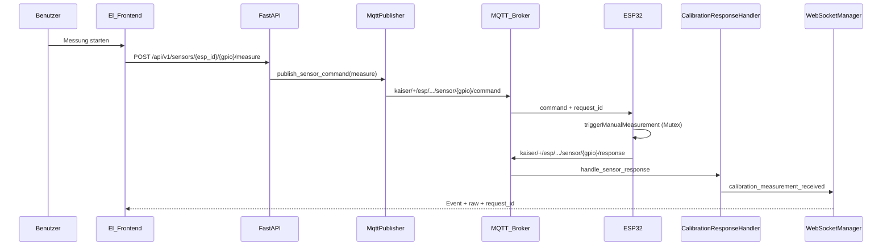
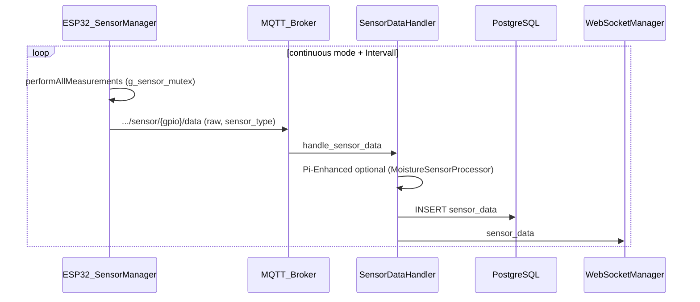

# Architektur- und Handling-Bericht: Bodenfeuchte (moisture) end-to-end

**Datum:** 2026-04-11  
**Modus:** IST-Analyse aus Code (kein Produktcode in diesem Lauf)  
**Scope:** Frontend → REST/WebSocket → MQTT → Backend-Services → PostgreSQL → ESP32-Firmware, Fokus Bodenfeuchte-Kalibrierung und -Messung.

---

## 1. Executive Summary

Ein Benutzer startet im **Kalibrier-Wizard** eine **Session** (`moisture_2point`), wählt ESP/GPIO/Sensortyp und kann **Live-Messungen** per **POST** `/api/v1/sensors/{esp_id}/{gpio}/measure` auslösen. Der Server veröffentlicht dazu ein **MQTT-Kommando** auf `kaiser/+/esp/{esp_id}/sensor/{gpio}/command` (QoS 2). Die Firmware führt eine **manuelle Messung** aus und antwortet auf `…/sensor/{gpio}/response` mit Rohwert und Korrelationsfeldern (`request_id`, `intent_id`, `correlation_id`). Der **CalibrationResponseHandler** wertet die Antwort aus und sendet **`calibration_measurement_received`** / **`failed`** per **WebSocket** an den Wizard. Kalibrierpunkte (trocken/nass) werden **nicht** automatisch aus der MQTT-Antwort persistiert: Der Nutzer bestätigt Werte, danach **POST** `/calibration/sessions/{id}/points`. Nach **finalize** und **apply** schreibt der Server ein **kanonisches** `calibration_data`-JSON in **`sensor_configs`**, typischerweise mit **`derived.dry_value` / `derived.wet_value`**.

Parallel dazu läuft im **Normalbetrieb** die **Telemetrie** über **`…/sensor/{gpio}/data`** (QoS 1): Rohwert kommt an, bei **`pi_enhanced=true`** verarbeitet der Server den Wert mit **`MoistureSensorProcessor`** (Library Loader), speichert Zeilen in **`sensor_data`** und broadcastet **`sensor_data`** per WebSocket. Damit existieren **zwei getrennte Datenpfade** (Kommando-Response vs. periodische Daten), die sich in IDs, Persistenz und Semantik unterscheiden — das ist die dominante architektonische Komplexität.

---

## 2. Begriffe und Aliase

| Begriff / UI | Kanonischer Server-Typ | Normalisierung / Ort |
|--------------|------------------------|----------------------|
| `soil_moisture` (DB, ESP-Alt) | `moisture` | `normalize_sensor_type()` in `src/sensors/sensor_type_registry.py` (`SENSOR_TYPE_MAPPING`) |
| `moisture` (Frontend-API-Body) | `moisture` | `normalizeCalibrationSensorType()` in `src/api/calibration.ts` und `useCalibrationWizard.ts` (Alias nur `soil_moisture` → `moisture`) |
| Kalibrier-Methode Feuchte | `moisture_2point` | Session-Start: `CalibrationService.start_session`, Frontend `calibrationApiMethodForSensorType()` |
| Physik-Parameter im Processor | `dry_value`, `wet_value` (ADC) | `MoistureSensorProcessor.process()`, aus `resolve_calibration_for_processor(calibration_data)` |
| Qualitätsstufen (Bodenfeuchte) | `good` / `fair` / `poor` / `error` | `MoistureSensorProcessor._assess_quality()` |

---

## 3. End-to-End-Diagramme (Mermaid)

### 3.1 Pfad A — Wizard: „Messung starten“ (HTTP → MQTT command → Response → WebSocket)

### 3.2 Pfad B — Intervall-Telemetrie (autonom, ohne Wizard)

**Hinweis:** Pfad A liefert die **Kalibrier-Rohwert-Anzeige** primär über **Response-Topic + WS**; Pfad B füllt **Zeitreihen** und Dashboard, kann aber **denselben GPIO** zeitlich überlappen — siehe Kapitel 9.

---

## 4. Frontend (Auslöser)

### 4.1 Relevante Dateien (Pfadliste)

| Pfad | Rolle |
|------|--------|
| `El Frontend/src/components/calibration/CalibrationWizard.vue` | UI, bindet `useCalibrationWizard` |
| `El Frontend/src/composables/useCalibrationWizard.ts` | Phasen, Session, Live-Messung, WS-Filter |
| `El Frontend/src/api/calibration.ts` | REST: Sessions, Punkte, finalize, apply |
| `El Frontend/src/api/sensors.ts` | `triggerMeasurement` → POST `/sensors/{esp}/{gpio}/measure` |
| `El Frontend/src/composables/useWebSocket.ts` | WS-Abonnement (über `filters.types`) |
| `El Frontend/src/composables/useCalibration.ts` | **Deprecated**, lokaler State ohne API — nur für Alt-Pfade relevant |

### 4.2 User-Events → API / WebSocket

| Aktion | API / Kanal |
|--------|-------------|
| Sensor wählen (ESP, GPIO, Typ) | rein lokal bis `selectSensor` |
| Session implizit / Messung | `calibrationApi.startSession` mit `method: moisture_2point` (bei erster Live-Messung oder vor Punkten) |
| Live-Messung | `sensorsApi.triggerMeasurement(espId, gpio)` |
| Rohwert übernimmt Wizard | WS-Events `calibration_measurement_received` / `failed`, gefiltert nach `esp_id`, `gpio`, `session_id`, **Korrelation** zu `measurementRequestId` |
| Punkt trocken/nass speichern | `calibrationApi.addPoint(sessionId, { raw_value, reference_value, point_role })` |
| Abschluss | `finalizeSession`, `applySession`, optional Polling `getSession` |

### 4.3 State (Wizard)

- **`currentSessionId`**: Server-Session-UUID.
- **`measurementRequestId`**: zuletzt von `triggerMeasurement` zurückgegebene `request_id`; wird mit WS-Payloads über `request_id` / `intent_id` / `correlation_id` / Top-Level-`correlation_id` abgeglichen (`measurementCorrelationCandidates`, `matchesActiveMeasurementRequest`).
- **`lastRawValue`**, **`measurementQuality`**, **`isFreshMeasurement`**: Anzeige nach erfolgreicher Zuordnung.

### 4.4 Warum die Frontend-Auslösung die Kette kompliziert

Die Oberfläche kombiniert **bewusst mehrere parallele Mechanismen**: (1) **Kalibrier-Session** mit serverseitigem Lebenszyklus und JSON-Punkten, (2) **On-Demand-Messung** über den **allgemeinen Sensor-Measure-Endpunkt** (gleicher MQTT-Command wie andere Features), (3) **WebSocket** mit **mehreren möglichen Korrelations-IDs**, (4) optional **laufende Telemetrie** auf demselben GPIO, die **ohne Wizard** weiter Zeilen in `sensor_data` schreibt. Der Wizard muss deshalb **Request-ID** und **Session-ID** gleichzeitig im Kopf behalten, während der Server bei der Response **keinen DB-Fallback** auf den letzten Telemetrie-Rohwert macht — sonst würden **Intervall-Messungen** fälschlich als Kalibrier-Messung erscheinen. Das ist **kein Bug**, sondern eine **Schutz-Architekturentscheidung** im `CalibrationResponseHandler`.

---

## 5. Backend (Schwerpunkt)

### 5.1 Router und Services (Überblick)

| Komponente | Pfad | Funktion |
|------------|------|----------|
| Calibration Sessions API | `src/api/v1/calibration_sessions.py` | REST unter Präfix `/v1/calibration/sessions` |
| Calibration Service | `src/services/calibration_service.py` | Session, Punkte, `finalize`, `apply`, `_compute_moisture_*` |
| Calibration Payloads | `src/services/calibration_payloads.py` | Kanonisierung, `resolve_calibration_for_processor` |
| Sensor Service | `src/services/sensor_service.py` | `trigger_measurement` → Publisher |
| Sensor Data Handler | `src/mqtt/handlers/sensor_handler.py` | Telemetrie, Pi-Enhanced, DB, WS `sensor_data` |
| Calibration Response Handler | `src/mqtt/handlers/calibration_response_handler.py` | MQTT `…/response` → WS Kalibrier-Events |
| MQTT Publisher | `src/mqtt/publisher.py` | `publish_sensor_command`, Payload mit `request_id`/`intent_id` |
| Subscriber-Registrierung | `src/main.py` | Handler-Mapping auf Topic-Patterns |

### 5.2 `CalibrationService` — Eingabe → Ausgabe (Auszug)

| Methode | Eingabe | Ausgabe / Nebenwirkung |
|---------|---------|-------------------------|
| `start_session` | `esp_id`, `gpio`, `sensor_type`, `method` (z. B. `moisture_2point`) | `CalibrationSession`; `sensor_type` wird **normalisiert**; `sensor_config_id` aus `sensor_configs` wenn vorhanden |
| `add_point` | `raw`, `reference`, `point_role` `dry`/`wet` | JSON `calibration_points.points[]` erweitert; Konkurrenzschutz via Locks / Overwrite-Arbitration |
| `finalize` | Session-ID | `_compute_calibration`; bei `moisture_2point` → `_compute_moisture` → kanonisches `calibration_result` mit `derived` |
| `apply` | Session-ID | Schreibt `sensor.calibration_data = canonicalize_calibration_data(...)`; Status `APPLIED` |

**Feuchte-Berechnung:** `_compute_moisture_from_role_points` liefert u. a. `type: moisture_2point`, `dry_value`, `wet_value`, `invert` (heuristisch: `invert = dry_raw > wet_raw`).

### 5.3 `resolve_calibration_for_processor` / `MoistureSensorProcessor`

| Schritt | Beschreibung |
|---------|--------------|
| DB-Spalte | `sensor_configs.calibration_data` (JSON) |
| Flachziehen | `resolve_calibration_for_processor`: bevorzugt `derived`, sonst Legacy-Flat |
| Verarbeitung | `MoistureSensorProcessor.process(raw_value, calibration=…, params=…)` → `value` (%), `quality`, Metadaten |

**Fallback-Pfade (explizit):**

- **Keine Kalibrierung** (`dry_value`/`wet_value` fehlen): Default-Mapping `_adc_to_moisture_default` (3200/1500).
- **`dry_value == wet_value`:** in `_adc_to_moisture_calibrated` Rückgabe 50 % (Schutz vor Division durch null), Qualität kann danach schlecht sein.
- **Validierung:** ADC außerhalb 0–4095 → `quality: error`.

### 5.4 `SensorDataHandler` (Telemetrie)

| Schritt | Bodenfeuchte-relevant |
|---------|-------------------------|
| Topic | `kaiser/+/esp/+/sensor/+/data` |
| Lookup | `sensor_repo.get_by_esp_gpio_and_type` (nach `sensor_type` aus Payload; `soil_moisture`/`moisture` als Keys in Physical Limits) |
| Pi-Enhanced | Wenn `sensor_config.pi_enhanced` und `raw_mode`: `LibraryLoader.get_processor` → `MoistureSensorProcessor.process` mit Kalibrierung |
| Range-Check | Nur bei `processing_mode == pi_enhanced"` und verarbeitetem Wert — **nicht** Roh-ADC gegen 0–100 % |
| Speicher | `sensor_repo.save_data` → Tabelle `sensor_data` |
| WS | `sensor_data` mit Display-Wert |

### 5.5 `CalibrationResponseHandler`

| Fall | Verhalten |
|------|-----------|
| `success: false` | WS `calibration_measurement_failed` |
| `raw` / `raw_value` fehlt | **Kein** „latest reading“ aus DB; WS **failed** mit erklärendem Fehlertext |
| Session aktiv | WS `calibration_measurement_received` inkl. `session_id` |
| Keine Session | Trotzdem WS `calibration_measurement_received` (Live-Anzeige), ohne Session-Bindung |

### 5.6 Nicht-Fokus (kurz)

**pH/EC** nutzen dieselbe **Session-Infrastruktur** (`linear_2point`, `offset`), dieselbe **REST-Oberfläche** und denselben **Wizard** — Unterschied liegt in `method`, Referenzwerten und `_compute_linear_2point` statt `_compute_moisture`.

---

## 6. MQTT

### 6.1 Topic-Muster (God-Kaiser, `kaiser_id` oft `+` in Subscriptions)

| Richtung | Topic (Muster) | QoS (Server-Konstanten) |
|----------|----------------|-------------------------|
| Server → ESP | `kaiser/{kaiser_id}/esp/{esp_id}/sensor/{gpio}/command` | `QOS_SENSOR_COMMAND = 2` |
| ESP → Server | `kaiser/{kaiser_id}/esp/{esp_id}/sensor/{gpio}/response` | Subscriber default 1 (Pattern ohne Sonderfall) |
| ESP → Server (Telemetrie) | `kaiser/{kaiser_id}/esp/{esp_id}/sensor/{gpio}/data` | `QOS_SENSOR_DATA = 1` |

Builder/Parser: `src/mqtt/topics.py` (`TopicBuilder`).

### 6.2 Command-Payload (Messung)

Aus `Publisher.publish_sensor_command`: `command`, `request_id`, `correlation_id`, `intent_id` (gleicher Wert wie `request_id` wenn nicht extern gesetzt), `timestamp`.

### 6.3 Response-Payload (Firmware, relevante Felder)

Aus `main.cpp` `handleSensorCommand`: `request_id`, `gpio`, `success`, `raw`, `quality`, `sensor_type`, `intent_id`, `correlation_id`, `ts`, …

### 6.4 Data-Payload (Telemetrie)

Erwartung laut `SensorDataHandler`-Docstring: `raw`/`raw_value`, `sensor_type`, `raw_mode`, ggf. `ts`/`timestamp`.

---

## 7. Firmware (Schwerpunkt)

### 7.1 Einstieg: Sensor-Kommando

| Symbol | Datei | Rolle |
|--------|-------|--------|
| `handleSensorCommand` | `El Trabajante/src/main.cpp` | Parst Topic/Payload, ruft `sensorManager.triggerManualMeasurement`, publiziert JSON auf `…/response` |
| `SensorManager::triggerManualMeasurement` | `El Trabajante/src/services/sensor/sensor_manager.cpp` | Manuelle Messung, Mutex, Timeout |
| `SensorManager::performMeasurement` / `performMeasurementForConfig` | dieselbe Datei | Liest Sensor je nach Typ; für Analog u. a. `readRawAnalog` |
| `SensorManager::readRawAnalog` | dieselbe Datei | ADC1-Hinweis, WiFi/ADC2-Konflikt, Median über Samples |
| `SensorManager::performAllMeasurements` | dieselbe Datei | **Autonomer** Zyklus; `g_sensor_mutex`; pro Sensor `operating_mode` (z. B. `on_demand` überspringt Autonom) |

### 7.2 Intervall vs. manuell vs. Modi

| Modus (`operating_mode`) | `performAllMeasurements` |
|---------------------------|----------------------------|
| `continuous` | wird im Intervall gemessen (wenn fällig) |
| `on_demand` | **keine** autonome Messung — nur MQTT-Command |
| `scheduled` | autonom ausgelassen (Server-Scheduler) |
| `paused` | immer aus |

Manuelle Messung (`triggerManualMeasurement`) nutzt **`SensorArrayMutexLock`** auf `g_sensor_mutex` mit Timeout (`MUTEX_TIMEOUT` möglich), **serialisiert** damit gegen den autonomen Loop (Kommentar SAFETY-RTOS M4).

### 7.3 Publish-Pfade

- **Manuell:** nach Messung wird Response auf `…/response` publiziert (QoS 1 in `mqttClient.publish` im gezeigten Ausschnitt).
- **Kontinuierlich:** `publishSensorReading(reading)` nach erfolgreichem `performMeasurementForConfig` im Loop.

### 7.4 Qualität ADC

`validateAdcReading` klassifiziert Randwerte (0/4095) etc.; `quality` fließt in MQTT mit.

---

## 8. Datenbank

**Hinweis:** Schema aus SQLAlchemy-Modellen / Migrationen abgeleitet (keine live DB-Abfrage in diesem Lauf).

### 8.1 Tabelle `calibration_sessions` (`src/db/models/calibration_session.py`)

| Spalte | Bedeutung |
|--------|-----------|
| `id` (UUID) | Primärschlüssel |
| `esp_id`, `gpio`, `sensor_type` | logischer Sensor (Typ **normalisiert**, z. B. `moisture`) |
| `sensor_config_id` | FK → `sensor_configs.id`, optional |
| `status` | u. a. `pending`, `collecting`, `finalizing`, `applied`, … |
| `method` | u. a. `moisture_2point` |
| `calibration_points` | JSONB: `points[]`, `history[]` |
| `calibration_result` | JSONB: kanonisches Ergebnis nach Finalize |
| `correlation_id` | optionale Korrelation |

### 8.2 Tabelle `sensor_configs` (`src/db/models/sensor.py`)

| Spalte | Bedeutung |
|--------|-----------|
| `calibration_data` | JSON — nach Apply kanonisch mit `method`, `points`, `derived`, `metadata` |
| `pi_enhanced` | steuert Server-seitige Verarbeitung eingehender **Telemetrie** |
| `sensor_metadata` | u. a. `latest_value`, `latest_timestamp`, `latest_quality` nach Datenempfang |
| `operating_mode`, `sample_interval_ms`, … | laufzeit / Modus |

### 8.3 Tabelle `sensor_data`

| Spalte | Bedeutung |
|--------|-----------|
| `raw_value`, `processed_value`, `unit`, `quality`, `processing_mode`, `timestamp` | Zeitreihe |
| `esp_id`, `gpio`, `sensor_type` | Zuordnung (inkl. Alias-Typen aus Payload) |

**Typische „latest reading“-Zugriffe:** über `sensor_configs.sensor_metadata` nach letztem MQTT-Daten-Handler-Lauf; zeitlich aggregiert über `sensor_data` mit `ORDER BY timestamp DESC` / Indizes `idx_esp_gpio_timestamp`, `idx_sensor_type_timestamp`.

### 8.4 Tabelle `esp_devices`

Geräteregistrierung, u. a. für FK von `sensor_configs.esp_id`; Online-Status wird im Mess-Trigger geprüft (`sensor_service.trigger_measurement`: ESP muss `online` sein).

---

## 9. Parallelität und Fehlerquellen (Architektur-Eigenschaften)

| Risiko | Beschreibung |
|--------|--------------|
| **ID-Korrelation** | Wizard erwartet, dass `request_id` aus REST mit MQTT/WS übereinstimmt; mehrere ID-Felder (`intent_id`, `correlation_id`) erhöhen Robustheit, erhöhen aber auch die Zordnungslogik im Frontend. |
| **Kein DB-Fallback für Rohwert** | Absicht: letzte `sensor_data`-Zeile kann von **Intervall-Telemetrie** stammen, nicht von der manuellen Messung. |
| **Parallele Messpfade** | Derselbe GPIO kann **WebSocket-Kalibrier-Rohwert** (Response) und **Dashboard-Telemetrie** (data) kurz nacheinander liefern; unterschiedliche Persistenz. |
| **Mutex / Timing Firmware** | Autonomer Loop und manuelle Messung teilen sich `g_sensor_mutex`; bei Konflikt Abbruch mit `MUTEX_TIMEOUT`. |
| **Pi-Enhanced vs. Wizard** | Wizard nutzt primär **Response-Rohwert**; Telemetrie-Pipeline aktualisiert parallel `sensor_data` und Dashboard-WS. |

---

## 10. Anhang — Datei- und Symbol-Index

Alphabetisch nach Pfad (Auswahl; ≥ 15 Einträge):

| Symbol / Export | Datei |
|-----------------|--------|
| `calibrationApi`, `normalizeCalibrationSensorType` | `El Frontend/src/api/calibration.ts` |
| `useCalibrationWizard`, `triggerLiveMeasurement` | `El Frontend/src/composables/useCalibrationWizard.ts` |
| `sensorsApi.triggerMeasurement` | `El Frontend/src/api/sensors.ts` |
| `CalibrationWizard.vue` | `El Frontend/src/components/calibration/CalibrationWizard.vue` |
| `CalibrationService`, `_compute_moisture_from_role_points` | `El Servador/god_kaiser_server/src/services/calibration_service.py` |
| `canonicalize_calibration_data`, `resolve_calibration_for_processor` | `El Servador/god_kaiser_server/src/services/calibration_payloads.py` |
| `SensorService.trigger_measurement` | `El Servador/god_kaiser_server/src/services/sensor_service.py` |
| `SensorDataHandler`, `handle_sensor_data`, `_trigger_pi_enhanced_processing` | `El Servador/god_kaiser_server/src/mqtt/handlers/sensor_handler.py` |
| `CalibrationResponseHandler`, `handle_sensor_response` | `El Servador/god_kaiser_server/src/mqtt/handlers/calibration_response_handler.py` |
| `Publisher.publish_sensor_command` | `El Servador/god_kaiser_server/src/mqtt/publisher.py` |
| `TopicBuilder` (sensor command/data/response) | `El Servador/god_kaiser_server/src/mqtt/topics.py` |
| `Subscriber.register_handler` (Patterns) | `El Servador/god_kaiser_server/src/mqtt/subscriber.py` |
| MQTT-Handler-Registrierung | `El Servador/god_kaiser_server/src/main.py` |
| `normalize_sensor_type`, `SENSOR_TYPE_MAPPING` | `El Servador/god_kaiser_server/src/sensors/sensor_type_registry.py` |
| `MoistureSensorProcessor` | `El Servador/god_kaiser_server/src/sensors/sensor_libraries/active/moisture.py` |
| `LibraryLoader.get_processor` | `El Servador/god_kaiser_server/src/sensors/library_loader.py` |
| `CalibrationSession`, `CalibrationStatus` | `El Servador/god_kaiser_server/src/db/models/calibration_session.py` |
| `SensorConfig`, `SensorData` | `El Servador/god_kaiser_server/src/db/models/sensor.py` |
| `handleSensorCommand` | `El Trabajante/src/main.cpp` |
| `SensorManager::triggerManualMeasurement`, `performAllMeasurements`, `readRawAnalog` | `El Trabajante/src/services/sensor/sensor_manager.cpp` |
| `TopicBuilder::buildSensorResponseTopic` | `El Trabajante/src/utils/topic_builder.cpp` |

---

*Ende des Berichts.*
