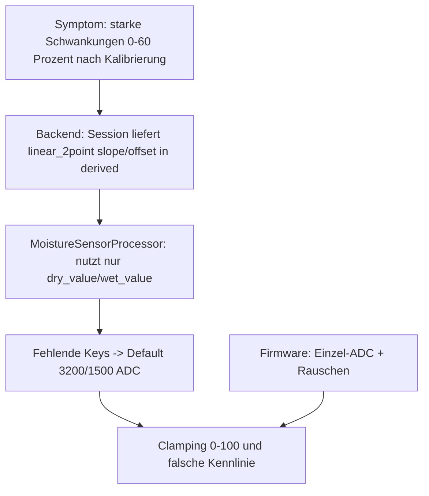

# IST-Bericht — Kalibrierungsflow Bodenfeuchte: Messinstabilität und Oszillation (0 % ↔ 60 %)

**Datum:** 2026-04-09  
**Typ:** Evidenzbasierter Analysebericht (keine Produktänderung aus diesem Dokument)  
**Repo-Stand (Referenz):** Branch `auto-debugger/work`, Commit `00deff9` (Verifikation 2026-04-09: `HEAD` = `00deff9`; bei neueren Commits Zeilenangaben im Tree gegenprüfen).

---

## 1. Executive Summary

Die End-to-End-Pipeline für kapazitive Bodenfeuchte ist im Code **konsistent** verknüpft, bis auf eine **zentrale semantische Lücke zwischen Kalibrier-Session und Feuchte-Processor**: Der Wizard und das Backend speichern nach `finalize` typischerweise ein **`linear_2point`-Ergebnis** (Steigung und Offset), während `MoistureSensorProcessor` ausschließlich **`dry_value` und `wet_value`** aus der Kalibrierung liest. Fehlen diese Schlüssel, fällt die Verarbeitung auf die **festen Default-Grenzen 3200/1500 ADC** zurück. Das erzeugt gegenüber der vom Operator wahrgenommenen „Kalibrierung“ ein **anderes physikalisches Modell**: Kleine ADC-Schwankungen an der falschen Stelle der Kennlinie führen zu **großen Prozent-Sprüngen**; wiederholtes **Clamping** auf 0 % bzw. 100 % erklärt typische **Sprünge** einschließlich eines Arbeitsbereichs wie **0 % … ~60 %**.

Serverseitig läuft die Kombination aus `resolve_calibration_for_processor` und `MoistureSensorProcessor.process` **nur im Pi-Enhanced-Zweig** (`sensor_config.pi_enhanced` und `raw_mode`); ohne diesen Zweig wird bei Roh-MQTT der numerische Roh-ADC oft direkt als angezeigter Wert weiterverwendet — für das hier beschriebene **Prozent-Symptom** ist der Pi-Enhanced-Pfad die relevante Schicht.

Das Composable `useCalibration` hat **keinen einzigen `import` im Projekt** außerhalb der eigenen Datei; `useCalibrationWizard` orchestriert API und Session direkt. Der Kopfkommentar in `useCalibrationWizard.ts` („Delegates … to useCalibration“) ist **nicht durch einen Import belegt** und wirkt veraltet. **Runtime-Logs vom 2026-04-09** waren im Arbeitsbaum **nicht als exportierte Dateien** auffindbar; die Bewertung stützt sich auf **Code-Evidence** und die dokumentierte Logger-Ausgabe im Server.

---

## 2. IST-Kontext (minimal)

| Aspekt | Befund |
|--------|--------|
| Branch / Commit | `auto-debugger/work` @ `00deff9` |
| Feature-Flags | Keine für diesen Pfad identifiziert |
| Log-Quellen im Repo | Keine durchsuchbaren Tages-Logs vom 2026-04-09 eingecheckt; in Betrieb typisch: Server-stdout/JSON-Logs, optional Docker, optional Loki — **nur was lokal/deployed verfügbar war, liegt hier nicht vor** |

---

## 3. Zeitachse / Evidence-Kette (repräsentativ, ohne Secrets)

Vollständige **UI → API → Server → MQTT → Wert**-Kette aus dem Code (statt echter Log-Zeilen, da keine Log-Exports vom Zieldatum im Tree):

| Schritt | Mechanismus | Code-Ort / Hinweis |
|--------|-------------|-------------------|
| 1 UI: „Messung starten“ | `POST /api/v1/sensors/{esp_id}/{gpio}/measure` über `sensorsApi.triggerMeasurement` | `El Frontend/src/api/sensors.ts` (Kommentar verweist auf `sensors.py` Measure-Route) |
| 2 Server: MQTT-Messauftrag → ESP | Publisher / Sensor-API (Mess-Trigger) | Siehe `El Servador/god_kaiser_server/src/api/v1/sensors.py` (Measure-Endpunkt im Projekt referenziert) |
| 3 ESP: Roh-ADC | `readRawAnalog` → `analogRead`, Einzelmessung | `El Trabajante/src/services/sensor/sensor_manager.cpp` |
| 4 Server: Antwort / Anreicherung | `CalibrationResponseHandler` broadcastet **Rohwert** per WebSocket | Event-Typ `calibration_measurement_received`, Felder u. a. `raw` / `raw_value`, `correlation_id` — `El Servador/god_kaiser_server/src/mqtt/handlers/calibration_response_handler.py` |
| 5 UI: Anzeige Roh | Listener in `useCalibrationWizard` setzt `lastRawValue` | `El Frontend/src/composables/useCalibrationWizard.ts` |
| 6 Kalibrierung: Session | `POST /v1/calibration/sessions` mit `method: 'linear_2point'` | `useCalibrationWizard` → `calibrationApi.startSession` |
| 7 Finalize / Apply | `finalize` → `_compute_calibration`; `apply` schreibt `sensor.calibration_data` kanonisch | `El Servador/god_kaiser_server/src/services/calibration_service.py` |
| 8 Live-Betrieb: MQTT-Sensordaten | `SensorDataHandler`: bei **`pi_enhanced` und `raw_mode`** → `processor.process(..., calibration=resolve_calibration_for_processor(...))`; sonst oft Roh-ADC als `processed_value` (Fallback Zeile ~334–335) | `El Servador/god_kaiser_server/src/mqtt/handlers/sensor_handler.py` |

**Repräsentative Log-Zeile (aus Quellcode, nicht aus einem konkreten Lauf):**  
Pi-Enhanced-Pfad loggt u. a. `raw=… → processed=…` — siehe `logger.info` mit Präfix `[Pi-Enhanced] SUCCESS` in `El Servador/god_kaiser_server/src/mqtt/handlers/sensor_handler.py` (ca. Zeilen 1310–1313).

---

## 4. Ursachenbaum



**Dominante Schicht:** **Backend** (Kalibrier-Ergebnisschema vs. Processor-Eingabe) — verstärkt durch **Firmware/Physik** (ADC-Rauschen, Grenzbereich), aber die **systematische Fehlkalibrier-Wirkung** entsteht primär aus der beschriebenen Schema-Diskrepanz.

---

## 5. Hypothesenmatrix H1–H7

| ID | Hypothese | Status | Evidence |
|----|-----------|--------|----------|
| H1 | `dry_value`/`wet_value` vertauscht oder `invert` inkonsistent | **Teilweise: invert in Session-Derived irrelevant für Processor** | `_compute_moisture` setzt `invert`, aber `MoistureSensorProcessor` liest **Invert nur aus `params`**, nicht aus `calibration` — `moisture.py` (`if params and "invert"`). Persistiertes `invert` in `derived` wirkt so **nicht** auf `process()`. |
| H2 | Roh-ADC verlässt die Kalibrier-Spanne → Clamping | **Bestätigt als stark plausibel (Mitverursacher)** | `moisture.py`: `_adc_to_moisture_calibrated` dann `max(min(moisture))` auf 0–100. Wenn effektiv **Default-Spanne** statt Operator-Spanne: häufiges **Grenz- und Rail-Verhalten**. |
| H3 | Messmodus vs. Live unterschiedliche Rohquellen | **Verworfen als dominante Ursache** | Beide Pfade: ESP `readRawAnalog`; Live-Anzeige im Wizard: WS mit **Roh**-Broadcast. Abweichung eher **Konfig/Zeitpunkt**, nicht zweite ADC-Mathematik. |
| H4 | Race: Kalibrierung noch nicht persistiert, UI zeigt schon Prozent | **Nicht belegbar** ohne Zeitstempel-Logs | `submitCalibration` pollt terminalen Session-Status; direkter Nachweis fehlt. |
| H5 | `soil_moisture` vs `moisture` falscher Registry-Pfad | **Verworfen** | `SENSOR_TYPE_MAPPING`: `"soil_moisture": "moisture"` — `El Servador/god_kaiser_server/src/sensors/sensor_type_registry.py` (ca. Zeilen 63–65); `LibraryLoader.get_processor` nutzt Normalisierung. |
| H6 | Sehr kleine Spanne `(wet - dry)` → hohe Verstärkung | **Plausibel bei echter dry/wet-Kalibrierung**; bei **Default**-Kennlinie anders, aber weiterhin **große Sprünge** möglich | `moisture.py` Division durch `(wet_value - dry_value)`; `dry_value == wet_value` → Fallback 50 %. |
| H7 | Doppelte Verarbeitung / raw_mode | **Verworfen für „doppelte Prozent“** | Firmware `applyLocalConversion`: Feuchte nicht in Liste der lokal konvertierten Typen → **Roh-Durchreichen** (`sensor_manager.cpp`). Server: **eine** `process()`-Runde. |

---

## 6. Zentrale Code-Evidence (Kernbefund)

**6.1 Wizard startet Session mit `linear_2point` (nicht `moisture_2point`)**

```357:362:El Frontend/src/composables/useCalibrationWizard.ts
    const session = await calibrationApi.startSession({
      esp_id: selectedEspId.value,
      gpio: selectedGpio.value ?? 0,
      sensor_type: selectedSensorType.value,
      method: 'linear_2point',
      expected_points: 2,
```

(Zweiter identischer Aufruf bei Live-Messung ohne Session: ca. Zeilen 556–561.)

**6.2 Finalize wählt Berechnung nach `method`**

```769:772:El Servador/god_kaiser_server/src/services/calibration_service.py
        if method == "moisture_2point":
            return CalibrationService._compute_moisture(points)
        elif method in ("linear_2point", "linear"):
            return CalibrationService._compute_linear_2point(sensor_type, points)
```

`_compute_linear_2point` — Ergebnis mit `slope`/`offset`, kein `dry_value`/`wet_value`:

```796:806:El Servador/god_kaiser_server/src/services/calibration_service.py
        return {
            "type": "linear_2point",
            "slope": round(slope, 6),
            "offset": round(offset, 4),
            "point1_raw": raw1,
            "point1_ref": ref1,
            "point2_raw": raw2,
            "point2_ref": ref2,
            "sensor_type": sensor_type,
            "calibrated_at": datetime.now(timezone.utc).isoformat(),
        }
```

`_compute_moisture` — `dry_value`/`wet_value`:

```820:826:El Servador/god_kaiser_server/src/services/calibration_service.py
        return {
            "type": "moisture_2point",
            "dry_value": dry_raw,
            "wet_value": wet_raw,
            "invert": dry_raw > wet_raw,  # Most capacitive sensors: dry=high, wet=low
            "calibrated_at": datetime.now(timezone.utc).isoformat(),
        }
```

**6.3 Processor nutzt nur `dry_value`/`wet_value`**

```142:152:El Servador/god_kaiser_server/src/sensors/sensor_libraries/active/moisture.py
        if calibration and "dry_value" in calibration and "wet_value" in calibration:
            dry_value = calibration["dry_value"]
            wet_value = calibration["wet_value"]
            moisture = self._adc_to_moisture_calibrated(raw_value, dry_value, wet_value)
            calibrated = True
        else:
            # No calibration - use default linear mapping
            # Default: dry ~3200 ADC, wet ~1500 ADC
            moisture = self._adc_to_moisture_default(raw_value)
            calibrated = False
```

Default-Kennlinie: `DEFAULT_DRY_VALUE = 3200.0`, `DEFAULT_WET_VALUE = 1500.0` in `_adc_to_moisture_default` (ca. Zeilen 357–372).

**6.4 Auflösung der DB-Payload**

```119:124:El Servador/god_kaiser_server/src/services/calibration_payloads.py
    if payload is None or not isinstance(payload, dict):
        return None

    derived = payload.get("derived")
    if isinstance(derived, dict) and derived:
        return dict(derived)
```

(Die Funktion `resolve_calibration_for_processor` beginnt in Zeile 108; Kern: flaches `derived` wird 1:1 an Processor durchgereicht.)

Damit erreicht der Processor genau den Inhalt von `derived` (z. B. `slope`/`offset` bei abgeschlossener `linear_2point`-Session), **ohne** automatische Ableitung von `dry_value`/`wet_value` aus der linearen Rechnung.

**6.5 Legacy-Composable ohne produktive Imports**

- Projektweite Suche: **kein** `import` von `@/composables/useCalibration` außerhalb `useCalibration.ts`. `useCalibrationWizard` importiert `useCalibration` **nicht**; der Kopfkommentar (Zeile 10) ist irreführend.

**6.6 Live-Pfad: Handler und Firmware**

- `resolve_calibration_for_processor` und `processor.process` nur wenn `sensor_config.pi_enhanced and raw_mode` (ca. Zeilen 269–307):

```269:281:El Servador/god_kaiser_server/src/mqtt/handlers/sensor_handler.py
                    if sensor_config and sensor_config.pi_enhanced and raw_mode:
                        # Pi-Enhanced processing needed
                        processing_mode = "pi_enhanced"

                        # Trigger Pi-Enhanced processing (pass raw_mode!)
                        pi_result = await self._trigger_pi_enhanced_processing(
                            esp_id_str,
                            gpio,
                            sensor_type,
                            raw_value,
                            sensor_config,
                            raw_mode=raw_mode,  # Pass raw_mode to processor
                        )
```

Innerhalb von `_trigger_pi_enhanced_processing`:

```1297:1307:El Servador/god_kaiser_server/src/mqtt/handlers/sensor_handler.py
            proc_calibration = None
            if sensor_config and sensor_config.calibration_data:
                proc_calibration = resolve_calibration_for_processor(
                    sensor_config.calibration_data
                )

            result = processor.process(
                raw_value=raw_value,
                calibration=proc_calibration,
                params=processing_params,
            )
```

- Firmware: `applyLocalConversion` enthält **keinen** Zweig für `moisture`/`soil_moisture`; unkonfigurierte Typen fallen auf Roh-Passthrough:

```85:87:El Trabajante/src/services/sensor/sensor_manager.cpp
    // Unknown → raw passthrough (server handles conversion)
    return { (float)raw_value, "raw", false };
}
```

---

## 7. Lücken (Observability, ohne Implementierung)

- **Fehlende Korrelation in exportierten Logs:** `esp_id`, `gpio`, `session_id`, `request_id`/`correlation_id` und **roher ADC** plus **verwendete Kalibrier-Keys** (`derived`-Typ) in **einer** strukturierten Zeile pro Verarbeitungsschritt.
- **Nachweis „welche Kalibrierkeys hat der Processor gesehen?“** — aktuell nur indirekt über DB-Inhalt und Codepfad ableitbar; gilt primär für **`pi_enhanced=true`** (siehe Abschnitt 6.6).
- **Kein eingechecktes Logarchiv** vom Analysetag — erneute Incident-Analyse sollte Logs **zeitlich gebündelt** ablegen (intern, nicht zwingend im App-Repo).

---

## 8. Follow-up (getrennt)

**Analyse (empfohlen):**

- Verifizierung in einer **Test- oder Staging-DB**: für einen betroffenen Sensor `sensor_configs.calibration_data` nach erfolgreicher Kalibrierung — steht `method`/`derived` als `linear_2point` mit `slope`/`offset` ohne `dry_value`/`wet_value`?
- Abgleich **eines** Live-Messwerts: gleicher Roh-ADC manuell mit `MoistureSensorProcessor.process` und **extrahierten** `dry_value`/`wet_value` aus den Kalibrierpunkten vs. tatsächlicher Server-Ausgabe.

**Implementierung (nur Vorschlag, keine Verpflichtung aus diesem Bericht):**

- Eine der folgenden **konsistenten** Optionen: (a) Session für Feuchte immer **`moisture_2point`** finalisieren bzw. `finalize` bei Sensor `moisture` `linear_2point` in **dry/wet-Derived** übersetzen; oder (b) `MoistureSensorProcessor` um Auswertung von **`slope`/`offset`** aus `linear_2point` erweitern; oder (c) `resolve_calibration_for_processor` so erweitern, dass aus linearen Punktwerten **dry/wet** rekonstruiert werden — jeweils mit Tests und ohne Breaking der kanonischen Schema-Regeln (separat zu planen).

---

## 9. Akzeptanzkriterien (Selbstcheck)

- [x] Bericht unter `docs/analysen/BERICHT-kalibrierungsflow-bodenfeuchte-oszillation-2026-04-09.md`
- [x] Mindestens eine **vollständige Evidence-Kette** (Abschnitt 3)
- [x] H1–H7 mit Evidence oder „nicht belegbar“ (Abschnitt 5)
- [x] Dominante Schicht benannt (**Backend**, Abschnitt 4)
- [x] Keine Pfade außerhalb der Auto-one-Wurzel im Fließtext (nur relative Repo-Pfade)

---

## 10. Umsetzung (Nachweis, 2026-04-09)

Die in Abschnitt 8 skizzierte **Option (a)** ist umgesetzt: Wizard startet Bodenfeuchte-Sessions mit **`moisture_2point`**; Legacy-Sessions **`linear_2point`** + Sensor **`moisture`** werden beim **Finalize** auf dieselbe **`moisture_2point`-Derived** (dry/wet) abgebildet; **`invert`** ist im Processor aus **`calibration`** lesbar, wenn **`params`** kein `invert` setzt. Kurzdoku und Operator-Hinweis: `docs/analysen/FIX-kalibrierungsflow-bodenfeuchte-2026-04-09.md`.

**Hinweis:** Die Abschnitte 1–8 dieses Dokuments bleiben **IST-Analyse zum Referenz-Commit**; sie werden nicht zurückgeschrieben. Für den aktuellen Code die genannten Dateien im Repo prüfen.
