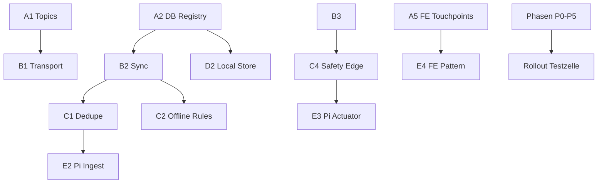

# Kaiser Edge-Relay — Master-Implementierungsplan (Konsolidat)

> **Status:** *Konsolidierungs-Entwurf (TM)* — **Verbindliche Produktions-Freigabe nur nach** Linear **F1 (AUT-162)** / `verify-plan` **B-KAISER-VERIFY-01..04 = GO**  
> **Version:** 1.0 | **Datum:** 2026-04-24  
> **Eingang:** `docs/analysen/ANALYSE-kaiser-edge-relay-ist-soll-sync-2026-04-24.md`  
> **Linear:** Projekt *Kaiser Edge-Relay — Vorplanung & Implementierungsplan (2026-Q2)*, Epics A–F (AUT-135–AUT-163)  
> **Nicht-Ziel:** Durchführung der Implementierung in dieser TM-Session; vielmehr **umsetzbare** Reihenfolge + Testpyramide + Rollout.

---

## 0. Regeln (Anti-Drift)

- **Kein Parallel-Universum:** Erweiterung der vorhandenen Topic-Contract-Patterns (`kaiser/{kaiser_id}/esp/...`), Service-Schichten, Config-/Pending-State, Safety-Kette.  
- **Pflichtsequenz (TM):** Analyse/Plan-Issues A–E abschliessen → diesen Plan pflegen → **F1 verify-plan** → **F2** erzeugt Implementierungs-Issues.  
- **Code gewinnt:** Wenn `verify-plan` Pfade korrigiert, Plan-Text nachziehen, nicht umgekehrt.  
- **Breaking Changes:** explizites Migrations-Issue; keine stillen Topic-Umbenennungen.

---

## 1. Phasen & Reihenfolge

| Phase | Inhalt | Abhängigkeiten | Outcome |
|-------|--------|----------------|--------|
| **P0** | Transport & Identität God↔Kaiser (TLS, Client-ID, least privilege) | A1, A2 | Entscheidung Matrix §4 Analyse; API-seitige Vorgaben |
| **P1** | Sync-Protokoll (Snapshot/Delta, Revisions) | A2, B2, B3 | Contract-Dok in `.claude/reference` nach Umsetzung via `/updatedocs` |
| **P2** | Uplink/Downlink ohne Doppel-Ingest | C1, B2 | Dedupe-Strategie in Server-Ingest; Kaiser-Seite Spiegel-Regeln |
| **P3** | Offline-Rule-Cache + NVS-Semantik | C2, C4 | God-Safety vs. Edge-Safety klar getrennt |
| **P4** | ESP-Handover `god` → Edge-Kaiser | C3, A4 | Firmware- und Server- koordinierte Releases (Reihenfolge: mqtt → server → esp32 → fe) |
| **P5** | Kaiser-Laufzeit (Pi) | D1–D3 | Prozess + lokaler DB-Layer + Lastgrenzen |
| **P6** | `kaiser_device` / Pi-GPIO | E1–E4 | Eigener Vertical Slice (Domain, MQTT, API, UI) |
| **P7** | Testfeld „eine Testzelle“ + Monitoring | alle vorher | Smoke + Last + Failover-Szenarien |

**Kritischer Pfad (P0–P2):** B (Sync) + C (Brücke) — parallel nur dort, wo keine gemeinsame Contract-Datei (sonst `mqtt-dev` zuerst laut `TM_WORKFLOW.md`).

---

## 2. Abhängigkeits-Graph (Kurz)

---

## 3. Migrations- & Rollout-Strategie

1. **Vor** Code: Alembic nur auf **God-DB** für neue Tabellen/Spalten (z. B. Kaisersync-Cursors, `kaiser_device` Registry) — Issues mit `db-inspector` + `server-dev` prüfen.  
2. **Kaiser-Edge-Schema** (lokal): eigener Migrations-Mechanismus (z. B. `sqlite` + `alembic` im Edge-Paket oder ad-hoc Version-Tabelle) — D2 Ergebnis.  
3. **Rollout:** Eine physisch/logische **Testzelle** (1 God, 1 Edge-Kaiser, 2+ ESP) — keine Breit-Rollout bis Gate grün.  
4. **Feature-Flags:** Umschalten `ESP.kaiser_id` nur über gut kontrollierten Provisioning-Pfad (siehe C3).

---

## 4. Testpyramide

| Schicht | Werkzeug | Fokus |
|---------|----------|--------|
| **Unit** | `pytest` (Server), `vitest` (FE) | Revisionsvergleich, Dedupe, Policy-Matrix, Mapper `kaiser_device` |
| **Contract** | MQTT-Tests / Topic-Builder-Tests (Repo-Pattern) | Wildcards `kaiser/+/...` vs. spezifische `kaiser_id` |
| **Integration** | `pytest` + ggf. Mock-Broker, Mosquitto in CI | Uplink-Only, kein doppelter DB-Insert |
| **E2E** | Playwright (bestehende Infrastruktur) | Hierarchie, Device-Zuweisung (wenn API steht) |
| **HW / Feld** | Eine Testzelle, ggf. Wokwi für ESP-Teile | Reconnect, Handover, God-Ausfall-Simulation |

*Konkrete Befehle: an `TEST_WORKFLOW.md` und Verifikationstabelle in `CLAUDE.md` ausrichten — bei `verify-plan` (F1) verpflichtend gegenprüfen.*

---

## 5. verify-plan-Gates (Meta + Epics)

| Gate-ID | Gültigkeit | Prüfgegenstand |
|---------|------------|----------------|
| **B-KAISER-VERIFY-01** | F1 | Alle im Plan genannten Pfade/Module existieren; keine erfundenen Dateien |
| **B-KAISER-VERIFY-02** | F1 | MQTT/REST/WS: bei vorgesehener Cross-Change beide Seiten adressiert |
| **B-KAISER-VERIFY-03** | F1 | Abhängigkeits-Graph ohne Zyklen/ Widerspruch |
| **B-KAISER-VERIFY-04** | F1 | Test-Kommandos + Working Directory + erwarteter grüner Umfang |
| B-KAISER-A-01..04 | Epic A (Analyse) | Wie in Linear Issues AUT-141–145 |
| B-KAISER-B-01..04 | Epic B | AUT-147–150 |
| … | Epics C–E | Wie in Linear |

**F1-Abnahme:** Issue **AUT-162**; bei **NO-GO** — Plan-Revision, keine F2-Implementierungs-Issues.

---

## 6. Nach F2 — Implementierungs-Backlog (Vorlagen)

*Erst anzulegen durch TM nach F1-GO (siehe AUT-163). Platzhalter-Kategorien:*

- `feat: [server]` God↔Kaiser Sync-Service + API  
- `feat: [mqtt-dev]` Uplink-Topics / Bridge-Config / ACL-Doku  
- `feat: [esp32-dev]` Provisioning-Handover + Tests  
- `feat: [frontend-dev]` Hierarchie + Kaiser-Geräte (ohne Parallel-UI)  
- `feat: [edge-kaiser]` *(neues Paket, Ort zu entscheiden — Monorepo vs. Subrepo in F2)*  

Jedes Issue endet mit `/updatedocs` laut `TM_WORKFLOW.md` §13.

---

## 7. Änderungshistorie (Plan)

| Datum | Autor | Änderung |
|-------|--------|----------|
| 2026-04-24 | TM | Erstversion als Konsolidat vor F1 |

---

*Ende Master-Plan v1.0 (Entwurf bis F1-GO).*
