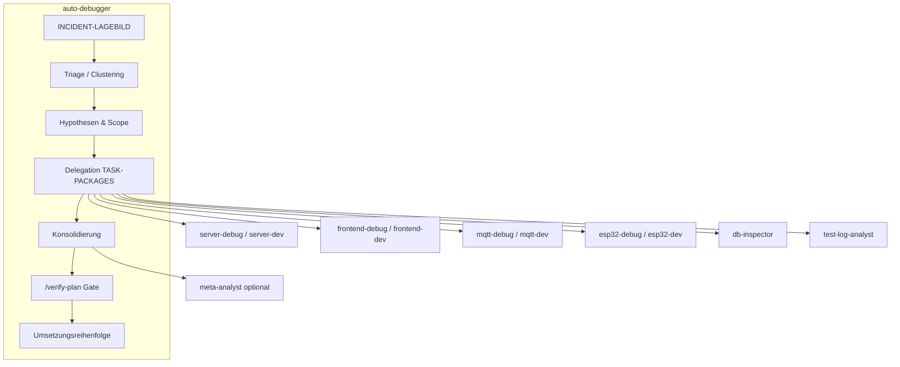
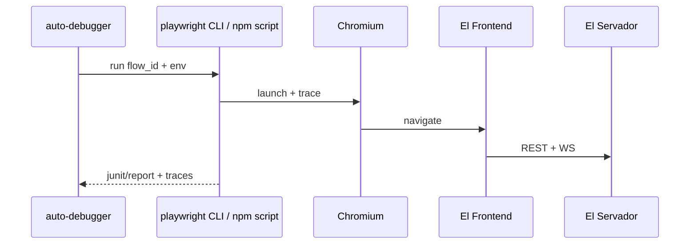

# Konzeptbericht: `auto-debugger`, Frontend-Flow-API, Alert-Center E2E

**Datum:** 2026-04-09  
**Typ:** Analyse / Architekturkonzept (keine Produktiv-Implementierung in diesem Dokument)  
**Repo:** AutomationOne (`Auto-one`)  
**Methodik:** Codegestützte Recherche (Pfadprüfung, Lesezugriff auf Kernmodule). Ergänzend konsistent mit bestehendem IST-Bericht `docs/analysen/IST-observability-correlation-contracts-2026-04-09.md`.

---

## 0. Runbook-Problemcluster A–D (Zuordnung)

| Cluster | Inhalt (Runbook) | Kanonische Doku |
|--------|------------------|-----------------|
| **A** | Orchestrierung, Steuerdatei-Pflicht, additive IST-Berichte, Abgrenzung Meta-Analyst | Abschnitt 3.4, 3.5; Steuerdatei `.claude/auftraege/auto-debugger/inbox/` |
| **B** | Observability, Korrelation, E2E-Verträge, zwei Ketten, UI-Finalität, Playwright, Firmware-Grenze | §4–6, §5.3–5.4, §7; IST-Observability |
| **C** | `/verify-plan`-Gate, `TASK-PACKAGES`, Git nur `auto-debugger/work` | §8; Skill `verify-plan`; Run `.claude/reports/current/auto-debugger-runs/problemcluster-obs-2026-04-09/` |
| **D** | Konzept unter `docs/analysen/` vs. Router (`AGENTS.md`, `CLAUDE.md`, Commands) | Dieses Dokument + `AGENTS.md` (Orchestrator-Abschnitt) |

**Zwei Ketten (Kurz):** NotificationRouter/DB-Inbox **≠** WS `error_event` — siehe IST-Bericht Abschnitt „Zwei Benachrichtigungsketten“ und §5.3 hier.

**ID-Warnung:** HTTP-`request_id` und MQTT-synthetische CID denselben Namen im Log teilen sich **nicht** automatisch die Semantik — nicht in einem Cluster ohne Quellenprüfung vermischen (IST: P0-Lücke).

---

## 1. Executive Summary

**Zielbild:** Ein Orchestrierungs-Agent **`auto-debugger`** führt bei Incidents eine **Pflichtsequenz** (IST → Log-Triage mit Correlation → Hypothesen → Delegation an Spezialisten → Konsolidierung → **`/verify-plan`-Gate** → gestaffelte Umsetzung) aus und erzeugt **selbsttragende Spezialisten-Prompts**. Parallel wird eine **deterministische Frontend-Flow-Ausführung** etabliert (benannte Flows, Schritt-Assertions), damit Agenten und CI **kein** unvertragliches „UI-Herumklicken“ betreiben.

**Hauptempfehlung Flow-API (Hauptvariante):** **Playwright-basierte Flow-Definitionen im Repo** (`El Frontend/tests/e2e/…`), ausführbar via `npm run test:e2e` mit `--grep` / dediziertem Tag. **Begründung:** Playwright ist **bereits** als Dev-Dependency und mit Szenario-Tests unter `tests/e2e/scenarios/` vorhanden (`package.json`: `test:e2e`, `test:playwright`). Es ist **CI-tauglich**, versionierbar und erzwingt **explizite Selektoren/Assertions** — passend zum Leitprinzip „messbare Schnittstellen“. **Fallback:** Ergänzend (nicht ersetzend) eine **stark abgesicherte interne Dev/CI-API** unter z. B. `/internal/...` nur mit `ENVIRONMENT=development` **und** Admin/Setup-Token **und** Feature-Flag — ausschließlich für Zustände, die sich mit reinem DOM nicht stabil abbilden lassen.

**Top-5 Risiken**

1. **Semantik-Kollision / Lücken bei IDs:** `request_id` deckt HTTP und synthetische MQTT-CIDs ab; JSON-Parse-Fehler im MQTT-Subscriber können Logs ohne brauchbare CID erzeugen (siehe IST-Observability-Bericht). **auto-debugger** muss beim Clustering **Feld-bewusst** sein (nicht alles unter „Request-ID“ mischen).
2. **Zwei parallele „Benachrichtigungs“-Ketten:** Persistierte **ISA-18.2-Alerts** (`NotificationRouter`, DB `notifications`) vs. **Echtzeit-Fehler** als WS `error_event` aus `error_handler.py` **ohne** NotificationRouter — Risiko falscher Root-Cause-Zuordnung, wenn der Orchestrator nur die Inbox sieht.
3. **Operator-Finalität vs. UI (IST 2026-04):** `alert-center.store` liefert `AlertLifecycleResult`; **NotificationDrawer** und **QuickAlertPanel** werten `success: false` aus und zeigen Fehler per `useToast` / `formatAlertLifecycleFailureMessage` (optional `request_id`). Schein-Erfolg bei REST-Lifecycle-Fehlern ist damit im zentralen UI-Pfad vermieden.
4. **Keine stabilen Test-IDs** in `src/components/notifications/` (keine `data-testid`-Treffer) — Playwright-Flows werden **brittle**, bis additiv Selektoren ergänzt werden (**ohne** Breaking Change am Verhalten).
5. **Firmware-Pfade:** `ErrorTracker::publishErrorToMqtt` nutzt weiterhin Arduino `String` (Ist-Stand); Alert-/Error-Pfade sind **hardware- und timingabhängig** — Wokwi reicht für Abnahme **kritischer** Firmware-Fixes im Alert-Pfad nicht allein.

**Top-5 Quick Wins (ohne Breaking Changes)**

1. **`data-testid`** (additiv) auf `NotificationDrawer`, Status-Tabs, „Alle erledigen“, List-Items, Ack/Resolve-Aktionen — ermöglicht sofort **einen** Referenz-Playwright-Flow.
2. **Flow-Katalog** als YAML/JSON im Repo (Versionierung) + ein **Referenz-Flow** `alert_center_acknowledge_active` nur gegen Dev/CI-Stack.
3. **Orchestrator-Artefakt-Ordner** konventionell unter `.claude/reports/current/incidents/<id>/` mit den im Auftrag geforderten Dateinamen (Markdown/JSON).
4. **Konsolidierung bestehender Skills:** `verify-plan`, `meta-analyst`, `test-log-analyst`, Debug-Skills explizit in der `auto-debugger`-Pflichtsequenz verlinken (kein neues Tooling nötig).
5. **Dokumentierte Clustering-Reihenfolge** für den Agenten: `correlation_id` (Notification) → `X-Request-ID` / `request_id` (HTTP) → `esp_id` + Zeitfenster → MQTT-synthetische CID aus Logs.

---

## 2. Ist-Inventar Auto-One

### 2.1 Agenten (`.claude/agents/`)

**14 Agent-Definitionen** (plus `Readme.md`):  
`agent-manager`, `auto-debugger`, `db-inspector`, `esp32-debug`, `esp32-dev`, `frontend-debug`, `frontend-dev`, `meta-analyst`, `mqtt-debug`, `mqtt-dev`, `server-debug`, `server-dev`, `system-control`, `test-log-analyst`.

**Zuordnung zum Orchestrator:** Debug- und `meta-analyst` liefern **Tiefenanalyse**; Dev-Agenten **Umsetzung**; `system-control` **IST-Stand/Briefing**; `db-inspector` **DB-Invarianten**; `test-log-analyst` **Test/CI-Evidenz**. **`auto-debugger`** ist der **Orchestrator** oberhalb dieser Rollen (Definition `.claude/agents/auto-debugger.md`, Skill `.claude/skills/auto-debugger/SKILL.md`, Steuerdatei-Inbox), ohne deren Fachlogik zu duplizieren.

### 2.2 Skills (`.claude/skills/*/SKILL.md`)

Relevant für den Workflow: `verify-plan` (Pflichtgate), `meta-analyst` (Cross-Report), `server-debug`, `frontend-debug`, `mqtt-debug`, `esp32-debug`, `db-inspector`, `test-log-analyst`, `system-control`, `collect-system-status`, `collect-reports`, `do`, `server-development`, `frontend-development`, `mqtt-development`, `esp32-development`, `ki-audit`, `git-health`, `updatedocs`, `hardware-test`, `git-commit`, `agent-manager`.

**Orchestrierung vs. Umsetzung:** Der Skill **`.claude/skills/auto-debugger/SKILL.md`** normiert Steuerdatei, Artefaktnamen (Incident), Merge-Regeln und `/verify-plan`-Gate; Ergänzung zu `system-control` (Session-Briefing) und `meta-analyst` (Cross-Report), nicht Ersatz.

### 2.3 Router-Dokumentation (`CLAUDE.md`, `.claude/reference/`)

- `CLAUDE.md`: Sub-Agent-Routing, Verifikationsmatrix, Verweis auf `TM_WORKFLOW.md`, Referenz-APIs unter `reference/api/`.
- **Bereits vorhandener Tiefen-IST:** `docs/analysen/IST-observability-correlation-contracts-2026-04-09.md` (IDs, Lücken, Loki-Hinweise).

### 2.4 E2E / Wokwi / Playwright

- **Playwright:** `@playwright/test` in `El Frontend/package.json`; Szenarien unter `tests/e2e/scenarios/` (Auth, Hardware-Views, Emergency, Logic, …). **Kein** dediziertes Alert-Center-Szenario in der Stichprobe.
- **Wokwi:** Projekt-Dokumentation (`docs/wokwi-mcp.md`, `AGENTS.md`) — Firmware-Regression **ohne** volle Hardware-Semantik.
- **Backend:** `tests/integration/test_alert_lifecycle.py` — solide Abdeckung **REST-Lebenszyklus** der Alerts.

---

## 3. Zielarchitektur `auto-debugger`

### 3.1 Rolle

- **Ein** Orchestrator-Agent: hält **`INCIDENT-LAGEBILD`** aktuell, führt die **Pflichtsequenz** (siehe Auftrag A.2), **konsolidiert** Widersprüche, **delegiert** in kleine Pakete.
- **Spezial-Agenten** bleiben **Ausführer** mit klarem Scope; Outputs müssen **ohne** vollen Session-Kontext nutzbar sein (`SPECIALIST-PROMPTS`).

### 3.2 Diagramm (textuell)



### 3.3 Artefaktfluss (Pflichtnamen)

| Artefakt | Pfad (Vorschlag) | Mindestinhalt |
|----------|------------------|---------------|
| `INCIDENT-LAGEBILD.md` | `.claude/reports/current/incidents/<incident_id>/` | Symptom, Zeitraum, betroffene `esp_id`/User/Notification-IDs, Schichten, offene Fragen |
| `CORRELATION-MAP.md` | gleicher Ordner | Tabelle: HTTP `X-Request-ID`, WS-Event, MQTT-Topic, DB-Zeilen, Notification `correlation_id` |
| `TASK-PACKAGES.md` | gleicher Ordner | nummerierte Pakete: Owner, Risiko, Tests, Akzeptanzkriterien |
| `SPECIALIST-PROMPTS.md` | gleicher Ordner | 1 Block pro Bereich, copy-paste-fähig |
| `VERIFY-PLAN-REPORT.md` | gleicher Ordner | Abweichungen Plan↔Code, Breaking-Change-Scan, geschärfte Aufträge |

**Merge-Regel:** Vor jeder Delegation `INCIDENT-LAGEBILD` aktualisieren; nach jedem Skill-Lauf Abschnitt „Eingebrachte Erkenntnisse“ anhängen.

### 3.4 Universeller Modus: Analyse-Artefakte verbessern (nicht nur Observability)

Neben **Incidents** soll `auto-debugger` **beliebige, bereits vorhandene oder laufend erweiterte Analyse-/IST-Berichte** desselben Typs (Markdown im Repo, z. B. unter `docs/analysen/`) **additiv und evidenzbasiert** verbessern können — **ohne** Observability-spezifische Hardcodierung im Agentenkern.

**Abgrenzung zu `meta-analyst`:** `meta-analyst` fokussiert **Querschnitt zwischen Berichten**; `auto-debugger` führt im Artefakt-Modus eine **Pflichtsequenz** aus (siehe unten), aktualisiert **ein oder mehrere Zieldokumente** nachvollziehbar und erzeugt bei Bedarf **TASK-PACKAGES** / **SPECIALIST-PROMPTS** für nachgelagerte Umsetzung — inkl. **`/verify-plan`-Gate**, bevor aus dem Bericht **Implementierungs**arbeit abgeleitet wird.

**Pflichtsequenz (Artefakt-Modus, kurz):**

1. **Steuerdatei lesen** (Pflicht): Zielpfade, Scope, verbotene Änderungen, Abnahme-Regeln.
2. **IST einfangen:** relevante Abschnitte der Zielberichte + verknüpfte Code-/Doc-Pfade im Repo per `Read`/`Glob`/`Grep` verifizieren (keine Annahmen).
3. **Lückenliste:** fehlende Evidence, Widersprüche Schicht A↔B, fehlende Korrelationsfelder (nur wenn im Scope).
4. **Patch-Vorschlag:** konkrete Markdown-Ergänzungen (Tabellen, „Evidence:“-Zeilen, Risiko-Boxen) — **rückverfolgbar** (Datei + Fundstelle).
5. **Delegation nur in Paketen:** wenn Code-Änderung nötig → `TASK-PACKAGES.md` + Spezialisten-Prompts; kein „still im Bericht behaupten“ ohne Repo-Check.
6. **`/verify-plan`:** bevor Umsetzung; Output `VERIFY-PLAN-REPORT.md` auch im Artefakt-Modus, wenn aus dem Bericht Implementierung folgen soll.

**Nicht-Ziele (Artefakt-Modus):** Keine Umbenennung öffentlicher APIs/MQTT/WS „aus Bequemlichkeit“; keine Erfindung von Logzeilen; keine Löschung fremder Autoren-Zusammenfassungen ohne explizite Freigabe in der Steuerdatei.

### 3.5 Datei- und ordnerbasiertes Triggern (Konvention)

**Praktisches Muster:** Jeder Lauf beginnt mit einer **Steuerdatei** im Repo (nicht mit „freiem Brainstorming“ ohne diese Datei).

**Vorschlag Ablage:**

- Ordner: `.claude/auftraege/auto-debugger/inbox/` (oder `pending/`) — **eine aktive Steuerdatei pro Lauf** oder klar benannte Batch-Liste.
- Dateiname: `STEUER-<kurz-id>-<YYYY-MM-DD>.md` (oder `.yaml` mit gleichem Inhalt).

**Mindestinhalt der Steuerdatei (normativ):**

| Feld | Zweck |
|------|--------|
| `run_mode` | `incident` \| `artefact_improvement` \| `both` |
| `incident_id` | nur bei `incident` / `both` — bestimmt `.claude/reports/current/incidents/<id>/` |
| `target_docs` | Liste von Repo-relativen Pfaden zu Markdown-Berichten |
| `scope` | z. B. „nur additive Abschnitte“, „Korrelation“, „Frontend-Flow/E2E“ |
| `forbidden` | z. B. „keine REST-Schema-Änderungen“, „keine Secrets“ |
| `done_criteria` | messbar: z. B. „alle P0-Lücken aus Steuerdatei geschlossen oder als BLOCKER dokumentiert“ |

**Wichtig (Plattform-Realität):** Claude Code **überwacht keine Ordner automatisch**. Die Konvention ist: **Du startest den Agenten explizit** und verweist als Erstes auf die Steuerdatei (z. B. `@.claude/auftraege/auto-debugger/inbox/STEUER-….md`) **oder** ein Slash-Command liest den Pfad als Argument. Der Agent **darf** freies Chatting nur zur Klärung nutzen — **Arbeit** beginnt erst nach validierter Steuerdatei.

---

## 4. Frontend-Flow-API

### 4.1 Variantenbewertung

| Option | Nutzen | Risiko | Passt zu Auto-One? |
|--------|--------|--------|---------------------|
| **1. Playwright im Repo** | CI, Review, klare Assertions | Wartung der Selektoren | **Ja** — Infrastruktur vorhanden |
| **2. Interne Dev/Test-API** | Steuerung ohne fragiles DOM | Sicherheit, Drift zu Produkt-API | **Optional** als Ergänzung mit **Gate** |
| **3. Extension/CDP** | Maximale Freiheit | Security, Wartung, Repro | **Nur** wenn 1+2 nicht reichen |

### 4.2 Empfohlene Hauptvariante

**Playwright als einzige vertragliche „Flow-API“** für das Alert-Center: Flows = TypeScript-Specs, die **REST-Setup** (Testuser, Notifications via API oder DB-Fixture) und **UI-Schritte** kombinieren. Agent/trigger: `cd "El Frontend" && npx playwright test tests/e2e/scenarios/alert-center/ --grep …`.

### 4.3 Sicherheitsmodell

- Keine Ausführung gegen **Produktion** ohne isoliertes Netz, **kein** offener Fernzugriff.
- Test-User mit **minimalen** Rechten; Secrets nur aus **Umgebungsvariablen** (Platzhalter im Konzept).
- **Trennung:** Operator-UI bleibt unverändert; Debug-only Routen — falls eingeführt — nur mit **`INTERNAL_API_ENABLED` + starke Auth** (siehe Nicht-Ziele: kein blindes Deploy).

### 4.4 Flow-Katalog-Schema (YAML, normativ für neue Flows)

```yaml
flow_id: alert_center_acknowledge_active
description: Öffnet Benachrichtigungs-Drawer, filtert aktive Alerts, bestätigt erste aktive Meldung
required_env:
  VITE_API_URL: string
  E2E_USER: string
  E2E_PASSWORD: string
data_fixtures:
  - type: api
    method: POST
    path: /api/v1/notifications/send   # nur wenn Admin-Fixture erlaubt; alternativ DB-Seed in Test-Setup
steps:
  - id: open_drawer
    action: click
    target: { testid: notification-drawer-trigger }
  - id: filter_active
    action: click
    target: { testid: alert-status-tab-active }
  - id: acknowledge_first
    action: click
    target: { testid: notification-ack-button-first }
assertions:
  - after_step: acknowledge_first
    type: api_response_or_ws
    description: PATCH /notifications/{id}/acknowledge 200 ODER notification_updated mit status acknowledged
  - type: dom
    target: { testid: notification-item-status }
    expect_text: acknowledged
```

*Hinweis:* `testid`-Ziele sind **Zielzustand** — im Ist-Code teils noch zu ergänzen (Quick Win).

**Umsetzung Phase 1 (versionierter Katalog):** Repo-Datei `El Frontend/tests/e2e/flows/alert_center_acknowledge_active.yaml` (Contract; Ausführung über `tests/e2e/scenarios/alert-center.spec.ts`). Umgebungsvariablen für Auth: `E2E_TEST_USER` / `E2E_TEST_PASSWORD` (siehe `tests/e2e/global-setup.ts`).

### 4.5 Mapping Alert-Center (Ist-Code)

| Aspekt | Ist-Implementierung |
|--------|---------------------|
| **UI-Hülle** | `NotificationDrawer.vue` — SlideOver „Benachrichtigungen“, Filter-Tabs, Status-Tabs (Alle/Aktiv/Gesehen/Erledigt), „Alle erledigen“ |
| **State** | `notification-inbox.store.ts` (Liste, WS), `alert-center.store.ts` (Stats-Polling 30s, Ack/Resolve, `getActiveAlerts`) |
| **API** | `El Frontend/src/api/notifications.ts` → `/notifications/...` (align mit `El Servador/.../api/v1/notifications.py`) |
| **WS** | `esp.ts` registriert `notification_new`, `notification_updated` (Dispatcher) |
| **Keine eigene Route** | Alert-Center = **Drawer/Widgets** (`TopBar`, `AlarmListWidget`, `QuickAlertPanel`), nicht zwingend `/alerts`-Seite |

### 4.6 Architekturdiagramm (Agent → Runner → Browser)



---

## 5. Alert-Center E2E — Ist-Audit & Lückenliste

### 5.1 Frontend

- **Finalität:** Server-seitig klare Übergänge (`test_alert_lifecycle.py`); Client-seitig liefern `acknowledgeAlert` / `resolveAlert` / `resolveAllAlerts` ein **`AlertLifecycleResult`** (`success: true` oder `AlertLifecycleFailure` mit `message` + optional `requestId`). **NotificationDrawer** und **QuickAlertPanel** zeigen bei Fehlschlag Toasts mit einheitlichem Text (`@/utils/alertLifecycleUi`). Evidence: `tests/e2e/scenarios/alert-center.spec.ts` (P1 Ack-Fail), `tests/unit/utils/alertLifecycleUi.test.ts`.
- **Realtime:** WS-Updates in Inbox; **Stats** zusätzlich per **Polling** — bei WS-Ausfall können Counts und Liste **divergieren**, bis Refresh/Polling nachzieht.
- **„Stummschalten“:** **Quiet Hours** in `NotificationPreferences`; **Alert-Suppression** serverseitig (`alert_suppression_service.py`) und UI eher in **Hardware-Kontext** (`DeviceAlertConfigSection`, Sensor/Actuator `alert-config`) — **nicht** identisch mit „Alert im Drawer stumm“.

### 5.2 Server & DB

- **REST:** `notifications.py` — u. a. `GET .../alerts/active`, `.../alerts/stats`, `PATCH .../acknowledge`, `.../resolve`, `resolve-all`.
- **Modell:** `Notification` mit `status`, `correlation_id`, `fingerprint`, `parent_notification_id`, Timestamps (`src/db/models/notification.py`).
- **Transaktionen:** `NotificationRouter.route` persistiert, WS, optional Email, `commit` — deduplizierung **titel-/fingerprint-/correlation-basiert**.
- **Teilfehler:** Router-Fehler dürfen MQTT-Pfade nicht blockieren (z. B. Actuator-Alert: explizites try/except um `NotificationRouter`).
- **MQTT-Ingress-Korrelation (IST 2026-04-10):** Der Subscriber erzeugt pro Nachricht eine synthetische CID (`generate_mqtt_correlation_id` in `subscriber.py`) und stellt sie Handlern über `get_request_id()` bereit — **fachlich MQTT-Ingress**, nicht die HTTP-UUID. `NotificationRouter` mappt `NotificationCreate.correlation_id` auf die DB-Spalte und `metadata` auf `extra_data`. **Lücke (P1):** `actuator_alert_handler` spiegelt die Ingress-CID bislang nicht in `NotificationCreate` — Evidence/Matrix: `.claude/reports/current/auto-debugger-runs/konzept-alertcenter-05-mqtt-correlation-2026-04-10/TASK-PACKAGES.md`. Schwellenwert-Alerts im `sensor_handler` nutzen bewusst eine eigene `threshold_*`-CID für Gruppierung.

### 5.3 MQTT / Hintergrund

- **ISA-18.2-Notifications:** u. a. **Sensor-Schwellen** (`sensor_handler.py` → `NotificationRouter`), **Actuator-Alerts** (`actuator/.../alert` → `actuator_alert_handler.py`).
- **ESP System-Error:** Topic laut Handler-Docstring `.../system/error` — **Audit + WS `error_event`**, **kein** `NotificationRouter` in `error_handler.py` (Stichprobe: Broadcast Ende der Datei).
- **Deduplizierung/Aggregation:** `NotificationRouter.DEDUP_WINDOWS`, `fingerprint` + partial unique index; Grafana-Webhooks mit Dedup-Tests in `test_webhooks_api.py`.

### 5.4 Firmware

- **Fehler/Events:** `ErrorTracker::publishErrorToMqtt` baut JSON-Payload mit `error_code`, `context.esp_id`, `ts` (`error_tracker.cpp`); MQTT-Client erlaubt **Error-Publish** auch vor Registration-ACK (`mqtt_client.cpp`).
- **Actuator-Alerts:** Pfad über Alert-Topic (siehe `MQTT_TOPICS.md` / `actuator_manager`).
- **Wokwi vs. ESP:** siehe Abschnitt 7.
- **Evidence (STEUER 06, 2026-04-10):** Run `.claude/reports/current/auto-debugger-runs/konzept-alertcenter-06-firmware-hw-2026-04-10/` — `pio run -e seeed_xiao_esp32c3` grün; **HW-Abnahme** am Referenz-ESP in dieser Session nicht erbracht (BLOCKER mit Nachbedingung im `VERIFY-PLAN-REPORT`). **Hinweis:** Server `error_handler.py` nutzt für Audit/WS `payload.get("timestamp")`, Firmware sendet **`ts`** — Zeitstempel-Korrelation serverseitig ggf. additiv ergänzen (außerhalb reiner Firmware-STEUER; siehe Verify-Report).

### 5.5 Priorisierte Lückenliste

| P | Thema |
|---|--------|
| **P0** | ~~**E2E-Korrelation Alert vs. Error-Event:** Operatoren/Agent müssen wissen, ob ein Symptom in der **Inbox** (Notification) oder nur als **`error_event`** erscheint — sonst falsche Fixes.~~ — **bedient** (additive Operator-Tabelle + Evidence-Zeilen in `docs/analysen/IST-observability-correlation-contracts-2026-04-09.md`, Abschnitt „Zwei Benachrichtigungsketten“; Run-Doku: `.claude/reports/current/auto-debugger-runs/konzept-alertcenter-04-zwei-ketten-doku-2026-04-10/`). |
| **P0** | ~~**Sichtbare Finalität im UI** bei fehlgeschlagenem Ack/Resolve~~ — **umgesetzt** (Drawer + Quick Alert; Formatter + Tests; Run-Doku: `.claude/reports/current/auto-debugger-runs/konzept-alertcenter-02-ui-finality-2026-04-10/`). |
| **P1** | **Playwright-Referenz-Flow** + **data-testid** für Drawer/Aktionen. |
| **P1** | **Einheitliche `correlation_id`-Befüllung** von MQTT→Notification über alle Quellen (wo sinnvoll additiv im `metadata`/`extra_data`). |
| **P2** | Optional: dedizierte **Route „Alert Center“** für deep-links — nur wenn UX/Agent es braucht (Feature-Flag). |

**Was schon gut ist**

- Robuste **Backend-Integrationstests** für Alert-Lifecycle.
- **NotificationRouter** mit Dedup, Metriken, Email-Pfad.
- **Klare REST- und WS-Event-Dokumentation** (`WEBSOCKET_EVENTS.md`: `notification_new`, `notification_updated`, …).
- **DB-Index** auf `correlation_id` für Notifications.

---

## 6. Korrelation & Logging

### 6.1 Nachweislich vorhanden (Kurz)

- **HTTP:** `RequestIdMiddleware` — `X-Request-ID` oder UUID, ContextVar, Response-Header (`middleware/request_id.py`).
- **Logging:** `request_id` im JSON-Log (`logging_config.py` + `get_request_id()`).
- **MQTT:** synthetische CID `generate_mqtt_correlation_id` (`request_context.py`) — **gleicher ContextVar-Name** wie HTTP (siehe IST-Bericht: Semantik beachten).
- **Notifications:** DB-Feld `correlation_id`; DTO im Frontend (`NotificationDTO.correlation_id`).
- **Audit:** `AuditLogRepository` mit `request_id` und `correlation_id` (Repositories).

### 6.2 Additive Verbesserungen (ohne Breaking Change)

- **Neue optionale Log-Felder:** `notification_id`, `alert_status`, `ws_event_type` in relevanten Server-Logs (nur additive JSON-Keys).
- **MQTT-Payload:** wo noch fehlend, optional `correlation_id` spiegeln, das mit Notification-Create weitergegeben wird.
- **Frontend:** bei Fehlern **Response-Header `x-request-id`** bereits im API-Client genutzt — im Error-Toast anzeigen (bestehendes Muster erweitern).

**Clustering-Reihenfolge für `auto-debugger`:**  
1) `notifications.correlation_id` / `fingerprint` / `parent_notification_id`  
2) `X-Request-ID` / `request_id`  
3) `esp_id` + Zeitfenster  
4) MQTT-Log-Zeilen mit generierter CID  
5) Titel/Dedup-Key nur als letztes (wegen Kollisionsrisiko)

---

## 7. Test- und Abnahmestrategie

### 7.1 Matrix (verbindlich)

| Testart | Erlaubte Aussage | Pflicht für |
|---------|------------------|-------------|
| **Wokwi / Simulation** | Protokoll, MQTT-Handler, UI+API mit Mocks | Server, Frontend, Contract-Regression |
| **Echter ESP** | Timing, NVS, Reconnect, GPIO, Safety, **echte** Alert-Ketten | **Firmware-kritische** Änderungen im Error-/Alert-Pfad |

### 7.2 CI-Einbindung

- **Playwright:** Workflow-Step „El Frontend E2E“ mit gestartetem Stack (wie bestehende E2E-01-Patterns) — **ein** Alert-Flow als Gate ab Phase 1.
- **pytest:** bestehende `test_alert_lifecycle.py` bei jeder Backend-Änderung am Lifecycle.

### 7.3 Was der Agent **nie** allein abnahmefähig erklärt

- Produktions-Deploy oder Freigabe safety-kritischer Aktoren.
- „Firmware fix verifiziert“ **ohne** Hardware-Checkliste bei Pfaden mit **I/O, NVS, Watchdog, Reconnect unter Last**.
- Abnahme bei **nur** grünem Wokwi, wenn der Fix **hardwareabhängige Semantik** hat — Ausnahme nur nach **explizitem** technischen Nachweis im `VERIFY-PLAN-REPORT`.

### 7.4 Hardware-Checkliste (Vorlage für Robin)

1. **Testgerät:** feste `esp_id` aus NVS/Server-UI notieren (Umgebungsvariable `AUTOONE_HW_TEST_ESP_ID` o. ä. — ohne Secret).
2. **Schritte:** Flash-Build, MQTT-Connect, reproduzierten Alert auslösen, Ack im UI, Logzeilen mit `esp_id` + Notification-ID prüfen.
3. **Abbruch:** kein MQTT-ACK, Reboot-Loop, Safety-Controller greift nicht ein → **Stop**.

---

## 8. `/verify-plan`-Prozedur (Pflichtgate)

**Definition:** Entspricht dem Skill `.claude/skills/verify-plan/SKILL.md` — erweitert um **Incident-spezifische** Checks.

### 8.1 Checkliste (vor Code)

1. Alle Pfade/Endpunkte/Topics aus `TASK-PACKAGES` gegen Repo verifizieren (`Glob`/`Read`).
2. Widerspruch Frontend↔Server↔Firmware auflösen (z. B. `error_event` vs. Notification).
3. **Breaking-Change-Scan:** öffentliche REST-Pfade, MQTT-Schema, Alembic, WS-Event-Namen.
4. **Testnachweis:** pro Paket ein konkreter Test (Datei + Testname).
5. **Output:** `VERIFY-PLAN-REPORT.md` mit **geänderten** Auftragstexten (IST/SOLL, Akzeptanzkriterien, Nicht-Ziele).

### 8.2 Verantwortlichkeit

- **Fachlich:** Technical Manager genehmigt Plan nach Gate.
- **Technisch:** Agent mit `verify-plan`-Skill (oder expliziter Sub-Invocation) führt Gate aus; **`auto-debugger`** stellt sicher, dass **kein** Paket ohne Report startet.

---

## 9. Roadmap (Phasen mit Exit-Kriterien)

| Phase | Inhalt | Exit-Kriterien |
|-------|--------|----------------|
| **0** | Inventar + Konzept (dieses Dokument) + Auftrag archiviert | Abnahme durch TM; keine offenen P0-Fragen zur Flow-Hauptvariante |
| **1** | `data-testid` + Playwright-Flow `alert_center_*` + Flow-Katalog-Datei | E2E grün in CI-Template; mindestens **eine** Assertion auf REST **oder** WS |
| **2** | UI-Finalität Ack/Resolve (Fehler sichtbar), optional Korrelation in Toasts | Vitest/Component- oder E2E-Test; manuelle Smoke-Checkliste |
| **3** | P0 Korrelation Notification↔Logs (additive Felder) + Agent-Runbook `auto-debugger` | Integrationstest oder Log-Snapshot-Review; kein Breaking Change |
| **4** | Interne Dev-API **nur** falls Phase 1/2 an Grenzen stoßen | Threat-Model + Flag + Admin-only + separate OpenAPI-Section |
| **5** | Firmware-Hardware-Abnahmeprozess für Alert-Pfad | Dokumentierte Checkliste + ein erfolgreicher Lauf am Referenz-ESP |

---

## 10. Anhang — Vorlagen (Copy-Paste)

### 10.1 `TASK-PACKAGES.md` (Fragment)

```markdown
## PKG-01 — Frontend: Alert Ack Error UX
- Owner: frontend-dev
- Risiko: niedrig
- IST: NotificationDrawer ruft acknowledgeAlert ohne Fehler-UI
- SOLL: bei false oder Exception — Toast + optional x-request-id
- Tests: vitest (store) oder playwright alert_center_acknowledge_active
- Nicht-Ziele: keine Änderung der REST-Antwortschemas
```

### 10.2 `SPECIALIST-PROMPTS.md` (Fragment)

```markdown
### Frontend-Dev
Du arbeitest nur in `El Frontend/`. IST: … SOLL: … Akzeptanz: …
Relevante Dateien: `src/components/notifications/NotificationDrawer.vue`, `src/shared/stores/alert-center.store.ts`.
Keine Änderungen an Backend. Verifiziere mit `npx vue-tsc --noEmit` und gezieltem Vitest/Playwright.

### Server-Dev
Du arbeitest nur in `El Servador/god_kaiser_server/`. IST: … SOLL: …
Wenn Notification betroffen: `src/services/notification_router.py`, `src/api/v1/notifications.py`.
Verifiziere mit `pytest tests/integration/test_alert_lifecycle.py -q`.

### ESP32-Dev
Du arbeitest nur in `El Trabajante/`. IST: … SOLL: …
Hardware-Checkliste (Pflicht): … Wokwi nur für …
Verifiziere mit `pio run` und dokumentierten MQTT-Traces.
```

---

## Referenzen (Code / Docs)

- Frontend Store/API/UI: `El Frontend/src/shared/stores/alert-center.store.ts`, `notification-inbox.store.ts`, `src/api/notifications.ts`, `src/components/notifications/NotificationDrawer.vue`
- Backend API/Model/Router: `El Servador/god_kaiser_server/src/api/v1/notifications.py`, `src/db/models/notification.py`, `src/services/notification_router.py`
- MQTT: `src/mqtt/handlers/error_handler.py`, `actuator_alert_handler.py`, `sensor_handler.py` (NotificationRouter-Nutzung)
- Middleware/IDs: `src/middleware/request_id.py`, `src/core/request_context.py`
- Firmware: `El Trabajante/src/error_handling/error_tracker.cpp`, `src/services/communication/mqtt_client.cpp`
- IST-Observability: `docs/analysen/IST-observability-correlation-contracts-2026-04-09.md`
- API-Referenz: `.claude/reference/api/REST_ENDPOINTS.md`, `WEBSOCKET_EVENTS.md`, `MQTT_TOPICS.md`

---

*Ende des Konzeptberichts.*
