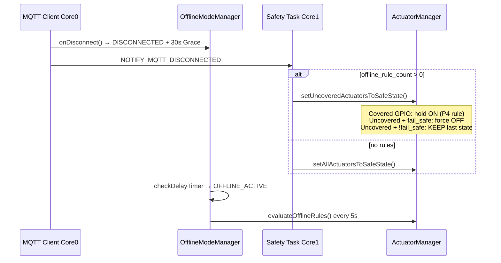

# Offline-Mode, Aktor-Safety und Disconnect — Forensik ESP_698EB4 (GPIO 14)

**Datum:** 2026-05-25  
**Gerät:** `ESP_698EB4` (Device-ID endet auf `B4`)  
**Fokus-Aktor:** GPIO 14 (`wasserpumpe`, `digital`)  
**Evidenz-Läufe:** `logs/verification/20260525T182535Z_*` (MQTT-Sturm + Disconnect), `20260525T183345Z_*` (REST PASS), PIO-Monitor `device-monitor-260525-201532.log`

**Linear-Kontext:** [AUT-481](https://linear.app/autoone/issue/AUT-481) (In Review, P0–P3 umgesetzt 2026-05-25)

---

## 1. Executive Summary

| Frage | Antwort (evidenzbasiert) |
|-------|---------------------------|
| Lief Offline-Mode nach Disconnect weiter? | **Ja.** `onDisconnect()` → Grace `DISCONNECTED` → nach Timer **`OFFLINE_ACTIVE`** → `evaluateOfflineRules()` alle 5 s. Parallel sofort `setUncoveredActuatorsToSafeState()` für Aktoren **ohne** Offline-Rule. |
| War das „sicher“? | **Teilweise beabsichtigt (AUT-66/P4):** GPIO **25** mit Offline-Rule → **bewusst ON gehalten** (`offline_rule_hold`). GPIO **14** **ohne** Rule → **nicht** abgeschaltet, weil `fail_safe_on_disconnect` effektiv **false** (von `critical=false` abgeleitet). |
| Blieb GPIO 14 nach manuellem ON an? | **Ja, sehr wahrscheinlich physisch ON** — letzter erfolgreicher Befehl vor Transport-Abbruch war **ON**; bei Disconnect `held=1 forced=0` (nur GPIO 25 gehalten). |
| Entspricht das der Nutzer-Erwartung „manueller Aktor ohne Offline-Rule → aus“? | **Nein im IST-Code** — Erwartung trifft nur zu, wenn `fail_safe_on_disconnect=true` (oder Server-Feld gesetzt). Default-Ableitung ist **`critical`**, Dashboard-Aktoren sind i. d. R. **non-critical** → **Last-State-Hold**. |

---

## 2. Zeitachse: MQTT-Verifikationslauf (20:25–20:28)

### 2.1 Vor Disconnect (funktioniert)

Aus `mqtt_actuator_window.log`:

1. OFF → `accepted` → `applied` → `response` + `status state=false`
2. ON → `applied`, `status state=true`
3. OFF → `applied`, `status state=false`
4. ON → `applied`, `status state=true` (Zeile 32–34)

### 2.2 Ab ~20:26:03 (Transport bricht)

Serial (`esp32_serial.log`, fragmentiert wegen parallelem UART-Leser):

- `MQTT_EVENT_DISCONNECTED`
- `[SAFETY-P4] disconnect notified (path=MQTT_EVENT)`
- `1 offline rules available, delegating covered actuators to P4`
- `[SAFETY] GPIO 25 offline_rule_hold` — **nur GPIO 25**
- `[SAFETY] Disconnect+rules: held=1 forced=0`

MQTT ab Zeile 35: weitere `actuator/14/command` (OFF/ON) **ohne** `response`/`status` — ESP war nicht mehr voll am Broker.

**Letzter erfolgreicher GPIO-14-Zustand in MQTT:** `state=true` (ON), kurz vor der Disconnect-Kaskade.

### 2.3 Offline-Mode läuft weiter

Serial-Stichworte nach Disconnect:

- `OFFLINE_ACTIVE — rules=1` / `offline_enter=1`
- `evaluateOfflineRules` / P4-Evaluation (GPIO 25 Regel)
- Mehrfache Disconnect/Reconnect-Versuche (TLS 3014), **kein** Server-LWT im gleichen Fenster (`docker/automationone-server.log` im Lauf: 0 LWT)

### 2.4 REST-Nachtest (20:34, API Robin)

Lauf `20260525T183345Z_ESP_698EB4_gpio14`: **PASS** — 4× OFF/ON über REST, kein Disconnect, 69 GPIO-14-Zeilen im Serial/PIO-Tail.

---

## 3. Architektur: Was passiert bei MQTT-Disconnect?



### 3.1 Code-Anker (Firmware)

| Schritt | Datei | Verhalten |
|---------|-------|-----------|
| Disconnect-Event | `mqtt_client.cpp` ~2335 | `offlineModeManager.onDisconnect()` + `NOTIFY_MQTT_DISCONNECTED` |
| Grace → aktiv | `offline_mode_manager.cpp` `onDisconnect`, `checkDelayTimer`, `activateOfflineMode` | 30 s Grace, dann `OFFLINE_ACTIVE` |
| Sofort-Safety | `safety_task.cpp` ~98–107 | Bei Rules>0: **nur uncovered** Aktoren sichern, covered → P4 |
| Per-GPIO-Policy | `actuator_manager.cpp` `setUncoveredActuatorsToSafeState` ~604–644 | Rule? hold : fail_safe? force OFF : **keep last state** |
| Rule-Abdeckung | `offline_mode_manager.cpp` `hasCoveringRule` ~1125 | Match auf `offline_rules_[i].actuator_gpio` |

### 3.2 AUT-66 / fail_safe Semantik (Kern des GPIO-14-Verhaltens)

```cpp
// actuator_types.h — Struct-Default
bool fail_safe_on_disconnect = true;

// config_manager.cpp — NVS-Laden wenn kein Override
config.fail_safe_on_disconnect = storageManager.getBool(new_key, config.critical);
```

**Wichtig:** Nach Config-Load ist der effektive Default **`critical`**, nicht `true`.  
Für `wasserpumpe` (GPIO 14): DB-`actuator_metadata` ohne `critical` → typisch **`critical=false`** → **`fail_safe_on_disconnect=false`** → bei Disconnect **Last State behalten**.

Zweig ohne Rule und `fail_safe=false`:

```cpp
// actuator_manager.cpp ~636–642
// fail_safe=false: keep last state
publishLatchedOffline(gpio, "offline_rule_hold", is_on);  // Alert-Reason irreführend!
```

**Forensik-Befund:** Alert-Reason `offline_rule_hold` wird auch bei **„kein Rule, State gehalten“** publiziert — erschwert MQTT/Server-Auswertung.

---

## 4. Offline-Rules auf ESP_698EB4

| GPIO | Aktor | Offline-Rule | Disconnect-Verhalten |
|------|-------|--------------|----------------------|
| **25** | `leuchte` | **1 Rule** (Serial: `offline_rule_hold`) | ON gehalten, P4 evaluiert weiter |
| **14** | `wasserpumpe` | **keine** Rule | **Last state** (bei ON → bleibt ON), `forced=0` im Log |

Server `config_builder.py` baut `offline_rules` nur aus passenden Logic-Rules; nicht jeder UI-Aktor hat eine Rule.

**Migration-Hinweis:** Alembic `fail_safe_on_disconnect` existiert im Repo, Spalte in **laufender DB nicht** (`column does not exist`) → Server pusht Feld nicht; ESP nutzt NVS-Ableitung von `critical`.

---

## 5. Server-Schicht bei Disconnect

| Pfad | GPIO 14 | Anmerkung |
|------|---------|-----------|
| LWT → `esp_devices.status=offline` | — | In MQTT-Lauf **nicht** ausgelöst (kurzer Transport-Glitch) |
| `setUncoveredActuatorsToSafeState` (Firmware) | Hold ON | **Hardware-Wahrheit** |
| `heartbeat_handler` Timeout → `actuator_states` reset | DB `off` | Erst nach Heartbeat-Timeout, kann **von Hardware abweichen** |
| AUT-481 LWT Intent-Sweep | DB Intents | Entkoppelt von GPIO-Physik |

**Nutzer sieht in UI ggf. „offline“ während Pumpe noch läuft** — klassisches Cross-Layer-Gap bis LWT/Timeout und fehlendes `fail_safe`.

---

## 6. Bewertung: „gut so“ vs. Bug

### 6.1 Offline-Mode weiterlaufen — **gewollt und gut**

- Lokale Autonomie für **regelgedeckte** Aktoren (GPIO 25) bei Broker-Ausfall.
- Grace-Timer verhindert sofortiges Flappen; `OFFLINE_ACTIVE` + 5 s Evaluation ist konsistent mit SAFETY-P4-Doku.

### 6.2 GPIO 14 ON gehalten — **IST korrekt zum Code, SOLL evtl. anders**

| Sicht | Bewertung |
|-------|-----------|
| **Code/AUT-66** | Non-critical + keine Rule → **kein** Force-OFF |
| **Produkt/Nutzer** | „Manuell ohne Offline-Rule → soll aus“ → erwartet `fail_safe_on_disconnect=true` |
| **Forensik** | Letzter Befehl ON + `forced=0` → Gefühl **bestätigt** |

**Offene Design-Frage (für Linear):** Soll „manueller Dashboard-Aktor ohne Offline-Rule“ **immer** `fail_safe=true` bekommen (Server-Default beim Anlegen), unabhängig von `critical`?

---

## 7. Test-Matrix (Pflicht für Follow-up-Agent)

| # | Szenario | Erwartung (wenn Produkt-SOLL = auto-OFF) | Prüfung |
|---|----------|------------------------------------------|---------|
| T1 | REST ON GPIO 14, dann Broker-Disconnect simulieren | GPIO 14 **OFF** physisch + `safety_forced_off` im Serial | Serial + optional Strom/Messung |
| T2 | Wie T1, aber `fail_safe_on_disconnect=true` in Config-Push | Force-OFF | Config-Payload + Serial |
| T3 | GPIO 25 mit Rule, Disconnect | ON gehalten, `offline_rule_hold` | Serial + MQTT `latched_offline` |
| T4 | Offline-Mode: Sensor weiter, Rule evaluiert 5 s | `OFFLINE_ACTIVE`, keine Guru-Meditation | Serial 2 min |
| T5 | REST paced 8× OFF/ON (≥2.5 s) | Kein LWT, Responses `applied` | `gpio14-b4-disconnect-verify.sh` + API |
| T6 | Nach Reconnect: Server-DB `actuator_states` vs. MQTT `status` | Konvergenz | DB + MQTT sub |

**Skript (REST):** `logs/verification/scripts/gpio14-b4-disconnect-verify.sh`  
**Log-Ordner:** `logs/verification/<run_id>/`

---

## 8. Referenzen

| Dokument / Pfad | Inhalt |
|-----------------|--------|
| `.claude/reference/api/MQTT_TOPICS.md` § `latched_offline` | `offline_rule_hold` vs `safety_forced_off` |
| `.claude/reference/STATE_AND_ALERT_OVERVIEW.md` | DB vs. Firmware-State |
| `El Trabajante/src/services/actuator/actuator_manager.cpp` | `setUncoveredActuatorsToSafeState` |
| `El Trabajante/src/tasks/safety_task.cpp` | `NOTIFY_MQTT_DISCONNECTED` |
| `logs/verification/GEGENPRUEFUNG-20260525.md` | Erste Gegenprüfung |
| Commits `0cee6d38`, `e15b6a26`, `6f617e0e` | AUT-481, Serialize, Correlation |

---

## 9. Empfohlene Linear/Slack-Kommunikation (Kurz)

- **Linear AUT-481:** Kommentar mit Verweis auf **dieses Dokument**, Befund GPIO 14 (fail_safe-Ableitung), T1–T6 offen; ggf. Sub-Task „Produkt-Default fail_safe für manuelle Aktoren“.
- **Slack:** Im **Thread zur AUT-481 / Pi-2 Disconnect-Arbeit** (nicht neuer Kanal) — Summary + Link auf `docs/analysen/OFFLINE-MODE-AKTOR-SAFETY-FORENSIK-ESP_698EB4-2026-05-25.md` + „REST-Pfad PASS, MQTT-Sturm TLS-Disconnect, GPIO14 hold ON by design unless fail_safe“.

---

*Erstellt aus Live-Logs und Code-Review. Keine Credentials in diesem Dokument.*
