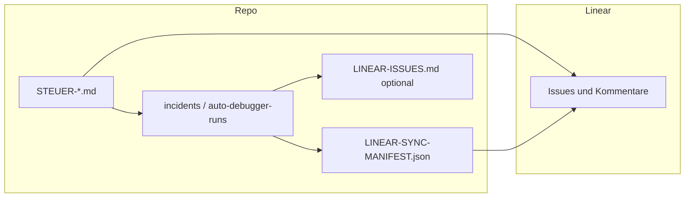

# Soll-Plan: auto-debugger Linear-Einbettung (TM-paralleler Workflow, 2026-04-24)

> **Ist-Analyse:** [ANALYSE-auto-debugger-linear-IST.md](./ANALYSE-auto-debugger-linear-IST.md)  
> **Onboarding:** [.claude/reference/linear-auto-debugger.md](../../.claude/reference/linear-auto-debugger.md)

## Zielbild

- **Linear** = kanonische SSOT für Arbeitspakete, Status, Relationen, Historie.
- **Repo** = Evidence-Store (Markdown, Logs, gebundene Reports) mit **Pflicht-Rückkopplung** (Kommentar + Pfad).
- **verify-plan** bleibt **strikt** Gate **D**; keine Produkt-Implementierung durch den Orchestrator ohne Gate.

## Sequenz A–F (Linear-Felder)

| Phase | Repo-Artefakte | Linear |
|-------|------------------|--------|
| **A** | `INCIDENT-LAGEBILD.md`, `CORRELATION-MAP.md` | Parent/Run: Kommentar Phase A + Evidence-Pfade |
| **B** | `TASK-PACKAGES.md`, `SPECIALIST-PROMPTS.md`, optional `LINEAR-ISSUES.md` | Sub-Issues; `parentId`, Labels; Dedup vorher |
| **C** | konsolidierte `TASK-PACKAGES.md` | Kommentar Checkliste / Sub-Issues |
| **D** | `VERIFY-PLAN-REPORT.md` | `VERIFY-PLAN: passed` / `failed` + BLOCKER-IDs |
| **E** | (Dev) | Abschlusskommentar mit Diff-/Pfad-Evidenz |
| **F** | `done_criteria` → Live-Schritte | Robin-Testprotokoll-Kommentar |

## Architektur (Überblick)



## Konfiguration

- `.claude/config/linear-auto-debugger.yaml` — Team, Labels, Defaults (keine Secrets).
- `.env` — `LINEAR_API_KEY` (siehe `.env.example`).

## Demo-Lauf (Akzeptanz — manuell mit API-Key)

**Artefaktordner:** `.claude/reports/current/auto-debugger-runs/demo-linear-embedding-2026-04-24/`  
**Steuerdatei:** `.claude/auftraege/auto-debugger/inbox/STEUER-demo-linear-embedding-2026-04-24.md`

### PowerShell (Repo-Root)

```powershell
cd "C:\Users\robin\Documents\PlatformIO\Projects\Auto-one"; $env:LINEAR_API_KEY="lin_api_..."; $d=".claude/reports/current/auto-debugger-runs/demo-linear-embedding-2026-04-24"; python scripts/linear/auto_debugger_sync.py search --config .claude/config/linear-auto-debugger.yaml --query "demo-linear-embedding"; python scripts/linear/auto_debugger_sync.py parent-ensure --config .claude/config/linear-auto-debugger.yaml --artifact-dir $d --run-id demo-linear-embedding-2026-04-24 --title "[demo] auto-debugger Linear embedding" --body-file "$d\DEMO-parent-body.md"; python scripts/linear/auto_debugger_sync.py child-ensure --config .claude/config/linear-auto-debugger.yaml --artifact-dir $d --slug PKG-01 --title "[demo] PKG-01 Spezialfrage A" --body-file "$d\DEMO-child-pkg01-body.md"; python scripts/linear/auto_debugger_sync.py child-ensure --config .claude/config/linear-auto-debugger.yaml --artifact-dir $d --slug PKG-02 --title "[demo] PKG-02 Spezialfrage B" --body-file "$d\DEMO-child-pkg02-body.md"
```

Nach Ausführung: `LINEAR-SYNC-MANIFEST.json` im Ordner `$d` enthält Parent- und Child-Identifiers — in **`LINEAR-ISSUES.md`** eintragen (Tabelle). Anschließend **verify-plan** simulieren: `VERIFY-PLAN-REPORT.md` im gleichen Ordner ist für die Demo als **passed**-Stub angelegt; optional:

```powershell
python scripts/linear/auto_debugger_sync.py comment-idempotent --config .claude/config/linear-auto-debugger.yaml --artifact-dir $d --issue PARENT_IDENTIFIER_FROM_MANIFEST --body-file "$d\DEMO-verify-plan-comment.md" --key verify-plan
```

(`PARENT_IDENTIFIER_FROM_MANIFEST` durch Wert aus `LINEAR-SYNC-MANIFEST.json` ersetzen, z. B. `AUT-xxx`.)

### Abnahme-Checkliste (messbar)

| # | Kriterium | Status |
|---|-----------|--------|
| 1 | Parent + ≥2 Sub-Issues mit Kommentaren/Evidence-Pfaden | Ausstehend: Robin führt PowerShell-Kette mit `LINEAR_API_KEY` aus; Manifest + `LINEAR-ISSUES.md` befüllen |
| 2 | Kein Ordner-only ohne Linear, außer `linear_local_only: true` | **Erfüllt** (Skill, Agent, STEUER-VORLAGE) |
| 3 | Dedup: `search` vor `parent-ensure` | **Erfüllt** (Befehlssequenz oben) |
| 4 | Onboarding unter 10 Minuten | **Erfüllt** (`.claude/reference/linear-auto-debugger.md` + `.env.example`) |
| 5 | verify-plan: gebundener `VERIFY-PLAN-REPORT.md` + Linear-Kommentar-Verweis | **Teil:** Stub im Demo-Ordner vorhanden; Linear-Kommentar nach Ausführung von `comment-idempotent` mit Parent-Identifier |

## Migrationshinweis

Alte `incidents/*` nicht massenimportieren. Optional: ein Linear-Kommentar mit Ordner-Link + neues Manifest für Folgesync.
