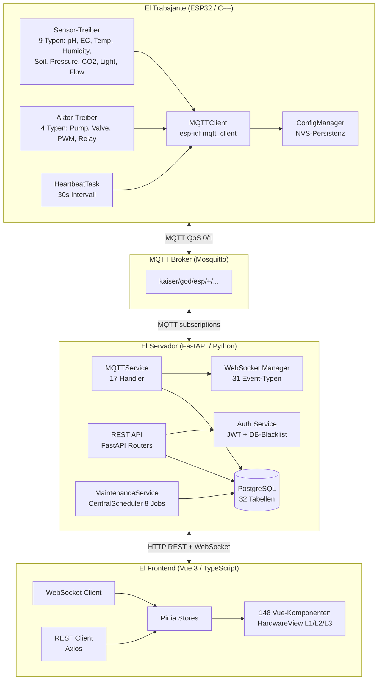
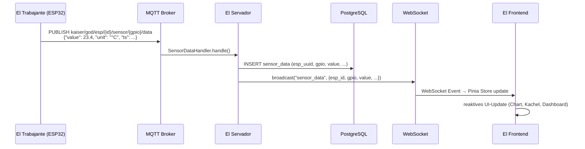
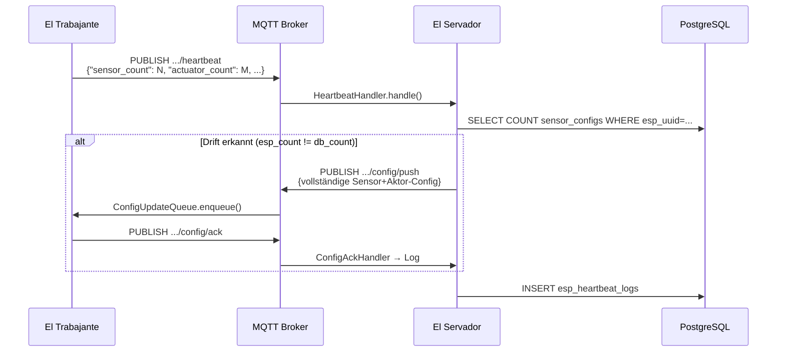
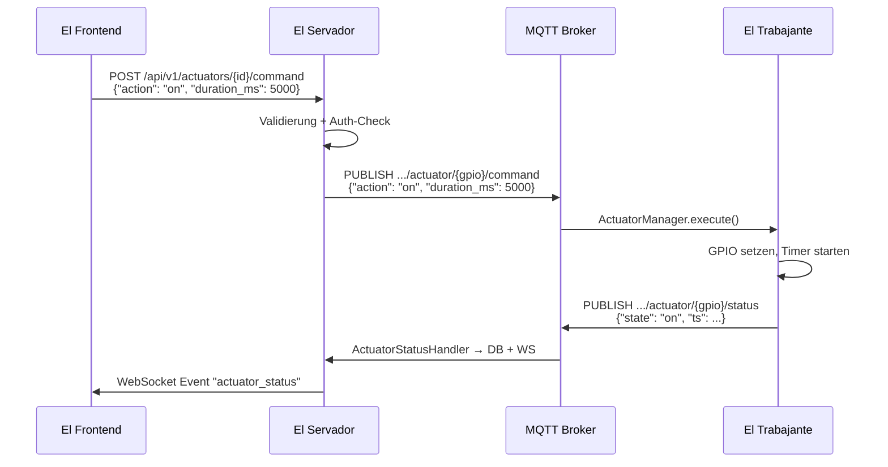
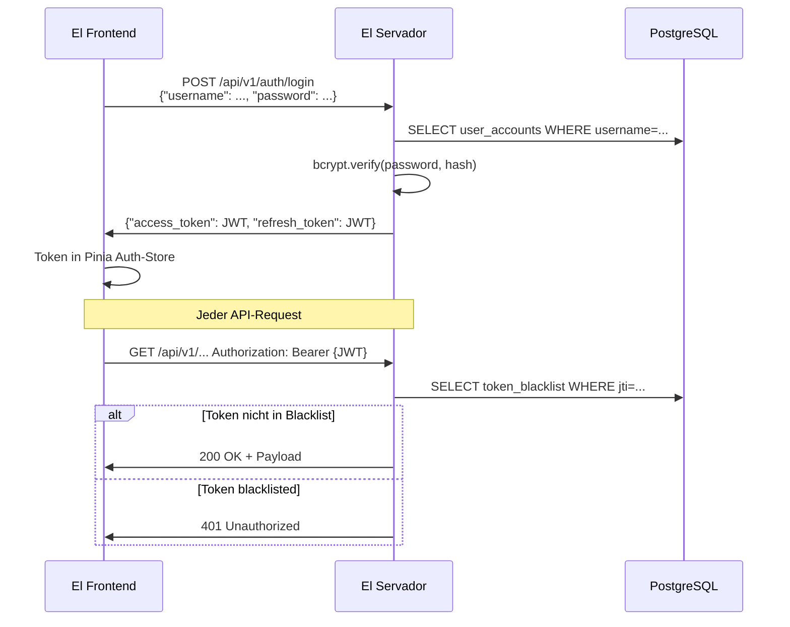

# E1 — Architektur-Gesamtüberblick AutomationOne

> **Linear:** [AUT-177](https://linear.app/autoone/issue/AUT-177)
> **Status:** Done — 2026-04-26
> **Zuständig:** TM (Technical Manager)
> **Basis:** E0-Reality-Check (code-verifiziert), keine Annahmen ohne Evidenz

---

## 1. System-Topologie

AutomationOne ist ein **server-zentrisches IoT-Framework** für Gewächshausautomation.
Die Kernregel ist absolut: **Alle Geschäftslogik liegt auf dem Server. ESP32 = dummer Sensor-/Aktoragent.**



---

## 2. Schichten-Beschreibung

### 2.1 El Trabajante (ESP32 / C++)

**Pfad:** `El Trabajante/src/`  
**Build-Tool:** PlatformIO (`pio run -e seeed`)  
**Ziel-Hardware:** Seeed XIAO ESP32-S3

| Komponente | Pfad | Funktion |
|---|---|---|
| `main.cpp` | `src/main.cpp` | Bootstrap, Task-Spawning |
| `SensorManager` | `src/services/sensor/` | Sensor-Registry, Polling-Loop |
| `ActuatorManager` | `src/services/actuator/` | Aktor-Registry, Command-Dispatch |
| `ConfigManager` | `src/services/config/` | NVS-Lesen/Schreiben, Config-Sync |
| `MQTTClient` | `src/services/communication/` | MQTT Publish/Subscribe, Reconnect |
| `OfflineModeManager` | `src/services/safety/` | Fallback bei Verbindungsverlust |
| `ConfigUpdateQueue` | `src/tasks/` | Queue für eingehende Config-Commands |

**NVS-Schema (code-verifiziert):**
```
sen_%d_type    → SensorType (uint8)
sen_%d_gpio    → GPIO-Nummer (uint8)
sen_%d_i2c     → I2C-Adresse (uint8)   ← existiert (I1 widerlegt)
sen_%d_name    → Name (string)
act_%d_type    → ActuatorType (uint8)
act_%d_gpio    → GPIO-Nummer (uint8)
```

> [!INKONSISTENZ] I8 — clean_session=true bei QoS-1-Subscriptions
>
> **Beobachtung:** `mqtt_cfg.disable_clean_session = 0` in `mqtt_client.cpp:335`. Der Broker verwirft alle QoS-1/2-Nachrichten für den Client bei jedem Disconnect. Config-Commands, die während einer Unterbrechung gesendet werden, gehen verloren.
> **Korrekte Stelle:** [E2 Firmware-Schicht — Abschnitt MQTT-Client](../10-firmware/E2-firmware-schicht.md#mqtt-client)
> **Empfehlung:** `disable_clean_session = 1` + persistente Client-ID setzen; alternativ Config-Commands über ACK-Mechanismus absichern.
> **Erst-Erkennung:** E0, 2026-04-26

> [!INKONSISTENZ] I2 — actuator_type Normalisierung: "relay" vs. "digital"
>
> **Beobachtung:** ESP32 speichert Aktor-Typ als konkrete Hardware-Typ-Enum (`RELAY`, `PUMP`, `VALVE`, `PWM`). Server normalisiert alle auf `"digital"` in der Config-Response. Frontend erhält manchmal `"relay"` aus Zustands-Topics, manchmal `"digital"` aus der Config-API.
> **Korrekte Stelle:** [E2 Firmware — Abschnitt Aktor-Typen](../10-firmware/E2-firmware-schicht.md#aktor-typen), [E4 Frontend — Abschnitt Aktor-Rendering](../30-frontend/E4-frontend-schicht.md#aktor-rendering)
> **Empfehlung:** Einheitliches Enum serverseitig; Frontend sollte nur einen Quell-Typ kennen.
> **Erst-Erkennung:** E0, 2026-04-26

---

### 2.2 El Servador (FastAPI / Python)

**Pfad:** `El Servador/god_kaiser_server/src/`  
**Framework:** FastAPI 0.110+, SQLAlchemy 2.0, Alembic  
**Linter:** ruff

#### 2.2.1 MQTT-Schicht (17 Handler)

| Handler | Topic-Pattern | Funktion |
|---|---|---|
| `HeartbeatHandler` | `.../heartbeat` | Config-Drift-Erkennung, Resync-Trigger |
| `SensorDataHandler` | `.../sensor/+/data` | Sensor-Daten → DB + WS-Broadcast |
| `SensorStatusHandler` | `.../sensor/+/status` | Online/Offline-Status |
| `ActuatorStatusHandler` | `.../actuator/+/status` | Aktor-Zustand |
| `ConfigAckHandler` | `.../config/ack` | Config-Bestätigung von ESP32 |
| `ErrorHandler` | `.../error` | Fehler-Events → Notification-Pipeline |
| `LwtHandler` | `$SYS/.../lwt` | Last-Will: ESP32 Offline-Erkennung |
| `KaiserHandler` | `.../kaiser` | Server-Command-Routing (vollständig aktiv) |
| *(9 weitere)* | | Kalibrierung, Debug, Metrics, … |

> [!INKONSISTENZ] I5 — VIRTUAL-Filter: 8 Callpoints, aber nur 1 Filterstelle
>
> **Beobachtung:** `build_combined_config()` filtert VIRTUAL-Sensor-Typen an einem einzigen Ort. Code-Scan ergab 8 Callpoints, die Config-Listen verarbeiten — nur `build_combined_config()` enthält den Filter. Neue Callpoints würden VIRTUAL-Sensoren ungeprüft weitergeben.
> **Korrekte Stelle:** [E3 Server-Schicht — Abschnitt Config-Builder](../20-server/E3-server-schicht.md#config-builder)
> **Empfehlung:** Filter in das Sensor-Repository-Layer verlagern (immer gefiltert zurückgeben), nicht in den Builder.
> **Erst-Erkennung:** E0, 2026-04-26

#### 2.2.2 REST-API-Schicht

FastAPI Routers unter `src/api/v1/`. Alle Endpunkte hinter JWT-Auth außer `/auth/login` und `/auth/refresh`.

**Wichtige Router-Gruppen:**
- `esp_router` — ESP-Registrierung, Heartbeat-History
- `sensor_router` — Sensor-CRUD, Kalibrierung
- `actuator_router` — Aktor-CRUD, Command-Dispatch
- `zone_router` — Zonen + Subzonen-Verwaltung
- `rule_router` — Logic Engine (Rule-Nodes, Conditions)
- `auth_router` — Login, Refresh, Logout (Blacklist)
- `debug_router` — Admin-Only, Diagnose-Endpoints

> [!INKONSISTENZ] I10 — sensor_type_registry.py liegt unter src/sensors/, nicht src/services/
>
> **Beobachtung:** In AUT-175 als potentieller Pfadfehler gelistet. E0 bestätigt: `src/sensors/sensor_type_registry.py` — das ist der tatsächliche Pfad. Die Doku hatte `src/services/` angenommen.
> **Korrekte Stelle:** [E3 Server-Schicht — Abschnitt Sensor-Registry](../20-server/E3-server-schicht.md#sensor-registry)
> **Empfehlung:** Alle Agenten verwenden `src/sensors/` als kanonischen Pfad.
> **Erst-Erkennung:** E0, 2026-04-26

#### 2.2.3 Datenbank-Schicht

PostgreSQL mit SQLAlchemy 2.0 ORM. 60 Alembic-Migrationen, 4 Merge-Points.

| Modell (tatsächlicher Name) | Tabelle | Soft-Delete |
|---|---|---|
| `UserAccount` | `user_accounts` | Nein (cascade) |
| `ESPDevice` | `esp_devices` | Ja (`deleted_at`) |
| `Zone` | `zones` | Ja (`deleted_at`) |
| `SensorConfig` | `sensor_configs` | Nein (cascade) |
| `SensorData` | `sensor_data` | Nein (Time-Series, nie gelöscht) |
| `ESPHeartbeatLog` | `esp_heartbeat_logs` | Nein |
| `NotificationLog` | `notification_logs` | Nein |
| *(25 weitere)* | | |

> [!INKONSISTENZ] I3 — Tabellen-Namens-Drift in älterer Dokumentation
>
> **Beobachtung:** Ältere Doku nennt `users` und `heartbeat_logs`. Tatsächliche DB-Modelle (code-verifiziert): `user_accounts` und `esp_heartbeat_logs`. SQLAlchemy `__tablename__` bestätigt.
> **Korrekte Stelle:** [E6 Datenbank-Schema](../50-querschnitt-db/E6-datenbank-schema.md)
> **Empfehlung:** Alle Referenzen auf tatsächliche Tabellennamen migrieren.
> **Erst-Erkennung:** E0, 2026-04-26

> [!INKONSISTENZ] I6 — Soft-Delete nur für esp_devices + zones
>
> **Beobachtung:** Nur `ESPDevice` und `Zone` haben `deleted_at`. `SensorConfig`, `UserAccount`, `NotificationLog` etc. werden hard-deleted (cascade). Wiederherstellung nach versehentlichem Löschen ist nur für Geräte und Zonen möglich.
> **Korrekte Stelle:** [E6 Datenbank-Schema — Abschnitt Löschverhalten](../50-querschnitt-db/E6-datenbank-schema.md#loeschverhalten)
> **Empfehlung:** Entscheidung dokumentieren: bewusst (Datenschutz) oder Lücke (fehlende Implementierung).
> **Erst-Erkennung:** E0, 2026-04-26

> [!INKONSISTENZ] E4 (neu) — Alembic: 4 Merge-Points ohne Linearisierung
>
> **Beobachtung:** Migration-Historie enthält 4 `alembic merge`-Punkte, die Parallelentwicklung zusammenführen. Die resultierende DAG ist nicht linear — `alembic upgrade head` funktioniert, aber `alembic history` ist schwer lesbar und Rollbacks sind komplex.
> **Korrekte Stelle:** [E6 Datenbank-Schema — Abschnitt Migrations-Historie](../50-querschnitt-db/E6-datenbank-schema.md#migrations-historie)
> **Empfehlung:** Bei nächster Gelegenheit eine lineare Squash-Migration erstellen (nach vollständigem Test).
> **Erst-Erkennung:** E0, 2026-04-26

---

### 2.3 El Frontend (Vue 3 / TypeScript)

**Pfad:** `El Frontend/src/`  
**Stack:** Vue 3 + Vite + Pinia + Tailwind CSS + TypeScript strict  
**Komponenten:** 148 Vue-Komponenten (Stand E0, 2026-04-26)

#### 2.3.1 View-Hierarchie

```
App.vue
├── HardwareView (Route-basiertes 3-Level-Zoom-System)
│   ├── L1: Übersicht — ZonePlate + DeviceMiniCard
│   ├── L2: Orbital/Device — Sensor-Kacheln, Aktor-Kacheln
│   └── L3: Modals — SensorConfigPanel, ActuatorCommandPanel
├── SensorsView (/sensors) — Wissensdatenbank (kein Config-Edit)
├── RulesView — Logic Engine / Rule-Node-Editor
├── DashboardView — Charts, Metriken
└── AuthView — Login
```

**Wichtige Regel:** Sensor-Konfiguration erfolgt **ausschließlich** in HardwareView (SensorConfigPanel). Die SensorsView unter `/sensors` ist eine Wissensdatenbank, kein Konfigurations-Interface.

> [!INKONSISTENZ] I4 — CSS-Token-Präfix: kein `--ao-*`
>
> **Beobachtung:** AUT-175 nahm an, CSS Custom Properties folgen dem `--ao-*` Präfix. Code-Scan zeigt: Tailwind-basiertes Design-System ohne Custom-Property-Präfix. Semantische Token-Namen wie `--color-primary`, `--spacing-md` — kein `--ao-*` gefunden.
> **Korrekte Stelle:** [E4 Frontend-Schicht — Abschnitt Design-System](../30-frontend/E4-frontend-schicht.md#design-system)
> **Empfehlung:** Doku-Aussagen zu CSS-Token-Präfixen auf Tailwind-Konfiguration basieren.
> **Erst-Erkennung:** E0, 2026-04-26

> [!INKONSISTENZ] E1 (neu) — WebSocket EventType-Union zu eng
>
> **Beobachtung:** TypeScript-Union für WebSocket-Events (in `types/` oder ähnlich) deckt ~16 Event-Typen ab. E0-Scan ergab 31 tatsächliche Event-Typen im Server-WS-Manager. 15 Event-Typen sind im Frontend nicht typisiert — führt zu `any`-Casting in Event-Handlern.
> **Korrekte Stelle:** [E4 Frontend-Schicht — Abschnitt WebSocket-Vertrag](../30-frontend/E4-frontend-schicht.md#websocket-vertrag)
> **Empfehlung:** TypeScript-Union aus Server-WS-Event-Enum generieren oder manuell auf 31 Typen erweitern.
> **Erst-Erkennung:** E0, 2026-04-26

> [!INKONSISTENZ] I13 — sensorId-Format und DS18B20-Overwrite-Bug
>
> **Beobachtung:** sensorId-Format `{espId}:{gpio}:{sensorType}` ist komplex. Bei mehreren DS18B20-Sensoren auf demselben OneWire-Bus (gleiches GPIO) überschreibt `simulation_config[{gpio}_{sensor_type}]` den vorherigen Eintrag (MEMORY NB6 dokumentiert diesen Bug als CRITICAL). Das sensorId-Format ist Teil des Problems: Adresse/Index fehlt im Key.
> **Korrekte Stelle:** [E4 Frontend-Schicht — Abschnitt sensorId-Konstruktion](../30-frontend/E4-frontend-schicht.md#sensorid-konstruktion)
> **Empfehlung:** sensorId auf `{espId}:{gpio}:{sensorType}:{address_or_index}` erweitern.
> **Erst-Erkennung:** E0, 2026-04-26 (ursprünglich MEMORY NB6)

---

## 3. Kommunikations-Matrix

| Von → Nach | Protokoll | Port | Auth | Richtung |
|---|---|---|---|---|
| ESP32 → Broker | MQTT QoS 0/1 | 1883 | Client-ID | bidirektional |
| Broker → Server | MQTT (intern) | 1883 | Service | bidirektional |
| Frontend → Server | HTTP/HTTPS | 8000 | JWT Bearer | Request/Response |
| Frontend ↔ Server | WebSocket | 8000 | JWT (Handshake) | bidirektional |
| Server → DB | PostgreSQL | 5432 | DB-User | intern |
| Grafana → Server | HTTP (Metrics) | 8000 | — | pull |
| Loki ← Server | HTTP (Logs) | 3100 | — | push |

**Topic-Prefix:** `kaiser/god/esp/{esp_uuid}/...`  
**Topic-Details:** → [E5 MQTT-Topic-Matrix](../40-querschnitt-mqtt/E5-mqtt-topic-matrix.md)

---

## 4. Datenflusskarten

### 4.1 Sensor-Daten-Fluss (Nominalpfad)



### 4.2 Heartbeat + Config-Resync-Fluss



### 4.3 Aktor-Command-Fluss



### 4.4 Auth-Fluss



---

## 5. Querschnittsthemen-Vorschau

Jedes der folgenden Themen hat eine eigene Etappe (E2–E10). Dieser Abschnitt gibt den Überblick, welche Themen in welcher Etappe vertieft werden.

| Thema | Etappe | Schlüssel-Konzepte |
|---|---|---|
| Firmware-Schicht | [E2](../10-firmware/E2-firmware-schicht.md) | SensorManager, NVS-Schema, SHT31-I2C, clean_session |
| Server-Schicht | [E3](../20-server/E3-server-schicht.md) | 17 Handler, VIRTUAL-Filter, sensor_type_registry |
| Frontend-Schicht | [E4](../30-frontend/E4-frontend-schicht.md) | 148 Komponenten, HardwareView L1–L3, WS-Events |
| MQTT-Topics | [E5](../40-querschnitt-mqtt/E5-mqtt-topic-matrix.md) | Topic-Matrix, QoS-Matrix, LWT-Schema |
| Datenbank | [E6](../50-querschnitt-db/E6-datenbank-schema.md) | 32 Tabellen, Soft-Delete, 4 Alembic-Merge-Points |
| Auth + Security | [E7](../60-querschnitt-auth/E7-auth-security-acl.md) | JWT-Blacklist, ACL, Admin-Endpoints |
| Background-Services | [E8](../70-querschnitt-hintergrund/E8-background-services.md) | CentralScheduler, 8 Jobs, MaintenanceService |
| Observability | [E9](../70-querschnitt-hintergrund/E9-observability-tests-cicd.md) | Grafana, Prometheus, Loki, pytest, Vitest |
| Löschpfade | [E10](../80-querschnitt-loeschpfade/E10-loeschpfade.md) | Cascade vs. Soft-Delete, Restore-Flows |

---

## 6. IST-Zählungen (E0-verifiziert, Stand 2026-04-26)

| Metrik | Verifizierter IST-Wert | Alte Doku-Aussage |
|---|---|---|
| Sensor-Typen | 9 | 9 ✓ |
| Aktor-Typen | 4 | 4 ✓ |
| MQTT-Handler (Server) | **17** | 13 ✗ |
| Vue-Komponenten (Frontend) | **148** | ~97 ✗ |
| WebSocket-Event-Typen | **31** | 16 ✗ |
| DB-Tabellen (PostgreSQL) | 32 | 31 ✗ |
| Alembic-Migrationen | 60 | — |
| Alembic-Merge-Points | 4 | — |
| MaintenanceService Jobs | 8 | — |
| Background-Worker | 1 (CentralScheduler Singleton) | — |
| JWT-Blacklist Mechanismus | DB-Tabelle `token_blacklist` | — |
| Notification-Trigger-Quellen | 4 | — |

---

## 7. Bekannte Inkonsistenzen (E1-Zusammenfassung)

Vollständige Inkonsistenz-Liste: → [README.md Tracking-Tabelle](../README.md#bekannte-inkonsistenzen-aus-aut-175-tracking-liste)

Für E1 relevante (systemübergreifende) Inkonsistenzen:
- **I2** (E2/E4): actuator_type Normalisierung relay↔digital zwischen Schichten
- **I8** (E2/E5): clean_session=true blockiert QoS-1-Garantie
- **E1** (E4): WS-EventType-Union 16 statt 31 Typen
- **I3** (E3/E6): Tabellennamen-Drift (users→user_accounts)

Schicht-interne Inkonsistenzen werden in der jeweiligen Etappe (E2–E10) inline kommentiert.

---

## 8. Zusammenfassung für Folge-Etappen-Agenten

**Was E1 liefert:**
- Vollständige System-Topologie als Referenz (Mermaid-Diagramme, Kommunikations-Matrix)
- Verifizierte IST-Zählungen für alle Schichten
- Datenfluss-Karten für 4 Kernszenarien
- Querschnittsthemen-Vorschau mit Etappen-Links

**Was die Folge-Etappen-Agenten wissen müssen:**
1. **Pfade sind verifiziert** — `El Trabajante/src/`, `El Servador/god_kaiser_server/src/`, `El Frontend/src/`
2. **Zählungen aus E0 gelten** — 17 Handler, 148 Komponenten, 31 WS-Events, 32 DB-Tabellen
3. **Inkonsistenz-Konvention** ist bindend — Inline `[!INKONSISTENZ]`/`[!ANNAHME]` Blöcke gemäß README.md
4. **Keine Code-Änderungen** — reiner Dokumentations-Sprint
5. **I1, I7, I11, I12, I14 sind widerlegt** — nicht als offene Inkonsistenzen behandeln

**Ungesicherte Annahmen (noch zu prüfen durch Spezial-Etappen):**

> [!ANNAHME] SHT31 I2C-Kommando-Sequenz in E2 zu verifizieren
>
> **Basis:** E0 hat `0x24, 0x00` in `SHT31Sensor.cpp` gefunden. Vollständige Protokoll-Konformität (CRC, Measurement-Duration, Wiederholrate) wird in E2 geprüft.
> **Zu verifizieren:** E2-Agent: SHT31-Datenblatt-Konformität der I2C-Implementierung.

> [!ANNAHME] NotificationRouter 4 Trigger-Quellen in E8 zu detaillieren
>
> **Basis:** E0 hat `NotificationRouter` mit Fingerprint-Deduplication gefunden. Genauer Trigger-Flow (welche 4 Quellen, welche Bedingungen) wird in E8 beschrieben.
> **Zu verifizieren:** E8-Agent: `notification_bridge.py` und `ai_notification_bridge.py` vollständig analysieren.
