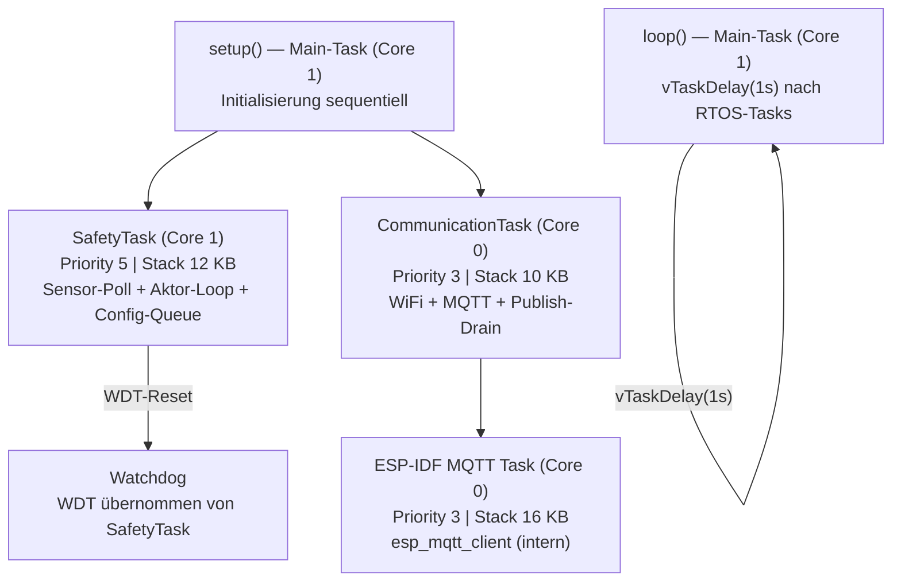
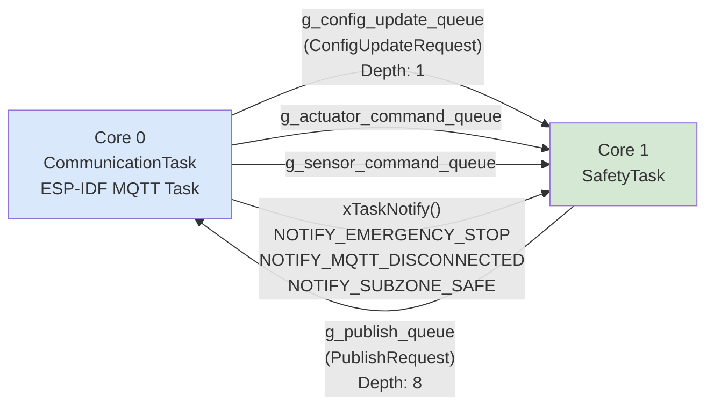
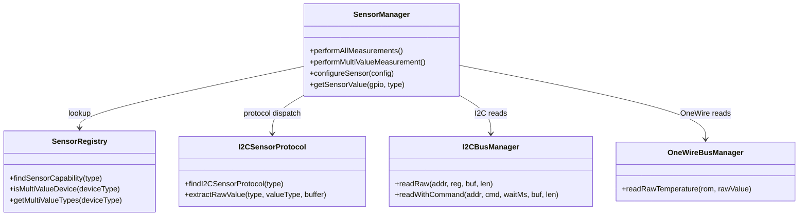
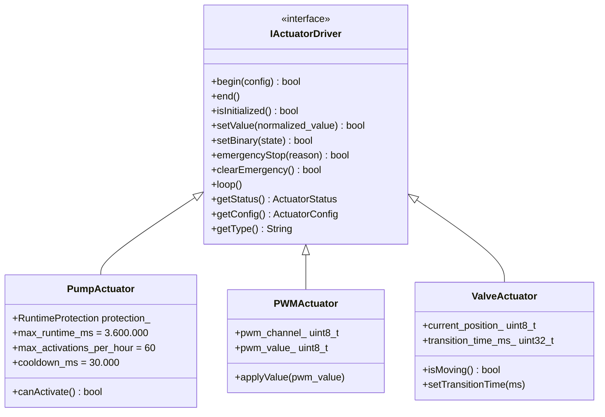
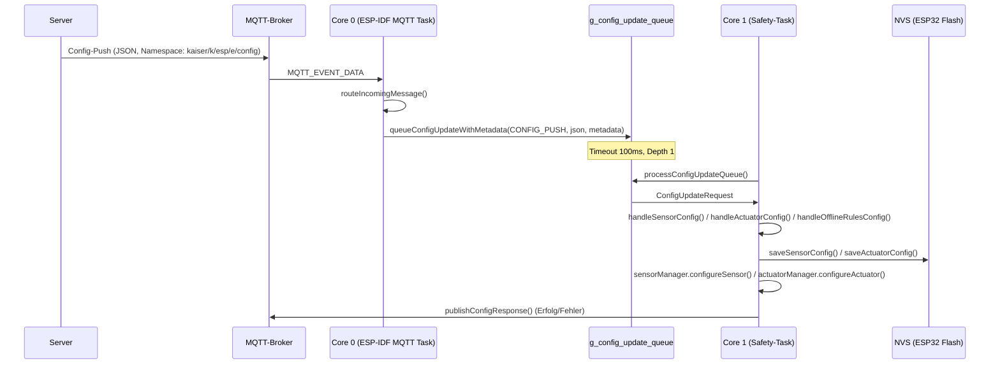
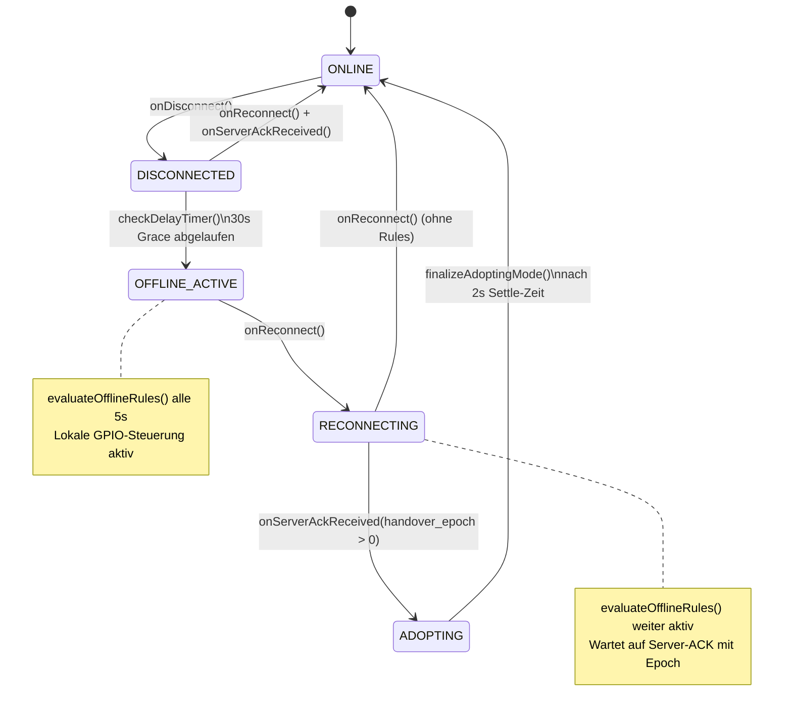

# E2 — Firmware-Schicht (El Trabajante)

**Etappe:** E2 | **Datum:** 2026-04-26 | **Autor:** esp32-dev Agent
**Analysierten Quelldateien:** `El Trabajante/src/main.cpp`, `services/sensor/`, `services/actuator/`, `services/config/`, `services/communication/`, `services/safety/`, `tasks/`, `drivers/`, `models/`

---

## 1. Überblick und Build-Umgebung

### 1.1 Ziel-Hardware

| Parameter | Wert |
|-----------|------|
| Primäres Target | Seeed XIAO ESP32-S3 (`-e seeed`) |
| Dev-Target | ESP32 Dev-Board (`-e esp32_dev`) |
| Wokwi-Targets | `wokwi_esp01/02/03` (Simulation, NVS in RAM) |
| Build-Tool | PlatformIO (`platformio.ini`) |
| Framework | Arduino-ESP32 (ESP-IDF 4.x unter der Haube) |

### 1.2 Ordnerstruktur

```
El Trabajante/src/
├── main.cpp                          ← Bootstrap + MQTT-Handler + Task-Spawning
├── drivers/                          ← GPIO, I2C-Bus, OneWire-Bus, PWM, I2C-Protokoll
├── services/
│   ├── sensor/                       ← SensorManager, SensorFactory, PiEnhancedProcessor
│   │   └── sensor_drivers/           ← Stub-Header (Impl. in sensor_manager.cpp + drivers/)
│   ├── actuator/                     ← ActuatorManager, SafetyController
│   │   └── actuator_drivers/         ← IActuatorDriver, PumpActuator, PWMActuator, ValveActuator
│   ├── communication/                ← MQTTClient, WiFiManager
│   ├── config/                       ← ConfigManager, StorageManager, RuntimeReadinessPolicy
│   ├── provisioning/                 ← ProvisionManager, PortalAuthority
│   └── safety/                       ← OfflineModeManager
├── tasks/                            ← FreeRTOS-Task-Definitionen, Queues
├── models/                           ← SensorTypes, ActuatorTypes, SensorRegistry, ErrorCodes
├── error_handling/                   ← ErrorTracker, CircuitBreaker, HealthMonitor
├── utils/                            ← Logger, TopicBuilder, TimeManager, WatchdogStorage
└── config/                           ← FeatureFlags, FirmwareVersion, Hardware-Configs
    └── hardware/                     ← esp32_dev.h, xiao_esp32c3.h
```

### 1.3 Architektur-Prinzip

```
Server (Single Source of Truth)
    ↕ MQTT
ESP32 (El Trabajante)
  ├── Sensordaten: RAW lesen → via MQTT senden (kein Processing)
  ├── Aktoren: MQTT-Befehle empfangen → GPIO steuern
  └── Config: NVS ← MQTT Config-Push (via Server)
```

**ESP32 enthält KEINE Business-Logik.** Die einzige genehmigte Ausnahme ist `OfflineModeManager` (SAFETY-P4), explizit durch TM autorisiert.

---

## 2. Task-Architektur (FreeRTOS)

### 2.1 Task-Übersicht



### 2.2 Detaillierte Task-Parameter

| Task | Core | Priorität | Stack (Bytes) | Zweck |
|------|------|-----------|---------------|-------|
| `SafetyTask` | 1 | 5 | 12.288 | Sensor-Polling, Aktor-Loops, Config-Queue draining, SAFETY-P4 |
| `CommunicationTask` | 0 | 3 | 10.240 | WiFi-Management, MQTT-Loop, Heartbeat-Trigger, Publish-Queue draining |
| `ESP-IDF MQTT Task` | 0 | 3 | 16.384 | Interner MQTT-Stack (esp_mqtt_client), Event-Dispatch |
| `Main/Loop Task` | 1 | 1 | — | Nach Task-Start: nur `vTaskDelay(1s)`, WDT-Ownership abgegeben |

> [!ANNAHME] Stack-Sizes Wokwi vs. Real-Hardware
>
> **Basis:** Der Kommentar `#ifndef WOKWI_SIMULATION esp_task_wdt_add(NULL) #endif` in `safety_task.cpp:53` zeigt, dass Watchdog in Wokwi deaktiviert ist.
> **Zu verifizieren:** Ob die Stack-Größen in allen Environments (seeed, esp32_dev, wokwi) identisch sind oder ob platformio.ini environment-spezifische Overrides enthält.

### 2.3 Inter-Task-Kommunikation



**Queues im Detail:**

| Queue | Richtung | Tiefe | Payload-Größe | Timeout |
|-------|----------|-------|---------------|---------|
| `g_config_update_queue` | Core 0 → Core 1 | 1 | 4.352 B (`CONFIG_PAYLOAD_MAX_LEN`) | 100 ms |
| `g_publish_queue` | Core 1 → Core 0 | 8 | 1.536 B (`PUBLISH_PAYLOAD_MAX_LEN`) | Non-blocking |
| `g_actuator_command_queue` | Core 0 → Core 1 | — | — | — |
| `g_sensor_command_queue` | Core 0 → Core 1 | — | — | — |

### 2.4 Safety-Task Loop-Reihenfolge

Pro Loop-Iteration (nominell alle 10 ms):

1. `xTaskNotifyWait()` — Cross-Core-Notifications auswerten (Emergency Stop, MQTT Disconnect, Subzone Safe)
2. `esp_task_wdt_reset()` — Watchdog zurücksetzen
3. `sensorManager.performAllMeasurements()` — Sensor-Polling
4. `actuatorManager.processActuatorLoops()` — Aktor Auto-Off Timer
5. `checkServerAckTimeout()` — SAFETY-P1: Server-ACK-Timeout prüfen
6. `processActuatorCommandQueue()` — MQTT-Aktor-Befehle anwenden
7. `processSensorCommandQueue()` — MQTT-Sensor-Befehle anwenden
8. `processConfigUpdateQueue()` — Config-Push von Core 0 anwenden
9. `healthMonitor.loop()` — Health-Metriken
10. `offlineModeManager.checkDelayTimer()` — SAFETY-P4: 30s Grace-Timer
11. `offlineModeManager.evaluateOfflineRules()` — SAFETY-P4: Offline-Rules (alle 5s)

---

## 3. Sensor-Subsystem

### 3.1 SensorManager

**Pfad:** `El Trabajante/src/services/sensor/sensor_manager.h` + `.cpp`

**Singleton-Pattern:**
```cpp
SensorManager& sensorManager = SensorManager::getInstance();
```

**Interner Zustand:**
```cpp
SensorConfig sensors_[MAX_SENSORS];   // MAX_SENSORS = 10 (default)
uint8_t sensor_count_;
ValueCacheEntry value_cache_[20];      // SAFETY-P4: letzte Messwerte für Offline-Rules
```

**Polling-Mechanismus (`performAllMeasurements`):**

- Vom Safety-Task (Core 1) jede Loop-Iteration aufgerufen
- Prüft pro Sensor `measurement_interval_ms` (default 30.000 ms)
- Sensor-Circuit-Breaker: OPEN nach 10 aufeinanderfolgenden Fehlern → Sensor wird 5 min übersprungen
- Für Multi-Value-Sensoren (SHT31, BMP280, BME280): `performMultiValueMeasurement()` gibt mehrere `SensorReading`s zurück
- Jedes erfolgreiche Reading wird via `publishSensorReading()` als MQTT-Payload gesendet
- `raw_mode = true` ist immer gesetzt — ESP32 sendet RAW-Rohdaten, Server verarbeitet

**Sensor-Lookup (Mutex-geschützt):**
```cpp
xSemaphoreTake(g_sensor_mutex, portMAX_DELAY);
// sensors_[] lesen/schreiben
xSemaphoreGive(g_sensor_mutex);
```

**Lokale Preview-Konversion (`applyLocalConversion`):**

ESP32 berechnet einen Näherungswert für Human-Readable MQTT-Payload. Server re-verarbeitet mit Kalibrierung:

| Sensor-Typ | Formel |
|-----------|--------|
| `sht31_temp` | `T(°C) = -45 + 175 × (raw / 65535)` |
| `sht31_humidity` | `H(%) = 100 × (raw / 65535)` |
| `ds18b20` | `T(°C) = raw × 0,0625` (12-bit) |
| `bmp280_temp`, `bme280_temp` | `T(°C) = raw / 100` (Centidegrees) |
| `bmp280_pressure`, `bme280_pressure` | `P(hPa) = raw / 100` (Centipascals) |
| `bme280_humidity` | `H(%) = raw / 1024` (1024stel-Prozent) |
| `ph_sensor`, `ec_sensor`, `moisture` | Kein lokales Konvert (ADC-Raw, `requiresCalibration()` Guard) |

**SAFETY-P4 Value-Cache:**
- Max 20 Einträge (GPIO × Sensor-Typ)
- Stale-Schwelle: 5 Minuten (`VALUE_CACHE_STALE_MS = 300.000 ms`)
- Genutzt von `OfflineModeManager.evaluateOfflineRules()` ohne neue Messung

### 3.2 Sensor-Treiber-Übersicht (alle registrierten Typen)



**Vollständige Sensor-Typ-Tabelle:**

| ESP32-Typ (sensor_type) | Server-Typ | Gerät | Bus | I2C-Adresse | Multi-Value |
|------------------------|-----------|-------|-----|------------|-------------|
| `temperature_sht31` / `sht31_temp` | `sht31_temp` | `sht31` | I2C | 0x44 (0x45 alternativ) | Ja (Teil von SHT31) |
| `humidity_sht31` / `sht31_humidity` | `sht31_humidity` | `sht31` | I2C | 0x44 | Ja (Teil von SHT31) |
| `sht31` | `sht31` | `sht31` | I2C | 0x44 | Ja (Base-Typ) |
| `temperature_ds18b20` / `ds18b20` | `ds18b20` | `ds18b20` | OneWire | — | Nein |
| `pressure_bmp280` / `bmp280_pressure` | `bmp280_pressure` | `bmp280` | I2C | 0x76 (0x77 alternativ) | Ja (Teil von BMP280) |
| `temperature_bmp280` / `bmp280_temp` | `bmp280_temp` | `bmp280` | I2C | 0x76 | Ja (Teil von BMP280) |
| `pressure_bme280` / `bme280_pressure` | `bme280_pressure` | `bme280` | I2C | 0x76 | Ja (Teil von BME280) |
| `temperature_bme280` / `bme280_temp` | `bme280_temp` | `bme280` | I2C | 0x76 | Ja (Teil von BME280) |
| `humidity_bme280` / `bme280_humidity` | `bme280_humidity` | `bme280` | I2C | 0x76 | Ja (Teil von BME280) |
| `ph_sensor` / `ph` | `ph` | `ph_sensor` | ADC | — | Nein |
| `ec_sensor` / `ec` | `ec` | `ec_sensor` | ADC | — | Nein |
| `moisture` / `soil_moisture` | `moisture` | `moisture` | ADC | — | Nein |

**Hinweis zur Normalisierung:** Der `SensorRegistry` unterstützt sowohl Legacy-Typen (`temperature_sht31`, `temperature_ds18b20`) als auch normalisierte Typen (`sht31_temp`, `ds18b20`). Beide Schreibweisen werden auf dieselbe `SensorCapability` gemappt.

**Implementierungs-Ort:**

Die Stub-Header-Dateien in `services/sensor/sensor_drivers/` (z.B. `temp_sensor_sht31.h`, `temp_sensor_ds18b20.h`, `ph_sensor.h`) sind leer (1 Zeile). Die tatsächliche Sensor-Implementierung befindet sich in:

- I2C-Sensoren: `sensor_manager.cpp` + `drivers/i2c_sensor_protocol.cpp` + `drivers/i2c_bus.cpp`
- OneWire (DS18B20): `sensor_manager.cpp` + `drivers/onewire_bus.cpp`
- ADC (pH, EC, Moisture): `sensor_manager.cpp` (`readRawAnalog()`)

> [!ANNAHME] Stub-Dateien in sensor_drivers/
>
> **Basis:** `temp_sensor_sht31.cpp`, `temp_sensor_ds18b20.cpp`, `ph_sensor.cpp`, `i2c_sensor_generic.cpp` sind alle leer (1 Byte / 1 Leerzeile).
> **Zu verifizieren:** Ob diese Dateien absichtlich leer sind (Implementierung wanderte in sensor_manager.cpp) oder ob sie in einer zukünftigen Refaktorierung befüllt werden sollen. Die isensor_driver.h ist ebenfalls leer — es gibt keine ISensorDriver-Interface-Hierarchie.

### 3.3 SHT31-I2C-Protokoll-Detail

**Protokoll-Klasse:** `I2CProtocolType::COMMAND_BASED`

**Referenz:** Sensirion Datasheet Version 6, März 2020

**Vollständiger I2C-Flow:**

```
1. I2C WRITE: [SHT31_ADDR=0x44] [CMD_MSB=0x24] [CMD_LSB=0x00]
   → Single Shot, High Repeatability, Clock Stretch Disabled

2. WARTE: 20 ms
   (Datasheet: max 15,5 ms + 4,5 ms Sicherheitsmarge im Code)

3. I2C READ: 6 Bytes von SHT31_ADDR=0x44
   Byte 0: Temp_MSB
   Byte 1: Temp_LSB
   Byte 2: Temp_CRC  (Sensirion CRC-8, Poly=0x31, Init=0xFF)
   Byte 3: Hum_MSB
   Byte 4: Hum_LSB
   Byte 5: Hum_CRC   (Sensirion CRC-8, Poly=0x31, Init=0xFF)

4. CRC-VALIDIERUNG (interleaved nach je 2 Bytes):
   - Temp-CRC prüft Bytes 0+1
   - Hum-CRC prüft Bytes 3+4

5. WERT-EXTRAKTION:
   raw_temp = (Byte0 << 8) | Byte1          (Big-Endian)
   raw_hum  = (Byte3 << 8) | Byte4          (Big-Endian)

6. MQTT PUBLISH (zwei separate Readings):
   sht31_temp:     raw_value = raw_temp, processed = -45 + 175 × (raw/65535)
   sht31_humidity: raw_value = raw_hum,  processed = 100 × (raw/65535)
```

**Konfigurations-Konstanten** (aus `i2c_sensor_protocol.cpp:21–56`):

```cpp
.command_bytes       = {0x24, 0x00}   // High Repeatability, No Clock Stretch
.command_length      = 2
.conversion_time_ms  = 20
.expected_bytes      = 6
.crc.polynomial      = 0x31           // Sensirion CRC-8
.crc.init_value      = 0xFF
.crc.interleaved     = true           // CRC nach je 2 Bytes
.default_i2c_address = 0x44           // ADDR-Pin zu GND
.alternate_i2c_address = 0x45         // ADDR-Pin zu VDD
```

**I9-Bestätigung:** SHT31 nutzt direktes I2C-Protokoll über `I2CBusManager`. Kein Adafruit-Library-Layer vorhanden. Die gesamte Protokolllogik ist in `i2c_sensor_protocol.cpp` und `i2c_bus.cpp` implementiert.

### 3.4 DS18B20-OneWire-Detail

**Bus-Manager:** `OneWireBusManager` (`drivers/onewire_bus.h/.cpp`)

**ROM-Code-Format:** 16 Hex-Zeichen, z.B. `"28FF641E8D3C0C79"`

**Spezialwert-Erkennung** (in `sensor_manager.cpp:32–35`):

| RAW-Wert | Bedeutung | Behandlung |
|----------|-----------|------------|
| `-2032` (-127°C) | Sensor getrennt / CRC-Fehler | Circuit Breaker: `consecutive_failures++` |
| `+1360` (+85°C) | Power-on-Reset-Wert | Erste Messung: Power-on-Reset wird akzeptiert und weitergeleitet |
| `< -880` (<-55°C) | Unter Datenblatt-Minimum | — |
| `> 2000` (>125°C) | Über Datenblatt-Maximum | — |

**Power-on-Reset-Logik:** Für jede DS18B20-Instanz (GPIO + ROM-Code) wird ein Reading-Counter geführt (`ds18b20_reading_counters[]`, max 16 Einträge). Beim ersten Reading (count == 0) wird der +85°C-Wert nicht gefiltert — da der Sensor korrekt antwortet. Ab der zweiten Messung könnte die Filterung greifen, jedoch ist kein expliziter Filter implementiert; der Wert wird als gültig publiziert.

**Mehrere DS18B20 auf einem GPIO:** Jeder DS18B20 wird durch seinen einzigartigen 64-Bit ROM-Code (`onewire_address` in `SensorConfig`) unterschieden.

---

## 4. Aktor-Subsystem

### 4.1 ActuatorManager

**Pfad:** `El Trabajante/src/services/actuator/actuator_manager.h` + `.cpp`

**Singleton:**
```cpp
ActuatorManager& actuatorManager = ActuatorManager::getInstance();
```

**Interner Zustand:**
```cpp
RegisteredActuator actuators_[MAX_ACTUATORS];   // MAX_ACTUATORS = 12
uint8_t actuator_count_;
```

**`RegisteredActuator`-Struktur:**
```cpp
struct RegisteredActuator {
    bool in_use = false;
    uint8_t gpio = 255;
    std::unique_ptr<IActuatorDriver> driver;   // RAII-Pattern
    ActuatorConfig config;
    bool emergency_stopped = false;
    unsigned long command_duration_end_ms = 0;  // Auto-Off Timer (F1)
    String last_command_source = "";
};
```

**Mutex-Schutz:** `g_actuator_mutex` schützt `actuators_[]` zwischen Core 0 (`publishAllActuatorStatus`) und Core 1 (`processActuatorLoops`).

**Command-Dispatch-Flow:**

```
MQTT → routeIncomingMessage() → g_actuator_command_queue (Core 0)
  ↓
processActuatorCommandQueue() auf Core 1 (Safety-Task)
  ↓
handleActuatorCommand(topic, payload)
  ↓
CommandAdmission-Check (intent_contract.h)
  ↓
controlActuator(gpio, value) → driver->setValue(normalized_value)
     oder
controlActuatorBinary(gpio, state) → driver->setBinary(state)
  ↓
publishActuatorResponse() → g_publish_queue → Core 0 → MQTT
```

**Auto-Off Timer (`processActuatorLoops`):**

- Wenn `command_duration_end_ms > 0` und `millis() >= command_duration_end_ms`: Aktor automatisch ausschalten
- Aufgerufen vom Safety-Task jede Loop-Iteration

**Safe-State-Mechanismen:**
- `setAllActuatorsToSafeState()` — alle Aktoren auf `config.default_state` (bei Disconnect ohne Offline-Rules)
- `setUncoveredActuatorsToSafeState()` — nur Aktoren ohne deckende Offline-Rule (AUT-66)
- `emergencyStopAll()` — sofortiger Not-Aus, GPIO → INPUT_PULLUP

### 4.2 Aktor-Treiber-Übersicht (alle 4 Typen)



**Treiber-Zuordnung:**

| `actuator_type` | Treiber-Klasse | Datei | Besonderheit |
|----------------|---------------|-------|-------------|
| `pump` | `PumpActuator` | `actuator_drivers/pump_actuator.h/.cpp` | Runtime-Protection (1h Max, 60 Akt./h, 30s Cooldown) |
| `relay` | `PumpActuator` | — | `relay` wird wie `pump` behandelt (Binary, gleiche Klasse) |
| `pwm` | `PWMActuator` | `actuator_drivers/pwm_actuator.h` | 0–255 PWM über ESP32 LEDC-Hardware |
| `valve` | `ValveActuator` | `actuator_drivers/valve_actuator.h` | Positions-Tracking (0–100%), Transition-Time, optionaler `aux_gpio` |

**Factory in `ActuatorManager::createDriver()`** (`actuator_manager.cpp:172–187`):
```cpp
if (type == "pump")  return std::make_unique<PumpActuator>();
if (type == "pwm")   return std::make_unique<PWMActuator>();
if (type == "valve") return std::make_unique<ValveActuator>();
if (type == "relay") return std::unique_ptr<IActuatorDriver>(new PumpActuator());
```

> [!INKONSISTENZ] relay → PumpActuator-Instanz mit `getType() == "pump"`
>
> **Beobachtung:** `createDriver("relay")` erstellt eine `PumpActuator`-Instanz. Diese gibt `getType() = "pump"` zurück (`pump_actuator.h:33`). Wenn der Server eine Status-Antwort mit `type: "pump"` erhält, obwohl er `"relay"` konfiguriert hat, kann dies zu Validierungsfehlern führen (I2 aus E0).
> **Korrekte Stelle:** `actuator_manager.cpp:182–183` + ggf. Server-seitige Validierung in `error_handler.py` oder `esp_service.py`
> **Empfehlung:** Entweder `getType()` in `PumpActuator` dynamisch aus `config_.actuator_type` beziehen, oder einen separaten `RelayActuator`-Treiber erstellen
> **Erst-Erkennung:** E2, 2026-04-26

---

## 5. Konfiguration + NVS

### 5.1 NVS-Schema (vollständig)

Der `ConfigManager` nutzt den `StorageManager` als NVS-Abstraktionsschicht. Die ESP32-NVS-Implementierung erzwingt eine **maximale Key-Länge von 15 Zeichen**. Im Januar 2026 wurden alle Keys auf ≤15 Zeichen refaktoriert; Legacy-Keys werden bei Erstlesen migriert.

**NVS-Namespaces:**

| Namespace | Inhalt |
|-----------|--------|
| `wifi_config` | SSID, Passwort, Server-Adresse, MQTT-Credentials |
| `zone_config` | Zone-ID, Master-Zone-ID, Kaiser-ID, Zone-Name |
| `system_config` | ESP-ID, Device-Name, Safe-Mode-Reason, Approval-Status |
| `sensor_config` | Sensor-Configs (indexiert 0–99) |
| `actuator_config` | Aktor-Configs (indexiert 0–11) |
| `subzone_config` | Subzone-Index-Map + Subzone-Daten |
| `offline` | Offline-Rules als NVS-Blob (`ofr_blob`) |
| `wdt_diag` | Watchdog-Diagnostics (früh initialisiert) |

**Sensor-NVS-Keys** (Namespace `sensor_config`):

| Key-Pattern | Beispiel (i=0) | Wert-Typ | Bedeutung |
|-------------|----------------|----------|-----------|
| `sen_count` | `sen_count` | uint8 | Anzahl gespeicherter Sensoren |
| `sen_%d_gpio` | `sen_0_gpio` | uint8 | GPIO-Pin |
| `sen_%d_type` | `sen_0_type` | string | Sensor-Typ (z.B. `ds18b20`) |
| `sen_%d_name` | `sen_0_name` | string | Sensor-Name (user-defined) |
| `sen_%d_sz` | `sen_0_sz` | string | Subzone-ID |
| `sen_%d_act` | `sen_0_act` | bool | Aktiv-Flag |
| `sen_%d_raw` | `sen_0_raw` | bool | raw_mode (immer true) |
| `sen_%d_mode` | `sen_0_mode` | string | operating_mode (`continuous`/`on_demand`/...) |
| `sen_%d_int` | `sen_0_int` | uint32 | measurement_interval_ms |
| `sen_%d_ow` | `sen_0_ow` | string | OneWire ROM-Code (z.B. `28FF641E...`) |
| `sen_%d_i2c` | `sen_0_i2c` | uint8 | I2C-Geräteadresse (7-bit) |

**Aktor-NVS-Keys** (Namespace `actuator_config`):

| Key-Pattern | Beispiel (i=0) | Wert-Typ | Bedeutung |
|-------------|----------------|----------|-----------|
| `act_count` | `act_count` | uint8 | Anzahl gespeicherter Aktoren |
| `act_%d_gpio` | `act_0_gpio` | uint8 | GPIO-Pin |
| `act_%d_aux` | `act_0_aux` | uint8 | Optionaler Aux-GPIO |
| `act_%d_type` | `act_0_type` | string | Aktor-Typ (`pump`/`relay`/`pwm`/`valve`) |
| `act_%d_name` | `act_0_name` | string | Aktor-Name |
| `act_%d_sz` | `act_0_sz` | string | Subzone-ID |
| `act_%d_act` | `act_0_act` | bool | Aktiv-Flag |
| `act_%d_crit` | `act_0_crit` | bool | Critical-Flag |
| `act_%d_inv` | `act_0_inv` | bool | inverted_logic |
| `act_%d_def_st` | `act_0_def_st` | bool | default_state |
| `act_%d_def_pwm` | `act_0_def_pwm` | uint8 | default_pwm (0–255) |

**Weitere NVS-Keys:**

- `wifi_config.ssid`, `wifi_config.password`, `wifi_config.server_address`, `wifi_config.mqtt_port`, `wifi_config.mqtt_username`, `wifi_config.mqtt_password`
- `zone_config`: `zone_id`, `master_id`, `zone_name`, `kaiser_id`, `kaiser_name`, `mz_id`, `mz_name`
- `system_config`: `esp_id`, `dev_name`, `sfm_reason`, `approved`, `approval_ts`
- `offline.ofr_blob`: Serialisierter Blob aller Offline-Rules (NVS native blob API)

### 5.2 Config-Sync-Mechanismus



**Config-Push-Payload:** Ein einzelner JSON mit drei optionalen Sektionen (`sensors`, `actuators`, `offline_rules`). Alle drei Handler werden immer aufgerufen (Full-State-Push-Prinzip).

**NVS-Persistenz im Wokwi-Modus:** `saveSensorConfig()` gibt `true` zurück ohne NVS-Schreibzugriff (`#ifdef WOKWI_SIMULATION`). Configs leben nur im RAM.

---

## 6. MQTT-Kommunikation

### 6.1 MQTTClient Architektur

**Pfad:** `El Trabajante/src/services/communication/mqtt_client.h` + `.cpp`

**Backend-Selektion (compile-time):**

| Flag | Backend | Einsatz |
|------|---------|---------|
| Kein Flag (default) | ESP-IDF `esp_mqtt_client` | `esp32_dev` — eigener FreeRTOS-Task (Core 0), nicht-blockierend, Outbox-basiert |
| `MQTT_USE_PUBSUBCLIENT=1` | PubSubClient (Arduino) | `seeed_xiao_esp32c3`, `wokwi_*` — manueller Reconnect, blocking |

**ESP-IDF-Pfad-Spezifika:**
- Eigener MQTT-Task auf Core 0, Priority 3, Stack 16.384 Bytes
- Inbound-Buffer: 8.192 Bytes (für Config-Push-Payloads >4 KB)
- Outbound-Buffer: 8.192 Bytes
- Publishes von Core 1 (Safety-Task) → über `g_publish_queue` → `processPublishQueue()` im Communication-Task
- `queuePublish()` von Core 1 enqueued, nie direktes `esp_mqtt_client_publish()` von Core 1

**PubSubClient-Pfad-Spezifika:**
- Offline-Buffer: max 25 Messages (`MAX_OFFLINE_MESSAGES = 25`, reduziert von 100 zur Heap-Entlastung)
- Manueller Reconnect mit Exponential-Backoff

**Heartbeat-Intervall:**
- Normal: 60.000 ms (`HEARTBEAT_INTERVAL_MS`)
- Registration-Gate geschlossen: 5.000 ms (`HEARTBEAT_REGISTRATION_RETRY_MS`)

**Registration-Gate:** Vor erstem Server-ACK (heartbeat/ack) ist die Registrierung nicht bestätigt. Timeout: 10.000 ms (`REGISTRATION_TIMEOUT_MS`). Fail-closed: Timeout öffnet das Gate nicht.

**Sequence-Number:** `publish_seq_` monoton steigend pro `getNextSeq()` — für Cross-Layer-Korrelation.

### 6.2 Topic-Subscriptions (ESP32-Seite)

Subscriptions werden in `subscribeToAllTopics()` (`main.cpp:617`) in Prioritätsreihenfolge in die deferred Subscribe-Queue eingereiht:

| Topic (schematisch) | QoS | Critical | Zweck |
|--------------------|-----|----------|-------|
| `kaiser/{k}/esp/{e}/system/heartbeat/ack` | 1 | true | Server-ACK + Registration-Gate |
| `kaiser/{k}/esp/{e}/config` | 2 | true | Config-Push (Sensoren, Aktoren, Offline-Rules) |
| `kaiser/{k}/esp/{e}/system/command` | 2 | true | System-Befehle (Reboot, OneWire-Scan...) |
| `kaiser/{k}/esp/{e}/actuator/+/command` | 2 | true | Aktor-Steuerung (Wildcard) |
| `kaiser/{k}/esp/{e}/actuator/emergency` | 1 | true | Aktor-Not-Aus |
| `kaiser/{k}/broadcast/emergency` | 2 | true | Broadcast-Not-Aus |
| `kaiser/{k}/esp/{e}/zone/assign` | 1 | true | Zone-Zuweisung |
| `kaiser/{k}/esp/{e}/subzone/assign` | 1 | true | Subzone-Zuweisung |
| `kaiser/{k}/esp/{e}/subzone/remove` | 1 | true | Subzone-Entfernen |
| `kaiser/{k}/esp/{e}/subzone/safe` | 1 | true | Subzone Safe-Mode |
| `kaiser/{k}/esp/{e}/sensor/+/command` | 2 | false | Sensor-Befehle (On-Demand-Messung) |
| `kaiser/{k}/server/status` | 1 | false | Server-LWT (SAFETY-P5) |

Insgesamt: **12 Topics** (Logging-Statement in `subscribeToAllTopics:641`).

Re-Subscription bei jedem Connect: `onMqttConnectCallback()` ruft `subscribeToAllTopics()` immer auf (Mechanism A, SAFETY-P1).

### 6.3 clean_session-Problem (I8)

**Code-Stelle:** `mqtt_client.cpp:335`
```cpp
mqtt_cfg.disable_clean_session = 0;   // 0 = clean_session=true
```

**Bedeutung:** Bei jedem Reconnect werden alle MQTT-Sessions-States (Subscriptions, QoS-1/2-Queues) auf dem Broker verworfen.

**Konsequenzen:**

| Konsequenz | Details |
|-----------|---------|
| **QoS-1-Nachrichten gehen verloren** | Nachrichten die der Server während des Disconnects mit QoS 1 an den ESP32 sendet, werden nicht in der Session zwischengespeichert — ESP32 erhält sie nach Reconnect nicht |
| **Re-Subscription bei jedem Connect** | `subscribeToAllTopics()` muss nach jedem Reconnect aufgerufen werden (bereits implementiert in `onMqttConnectCallback`) |
| **Keine persistente MQTT-Session** | Broker führt keinen Pending-Message-Buffer für diesen Client |

**Aktueller Workaround:** Config-Push wird bei Reconnect erneut gesendet (Server-seitig). `onMqttConnectCallback()` triggert `publishAllActuatorStatus()` für State-Sync. Die Robustheit des Systems hängt davon ab, dass der Server nach einer Reconnect-Session einen vollständigen Config-Push sendet.

> [!INKONSISTENZ] clean_session=true widerspricht QoS-1-Semantik
>
> **Beobachtung:** Alle kritischen Topics (Config, Aktor-Commands, Zone/Subzone) verwenden QoS 1 oder 2. Mit `clean_session=true` werden Nachrichten die während des Disconnects gepuffert wurden nie zugestellt.
> **Korrekte Stelle:** `mqtt_client.cpp:335` (ESP32) — Entsprechung auf Server-Seite: `mqtt_client.py` oder Broker-Konfiguration
> **Empfehlung:** Entweder `disable_clean_session = 1` (Persistenz) mit eindeutiger `client_id` und garantiertem Re-Subscribe, oder explizit dokumentieren dass Full-State-Config-Push bei Reconnect die fehlende Session-Persistenz kompensiert
> **Erst-Erkennung:** E0/I8, lokalisiert E2, 2026-04-26

**LWT-Konfiguration** (`mqtt_client.cpp:316–341`):
- Topic: `kaiser/{k}/esp/{e}/system/will`
- Payload: `{"status":"offline","esp_id":"...","reason":"unexpected_disconnect","timestamp":...}`
- QoS: 1, Retain: true

---

## 7. Offline-Modus (OfflineModeManager)

**Pfad:** `El Trabajante/src/services/safety/offline_mode_manager.h` + `.cpp`

**TM-Ausnahme:** SAFETY-P4 ist die einzige genehmigte Abweichung vom Server-Centric-Prinzip.

### 7.1 Zustandsmaschine



| Zustand | Bedeutung |
|---------|-----------|
| `ONLINE` | Normale Operation, Server verbunden |
| `DISCONNECTED` | Verbindung verloren, 30s Grace-Timer läuft |
| `OFFLINE_ACTIVE` | Grace abgelaufen, lokale Rules aktiv |
| `RECONNECTING` | Transport reconnected, warte auf Server-ACK |
| `ADOPTING` | Server-ACK erhalten, 2s Settle-Fenster |

### 7.2 Offline-Rules

**Struktur einer `OfflineRule`:**
- `actuator_gpio` / `sensor_gpio` — welcher Sensor steuert welchen Aktor
- `sensor_value_type` — z.B. `"sht31_temp"`, `"moisture"`
- `activate_below` / `deactivate_above` — Hysterese-Schwellen für "einschalten wenn kalt"
- `activate_above` / `deactivate_below` — Hysterese-Schwellen für "einschalten wenn warm"
- `time_filter_enabled`, `start_hour/minute`, `end_hour/minute`, `days_of_week_mask` — Zeitfenster-Filter
- `timezone_mode` — `UTC` oder `Europe/Berlin` (mit DST-Berechnung)

**NVS-Persistenz:** Alle Rules als einzelner Blob `ofr_blob` im Namespace `offline` (NVS native blob API, nicht über StorageManager, da `nvs_get_blob` direkt verwendet wird — `offline_mode_manager.cpp:1044`).

**ADC-Sensoren-Guard:** `requiresCalibration()` filtert `ph`, `ec`, `moisture` aus — diese liefern nur ADC-Rohwerte (0–4095), Offline-Rule-Schwellen wären in physikalischen Einheiten sinnlos.

**Warmlauf:** Jede Rule benötigt `OFFLINE_WARMUP_VALID_SAMPLES = 3` gültige Sensor-Messwerte bevor sie aktiv wird.

### 7.3 Verhalten bei Verbindungsverlust

**Mit Offline-Rules:**
1. `NOTIFY_MQTT_DISCONNECTED` → Safety-Task → `setUncoveredActuatorsToSafeState()` (Aktoren ohne deckende Rule → sofort safe)
2. `offlineModeManager.onDisconnect()` → 30s Grace-Timer startet
3. Nach 30s: `OFFLINE_ACTIVE` — `evaluateOfflineRules()` alle 5s
4. Bei Reconnect: `RECONNECTING` → Aktoren bleiben unter Rule-Kontrolle bis `handover_epoch` bestätigt

**Ohne Offline-Rules:**
1. `NOTIFY_MQTT_DISCONNECTED` → Safety-Task → `setAllActuatorsToSafeState()` sofort

**Not-Aus (Emergency Stop):** Immer unverzögert, unabhängig vom Offline-Modus. `onEmergencyStop()` setzt State auf ONLINE und löscht alle Rule-States.

---

## 8. ConfigUpdateQueue

**Pfad:** `El Trabajante/src/tasks/config_update_queue.h` + `.cpp`

### 8.1 Zweck

Verhindert Race-Conditions zwischen Core 0 (MQTT-Event-Handler, schreibt Config) und Core 1 (Safety-Task, liest `sensors_[]` / `actuators_[]`). Direkte Aufrufe von `handleSensorConfig()` aus dem MQTT-Event-Handler würden ohne Queue-Schutz zu Data-Races führen.

### 8.2 Queue-Spezifikation

| Parameter | Wert |
|-----------|------|
| Tiefe | 1 (`CONFIG_UPDATE_QUEUE_SIZE = 1`) |
| Payload-Max | 4.352 Bytes (`CONFIG_PAYLOAD_MAX_LEN`) |
| JSON-Doc-Größe | 7.680 Bytes (`CONFIG_JSON_DOC_SIZE`) — BSS-alloziert |
| Enqueue-Timeout | 100 ms |
| Drain pro Iteration | max 2 Items (`processConfigUpdateQueue(max_items=2)`) |

**Begründung für Tiefe 1:** Parallele Config-Writes sind race-unsafe. Wenn der Server während eines Config-Push einen zweiten sendet, wird der zweite innerhalb von 100 ms blockiert. Falls ein Config-Push das NVS-Limit überschreitet (`> ~4000 B`), wird er via `cfg_pending`-NVS-Ring gespeichert und beim nächsten Boot wiedergegeben.

### 8.3 Verarbeitungs-Flow

```
MQTT_EVENT_DATA (Core 0)
  ↓
routeIncomingMessage() → Topic-Match: /config
  ↓
queueConfigUpdateWithMetadata(CONFIG_PUSH, json_payload, &metadata)
  ↓
g_config_update_queue (FreeRTOS Queue, Tiefe 1)
  ↓
processConfigUpdateQueue() — Safety-Task (Core 1)
  ↓ Central parse: DynamicJsonDocument (7680 B)
  ├── handleSensorConfig(root, correlationId)
  │     ├── SensorManager.configureSensor()
  │     └── ConfigManager.saveSensorConfig()
  ├── handleActuatorConfig(actuators, correlationId)
  │     ├── ActuatorManager.configureActuator()
  │     └── ConfigManager.saveActuatorConfig()
  └── handleOfflineRulesConfig(root, correlationId)
        └── OfflineModeManager.parseOfflineRules()
              └── OfflineModeManager.saveOfflineRulesToNVS()
```

**CP-F2:** Die JSON-Deserialisierung geschieht einmalig zentral in `processConfigUpdateQueue()`. Die drei Handler erhalten einen bereits geparsten `JsonObject` — kein zweites `deserializeJson()` in den Handlern selbst.

---

## 9. Bekannte Inkonsistenzen (inline)

> [!INKONSISTENZ] relay → PumpActuator mit falschem getType()
>
> **Beobachtung:** `ActuatorManager::createDriver("relay")` gibt eine `PumpActuator`-Instanz zurück. `PumpActuator::getType()` gibt konstant `"pump"` zurück (hardcodiert in `pump_actuator.h:33`). Server-seitige Status-Nachrichten enthalten damit `type: "pump"` statt `type: "relay"`.
> **Korrekte Stelle:** `El Trabajante/src/services/actuator/actuator_manager.cpp:182–183` und `El Trabajante/src/services/actuator/actuator_drivers/pump_actuator.h:33`
> **Empfehlung:** `getType()` aus `config_.actuator_type` beziehen (wird nach `begin(config)` gesetzt) statt hartcodiert zurückgeben
> **Erst-Erkennung:** E2, 2026-04-26

> [!INKONSISTENZ] clean_session=true mit QoS-1-Subscriptions
>
> **Beobachtung:** `mqtt_cfg.disable_clean_session = 0` in `mqtt_client.cpp:335` erzwingt clean sessions. Alle kritischen Topics (config, aktor/command, zone/assign) werden mit QoS 1 oder 2 subscribed. Nachrichten, die während des Disconnects gepuffert wurden, gehen verloren.
> **Korrekte Stelle:** `El Trabajante/src/services/communication/mqtt_client.cpp:335`
> **Empfehlung:** Dokumentieren ob der Server vollständige Config-Pushes nach Reconnect sendet (als bewusster Ersatz für Session-Persistenz), oder `disable_clean_session = 1` setzen
> **Erst-Erkennung:** E0/I8, vollständig dokumentiert E2, 2026-04-26

> [!ANNAHME] Sensor-Driver-Stub-Dateien
>
> **Basis:** `temp_sensor_sht31.cpp`, `temp_sensor_ds18b20.cpp`, `ph_sensor.cpp`, `i2c_sensor_generic.cpp` sind leer (1 Byte). `isensor_driver.h` ist leer (kein Interface). Die Implementierung liegt in `sensor_manager.cpp` + `drivers/i2c_sensor_protocol.cpp`.
> **Zu verifizieren:** Ob diese Stub-Dateien absichtlich als Platzhalter für eine geplante Driver-Interface-Refaktorierung existieren oder totes Artefakt sind. Relevant für Agent E11.

> [!ANNAHME] DS18B20 Power-on-Reset-Filterung
>
> **Basis:** Der Code (`sensor_manager.cpp:32–47`) erkennt den +85°C Power-on-Reset-Wert (raw=1360). Die Reading-Counter-Logik liefert beim ersten Call `count=0` zurück — eine explizite Filterbedingung `if (previous_count == 0 && raw == DS18B20_RAW_POWER_ON_RESET)` konnte in der Analyse nicht verifiziert werden.
> **Zu verifizieren:** Ob der +85°C-Wert beim ersten Reading tatsächlich an MQTT publiziert wird oder still verworfen wird. Implikation: Server könnte ungültige Erstmessungen empfangen.

> [!ANNAHME] BMP280/BME280 Initialisierungssequenz
>
> **Basis:** Das `I2CSensorProtocol` für BMP280/BME280 hat `conversion_time_ms = 0` und erwartet einen bereits konfigurierten Sensor (Kommentar: "Sensor must be pre-configured via separate init sequence"). Die Init-Sequenz (`ctrl_meas`-Register-Write) wurde in der Analyse nicht lokalisiert.
> **Zu verifizieren:** Wo im Code BMP280/BME280 in den Forced- oder Normal-Mode versetzt wird. Ohne diesen Schritt liefert das Register 0xF7 nur Null-Bytes.

---

*E2 basiert auf direkter Quellcode-Analyse der genannten Dateien. Cross-References zu E1 (Server-Schicht) und E0 (Basis-Verifikation) sind mit I-Nummern vermerkt.*
