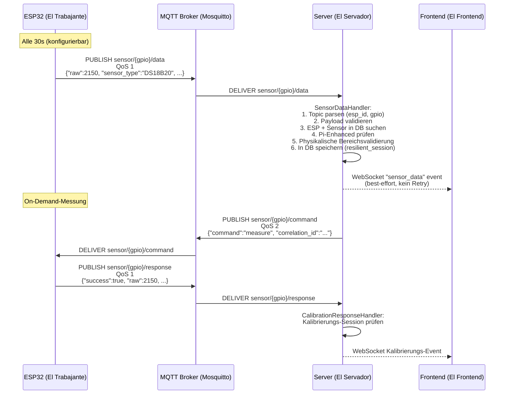
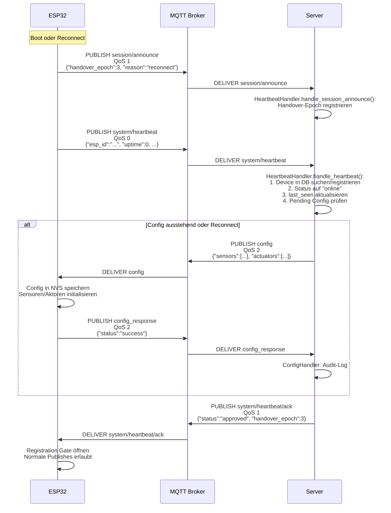
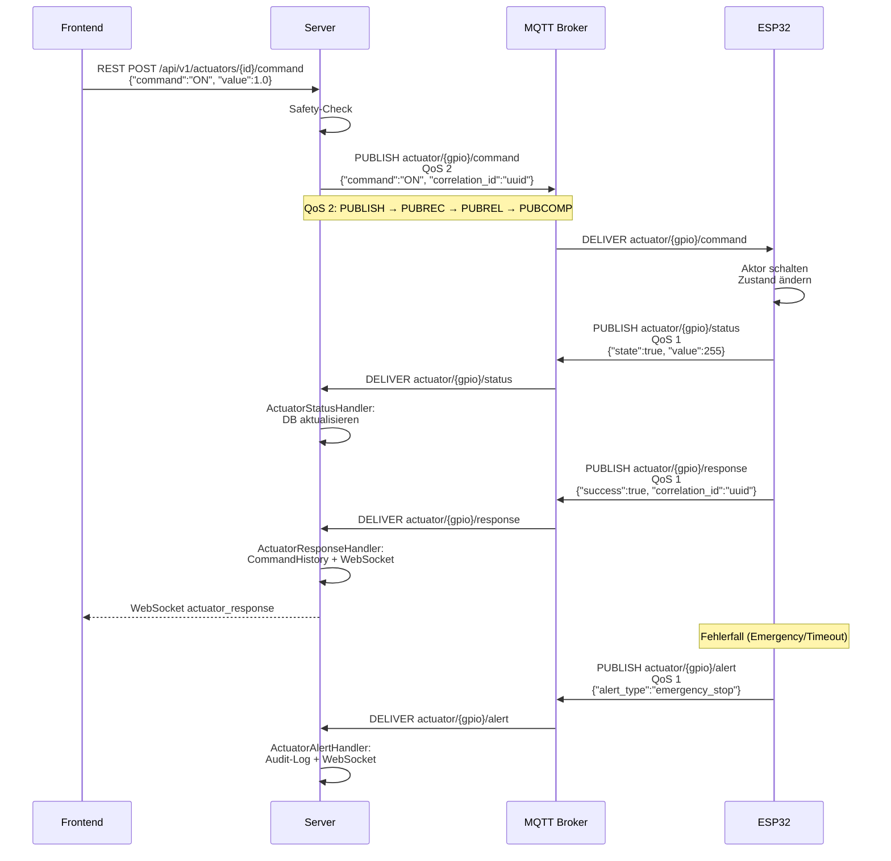
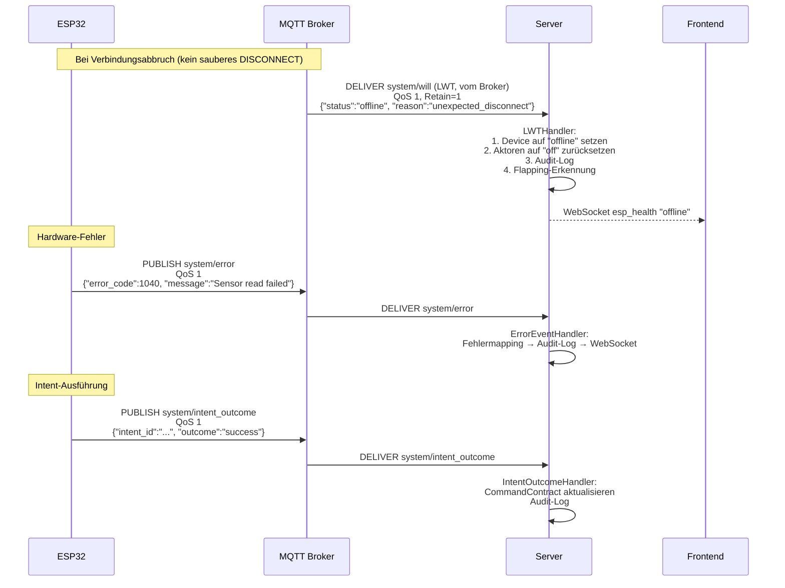

# E5 — MQTT-Topic-Matrix und Datenfluss-Karte

> **Etappe:** E5 | **Sprint:** AUT-175 Architektur-Wissensausbau
> **Erstellt:** 2026-04-26
> **Quellen (verifiziert):** `El Servador/god_kaiser_server/src/core/constants.py`, `src/mqtt/topics.py`, `src/mqtt/publisher.py`, `src/main.py`, `src/mqtt/handlers/` (19 Dateien), `El Trabajante/src/utils/topic_builder.cpp`, `src/services/communication/mqtt_client.cpp`, `src/main.cpp`, `.claude/reference/api/MQTT_TOPICS.md`, `docker/mosquitto/mosquitto.conf`
> **Modus:** Reine Dokumentation (kein Code geändert)

---

## 1. Topic-Namenskonvention und Prefix

### Basis-Schema

```
kaiser/{kaiser_id}/esp/{esp_id}/{kategorie}/{gpio}/{aktion}
```

| Segment | Wert | Quelle |
|---------|------|--------|
| `kaiser` | Literal | constants.py, topic_builder.cpp |
| `{kaiser_id}` | `"god"` (derzeit einziger Wert) | `DEFAULT_KAISER_ID = "god"` in constants.py |
| `esp` | Literal | alle Topic-Templates |
| `{esp_id}` | Geräte-ID, z.B. `ESP_12AB34CD` | `g_system_config.esp_id` auf ESP32 |
| `{kategorie}` | `sensor`, `actuator`, `system`, `config`, `subzone`, `zone`, `session` | je nach Topic |
| `{gpio}` | GPIO-Pin-Nummer 0–39 | wird bei System-Topics weggelassen |
| `{aktion}` | `data`, `command`, `status`, `response`, `alert`, `ack`, usw. | je nach Topic |

**Abweichungen vom Schema (verifiziert):**

- `kaiser/broadcast/emergency` — kein `esp/`-Segment, gilt für alle Geräte
- `kaiser/{kaiser_id}/server/status` — kein `esp/`-Segment, Server-seitig publiziert
- `kaiser/{kaiser_id}/discovery/esp32_nodes` — Legacy-Topic, kein `esp/{esp_id}`-Segment
- `kaiser/{kaiser_id}/esp/{esp_id}/config_response` — kein GPIO-Segment (Gesamt-Config)
- `kaiser/{kaiser_id}/esp/{esp_id}/config` — kein GPIO-Segment (Gesamt-Config)
- `kaiser/{kaiser_id}/esp/{esp_id}/session/announce` — kein GPIO-Segment

**Server-Wildcard-Subscriptions:**

Der Server nutzt bei der Handler-Registrierung in `main.py` generisch den Wildcard `+` für `kaiser_id`:

```python
# Beispiel aus main.py (verifiziert, Zeile 259–348)
_subscriber_instance.register_handler(
    "kaiser/+/esp/+/sensor/+/data", sensor_handler.handle_sensor_data
)
```

Damit ist Multi-Kaiser-Support vorbereitet. Im Betrieb ist `kaiser_id` immer `"god"`.

---

## 2. Vollständige Topic-Matrix (Tabelle)

Die folgende Tabelle dokumentiert alle im Code verifizierten Topics. Quellen: `topic_builder.cpp` (ESP32-Seite), `constants.py` + `topics.py` (Server-Seite), `main.py` (Handler-Registrierung), `main.cpp` (ESP32-Subscriptions).

| # | Topic-Pattern | Richtung | QoS Pub | QoS Sub (ESP32) | ESP32 Builder | Server Konstante / Handler | Anmerkung |
|---|---------------|----------|---------|-----------------|----------------|---------------------------|-----------|
| 1 | `kaiser/god/esp/{esp_id}/sensor/{gpio}/data` | ESP→Server | 1 | — | `buildSensorDataTopic()` | `MQTT_TOPIC_ESP_SENSOR_DATA` / `SensorDataHandler` | Periodische Rohdaten |
| 2 | `kaiser/god/esp/{esp_id}/sensor/batch` | ESP→Server | 1 | — | `buildSensorBatchTopic()` | — | ORPHANED: kein Server-Handler registriert |
| 3 | `kaiser/god/esp/{esp_id}/sensor/{gpio}/command` | Server→ESP | 2 | 2 (Wildcard) | `buildSensorCommandTopic()` | `MQTT_TOPIC_ESP_SENSOR_COMMAND` / `Publisher.publish_sensor_command()` | On-Demand-Messung |
| 4 | `kaiser/god/esp/{esp_id}/sensor/{gpio}/response` | ESP→Server | 1 | — | `buildSensorResponseTopic()` | `CalibrationResponseHandler` | Kalibrierungs-Antwort |
| 5 | `kaiser/god/esp/{esp_id}/actuator/{gpio}/command` | Server→ESP | 2 | 2 (Wildcard) | `buildActuatorCommandTopic()` | `MQTT_TOPIC_ESP_ACTUATOR_COMMAND` / `Publisher.publish_actuator_command()` | Aktor-Steuerbefehl |
| 6 | `kaiser/god/esp/{esp_id}/actuator/{gpio}/status` | ESP→Server | 1 | — | `buildActuatorStatusTopic()` | `MQTT_TOPIC_ESP_ACTUATOR_STATUS` / `ActuatorStatusHandler` | Zustandsmeldung |
| 7 | `kaiser/god/esp/{esp_id}/actuator/{gpio}/response` | ESP→Server | 1 | — | `buildActuatorResponseTopic()` | `ActuatorResponseHandler` | Befehlsbestätigung |
| 8 | `kaiser/god/esp/{esp_id}/actuator/{gpio}/alert` | ESP→Server | 1 | — | `buildActuatorAlertTopic()` | `ActuatorAlertHandler` | Notfall/Timeout-Alert |
| 9 | `kaiser/god/esp/{esp_id}/actuator/emergency` | Server→ESP | 1 | 1 | `buildActuatorEmergencyTopic()` | — | ORPHANED: ESP-spezifischer Emergency-Stop (kein dedizierter Server-Handler; wird via `broadcast/emergency` ersetzt) |
| 10 | `kaiser/god/esp/{esp_id}/session/announce` | ESP→Server | 1 | — | — (direkt in `mqtt_client.cpp`) | `MQTT_TOPIC_ESP_SESSION_ANNOUNCE` / `HeartbeatHandler.handle_session_announce()` | Reconnect-Announce (AUT-69) |
| 11 | `kaiser/god/esp/{esp_id}/system/heartbeat` | ESP→Server | 0 | — | `buildSystemHeartbeatTopic()` | `MQTT_TOPIC_ESP_HEARTBEAT` / `HeartbeatHandler` | Kern-Liveness + Auto-Discovery |
| 12 | `kaiser/god/esp/{esp_id}/system/heartbeat_metrics` | ESP→Server | 0 | — | `buildSystemHeartbeatMetricsTopic()` | `MQTT_TOPIC_ESP_HEARTBEAT_METRICS` / `HeartbeatMetricsHandler` | Erweiterte Laufzeit-Counter (AUT-121, `ENABLE_METRICS_SPLIT`) |
| 13 | `kaiser/god/esp/{esp_id}/system/heartbeat/ack` | Server→ESP | 1 | 1 (kritisch) | `buildSystemHeartbeatAckTopic()` | `MQTT_TOPIC_ESP_HEARTBEAT_ACK` / `Publisher.publish_heartbeat_ack()` | Genehmigungsstatus vom Server (SAFETY-P5) |
| 14 | `kaiser/god/server/status` | Server→ALL | 1 | 1 | `buildServerStatusTopic()` | `MQTT_TOPIC_SERVER_STATUS` | Server-LWT + Online/Offline (SAFETY-P5) |
| 15 | `kaiser/god/esp/{esp_id}/system/command` | Server→ESP | 2 | 2 (kritisch) | `buildSystemCommandTopic()` | `MQTT_TOPIC_ESP_SYSTEM_COMMAND` / `Publisher.publish_system_command()` | System-Befehle (REBOOT, OTA, usw.) |
| 16 | `kaiser/god/esp/{esp_id}/system/diagnostics` | ESP→Server | 0 | — | `buildSystemDiagnosticsTopic()` | `DiagnosticsHandler` | HealthMonitor-Snapshots alle 60s |
| 17 | `kaiser/god/esp/{esp_id}/system/error` | ESP→Server | 1 | — | `buildSystemErrorTopic()` | `ErrorEventHandler` | Hardware/Config-Fehler |
| 18 | `kaiser/god/esp/{esp_id}/system/will` | ESP→Server (Broker) | 1 | — | (LWT beim Connect) | `LWTHandler` | Last-Will-Testament |
| 19 | `kaiser/god/esp/{esp_id}/system/intent_outcome` | ESP→Server | 1 | — | `buildIntentOutcomeTopic()` | `IntentOutcomeHandler` | Intent/Outcome-Events |
| 20 | `kaiser/god/esp/{esp_id}/system/intent_outcome/lifecycle` | ESP→Server | 1 | — | `buildIntentOutcomeLifecycleTopic()` | `IntentOutcomeLifecycleHandler` | CONFIG_PENDING-Lifecycle |
| 21 | `kaiser/god/esp/{esp_id}/system/queue_pressure` | ESP→Server | 1 | — | `buildQueuePressureTopic()` | `QueuePressureHandler` | Publish-Queue-Backpressure (PKG-01) |
| 22 | `kaiser/god/esp/{esp_id}/config` | Server→ESP | 2 | 2 (kritisch) | `buildConfigTopic()` | `MQTT_TOPIC_ESP_CONFIG` / `Publisher.publish_config()` | Gesamt-Config (Sensoren + Aktoren) |
| 23 | `kaiser/god/esp/{esp_id}/config_response` | ESP→Server | 2 | — | `buildConfigResponseTopic()` | `MQTT_TOPIC_ESP_CONFIG_RESPONSE` / `ConfigHandler` | Config-ACK vom ESP32 |
| 24 | `kaiser/god/esp/{esp_id}/config/sensor/{gpio}` | Server→ESP | 2 | — | — | `MQTT_TOPIC_ESP_CONFIG_SENSOR` / `Publisher.publish_sensor_config()` | Einzelner Sensor-Config-Push |
| 25 | `kaiser/god/esp/{esp_id}/config/actuator/{gpio}` | Server→ESP | 2 | — | — | `MQTT_TOPIC_ESP_CONFIG_ACTUATOR` / `Publisher.publish_actuator_config()` | Einzelner Aktor-Config-Push |
| 26 | `kaiser/god/esp/{esp_id}/zone/assign` | Server→ESP | 1 | 1 | `buildZoneAssignTopic()` | `MQTT_TOPIC_ESP_ZONE_ASSIGN` / `Publisher.publish_zone_assign()` | Zone-Zuweisung |
| 27 | `kaiser/god/esp/{esp_id}/zone/ack` | ESP→Server | 1 | — | `buildZoneAckTopic()` | `ZoneAckHandler` | Zone-Zuweisung ACK |
| 28 | `kaiser/god/esp/{esp_id}/subzone/assign` | Server→ESP | 1 | 1 | `buildSubzoneAssignTopic()` | `MQTT_TOPIC_SUBZONE_ASSIGN` | Subzone-Zuweisung |
| 29 | `kaiser/god/esp/{esp_id}/subzone/remove` | Server→ESP | 1 | 1 | `buildSubzoneRemoveTopic()` | `MQTT_TOPIC_SUBZONE_REMOVE` | Subzone-Entfernung |
| 30 | `kaiser/god/esp/{esp_id}/subzone/ack` | ESP→Server | 1 | — | `buildSubzoneAckTopic()` | `MQTT_TOPIC_SUBZONE_ACK` / `SubzoneAckHandler` | Subzone-ACK |
| 31 | `kaiser/god/esp/{esp_id}/subzone/status` | ESP→Server | 1 | — | `buildSubzoneStatusTopic()` | — | ORPHANED: kein Server-Handler registriert |
| 32 | `kaiser/god/esp/{esp_id}/subzone/safe` | Server→ESP | 1 | 1 | `buildSubzoneSafeTopic()` | `MQTT_TOPIC_SUBZONE_SAFE` | Subzone-Safe-Mode |
| 33 | `kaiser/broadcast/emergency` | Server→ALL | 2 | 2 (kritisch) | `buildBroadcastEmergencyTopic()` | `MQTT_TOPIC_BROADCAST_ALL` | Globaler Not-Aus |
| 34 | `kaiser/god/discovery/esp32_nodes` | ESP→Server | 1 | — | — | `MQTT_TOPIC_ESP_DISCOVERY` / `DiscoveryHandler` | DEPRECATED: Legacy-Discovery (jetzt via Heartbeat) |

**Server-Handler-Zählung:** 17 registrierte Handler in `main.py` (verifiziert, Zeilen 259–348):
SensorData, ActuatorStatus, ActuatorResponse, ActuatorAlert, Heartbeat, SessionAnnounce, Discovery, Config, ZoneAck, SubzoneAck, LWT, Error, IntentOutcome, IntentOutcomeLifecycle, Diagnostics, QueuePressure, HeartbeatMetrics, CalibrationResponse.

> [!INKONSISTENZ] sensor/batch hat keinen Server-Handler
>
> **Beobachtung:** `topic_builder.cpp` implementiert `buildSensorBatchTopic()` (Zeile 95, kommentiert als "ORPHANED - No server handler"). In `main.py` ist kein Handler für `kaiser/+/esp/+/sensor/batch` registriert. Nachrichten auf diesem Topic werden vom Subscriber stumm verworfen.
> **Korrekte Stelle:** `El Trabajante/src/utils/topic_builder.cpp`, Zeile 93-99 (Kommentar "ORPHANED")
> **Empfehlung:** Entweder Handler serverseitig hinzufügen oder `buildSensorBatchTopic()` aus dem ESP32-Code entfernen und im Protokoll als nicht-implementiert markieren.
> **Erst-Erkennung:** E5, 2026-04-26

> [!INKONSISTENZ] subzone/status hat keinen Server-Handler
>
> **Beobachtung:** `topic_builder.cpp` implementiert `buildSubzoneStatusTopic()` (Zeile 283-289, kommentiert als "ORPHANED - No server handler"). In `main.py` ist kein Handler für `kaiser/+/esp/+/subzone/status` registriert.
> **Korrekte Stelle:** `El Trabajante/src/utils/topic_builder.cpp`, Zeile 283
> **Empfehlung:** Server-Handler implementieren oder Topic aus ESP32-Code entfernen.
> **Erst-Erkennung:** E5, 2026-04-26

> [!INKONSISTENZ] actuator/emergency ist ORPHANED auf ESP32-Seite
>
> **Beobachtung:** `topic_builder.cpp` kommentiert `buildActuatorEmergencyTopic()` als "ORPHANED (GHOST) - Server->ESP but ESP never subscribes". In `main.cpp` ist `actuator/emergency` in `subscribeToAllTopics()` jedoch als Subscription aufgeführt (Zeile 629). Der Kommentar in `topic_builder.cpp` ist damit irreführend.
> **Korrekte Stelle:** `El Trabajante/src/utils/topic_builder.cpp`, Zeile 152-158 (Kommentar)
> **Empfehlung:** Kommentar in `topic_builder.cpp` korrigieren — ESP32 subscribed tatsächlich auf dieses Topic. Status prüfen ob Server-seitig ein dedizierter Handler fehlt.
> **Erst-Erkennung:** E5, 2026-04-26

---

## 3. Payload-Schemata (wichtigste Topics)

### 3.1 system/heartbeat (verifiziert aus `mqtt_client.cpp:publishHeartbeat()`)

```json
{
  "esp_id": "ESP_12AB34CD",
  "zone_id": "greenhouse",
  "master_zone_id": "greenhouse-master",
  "zone_assigned": true,
  "ts": 1735818000,
  "time_valid": true,
  "boot_sequence_id": "ESP_12AB34CD-b42-r1",
  "reset_reason": "POWERON",
  "segment_start_ts": 1735817990,
  "uptime": 3600,
  "heap_free": 245760,
  "wifi_rssi": -65,
  "wifi_ip": "192.168.1.100",
  "sensor_count": 3,
  "actuator_count": 2,
  "persistence_degraded": false,
  "persistence_degraded_reason": "NONE",
  "runtime_state_degraded": false,
  "mqtt_circuit_breaker_open": false,
  "wifi_circuit_breaker_open": false,
  "network_degraded": false,
  "active_handover_epoch": 3,
  "handover_completed_epoch": 2,
  "sensor_command_queue_overflow_count": 0,
  "safe_publish_retry_count": 0,
  "emergency_rejected_no_token_total": 0,
  "config_status": { ... }
}
```

**Hinweis:** Wenn `ENABLE_METRICS_SPLIT` nicht definiert ist, enthält das Heartbeat zusätzlich die Offline-Metriken (`offline_enter_count`, `adopting_enter_count`, usw.). Mit `ENABLE_METRICS_SPLIT` werden diese auf `system/heartbeat_metrics` ausgelagert.

### 3.2 system/will — LWT-Payload (verifiziert aus `mqtt_client.cpp:connect()`, Zeile 324–326)

```json
{
  "status": "offline",
  "esp_id": "ESP_12AB34CD",
  "reason": "unexpected_disconnect",
  "timestamp": 1735818000
}
```

Dieser Payload wird beim MQTT-Connect als Last-Will-Testament beim Broker registriert (`lwt_msg` in `esp_mqtt_client_config_t`). Der Broker sendet ihn automatisch bei unerwartetem Verbindungsabbruch. QoS 1, Retain=1 (damit der Server nach Reconnect den letzten LWT-Status abrufen kann).

### 3.3 actuator/{gpio}/command (verifiziert aus `publisher.py:publish_actuator_command()`)

```json
{
  "command": "ON",
  "value": 1.0,
  "duration": 0,
  "timestamp": 1735818000,
  "issued_by": "user:admin",
  "correlation_id": "cmd_abc123",
  "intent_id": "cmd_abc123"
}
```

`correlation_id` und `intent_id` sind identisch und werden nur gesetzt, wenn eine Tracking-ID vorhanden ist. Bei Not-Aus (emergency_stop) hat `correlation_id` das Format `{incident_id}:{esp_id}:{gpio}`.

### 3.4 sensor/{gpio}/data (verifiziert aus `MQTT_TOPICS.md` + `sensor_handler.py`)

```json
{
  "ts": 1735818000,
  "esp_id": "ESP_12AB34CD",
  "gpio": 4,
  "sensor_type": "DS18B20",
  "raw": 2150,
  "value": 21.5,
  "unit": "°C",
  "quality": "good",
  "subzone_id": "zone_a",
  "sensor_name": "Boden Temp",
  "raw_mode": true,
  "onewire_address": "28FF123456789ABC"
}
```

`raw_mode: true` ist Pflichtfeld und signalisiert dem Server, dass er die Kalibrierung anwenden soll. `onewire_address` und `i2c_address` schließen sich gegenseitig aus.

### 3.5 config (verifiziert aus `publisher.py:publish_config()`)

```json
{
  "sensors": [
    {
      "gpio": 4,
      "sensor_type": "DS18B20",
      "name": "Boden Temp",
      "interval_ms": 30000,
      "enabled": true
    }
  ],
  "actuators": [
    {
      "gpio": 5,
      "actuator_type": "pump",
      "name": "Pumpe 1",
      "enabled": true
    }
  ],
  "timestamp": 1735818000
}
```

Maximale Payload-Größe: 8192 Bytes (ESP32 Buffer-Konfiguration in `mqtt_client.cpp`, Zeile 345).

### 3.6 config_response (verifiziert aus `config_handler.py`)

```json
{
  "status": "success",
  "error": "NONE",
  "message": "",
  "timestamp": 1735818000
}
```

Fehler-Codes: `JSON_PARSE_ERROR`, `VALIDATION_FAILED`, `GPIO_CONFLICT`, `NVS_WRITE_FAILED`, `TYPE_MISMATCH`, `MISSING_FIELD`, `OUT_OF_RANGE`, `UNKNOWN_ERROR`. Bei `partial_success`: zusätzliches Array `failures` mit Einzelfehlern.

### 3.7 session/announce (verifiziert aus `mqtt_client.cpp:publishSessionAnnounce()`)

```json
{
  "esp_id": "ESP_12AB34CD",
  "handover_epoch": 3,
  "session_epoch": 3,
  "reason": "reconnect",
  "ts_ms": 1735818000000,
  "boot_ts": "1735817990"
}
```

`session_epoch` ist Legacy-Alias für `handover_epoch`. Kanonischer Feldname ist `handover_epoch` (AUT-69).

### 3.8 system/queue_pressure (verifiziert aus `queue_pressure_handler.py`)

```json
{
  "event": "entered_pressure",
  "fill_level": 85,
  "high_watermark": 92,
  "shed_count": 3,
  "drop_count": 1,
  "ts": 1735818000
}
```

`event` ist entweder `"entered_pressure"` oder `"recovered"`.

### 3.9 actuator/{gpio}/response (verifiziert aus `actuator_response_handler.py`)

```json
{
  "esp_id": "ESP_12AB34CD",
  "zone_id": "zone_main",
  "ts": 1735818000,
  "gpio": 25,
  "command": "ON",
  "value": 1.0,
  "duration": 0,
  "success": true,
  "message": "Command executed",
  "correlation_id": "cmd_abc123"
}
```

### 3.10 system/heartbeat/ack (verifiziert aus MQTT_TOPICS.md, topics.py)

```json
{
  "status": "approved",
  "esp_id": "ESP_12AB34CD",
  "timestamp": 1735818000,
  "handover_epoch": 3,
  "session_id": "ESP_12AB34CD:handover:3:1735818000",
  "reason_code": null,
  "correlation_id": null
}
```

`status` kann `"approved"`, `"pending"` oder `"rejected"` sein. Bei Ablehnung sind `reason_code` und ggf. `revocation_source`, `upstream_deleted`, `delete_intent` gesetzt (PKG-05).

---

## 4. QoS-Matrix und Begründung

### Vollständige QoS-Zuordnung

| QoS | Topics | Begründung |
|-----|--------|------------|
| **0** (At most once) | `system/heartbeat`, `system/heartbeat_metrics`, `system/diagnostics` | Regelmäßig, Verlust akzeptabel: nächste Nachricht kommt bald. Latenz-optimiert. |
| **1** (At least once) | `sensor/{gpio}/data`, `sensor/batch`, `sensor/{gpio}/response`, `actuator/{gpio}/status`, `actuator/{gpio}/response`, `actuator/{gpio}/alert`, `actuator/emergency`, `session/announce`, `system/will` (LWT), `system/error`, `system/intent_outcome`, `system/intent_outcome/lifecycle`, `system/queue_pressure`, `zone/assign`, `zone/ack`, alle `subzone/*`, `server/status`, `system/heartbeat/ack` | Datenverlust unerwünscht, Duplikate sind verarbeitbar (idempotente Handler oder Dedup-Schlüssel). |
| **2** (Exactly once) | `sensor/{gpio}/command`, `actuator/{gpio}/command`, `system/command`, `config`, `config/sensor/{gpio}`, `config/actuator/{gpio}`, `config_response`, `broadcast/emergency` | Duplikate wären gefährlich: Aktor wird zweimal geschaltet, Config zweimal angewendet, Not-Aus zweimal ausgelöst. |

### QoS-Konstanten im Server (`constants.py`, verifiziert)

```python
QOS_SENSOR_DATA = 1       # At least once
QOS_ACTUATOR_COMMAND = 2  # Exactly once
QOS_SENSOR_COMMAND = 2    # Exactly once
QOS_HEARTBEAT = 0         # At most once
QOS_HEARTBEAT_METRICS = 0 # At most once
QOS_CONFIG = 2            # Exactly once
```

### QoS-Entscheidungsbaum

```
Kann ein Duplikat Schaden anrichten?
(Aktor schaltet doppelt, Config wird doppelt angewendet)
       |
  JA → QoS 2
  NEIN → Ist Datenverlust kritisch?
           |
      JA → QoS 1
      NEIN → QoS 0
```

### ESP32-Subscription-QoS (verifiziert aus `main.cpp:subscribeToAllTopics()`)

```cpp
// Kritische Control-Plane Topics (zuerst in Queue):
mqttClient.queueSubscribe(buildSystemHeartbeatAckTopic(),   1, true);  // Heartbeat ACK
mqttClient.queueSubscribe(buildConfigTopic(),               2, true);  // Config
mqttClient.queueSubscribe(buildSystemCommandTopic(),        2, true);  // System Command
mqttClient.queueSubscribe(buildBroadcastEmergencyTopic(),   2, true);  // Not-Aus
// Actuator Commands (Wildcard):                             2, true
mqttClient.queueSubscribe(buildActuatorEmergencyTopic(),    1, true);  // ESP-Emergency
mqttClient.queueSubscribe(buildZoneAssignTopic(),           1, true);  // Zone
mqttClient.queueSubscribe(buildSubzoneAssignTopic(),        1, true);  // Subzone
mqttClient.queueSubscribe(buildSubzoneRemoveTopic(),        1, true);
mqttClient.queueSubscribe(buildSubzoneSafeTopic(),          1, true);
// Sensor Commands (Wildcard):                              2, false
mqttClient.queueSubscribe(buildServerStatusTopic(),         1, false); // Server LWT
```

---

## 5. LWT-Schema

### ESP32-LWT (Broker → Server)

**Topic:** `kaiser/god/esp/{esp_id}/system/will`

**Registrierung:** Beim `esp_mqtt_client_init()` in `mqtt_client.cpp:connect()` (Zeile 315–341):

```cpp
// LWT-Topic wird aus Heartbeat-Topic abgeleitet:
String lw_topic_str = String(TopicBuilder::buildSystemHeartbeatTopic());
lw_topic_str.replace("/heartbeat", "/will");

// LWT-Payload (JSON, 160 Bytes max):
snprintf(lw_msg, sizeof(lw_msg),
    "{\"status\":\"offline\",\"esp_id\":\"%s\",\"reason\":\"unexpected_disconnect\",\"timestamp\":%lu}",
    g_system_config.esp_id.c_str(), (unsigned long)will_ts);

mqtt_cfg.lwt_topic = lw_topic_str.c_str();
mqtt_cfg.lwt_msg   = lw_msg;
mqtt_cfg.lwt_qos   = 1;
mqtt_cfg.lwt_retain = 1;  // Retain=1: letzter Status bleibt auf Broker
```

**Payload:**

```json
{
  "status": "offline",
  "esp_id": "ESP_12AB34CD",
  "reason": "unexpected_disconnect",
  "timestamp": 1735818000
}
```

**Auslöser:** Der Broker sendet den LWT automatisch, wenn der ESP32 die Verbindung verliert, ohne ein sauberes MQTT-DISCONNECT zu senden (Stromausfall, Netzwerkabbruch, Crash, Keepalive-Timeout).

**Server-Verarbeitung (`lwt_handler.py`):**

1. Topic parsen → `esp_id` extrahieren
2. Payload normalisieren (`canonicalize_lwt()`)
3. ESP-Device in DB suchen
4. Status auf `"offline"` setzen (terminal-autoritativ, Dedup per `upsert_terminal_event_authority`)
5. Aktoren auf `"off"` zurücksetzen (außer bei Flapping: >2 LWTs in 300s)
6. `device_metadata.last_disconnect` aktualisieren
7. Audit-Log-Eintrag schreiben
8. WebSocket-Broadcast (`esp_health` → `"offline"`)
9. Retained LWT durch leeren Publish auf gleichem Topic löschen (nach ESP32-Reconnect)

**Flapping-Erkennung:** `FLAPPING_THRESHOLD = 2` LWT-Events in `FLAPPING_WINDOW_SECONDS = 300` Sekunden. Bei Flapping wird der Aktor-Reset übersprungen (Aktoren sind bereits `off`).

### Server-LWT

**Topic:** `kaiser/god/server/status`

**Registrierung:** Als Server-eigenes LWT beim MQTT-Broker-Connect. ESP32 subscribed auf dieses Topic (QoS 1) und erkennt damit Server-Abstürze schneller als via Heartbeat-ACK-Timeout (120s).

> [!ANNAHME] Server-LWT-Payload
>
> **Beobachtung:** Der genaue Payload des Server-LWT (`server/status`) konnte nicht in `mqtt/client.py` verifiziert werden — die Server-MQTT-Client-Implementierung wurde nicht vollständig gelesen.
> **Annahme:** Analog zum ESP32-LWT vermutlich `{"status": "offline", "timestamp": ...}`.
> **Empfehlung:** In `mqtt/client.py` nachschlagen und hier ergänzen.
> **Erst-Erkennung:** E5, 2026-04-26

---

## 6. Datenfluss-Diagramme (Mermaid)

### 6.1 Sensor-Datenfluss



### 6.2 Config-Sync (Heartbeat + Config-Push)



### 6.3 Aktor-Command



### 6.4 Error-/Notification-Flow (LWT + Fehler)



---

## 7. Broker-Konfiguration

Quelle: `docker/mosquitto/mosquitto.conf` (verifiziert)

### Listener-Konfiguration

```
listener 1883   # MQTT (für ESP32 und Server)
protocol mqtt

listener 9001   # WebSocket (für Frontend-Debug)
protocol websockets
```

### Sicherheitseinstellungen (Entwicklung)

```
allow_anonymous true
# Produktion erfordert:
# allow_anonymous false
# password_file /mosquitto/config/passwd
# acl_file /mosquitto/config/acl
```

### Verbindungseinstellungen

| Parameter | Wert | Begründung |
|-----------|------|------------|
| `max_keepalive` | 300s | ESP32 Keepalive = 60s; Obergrenze für Debug-Tools (PKG-19, INC-2026-04-11) |
| `max_connections` | -1 (unbegrenzt) | Keine Begrenzung in Entwicklung |
| `max_inflight_messages` | 10 | Begrenzung gleichzeitiger QoS-1/2-Deliveries (ESP32 Ressourcenschutz) |
| `max_queued_messages` | 100 | Defense-in-depth (clean_session=true → kaum relevante Offline-Queue) |
| `max_packet_size` | 262144 (256KB) | Maximale Payload-Größe |

### Persistenz

```
persistence true
persistence_location /mosquitto/data/
autosave_interval 300  # State-Save alle 5 Minuten
```

### Logging

```
log_dest stdout               # Docker-Log → Promtail → Loki
log_type error
log_type warning
log_type notice
log_type information
log_type subscribe
log_type unsubscribe
log_timestamp true
connection_messages true
```

---

## 8. clean_session-Problem (I8)

### Befund

Der ESP32 verbindet sich mit `clean_session=true` (verifiziert in `mqtt_client.cpp`, Zeile 335):

```cpp
mqtt_cfg.disable_clean_session = 0;  // 0 = clean_session ist AKTIV
```

`clean_session=true` bedeutet: Der Broker verwirft beim Verbindungsaufbau alle gepufferten Nachrichten für diesen Client. Es gibt keine persistente Session zwischen Verbindungen.

### Auswirkungen nach QoS-Niveau

| QoS | Behavior bei Disconnect | Auswirkung mit clean_session=true |
|-----|-------------------------|-----------------------------------|
| **0** | Fire-and-forget, keine Garantien | Keine zusätzliche Auswirkung — QoS 0 hat sowieso keine Delivery-Garantie |
| **1** | Broker puffert, ESP bekommt nach Reconnect nach | **VERLUST:** Mit clean_session=true wird der Broker-Puffer beim Reconnect geleert. Alle QoS-1-Nachrichten, die an den ESP gesendet wurden während er offline war, gehen verloren. |
| **2** | Broker und Client koordinieren Exactly-Once | **VERLUST:** Analog zu QoS 1. Außerdem: Halbfertige QoS-2-Handshakes (PUBREC/PUBREL ausstehend) werden verworfen. |

### Konkret betroffene Topics (Server→ESP)

Alle Topics vom Server zum ESP mit QoS 1 oder 2, die während eines ESP32-Disconnects gesendet werden, gehen verloren:

| Topic | QoS | Risiko |
|-------|-----|--------|
| `actuator/{gpio}/command` | 2 | **HOCH**: Aktor-Befehl kann verloren gehen. ESP bekommt ihn nicht, aber Server denkt er wurde zugestellt. |
| `config` | 2 | **HOCH**: Config-Update wird nie angewendet. ESP bleibt mit alter Config. |
| `system/command` | 2 | **MITTEL**: System-Befehle (REBOOT, OTA) werden nicht ausgeführt. |
| `zone/assign` | 1 | **MITTEL**: Zone-Zuweisung geht verloren. |
| `subzone/assign` | 1 | **MITTEL**: Subzone-Zuweisung geht verloren. |
| `system/heartbeat/ack` | 1 | **GERING**: ESP bleibt im Registration-Gate, sendet erneut Heartbeat → ACK folgt. |

### Kompensationsmechanismen (verifiziert)

Das System kompensiert den Verlust durch mehrere Mechanismen:

1. **Config-Push bei Reconnect:** `heartbeat_handler.py` erkennt Reconnect-Events und triggert einen neuen Config-Push. Der ESP bekommt die Config beim nächsten Verbindungsaufbau automatisch (verifiziert via `_has_pending_config()` und `STATE_PUSH_COOLDOWN_SECONDS = 120`).

2. **Heartbeat-basierte Re-Registration:** Nach Reconnect sendet der ESP einen neuen Heartbeat. Der Server sendet daraufhin einen neuen ACK und ggf. Config. Die Registration-Gate auf ESP-Seite stellt sicher, dass keine Daten-Publishes vor dem ACK gesendet werden.

3. **session/announce:** Der ESP sendet nach Reconnect ein `session/announce` (QoS 1) mit seiner `handover_epoch`. Der Server nutzt dies zur Reconnect-Sequenz-Koordination.

4. **MQTTCommandBridge mit Timeout:** `MQTTCommandBridge.send_and_wait_ack()` hat einen Timeout. Wenn der ESP offline geht und der Befehl verloren geht, läuft der Timeout ab und der Server kann entsprechend reagieren.

5. **Intent-Outcome-Tracking:** ESP32 bestätigt Befehlsausführungen via `system/intent_outcome`. Ausbleibende Bestätigung signalisiert Verlust.

### Bewertung

> [!INKONSISTENZ] clean_session=true mit QoS-2-Befehlen ist konzeptuell widersprüchlich
>
> **Beobachtung:** Der ESP32 verwendet `clean_session=true` (Zeile 335 in `mqtt_client.cpp`), aber subscribed gleichzeitig auf QoS-2-Topics (`config`, `actuator/command`, `system/command`). Der QoS-2-Vorteil (Exactly-Once) greift nur für die Dauer einer Session — bei Disconnect gehen alle gepufferten QoS-2-Nachrichten verloren (clean_session-Semantik). De facto verhalten sich diese Topics damit wie QoS 0 bei Disconnect.
> **Korrekte Stelle:** `El Trabajante/src/services/communication/mqtt_client.cpp`, Zeile 335 (`disable_clean_session = 0`)
> **Empfehlung:** Entweder `clean_session=false` setzen (dann persistente Session, ESP muss feste `client_id` haben), oder die Kompensationsmechanismen (Config-Push bei Reconnect, ACK-Timeout) als primären Verlust-Schutzmechanismus dokumentieren und QoS auf 1 reduzieren wo Exactly-Once ohnehin nicht garantierbar ist.
> **Erst-Erkennung:** I8 (E0-bestätigt), vollständig dokumentiert in E5, 2026-04-26

---

## 9. Bekannte Inkonsistenzen

### I-MQTT-01: sensor/batch ORPHANED

> [!INKONSISTENZ] sensor/batch hat keinen Server-Handler
>
> **Beobachtung:** `topic_builder.cpp` implementiert `buildSensorBatchTopic()`, kommentiert als "ORPHANED - No server handler". In `main.py` fehlt der entsprechende Handler. Die ESP32-Firmware könnte diese Methode aufrufen und Daten ins Nirvana senden.
> **Korrekte Stelle:** `El Trabajante/src/utils/topic_builder.cpp`, Zeile 93-99
> **Empfehlung:** Server-Handler implementieren (`SensorBatchHandler`) oder `buildSensorBatchTopic()` aus ESP32-Code entfernen.
> **Erst-Erkennung:** E5, 2026-04-26

### I-MQTT-02: subzone/status ORPHANED

> [!INKONSISTENZ] subzone/status hat keinen Server-Handler
>
> **Beobachtung:** `topic_builder.cpp` implementiert `buildSubzoneStatusTopic()` (Zeile 284, "ORPHANED"). In `main.py` fehlt der Handler. Subzone-Status-Meldungen vom ESP werden ignoriert.
> **Korrekte Stelle:** `El Trabajante/src/utils/topic_builder.cpp`, Zeile 283-289
> **Empfehlung:** Server-Handler implementieren oder Topic aus ESP32-Code entfernen.
> **Erst-Erkennung:** E5, 2026-04-26

### I-MQTT-03: actuator/emergency Kommentar-Widerspruch

> [!INKONSISTENZ] actuator/emergency Kommentar widerspricht tatsächlichem Verhalten
>
> **Beobachtung:** `topic_builder.cpp` kommentiert `buildActuatorEmergencyTopic()` als "ORPHANED (GHOST) - Server->ESP but ESP never subscribes" (Zeile 152). In `main.cpp:subscribeToAllTopics()` (Zeile 629) subscribed der ESP32 jedoch tatsächlich auf dieses Topic. Der Kommentar ist falsch.
> **Korrekte Stelle:** `El Trabajante/src/utils/topic_builder.cpp`, Zeile 152-158
> **Empfehlung:** Kommentar korrigieren. Falls kein Server-Handler existiert, diesen hinzufügen oder dokumentieren, wie der Server dieses Topic verwendet.
> **Erst-Erkennung:** E5, 2026-04-26

### I-MQTT-04: heartbeat_metrics nur bei ENABLE_METRICS_SPLIT

> [!ANNAHME] heartbeat_metrics erfordert Compile-Flag
>
> **Beobachtung:** `publishHeartbeatMetrics()` in `mqtt_client.cpp` ist unter `#ifdef ENABLE_METRICS_SPLIT` geschützt (Zeile 1475). In der Standard-Firmware (ohne Flag) werden Metriken im Core-Heartbeat gesendet. Der Server-Handler `HeartbeatMetricsHandler` ist immer registriert. Bei Standard-Firmware-Builds kommt also kein `heartbeat_metrics`-Topic, aber der Handler wartet.
> **Annahme:** Dies ist bewusstes Design (Opt-in-Split). Der Handler ist robust gegen ausbleibende Messages.
> **Empfehlung:** In der Dokumentation explizit vermerken, dass `heartbeat_metrics` ein optionales Feature hinter einem Compile-Flag ist.
> **Erst-Erkennung:** E5, 2026-04-26

### I-MQTT-05: clean_session vs QoS-2 (I8 — vollständige Dokumentation)

Siehe Abschnitt 8 (clean_session-Problem) für die vollständige Analyse.

---

## Anhang: Referenz-Dateipfade

| Datei | Inhalt |
|-------|--------|
| `El Servador/god_kaiser_server/src/core/constants.py` | Topic-Konstanten, QoS-Konstanten |
| `El Servador/god_kaiser_server/src/mqtt/topics.py` | TopicBuilder (Python) mit build_* und parse_*-Methoden |
| `El Servador/god_kaiser_server/src/mqtt/publisher.py` | High-Level Publisher mit Retry |
| `El Servador/god_kaiser_server/src/main.py` | Handler-Registrierung (Zeilen 259–348) |
| `El Servador/god_kaiser_server/src/mqtt/handlers/` | 19 Handler-Dateien |
| `El Trabajante/src/utils/topic_builder.cpp` | TopicBuilder (C++) |
| `El Trabajante/src/utils/topic_builder.h` | TopicBuilder Header |
| `El Trabajante/src/services/communication/mqtt_client.cpp` | MQTT-Client (Publish, Subscribe, LWT, Circuit Breaker) |
| `El Trabajante/src/main.cpp` | ESP32 Subscriptions (`subscribeToAllTopics()`) |
| `docker/mosquitto/mosquitto.conf` | Broker-Konfiguration |
| `.claude/reference/api/MQTT_TOPICS.md` | Vollständige Topic-SSOT-Referenz (v2.23) |
