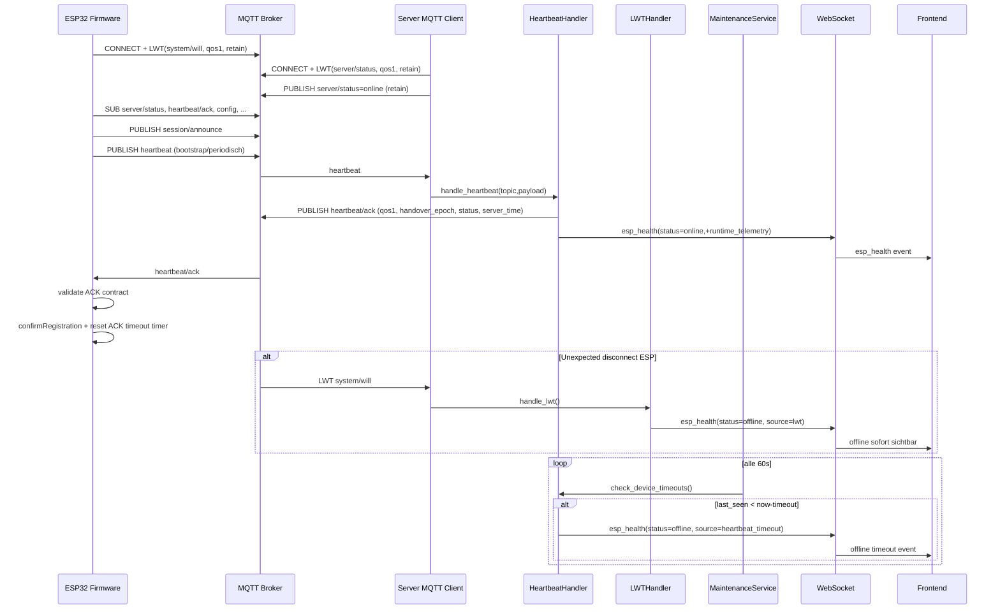
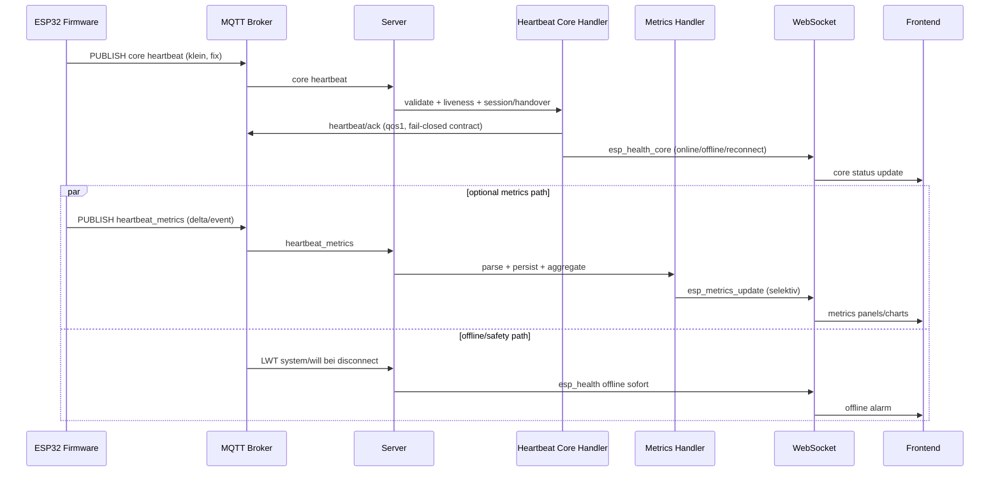

# Heartbeat und Verbindungsablauf (IST vs SOLL)

## Scope

Dieses Dokument fokussiert nur auf:

- Verbindungsaufbau ESP32 <-> Broker <-> Server
- Heartbeat-Loop inkl. ACK-Vertrag
- Offline-Erkennung (LWT, ACK-Timeout, Heartbeat-Timeout)
- Zusatzinformationen im Heartbeat (Runtime-Telemetrie)
- Architektur-Schnitt Core-Heartbeat vs. Metrics

Basis:

- `.claude/auftraege/Auto_One_Architektur/Diagramme/firmware-architektur.svg`
- `.claude/auftraege/Auto_One_Architektur/Diagramme/server-architektur.svg`
- Codepfade in `El Trabajante` und `El Servador`

---

## 1) IST: Was in den zwei Diagrammen steht

### Diagramm-Aussagen (kurz)

- Firmware-Diagramm zeigt Heartbeat 60s, ACK, LWT und Offline-States.
- Server-Diagramm zeigt Heartbeat-Handler + LWT-Handler + Health-Checks.
- Beide Diagramme zeigen korrekt: LWT ist ein zentraler Offline-Trigger.

### Kritische Delta-Punkte gegen aktuellen Code

1. **Server-LWT ist inzwischen real vorhanden**
   - Firmware-Diagramm sagt sinngemaess: "Server hat kein eigenes LWT".
   - Code heute: Server setzt `will_set` auf `kaiser/{kaiser_id}/server/status` und publiziert auch retained `online`.
2. **ACK QoS ist im Code 1, nicht 0**
   - Firmware-Diagramm beschreibt ACK als QoS 0.
   - Server publiziert Heartbeat-ACK mit QoS 1.
3. **Timeout-Werte differenzieren sich**
   - Firmware Safety-P1 ACK-Timeout: 120s.
   - Server Heartbeat-Timeout (Maintenance): default 180s.
4. **Heartbeat-Inhalt ist gewachsen**
   - Heartbeat enthaelt heute viele Runtime-/Forensik-Counter (Queue, Drift, Handover, Circuit Breaker, Drops).
   - Payload-Guard ist hart: `PUBLISH_PAYLOAD_MAX_LEN=1024`, Oversize wird verworfen.

---

## 2) Codebelegter IST-Fluss (End-to-End)

## 2.1 Verbindungsaufbau und Reconnect

1. ESP32 baut MQTT-Verbindung asynchron auf (ESP-IDF Client, clean session, LWT gesetzt).
2. Bei `MQTT_EVENT_CONNECTED`:
   - `g_mqtt_connected=true`
   - ACK-Timer sofort reset
   - Subscription-Queue vorbereitet (inkl. `.../system/heartbeat/ack`, `.../config`, `.../server/status`)
   - Session-Announce publiziert
3. Nach bestaetigten Subscriptions wird ein Bootstrap-Heartbeat forciert gesendet.
4. Heartbeat-ACK validiert den Vertrag (`handover_epoch` Pflicht, fail-closed).
5. Erst danach oeffnet die Registration-Gate (`confirmRegistration`).

## 2.2 Heartbeat-Verarbeitung serverseitig

1. `subscriber` routed `kaiser/+/esp/+/system/heartbeat` an `heartbeat_handler.handle_heartbeat`.
2. Handler:
   - normalisiert payload
   - validiert Felder
   - erkennt reconnect anhand `last_seen`-Delta
   - sendet ACK frueh (vor DB-Write)
   - aktualisiert Status + `last_seen`
   - loggt Heartbeat-History
   - broadcastet `esp_health` via WebSocket inkl. `runtime_telemetry`
3. Bei Reconnect startet Adoption/Handover-Phase und triggert zusaetzliche Flows.

## 2.3 Offline-Erkennung

Es gibt **3 parallele Offline-Pfade**:

1. **LWT (sofortig)**
   - Broker publiziert `.../system/will` bei unerwartetem Disconnect.
   - `lwt_handler` setzt Device offline, setzt Aktoren auf safe/off, broadcastet `esp_health`.
2. **Serverseitiger Heartbeat-Timeout (periodisch)**
   - Maintenance-Job (60s) ruft `check_device_timeouts()`.
   - Wenn `last_seen` aelter als Schwellwert (default 180s): offline + reset + WS-Event.
3. **Firmwareseitiger ACK-Timeout Safety-P1**
   - Wenn MQTT connected, aber kein gueltiger ACK >120s:
   - P4-Offline-State-Machine wird getriggert, ggf. Safe-State/Offline-Rules.

---

## 3) IST-Diagramm (fokussiert auf Verbindung + Heartbeat)

---

## 4) SOLL-Architektur fuer saubere Trennung Heartbeat vs Metrics

## Zielbild

- **Core-Heartbeat** bleibt klein, robust, verbindlich fuer Liveness/Session/Registration.
- **Metrics-Telemetrie** wird ausgelagert und event-/delta-basiert.
- Offline-/Safety-Pfade bleiben voll funktionsfaehig, auch wenn Metrics kanalweise ausfallen.

### Core-Heartbeat (pflicht, klein, stabil)

- Muss enthalten:
  - `esp_id`, `ts`, `status`-relevante Basis
  - `handover_epoch`, `session_id`/session-hinweise
  - minimale health-signale fuer Operator-Liveness
- Muss **nicht** enthalten:
  - forensische Counter in voller Breite
  - queue-pressure Detailsets je Beat

### Metrics-Kanal (zusatzlich, entkoppelt)

- Eigener Topic/Contract (z. B. `.../system/heartbeat_metrics`), QoS nach Anforderung.
- Event-/Delta-Strategie statt Vollbild je 60s.
- Server persistiert und projiziert diese Daten getrennt (DB/WS/UI/Monitoring).

## SOLL-Diagramm (Trennung)

---

## 5) Umbau-Gates (damit der Umbau sicher wird)

R0 (Stabilitaet halten, vor Split):

- ACK-Contract unveraendert fail-closed testen.
- LWT und Heartbeat-Timeout koennen parallel korrekt offline setzen.
- Kein Oversize im Core-Heartbeat.

R1 (Split einziehen):

- Core-Heartbeat Payload bewusst reduzieren, Contract versioniert.
- Metrics separat senden, bei Ausfall keine Blockade des Core-Pfads.
- Backward-Compatibility fuer bestehende Consumer.

R2 (Utilization fertig):

- DB speichert Metrics strukturiert getrennt von Core-Liveness.
- WS trennt `esp_health_core` und `esp_metrics_update`.
- Frontend zeigt Runtime-Health nicht mehr als Sammelbecken heterogener Signale.

---

## 6) IST vs SOLL auf einen Blick

- IST: Ein Heartbeat traegt Core + viele Metrics + Forensik-Zaehler gleichzeitig.
- SOLL: Core-Heartbeat ist schmal und hart stabil; Metrics laufen als separater, kontrollierter Datenstrom.
- IST: Offline-Erkennung ist bereits mehrpfadig (LWT + timeout + ACK-timeout) und sollte unveraendert als Sicherheitsnetz bleiben.
- SOLL: Diese Mehrpfad-Offline-Erkennung bleibt, aber ohne Coupling an grosse Metrics-Payloads.

